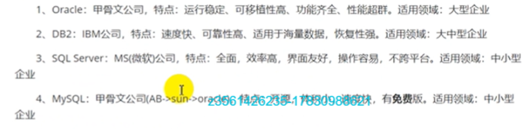
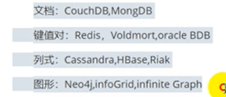
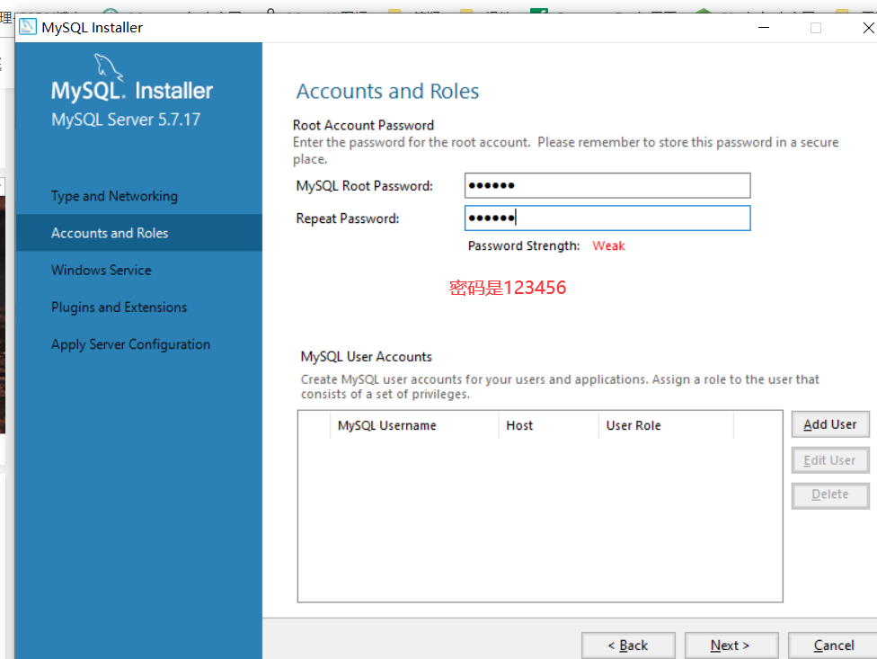
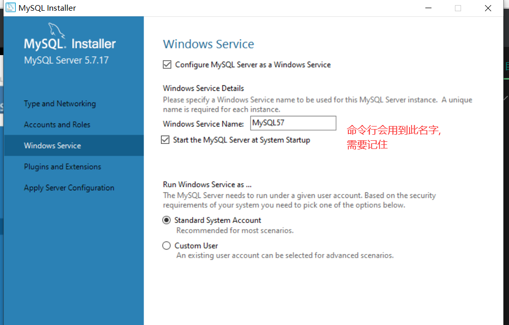
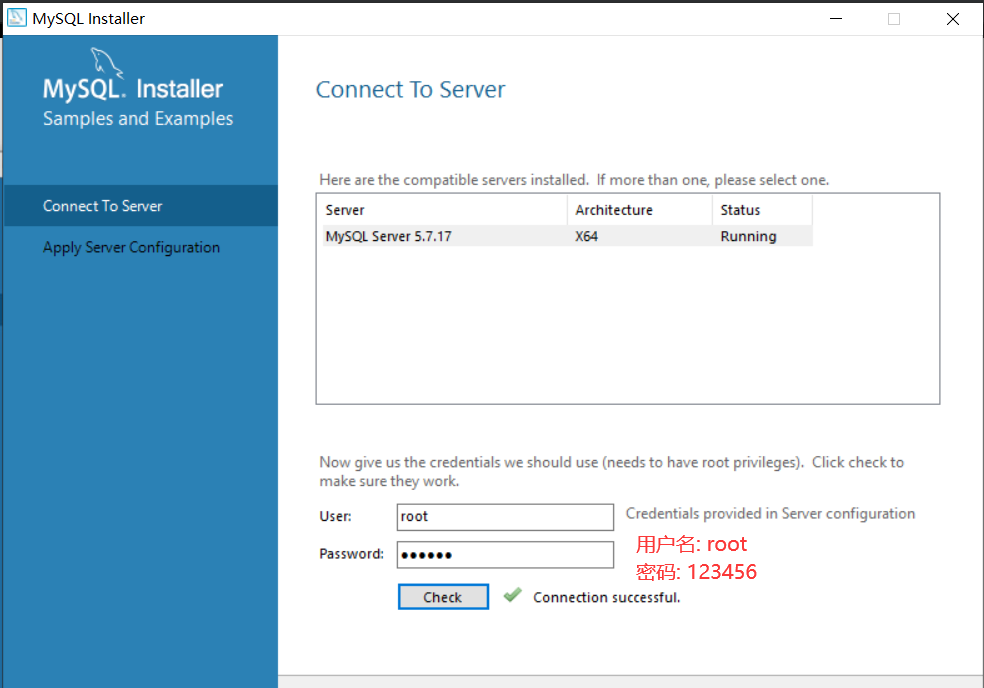

# MySQL初级

## 数据库基础

### 1 什么是数据库

#### 1.1 数据库

​		数据库是按照一定结构来组织、存储和管理数据的仓库.

​		存储数据的介质: 硬盘。

#### 1.2 数据库管理系统

​		数据库是管理数据的仓库，只是一个仓库，但是数据怎么存进去和取出来我们并不知道,对数据库的操作和管理以及内部数据增删改查都是数据库管理系统来完成.

​		所以有了数据库管理系统：专门用于管理数据库的计算机系统软件。

​		数据库管理系统是数据库系统的核心组件，主要完成以下操作：

​		1、完成对数据库的操作和管理功能.

​		2、完成对数据库对象的创建.

​		3、对数据库内存储的数据进行增删改查.

​		4、对数据库用户进行管理

​		5、对数据库的权限进行管理

​		...等等

#### 1.3 数据库系统

​		由数据库及其管理软件(数据库管理系统)构成,统称数据库系统.

​		注意: 日常生活中我们经常听到的MySQL数据库,或者XXX数据库,实际讲的不是单纯的数据库(管理数据的仓库),而是讲的数据库系统,以后我们听到了就要有这个概念

### 2 数据库的分类

​		早期：分为三类

​				层次数据库、网格式数据库、关系型数据库

​		现在：分为两类

​				关系型数据库、非关系型数据库

#### 2.1 层次数据库和网状数据库

​		层次数据库和网状式数据库是用指针来表示数据之间的联系

#### 2.2 关系型数据库

​		是用关系模型来表示数据之间的联系

##### 2.2.1 关系表的概念

​		关系表是二维表（日常的表格，行和列），使用关系表来存储数据。

​		关系表的**行任意，列固定**，是存储同类实体各种属性的集合

##### 2.2.2 关系型数据库的优点

​		1、易于维护：使用表结构，格式一致

​		2、使用方便：SQL语言通用、可用于复杂查询

​		3、支持复杂操作：支持SQL、可用于一个表或多个表之间的复杂查询

##### 2.2.3 关系型数据库的缺点

​		1、读写性能差，尤其是海量数据的高性能读写（这里的海量指的上千万、亿条，几百万的不叫海量）

​		2、固定的表结构、灵活性差（列固定，若想增加列、不容易）

​		3、在有高并发读写的需求时，硬盘I/O性能会是整个程序性能的瓶颈

##### 2.2.3 关系型数据库的主流产品

​		虽然1.2好,但是市面上大部分公司用MySQL，因为它开源免费有免费版。

#### 2.3 非关系型数据库

​		NOMSQ 这里NO是No Only的缩写,表示不仅仅是MSQ，它是关系型数据库的补充，在特定场景特定情况下可以实现高性能高效率的特点。

​		严格来说，它不是数据库，而是数据结构存储的方法的集合。

##### 2.3.1 非关系型数据库的优点

​		1、格式灵活：存储格式（文档、键值对、图片等），应用场景广，关系型数据库只支持基础类型。

等。

​		2、速度快：NOSQL可以使用硬盘来存储数据、也可使用随机存储器（U盘、闪存等）来存储。而关系型数据库只支持硬盘存储。

​		3、高扩展性。

​		4、成本低：NOSQL数据库部署简单,基本上都是开源软件.

##### 2.3.2 非关系型数据库的缺点

​		1、不提供SQL支持、学习和使用成本较高。	

​		2、无事务处理（这是致命的）

​		3、数据结构相对复杂，复杂查询方面欠缺。

##### 2.3.3 非关系型数据库主流产品

## 结构化查询语言（SQL）

### 1 定义

### 2 功能

#### 2.1 SQL数据定义功能

#### 2.2 SQL数据操纵功能

#### 2.3 SQL数据控制功能

### 3 分类

#### 3.1 数据查询语言（DQL）

## 安装

