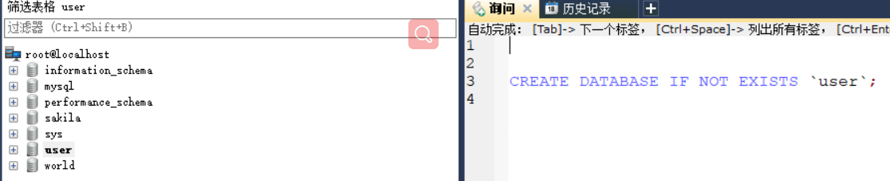

# MySQL初级

## 数据库基础

### 1 什么是数据库

#### 1.1 数据库

​		数据库是按照一定结构来组织、存储和管理数据的仓库.

​		存储数据的介质: 内存 硬盘。

#### 1.2 数据库管理系统

​		数据库是管理数据的仓库，只是一个仓库，但是数据怎么存进去和取出来我们并不知道,对数据库的操作和管理以及内部数据增删改查都是数据库管理系统来完成.

​		所以有了数据库管理系统：专门用于管理数据库的计算机系统软件。

​		数据库管理系统是数据库系统的核心组件，主要完成以下操作：

​		1、完成对数据库的操作和管理功能.

​		2、完成对数据库对象的创建.

​		3、对数据库内存储的数据进行增删改查.

​		4、对数据库用户进行管理

​		5、对数据库的权限进行管理

​		...等等

#### 1.3 数据库系统

​		由数据库及其管理软件(数据库管理系统)构成,统称数据库系统.

​		注意: 日常生活中我们经常听到的MySQL数据库,或者XXX数据库,实际讲的不是单纯的数据库(管理数据的仓库),而是讲的数据库系统,以后我们听到了就要有这个概念

### 2 数据库的分类

​		早期：分为三类

​				层次数据库、网格式数据库、关系型数据库

​		现在：分为两类

​				关系型数据库、非关系型数据库

#### 2.1 层次数据库和网状数据库

​		层次数据库和网状式数据库是用指针来表示数据之间的联系

#### 2.2 关系型数据库

​		是用关系模型来表示数据之间的联系

##### 2.2.1 关系表的概念

​		关系表是二维表（日常的表格，行和列），使用关系表来存储数据。

​		关系表的**行任意，列固定**，是存储同类实体各种属性的集合

##### 2.2.2 关系型数据库的优点

​		1、易于维护：使用表结构，格式一致

​		2、使用方便：SQL语言通用、可用于复杂查询

​		3、支持复杂操作：支持SQL、可用于一个表或多个表之间的复杂查询

##### 2.2.3 关系型数据库的缺点

​		1、读写性能差，尤其是海量数据的高性能读写（这里的海量指的上千万、亿条，几百万的不叫海量）

​		2、固定的表结构、灵活性差（列固定，若想增加列、不容易）

​		3、在有高并发读写的需求时，硬盘I/O性能会是整个程序性能的瓶颈

##### 2.2.3 关系型数据库的主流产品


​		虽然1.2好,但是市面上大部分公司用MySQL，因为它开源免费有免费版。

#### 2.3 非关系型数据库

​		NOMSQ 这里NO是No Only的缩写,表示不仅仅是MSQ，它是关系型数据库的补充，在特定场景特定情况下可以实现高性能高效率的特点。

​		严格来说，它不是数据库，而是数据结构存储的方法的集合。

##### 2.3.1 非关系型数据库的优点

​		1、格式灵活：存储格式（文档、键值对、图片等），应用场景广，关系型数据库只支持基础类型。

等。

​		2、速度快：NOSQL可以使用硬盘来存储数据、也可使用随机存储器（U盘、闪存等）来存储。而关系型数据库只支持硬盘存储。

​		3、高扩展性。

​		4、成本低：NOSQL数据库部署简单,基本上都是开源软件.

##### 2.3.2 非关系型数据库的缺点

​		1、不提供SQL支持、学习和使用成本较高。	

​		2、无事务处理（这是致命的）

​		3、数据结构相对复杂，复杂查询方面欠缺。

##### 2.3.3 非关系型数据库主流产品


## 结构化查询语言（SQL）

### 1 定义

​		是结构化查询语言,是编程语言,是专门用于数据库查询和程序设计的语言,专门用于存取数据以及查询、更新和管理关系型数据库系统。

### 2 功能

#### 2.1 SQL数据定义功能

​		能够定义数据库的三级模式结构，外模式（view）、内模式(用户不需要管、系统根据数据库模式自动来实现的)、全局模式（schema）

#### 2.2 SQL数据操纵功能

​		对数据的增、删、改、查（这个查询占据了对数据库操纵的绝大部分，而增删改相对少一点）

#### 2.3 SQL数据控制功能

​		主要讲的是对用户的访问权限，可以加以控制，从而保证系统的安全性。

### 3 分类

#### 3.1 数据查询语言（DQL）

​		也称为"数据检索语言"，用于在数据库表中获取数据。

​		关键字：select 、where根据条件的、order by排序、group by分组、hving筛选

​		注意：where、order by、group by、hving.....这些可以和其他类型SQL语句结合使用

#### 3.2 数据操作语言（DML）

​		增（insert）、删（delete）、改（update）

#### 3.3 事务控制语言（TCL）

​		确保对DML语句所影响的表的记录得到及时更新.

​		begin（start transaction）：开启事务

​		commit：提交事务

​		rollback：回滚，即处理事务的过程中某条SQL语句出现错误，可回滚到之前设置保存点的操作位置

​		savaPoint：设置保存点，可回滚到保存点的位置

#### 3.4 数据控制语言（DCL）

​		实现用户权限控制,grant（授权）、revoke（取消）

​		可通过它们实现用户的访问权限

#### 3.5 数据定义语言（DDL）

​		对数据库以及数据库表的创建、修改、删除。

​		create：创建数据库或数据库表

​		alter：修改，修改数据库表的结构或者给表添加约束

​		drop：删除，删除数据库或者删除数据库表

#### 3.6 指针控制语言（CCL）

​		这个少见，用得多的是前面几种，用来对一个或多个表独行的操作

​		declare cusor（声明一个指针）、fetch into和update where current

## MySQL的优势

​		前面提到了体积小，速度快，总体拥有成本低，开放源码，应用广泛，中小型网站都是使用MySQL作为网站的数据库.

​		免费版性能卓越,搭配java及Apache服务器可组成良好的开发环境。

## MySQL的版本

​		针对不同用户，分为两个版本

​		免费用户：社区版，官方不提供技术支持

​		付费用户：企业版，官方通过电话提供技术支持

## MySQL的安装（window系统）

### 1.下载安装包

这里案例是5.7.17视频老版本，下载地址：https://downloads.mysql.com/archives/installer/

注意：如果下载速度慢就复制下载链接 然后迅雷下载


### 2. 安装版安装教程


### 3. 记录用户名和密码


### 4. MySQL安装目录介绍

> data文件夹所在位置：C:\ProgramData\MySQL\MySQL Server 5.7


> 除data外的文件夹所在位置：C:\Program Files\MySQL\MySQL Server 5.7


+ bin：MySQL常用的命令工具和管理工具
+ data：保存了MySQL的数据库文件及日志文件（重要）
+ docs：保存来了MySQL的使用文档
+ include：保存了MySQL所依赖的头文件
+ lib：保存了MySQL所依赖的库文件
+ share：保存了MySQL使用的语言及字符集

### 5. MySQL系统数据库介绍

> 介绍装好之后MySQL提供的几个系统数据库，MySQL只要安装完成就自带这四个系统数据库

注意：MySQL5.6之前的版本中，是没有sys数据库的，取而代之的是test数据库。版本不相同，提供的几个数据库有时候会不一样。

#### 5.1 information _schema

​		是一个信息数据库，保存了关于MySQL服务器所维护的所有其他数据库的相关信息（数据库名，数据库表，表的访问权限、数据类型等）。

​		该库中只有几张只读表。

#### 5.2 mysql

​		是MySQL的核心数据库，负责存储数据库的用户、权限设置、关键字等MySQL自己需要使用的控制和管理信息。

#### 5.3 performance_schema

​		主要用于收集数据库服务器性能参数。MySQL5.6之前是没有开启的,需要手动开启,而MySQL5.6之后默认开启。

#### 5.4 sys

​		sys数据库的数据来自于performance_schema。目的是为了降低performance_schema的复杂度，便于DBA更好的阅读库里面的内容,让DBA更快的了解数据库的运行情况。

​		DBA：database adminstrator  又称之为数据库管理员。

## MySQL操作流程

​		MySQL是C/S架构软件，C表client客户端，S表server服务器端。

​		对于C/S架构软件来说，一般服务器端有服务一直开着的（若不手动停止就不会停），而客户端需要下载客户端软件然后来连接服务端，才可以使用MySQL的服务，所以想使用数据库服务必须先开启服务端的服务。

### 1. 启动MySQL服务（两种方式 推荐方式二）

#### 1.1 方式一

找到`此电脑`右键选择`管理`点击`服务`,进去后选中列表中任意一项输入`m`找到`MySQL57`如图这里的`MySQL57`就是服务端的服务,左上角选择开启服务。


#### 1.2 方式二

> 操作命令行启动服务（==注意：==使用命令行请先将安装目录下的bin目录路径`C:\Program Files\MySQL\MySQL Server 5.7\bin`设置环境变量,否则就需要进到bin目录下执行命令行操作,推荐前者设变量）

启动服务

```
1. 搜索cmd,右键通过管理员权限使用命令工具,不用管理员权限会拒绝访问
2. 运行命令
	 net start 服务名
	 而这里的服务名是之前记录的mysql57   不区分大小写 直接使用即可 net译网络
```

停止服务

```
net stop mysql57(mysql服务名)
```


### 2. 客户端与服务端建立连接,连接MySQL

​		MySQL服务启动后，就可以向客户端提供服务了。如果希望使用MySQL服务，需要客户端和服务端建立连接。

```js
//登录MySQL服务 u是user缩写 p是password缩写
//命令行运行命令 成功后就表示已经建立了连接可以使用MySQL服务了
mysql -u接用户名 -p接密码
```


### 3. 客户端向服务端发送SQL指令

> 连接成功后此时打开的这个黑窗口就相当于是打开的客户端，我们可以向服务端发送SQL语句，服务端执行SQL语句把对应的结果返回给我们。

​		==注意 ：==连接成功在`mysql>`后现在写的语句叫结构化查询语言，和之前命令行输入的不一样，此时叫SQL语句，而==每条SQL语句后面必须加分号==否则会报错，之前命令行不加的。

```js
//发送SQL语句 译显示 数据库
//作用: 查看服务端现在有哪些数据库
show databases;
```

### 4. 服务端处理接收到的SQL指令,返回处理结果

> 服务端有这个处理过程，但我们看不到

### 5. 客户端接收并显示处理结果


### 6. 断开MySQL连接（三种方式）

> quit译退出、离开      exit译退出 出口     

**方式一：**发送SQL语句 `\q`这里没分号


**方式二: ** 发送SQL语句 `exit;`


**方式三: ** 发送SQL语句 `quit;`


## 操作MySQL的工具

> 辅助作用：类似我们现在用vscode写代码，这就是辅助工具，而前面我们用命令行发送SQL语句从而操作MySQL，但是使用命令行有缺点 一不直观 二关键字也可能记错从而把SQL语句写错

navicat、sql yog用得多，最后一种workbench相对少因为是英文的，而视频里用的sql yog,这里对navicat不讲,workbench简单讲仅了解,==主要讲sql yog==.

### 1. navicat

### 2. sql yog

#### 2.1安装

​		https://www.cesafe.com/9819.html破解版下载地址和步骤讲解,仅参考,安装包已经存到百度云盘了.


```
注册码可以用这个
注册名：luoye2562
注册码: 8d8120df-a5c3-4989-8f47-5afc79c56e7c
```

#### 2.2 使用

进去后显示此窗口,这里my是客户端和服务端连接取的名字,其他信息输入后点测试连接,测试连接成功了就点连接.


### 3. workbench

​		我们用的安装版安装MySQL，安装时默认安装了workbench


	


## 使用SQL操作MySQL

### 1 使用SQL操作数据库

SQL语句里面打两个#号就是注释，SQL语句关键字打对了之后会自动变成大写，且变成蓝色

#### 1.1 新增数据库 create

> 创建后点击数据库列表空白处 右键刷新对象浏览器 刷新后才会显示创建的数据库

==第二种方式最常用==,第三种很少用，因为我们一般使用服务端默认的字符集和校对集不会自己设置。

第三种是：如果不存在则创建数据库，并设置字符集utf8、设置校对集utf8_general_ci，每一种字符集都有多个校对集，这里设的只是其中一个校对集。


##### 1.1.1 数据库名称的命名

> 数据库的名称命名有要求，和代码中变量一样不能使用保留字和关键字，命名中只要名字变大写变蓝色就是保留字关键字


使用``符号后,里面的内容就不会识别为关键字保留字，案例如下：



#### 1.2 查看数据库 show

> 查看指定数据库，databases末尾也有s，因为是模糊查询所以可能也有多个，like译像...一样。
>
> `%`表示匹配多个字符（数据库名字），`m%`是通配符 可以匹配任意的。
>
> `_`表示单个字符站位置，若想匹配第二个字母为y的，匹配多个就`_y$`，若想匹配第三个字母为y的就多加一个`_`即`__y$`
>
> 如果想完整匹配整个名字，就不加`%`，是精确匹配。


#### 1.3 修改数据库 alter

> 修改数据库一般很少改，关键字`alter`译修改。
>
> 修改字符集和字符集校对规则是里面常见的。
>
> 修改数据库名称是相对少且复杂的。


#### 1.4 删除数据库 drop

==注意：数据库删除操作不可逆，不要随意尝试，如果有删除的需求请你先做备份再做删除。==


### 2 使用MySQL操作二维表

#### 2.1 MySQL存储引擎

​		关系型数据库管理系统是通过存储引擎来实现对数据的操作，不同的表可以使用不同的存储引擎，存储引擎是在二维表上实现的。这里仅列常用的几种：(主存表存到内存存不下为止,None表没有限制)

​		==MySQL最常用的存储引擎是InnoDB和MyISAM。==


​		关系型数据库表与表之间的关系就是通过外键来实现的

​		**如何选择使用哪种存储引擎？**

​		1. 如果需要提供事务支持（提交、回滚、恢复等事务），使用innoDB。

​		2. 如果某张表主要做插入和查询操作，使用MyISAM，效率更高。

​		3. 如果存放的是临时数据，并且安全性要求不高，使用MEMORY。因为它使用的内存，读取效率更高。

​		4. 如果只有插入和查询操作，也可使用ARCHIVE，因它支持高并发插入操作。慎重。一般用于记录日志。

​		

​	==在开发中如果需要事务和外键操作，必选innoDB，其他操作使用MyISAM。==

​	==innoDB支持事务支持外键，MyISAM不支持事务不支持外键，两种区别一定要记清楚。==

##### 2.1.1 查看支持的存储引擎


##### 2.1.2 设置默认存储引擎（一般不会操作）

​		=后写的存储引擎名称


#### 2.2 MySQL数据类型

​		这里讲的二维表的列的数据类型，用来限制列中存储的数据。

​		数据库存储的数据，最终是存在硬盘上的，而列中数据类型决定了在硬盘上数据所占据的空间。可以通过类型进行控制，毕竟数据存在硬盘上占据了硬盘资源。硬件这种东西不可能无限制扩充所以需要对数据进行限定。

​		常见数据类型：整数类型、小数类型、日期和时间类型，字符串类型、二进制类型

##### 2.2.1 整数类型

> 数值型数据，存储整数。

​		**整数类型：**

​		tinyint：1字节

​		smallint：2字节

​		mediumint：3字节

​		int：4字节

​		bigint：8字节


​		最常用的整数：int和bigint。

##### 2.2.2 小数类型

> 数值型数据，存储小数。

​		**小数类型：**(前两种 浮点型 最后种 定点型，浮点型和定点型主要是精度上区别)

​		浮点型

​			float：单精度

​			double：双精度

​		定点型

​			decimal

​		**表示形式：**

​		float(M,D)：M->精度，表示数总共的位数，D->标度，表示小数的位数。

​		例 float(5,2) -->543.21 精度总共5位 标度小数部分的位数2位

​			float(5,2) -->543.21789 这种最终存进去的会四舍五入即 543.22


​		==decimal一般用来表示金钱,其他就用任意浮点型==

​		==浮点型在做四则运算(加减乘除)和比较运算时容易出错,应尽量避免使用浮点型来做比较.==

##### 2.2.3 日期和时间类型

​		不同类型存放不同数据,datetime和timestamp区别就是取值范围不同。

​		==存入的数据和字符串类似，需用‘ ’一对单引号包裹==。


##### 2.2.4 字符串类型

​		char:定长类型，表现形式 char(M) 这个M表示当前数据类型里面能存多少个字符 它长度是固定的

​		varchar:变长类型, varchar(M)

​		tinytext:文本

​		text:**常用**这个，文本

​		mediumtext:文本

​		longtext:文本

​		enum:

​		set

**变长和定长的区别**

```
varchar和text,都是变长类型

varchar(M)  --->varchar(10) 指定长度10  --->ab 我存的ab两个长度进去 --->'ab '会在我存的数据的基础上加一个空格 这里实际存进去就是3个字符,

char(M)  --->char(10)指定长度10 --->ab --->'ab        '会在我存的基础上加剩余的空格补上,这里实际存的是10字符
```

**M含义**

```
M指定了字符串存储的字符个数，如果存储的数据字符数超出了M的限制，会被做截取，超出的部分被抛弃并报警告。
```

==**字符串都是用单引号包裹。**==

**终上:**

varchar(10)虽然指定的10,但当数不够时只补一个空格,但是char(10)会补所有剩余的空格,这样会在一定程度上浪费空间。所以**常用varchar（M）**，很少用char(M)

##### 2.2.5 二进制类型

> 二进制类型其实也是一种字符串类型

​		bit

​		binary

​		varbinary

​		tinyblob

​		blob

​		mediumblob

​		longblob

​		

​		binary和varbinary类似char和varchar

​		二进制类型可以存放的内容：图形、音频、视频、二进制对象，存放的范围0-4GB

​		在开发过程中,不会直接向数据库中存入图形、音频、视频之类的数据，因为它太大了。一般在数据库中存放的是二进制文件的保存路径。也就是说二进制文件不会保存到数据库里，只会给一个路径，需要的时候自己根据路径找。

​		bit，一般存放0或1。可以用来表示程序中的boolean类型，true和false。

#### 2.3 新增表


#### 2.4 查看表


#### 2.5 修改表


##### 2.5.1 修改表本身


##### 2.5.2 修改表中字段


#### 2.7 建立约束

​		约束：在表中定义的用于维护数据库完整性的一些规则。

​		作用：可以防止将错误的数据插入到表中,也可以保持表之间数据的一致性。

​		约束：主键约束、外键约束、默认约束、唯一约束、非空约束、检查约束。

​		注意：MySQL中，不支持检查约束，检查约束语法可以写，不会报错，但是不生效。

##### 2.7.1 主键约束

​		主键：主键约束

​		MySQL中主键约束是一个列或者多个列的组合，例联合主键即为主键。

​		主键的值能唯一的标识表中的每一行。

​		主键字段的选择：确定该列的值不可重复出现，一般来说会在表中创建一个与业务无关且无特定含义的字段用来作为主键。

​		创建主键应该遵守的规则：

​		1、每个表都只能有一个主键（注意：这里说的不是主键列，因可以多个字段组成一个主键，而这里的字段叫主键列，可以多个主键列，只能一个主键）

​		2、主键必须能够唯一标识表中的每一行，而且主键字段值不能为null。

​		3、复合主键中（又称联合主键），同一个列名只能出现一次。

​		4、对复合主键来说，需要遵循主键最小化原则。（就是复合主键中若删除了其中某列，剩下的列构成的主键仍然能满足主键唯一性，那就不符合主键最小化原则）

##### 2.7.2 外键约束

​		外键约束：foreign key，用来在两个关系表之间建立连接。

​		一张表中可以有多个外键，外键是否为空看你有没有做not null非空约束，但是实际应用中外键不允许为空，因为如果为空就没办法找到另一个值了。

​		外键属于表中的一个字段，对应于另外一张表的**==主键==**==（必须是主键）==。定义外键后，外键所指向的另一张表不能先于当前表被删除。必须先把当前表删除再删外键指向的另一张表。

​		主表（父表）：相关联的字段中主键所在的表称为主表（父表）

​		从表（子表）：相关联的字段中外键所在的表称为从表（子表）

​		

​		创建外键的原则：

​		1、主表必须已经存在于数据库中

​		2、主表必须指定定主键，因为外键**必须指向主表的主键**，如果没指定就指向不了。

​		3、主键不允许为空，但外键可以为空。

​		4、外键列的数据类型必须与主表中主键列的数据类型保持一致。

##### 2.7.3 唯一约束 unique

​		作用：字段下的记录值唯一，允许为空，只能出现一个空值。它可以确保一列或者某几列中不出现重复值。

##### 2.7.4 默认约束

​		作用：对某个字段使用默认值来进行填充

##### 2.7.5 非空约束

​		作用：使用not null关键字对表中某个字段进行约束，使其该字段的值不能为null。	