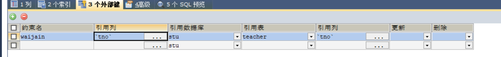

# MySQL学习笔记

## 登录和退出MySQL服务器

```shell
# 登录MySQL 																										(root为用户名 123456为密码)
mysql -uroot -p123456

# 退出MySQL数据库服务器
exit;
```

## 基本语法

```mysql
-- 显示所有数据库
show databases;

-- 创建数据库 																															(test为数据库名)
CREATE DATABASE test;

-- 使用数据库
use test;

-- 创建数据表 三种方式 推荐第二种(注意: 创建时最后一个字段不写逗号,写了报错)
-- 第一种
CREATE TABLE pet (
    name VARCHAR(20),
    owner VARCHAR(20),
    species VARCHAR(20),
    sex CHAR(1),
    birth DATE,
    death DATE
);
-- 第二种(如果不存在则创建)
CREATE TABLE if not exists pet (
);
-- 第三种(不使用服务器默认字符编码,单独为此表设置字符编码或引擎)
CREATE TABLE if not exists pet (
)charset=utf8;

-- 查看数据表结构详情
-- describe pet;	(两种方式下面是简写)																	(显示字段和数据类型等)
desc pet;
-- 第三种形式 通过查看所有列来展示
show columns from '表名'

-- 显示已选数据库中的所有表 								  													    (需先use 数据库)
show tables;
-- 查看表名是t开头的表 通过模糊查询查看
show tables like 't%';

-- 查看表的创建语句 建表语句
show create table tableName;

-- 修改表本身：存储引擎，字符集名校对集
alter table 表名 charset utf8;
-- 或者（中间等号是可写可不写）
alter table 表名 charset = utf8；

-- 修改表名（两种方式）
-- 方式一 rename译改名、重命名
alter table 表名 rename to 新名字；
-- 方式二
rename table 旧表名 to 新表名；

-- 查询数据表的记录 																					(已选中数据库,查看里面的pet表内容)
SELECT * from pet;
-- 根据条件查询表中记录                    (id为字段 0为字段下的记录 若记录是字符串需加引号否则报错)
SELECT * FROM pet WHERE id=0;

-- 插入数据																											(存储字符串和时间需用单引号包裹)
INSERT INTO pet VALUES ('puffball', 'Diane', 'hamster', 'f', '1990-03-30', NULL);

-- 修改数据																(pet表名 squirrel新数据 owner = 'Diane'根据条件查找)
UPDATE pet SET name = 'squirrel' where owner = 'Diane';

-- 删除数据
DELETE FROM pet where name = 'squirrel';

-- 删除表
DROP TABLE myorder;
-- 删除多张表 
DROP TABLE 表1,表2,表3,表4;

## 新增表字段 
-- column可写可不写 字段位置可选
-- 不指定位置默认放最后
alter table 表名 add column 字段名 字段类型；
-- 位置的关键字两个：
-- first:表示要把新增字段放到第一列
-- after+字段名:表示要新增字段放在after指定字段后面
-- 通过after表示放在字段a后面
alter table 表名 add column 字段名 字段类型 after 已有字段a;

## 删除表字段
alter table 表名 drop 字段名。

## 对字段的修改，通过change或者modify都可实现,两者区别是参数一个指定新字段名,一个不指定新字段名,column可省略,

## mysql修改字段类型：	 
ALTER  TABLE 表名 MODIFY 字段名 新数据类型 新类型长度  新默认值  新注释 位置; 
alter  table table1 modify column1  decimal(10,1) DEFAULT NULL COMMENT -- '注释'; 
 
## mysql修改字段名：必须指定数据类型
ALTER  TABLE 表名 CHANGE 旧字段名 新字段名 新数据类型 位置;	 
alter  table table1 change column1 column1 varchar(100) DEFAULT 1.2 COMMENT '注释'; 
```

## 建表约束

### 主键约束

​		==修改表字段，通过change或者modify都可实现,两者区别是参数一个指定新字段名,一个不指定新字段名,column可省略,==

```mysql
-- 主键约束
-- 使某个字段不重复且不得为空，确保表内所有数据的唯一性。                   (primary key表主键约束)
CREATE TABLE user (
    id INT primary key,
    name VARCHAR(20)
);

-- 联合主键
-- 联合主键中的每个字段都不能为空，并且加起来不能和已设置的联合主键重复(即id值和name值相加后的结果不重复即可,任意单个可重复)。
-- primary key(id, name)表设置联合主键
CREATE TABLE user (
    id INT,
    name VARCHAR(20),
    password VARCHAR(20),
    primary key(id, name)  -- 也可只写一个字段,和直接写字段后等效
);

-- 自增约束
-- 自增约束的主键由系统自动递增分配。auto_increment
CREATE TABLE user (
    id INT primary key auto_increment,
    name VARCHAR(20)
);
-- 设置自增约束后如何使用。（表只添加name字段的记录，id由1开始递增,也可(name,id)表只插入这两个）
INSERT INTO b (name) VALUES ('zs');

-- 添加主键约束
-- 如果忘记设置主键，还可以通过SQL语句设置（两种方式）：
ALTER TABLE user ADD PRIMARY KEY(id);-- 通过修改表给字段加主键约束
ALTER TABLE user MODIFY id INT PRIMARY KEY; 	-- 修改字段的方式添加主键约束
-- 删除主键 
ALTER TABLE user drop PRIMARY KEY;-- 因主键只有一个,所以不指定
```

**注意**

```mysql
-- 1、数据库的每张表只能有一个主键，不可能有多个主键。

-- 2、所谓的一张表多个主键，我们称之为联合主键。
--    注：联合主键：就是用多个字段一起作为一张表的主键。

-- 3、主键的主键的作用是保证数据的唯一性和完整性，同时通过主键检索表能够增加检索速度。
```


### 唯一主键

```mysql
-- 使字段不重复 允许为空 值只能出现一次  例若多个空值就不唯一了
-- 建表时创建唯一主键(三种方式)
-- 方式一和方式二等效
CREATE TABLE user ( 
    id INT,
    name VARCHAR(20),
    UNIQUE(name)
);
-- 方式二
CREATE TABLE user ( 
    id INT,
    name VARCHAR(20) UNIQUE,
);
-- 方式三 等效于联合主键,即加起来不重复
CREATE TABLE user (  
    id INT,
    name VARCHAR(20),
  	UNIQUE(id,name)
);


-- 添加唯一主键
-- 如果建表时没有设置唯一建，还可以通过SQL语句设置（三种方式）：
ALTER TABLE user ADD UNIQUE(name);
ALTER TABLE user MODIFY name VARCHAR(20) UNIQUE;
-- 也可给唯一约束取名 若取名后 删除时的名字就不能是列名 必须是设置的约束名
ALTER TABLE user ADD constraint '约束名' UNIQUE(name);

-- 删除唯一主键 若创建时有取名,就把名字改为取的名字
ALTER TABLE user DROP INDEX name;
```

### 非空约束

```mysql
-- 建表时添加非空约束
-- 约束某个字段不能为空
CREATE TABLE user (
    id INT,
    name VARCHAR(20) NOT NULL
);

-- 添加唯一主键
-- 如果建表时没有设置非空约束，还可以通过SQL语句设置
-- 方式一
ALTER TABLE user MODIFY id INT NOT NULL;
-- 方式二
ALTER TABLE a CHANGE COLUMN name_ name_ VARCHAR(20) not null;

-- 移除非空约束
-- 方式一
ALTER TABLE user MODIFY name VARCHAR(20);
-- 方式二 （经测试 直接不写也可以）
ALTER TABLE a CHANGE COLUMN name_ name_ VARCHAR(20) null;
```

### 默认约束

```mysql
-- 建表时添加默认约束
-- 约束某个字段的默认值
CREATE TABLE user2 (
    id INT,
    name VARCHAR(20),
    age INT DEFAULT 10
);
-- 修改表指定默认值(两种方式)
-- 方式一 老师讲的
alter table '表名' change column 字段名 新字段名 新数据类型 default 默认值;
-- change column改变列(字段) 后接要改的字段 然后是设置新的字段名 数据类型 若不改就填原样 然后设置默认值
-- 方式二 自己猜的
ALTER TABLE 表名 MODIFY 字段名 字段类型 设置默认值;
-- 案例:
ALTER TABLE a MODIFY name INT DEFAULT 50;

-- 移除默认约束
-- 方式一
ALTER TABLE user MODIFY age INT;
-- 方式二 将值设置为null
alter table '表名' change column 字段名 新字段名 新数据类型 default null;
```

### 外键约束

```mysql
## 创建表时加外键
-- 班级
CREATE TABLE classes (
    id INT PRIMARY KEY,
    name VARCHAR(20)
);

-- 学生表
CREATE TABLE students (
    id INT PRIMARY KEY,
    name VARCHAR(20),
    -- 这里的 class_id 要和 classes 中的 id 字段相关联,所以类型必须一致            
    class_id INT,
    -- 表示 class_id 的值必须来自于 classes 中的 id 字段值
  	-- 加外键方式 选其一
  	-- 方式一 这里指定外键没设置外键名,系统会自动加
    foreign key(class_id) references classes(id)
  	-- 方式二 指定外键名且创建外键
  	constraint '外键名' foreign key('列名') references '主表名'('列名')
);

-- 1. 主表（父表）classes 中没有的数据值，在副表（子表）students 中，是不可以使用的；
-- 2. 主表中的记录被副表引用时，主表不可以被删除。

## 创建表后加外键
-- 添加外键名
alter table '表名' add constraint '外键名' foreign key('列名') references '主表名'('列名');

## 删除外建名（这里填的外键约束名不是键所在的列名）
ALTER TABLE '表名' DROP FOREIGN KEY '外键约束名';
```

```mysql
-- 查看外键约束名（三种方式 推荐方式三）
-- 方式一 只看约束信息 表名替换成你要看的表
SELECT CONSTRAINT_CATALOG,
CONSTRAINT_SCHEMA,
CONSTRAINT_NAME,
TABLE_SCHEMA,
TABLE_NAME,
CONSTRAINT_TYPE
FROM
information_schema.TABLE_CONSTRAINTS
WHERE
TABLE_NAME='表名'
-- 方式二 看表大部分信息 查看表的创建语句
show create table tableName;


-- 参考链接:https://blog.csdn.net/shenqueying/article/details/78062545
```

查看约束名 方式三

> 选中子表--->右键--->关/系/外键




## 数据库的三大设计范式

### 1NF 第一范式 （拆字段值）

+ 只要字段的值还可以继续拆分，就不满足第一范式。
     - （例'中国成都市武侯区'有很多个类似数据时字段值可以从一个‘地址’字段拆分为‘国家’、‘城市’、’区县‘三个字段，单需要对单独某个字段进行操作时会比较方便）
+ 范式设计得越详细，对某些实际操作可能会更好，但并非都有好处（因若要用完整地址还需拼接），需要对项目的实际情况进行设定（若从来不会对地址某个小字段操作，就不需要此范式，我们需要知道这个）。

### 2NF 第二范式 （拆表）

在满足第一范式的前提下，其他列都必须完全依赖于主键列。如果出现不完全依赖，只可能发生在联合主键的情况下：

```mysql
-- 订单表
CREATE TABLE myorder (
    product_id INT,
    customer_id INT,
    product_name VARCHAR(20),
    customer_name VARCHAR(20),
    PRIMARY KEY (product_id, customer_id)
);
```

实际上，在这张订单表中，`product_id, customer_id`两者构成了主键，`product_name` 只依赖于 `product_id` ，`customer_name` 只依赖于 `customer_id` 。也就是说，`product_name` 和 `customer_name` 只依赖部分主键，不是完全依赖。

这就不满足第二范式：其他列都必须完全依赖于主键列！

```mysql
CREATE TABLE myorder (
    order_id INT PRIMARY KEY,
    product_id INT,
    customer_id INT
);

CREATE TABLE product (
    id INT PRIMARY KEY,
    name VARCHAR(20)
);

CREATE TABLE customer (
    id INT PRIMARY KEY,
    name VARCHAR(20)
);
```

拆分之后，`myorder` 表中的 `product_id` 和 `customer_id` 完全依赖于 `order_id` 主键，而 `product` 和 `customer` 表中的·`name`完全依赖于各自的主键，这就满足第二范式。

### 3NF 第三范式

在满足第二范式的前提下，除了主键列之外，其他列之间不能有传递依赖关系(不能通过其他表找到)。

```mysql
CREATE TABLE myorder (
    order_id INT PRIMARY KEY,
    product_id INT,
    customer_id INT,
    customer_phone VARCHAR(15)
);
```

表中的 `customer_phone` 有可能依赖于 `order_id` 、 `customer_id` 两列（通过这里面也就是其他地方找到`phone`），也就不满足了第三范式的设计：其他列之间不能有传递依赖关系。

```mysql
CREATE TABLE myorder (
    order_id INT PRIMARY KEY,
    product_id INT,
    customer_id INT
);

CREATE TABLE customer (
    id INT PRIMARY KEY,
    name VARCHAR(20),
    phone VARCHAR(15)
);
```

修改后就不存在其他列之间的传递依赖关系，其他列都只依赖于主键列，满足了第三范式的设计！

## 查询练习

### 准备数据

```mysql
-- 创建数据库
CREATE DATABASE select_test;
-- 切换数据库
USE select_test;

-- 创建学生表
CREATE TABLE student (
    no VARCHAR(20) PRIMARY KEY,
    name VARCHAR(20) NOT NULL,
    sex VARCHAR(10) NOT NULL,
    birthday DATE, -- 生日
    class VARCHAR(20) -- 所在班级
);

-- 创建教师表
CREATE TABLE teacher (
    no VARCHAR(20) PRIMARY KEY,
    name VARCHAR(20) NOT NULL,
    sex VARCHAR(10) NOT NULL,
    birthday DATE,
    profession VARCHAR(20) NOT NULL, -- 职称
    department VARCHAR(20) NOT NULL -- 部门
);

-- 创建课程表
CREATE TABLE course (
    no VARCHAR(20) PRIMARY KEY,
    name VARCHAR(20) NOT NULL,
    t_no VARCHAR(20) NOT NULL, -- 教师编号
    -- 表示该 tno 来自于 teacher 表中的 no 字段值
    FOREIGN KEY(t_no) REFERENCES teacher(no) 
);

-- 成绩表
CREATE TABLE score (
    s_no VARCHAR(20) NOT NULL, -- 学生编号
    c_no VARCHAR(20) NOT NULL, -- 课程号
    degree DECIMAL,	-- 成绩
    -- 表示该 s_no, c_no 分别来自于 student, course 表中的 no 字段值
    FOREIGN KEY(s_no) REFERENCES student(no),	
    FOREIGN KEY(c_no) REFERENCES course(no),
    -- 设置 s_no, c_no 为联合主键
    PRIMARY KEY(s_no, c_no)
);

-- 查看所有表
SHOW TABLES;

-- 添加学生表数据
INSERT INTO student VALUES('101', '曾华', '男', '1977-09-01', '95033');
INSERT INTO student VALUES('102', '匡明', '男', '1975-10-02', '95031');
INSERT INTO student VALUES('103', '王丽', '女', '1976-01-23', '95033');
INSERT INTO student VALUES('104', '李军', '男', '1976-02-20', '95033');
INSERT INTO student VALUES('105', '王芳', '女', '1975-02-10', '95031');
INSERT INTO student VALUES('106', '陆军', '男', '1974-06-03', '95031');
INSERT INTO student VALUES('107', '王尼玛', '男', '1976-02-20', '95033');
INSERT INTO student VALUES('108', '张全蛋', '男', '1975-02-10', '95031');
INSERT INTO student VALUES('109', '赵铁柱', '男', '1974-06-03', '95031');

-- 添加教师表数据
INSERT INTO teacher VALUES('804', '李诚', '男', '1958-12-02', '副教授', '计算机系');
INSERT INTO teacher VALUES('856', '张旭', '男', '1969-03-12', '讲师', '电子工程系');
INSERT INTO teacher VALUES('825', '王萍', '女', '1972-05-05', '助教', '计算机系');
INSERT INTO teacher VALUES('831', '刘冰', '女', '1977-08-14', '助教', '电子工程系');

-- 添加课程表数据
INSERT INTO course VALUES('3-105', '计算机导论', '825');
INSERT INTO course VALUES('3-245', '操作系统', '804');
INSERT INTO course VALUES('6-166', '数字电路', '856');
INSERT INTO course VALUES('9-888', '高等数学', '831');

-- 添加添加成绩表数据
INSERT INTO score VALUES('103', '3-105', '92');
INSERT INTO score VALUES('103', '3-245', '86');
INSERT INTO score VALUES('103', '6-166', '85');
INSERT INTO score VALUES('105', '3-105', '88');
INSERT INTO score VALUES('105', '3-245', '75');
INSERT INTO score VALUES('105', '6-166', '79');
INSERT INTO score VALUES('109', '3-105', '76');
INSERT INTO score VALUES('109', '3-245', '68');
INSERT INTO score VALUES('109', '6-166', '81');

-- 查看表结构
SELECT * FROM course;
SELECT * FROM score;
SELECT * FROM student;
SELECT * FROM teacher;
```

### 1 到 11种查询

```mysql
-- 1、查询 student 表的所有记录 (*表所有字段数，即查询此表所有字段数的记录)
SELECT * FROM student;

-- 2、查询 student 表中的 name、sex 和 class 字段的记录（即查询指定字段的记录）
SELECT name, sex, class FROM student;

-- 3、查询 teacher 表中department列内不重复记录 
-- distinct: 译不同的，是排重关键字
SELECT distinct department FROM teacher;

-- 4.查询 score 表中成绩在60-80之间的所有行（区间查询和运算符查询）
-- BETWEEN xx AND xx: 查询区间, AND 表示 "并且"
SELECT * FROM score WHERE degree BETWEEN 60 AND 80;
SELECT * FROM score WHERE degree > 60 AND degree < 80;

-- 5、查询 score 表中成绩为 85, 86 或 88 的行（或者关系的查询）
-- IN: 查询规定中的多个值
SELECT * FROM score WHERE degree IN(85, 86, 88);

-- 6、查询 student 表中 '95031' 班或性别为 '女' 的所有行
-- or: 表示或者关系 （和案例5区别：5是同字段或者关系，6是不同字段，若换成and则是不同字段并且关系）
SELECT * FROM student WHERE class = '95031' or sex = '女';

-- 7、order by 排序, 以 class 降序的方式查询 student 表的所有行
-- DESC: 降序，从高到低
-- ASC（默认）: 升序，从低到高
SELECT * FROM student ORDER BY class DESC;
SELECT * FROM student ORDER BY class ASC;

-- 8、多字段排序，以 c_no 升序、degree 降序查询 score 表的所有行
-- 是先c_no升序,升序完成后在相同的记录中,再DESC降序
SELECT * FROM score ORDER BY c_no ASC, degree DESC;

-- 9、查询 class字段为"95031" 的个数
-- COUNT: 统计
SELECT COUNT(*) FROM student WHERE class = '95031';

-- 10、查询 score 表中的最高分的学生学号和课程编号（子查询或排序查询）。
-- (SELECT MAX(degree) FROM score): 子查询，算出最高分
SELECT s_no, c_no FROM score WHERE degree = (SELECT MAX(degree) FROM score);

-- 11、排序查询
-- limit r, n: 表示从第r行开始，查询n条数据,首行下标为0所以0,1表示第一行开始(含自身)查一条。limit限制
SELECT s_no, c_no, degree FROM score ORDER BY degree DESC limit 0, 1;
-- 排序查询有缺陷,若最高分有两个或者三个,那么这里0,1则只查了一条
```

### 分组计算平均成绩

**查询每门课的平均成绩。**

```mysql
-- AVG: 平均值 (查询指定单个课的平均成绩)
SELECT AVG(degree) FROM score WHERE c_no = '3-105';
SELECT AVG(degree) FROM score WHERE c_no = '3-245';
SELECT AVG(degree) FROM score WHERE c_no = '6-166';

-- GROUP BY: 分组查询 (查询每门课的平均成绩,不用再一个个算) 
-- 先按课程号进行分组,再算每组的平均值
SELECT c_no, AVG(degree) FROM score GROUP BY c_no;
```

### 分组条件与模糊查询

**查询 `score` 表中至少有 2 名学生选修，并以 3 开头的课程的平均分数。**

```mysql
SELECT * FROM score;
-- c_no 课程编号
+------+-------+--------+
| s_no | c_no  | degree |
+------+-------+--------+
| 103  | 3-105 |     92 |
| 103  | 3-245 |     86 |
| 103  | 6-166 |     85 |
| 105  | 3-105 |     88 |
| 105  | 3-245 |     75 |
| 105  | 6-166 |     79 |
| 109  | 3-105 |     76 |
| 109  | 3-245 |     68 |
| 109  | 6-166 |     81 |
+------+-------+--------+
```

分析表发现，至少有 2 名学生选修的课程是 `3-105` 、`3-245` 、`6-166` ，以 3 开头的课程是 `3-105` 、`3-245` 。也就是说，我们要查询所有 `3-105` 和 `3-245` 的 `degree` 平均分。

```mysql
-- 首先把 c_no, AVG(degree) 通过分组查询出来
SELECT c_no, AVG(degree) FROM score GROUP BY c_no
+-------+-------------+
| c_no  | AVG(degree) |
+-------+-------------+
| 3-105 |     85.3333 |
| 3-245 |     76.3333 |
| 6-166 |     81.6667 |
+-------+-------------+

-- 再查询出至少有 2 名学生选修的课程
-- HAVING: 表示持有
-- having和group by配合使用,用于对分组的过滤
HAVING COUNT(c_no) >= 2

-- 并且是以 3 开头的课程
-- LIKE 表示模糊查询，"%" 是一个通配符，匹配 "3" 后面的任意字符。
AND c_no LIKE '3%';

-- 把前面的SQL语句拼接起来，
-- 后面加上一个 COUNT(*)，表示将每个分组的个数也查询出来。
SELECT c_no, AVG(degree), COUNT(*) FROM score GROUP BY c_no
having COUNT(c_no) >= 2 AND c_no LIKE '3%';
+-------+-------------+----------+
| c_no  | AVG(degree) | COUNT(*) |
+-------+-------------+----------+
| 3-105 |     85.3333 |        3 |
| 3-245 |     76.3333 |        3 |
+-------+-------------+----------+

-- count(*)---包括所有列，返回表中的记录数，相当于统计表的行数，在统计结果的时候，不会忽略列值为NULL的记录。
-- count(列名)---只包括列名指定列，返回指定列的记录数，在统计结果的时候，会忽略列值为NULL的记录（不包括空字符串和0），即列值为NULL的记录不统计在内。
```

### 多表查询 - 1

**查询所有学生的 `name`，以及该学生在 `score` 表中对应的 `c_no` 和 `degree` 。**

```mysql
SELECT no, name FROM student;
+-----+-----------+
| no  | name      |
+-----+-----------+
| 101 | 曾华      |
| 102 | 匡明      |
| 103 | 王丽      |
| 104 | 李军      |
| 105 | 王芳      |
| 106 | 陆军      |
| 107 | 王尼玛    |
| 108 | 张全蛋    |
| 109 | 赵铁柱    |
+-----+-----------+

SELECT s_no, c_no, degree FROM score;
+------+-------+--------+
| s_no | c_no  | degree |
+------+-------+--------+
| 103  | 3-105 |     92 |
| 103  | 3-245 |     86 |
| 103  | 6-166 |     85 |
| 105  | 3-105 |     88 |
| 105  | 3-245 |     75 |
| 105  | 6-166 |     79 |
| 109  | 3-105 |     76 |
| 109  | 3-245 |     68 |
| 109  | 6-166 |     81 |
+------+-------+--------+
```

通过分析可以发现，只要把 `score` 表中的 `s_no` 字段值替换成 `student` 表中对应的 `name` 字段值就可以了，如何做呢？

```mysql
-- FROM...: 表示从 student, score 表中查询
-- WHERE 的条件表示为，只有在 student.no 和 score.s_no 相等时才显示出来。
SELECT name, c_no, degree FROM student, score 
WHERE student.no = score.s_no;
+-----------+-------+--------+
| name      | c_no  | degree |
+-----------+-------+--------+
| 王丽      | 3-105 |     92 |
| 王丽      | 3-245 |     86 |
| 王丽      | 6-166 |     85 |
| 王芳      | 3-105 |     88 |
| 王芳      | 3-245 |     75 |
| 王芳      | 6-166 |     79 |
| 赵铁柱    | 3-105 |     76 |
| 赵铁柱    | 3-245 |     68 |
| 赵铁柱    | 6-166 |     81 |
+-----------+-------+--------+
```

### 多表查询 - 2

**查询所有学生的 `no` 、课程名称 ( `course` 表中的 `name` ) 和成绩 ( `score` 表中的 `degree` ) 列。**

只有 `score` 关联学生的 `no` ，因此只要查询 `score` 表，就能找出所有和学生相关的 `no` 和 `degree` ：

```mysql
SELECT s_no, c_no, degree FROM score;
+------+-------+--------+
| s_no | c_no  | degree |
+------+-------+--------+
| 103  | 3-105 |     92 |
| 103  | 3-245 |     86 |
| 103  | 6-166 |     85 |
| 105  | 3-105 |     88 |
| 105  | 3-245 |     75 |
| 105  | 6-166 |     79 |
| 109  | 3-105 |     76 |
| 109  | 3-245 |     68 |
| 109  | 6-166 |     81 |
+------+-------+--------+
```

然后查询 `course` 表：

```mysql
+-------+-----------------+
| no    | name            |
+-------+-----------------+
| 3-105 | 计算机导论      |
| 3-245 | 操作系统        |
| 6-166 | 数字电路        |
| 9-888 | 高等数学        |
+-------+-----------------+
```

只要把 `score` 表中的 `c_no` 替换成 `course` 表中对应的 `name` 字段值就可以了。

```mysql
-- 增加一个查询字段 name，分别从 score、course 这两个表中查询。
-- as 表示取一个该字段的别名。
SELECT s_no, name as c_name, degree FROM score, course
WHERE score.c_no = course.no;
-- 注意 若两表中无相同字段 可以不用表名点字段,直接写为字段即可例c_no =no
+------+-----------------+--------+
| s_no | c_name          | degree |
+------+-----------------+--------+
| 103  | 计算机导论      |     92 |
| 105  | 计算机导论      |     88 |
| 109  | 计算机导论      |     76 |
| 103  | 操作系统        |     86 |
| 105  | 操作系统        |     75 |
| 109  | 操作系统        |     68 |
| 103  | 数字电路        |     85 |
| 105  | 数字电路        |     79 |
| 109  | 数字电路        |     81 |
+------+-----------------+--------+
```

### 三表关联查询

**查询所有学生的 `name` 、课程名 ( `course` 表中的 `name` ) 和 `degree` 。**

只有 `score` 表中关联学生的学号和课堂号，我们只要围绕着 `score` 这张表查询就好了。

```mysql
SELECT * FROM score;
+------+-------+--------+
| s_no | c_no  | degree |
+------+-------+--------+
| 103  | 3-105 |     92 |
| 103  | 3-245 |     86 |
| 103  | 6-166 |     85 |
| 105  | 3-105 |     88 |
| 105  | 3-245 |     75 |
| 105  | 6-166 |     79 |
| 109  | 3-105 |     76 |
| 109  | 3-245 |     68 |
| 109  | 6-166 |     81 |
+------+-------+--------+
```

只要把 `s_no` 和 `c_no` 替换成 `student` 和 `srouse` 表中对应的 `name` 字段值就好了。

首先把 `s_no` 替换成 `student` 表中的 `name` 字段：

```mysql
SELECT name, c_no, degree FROM student, score WHERE student.no = score.s_no;
+-----------+-------+--------+
| name      | c_no  | degree |
+-----------+-------+--------+
| 王丽      | 3-105 |     92 |
| 王丽      | 3-245 |     86 |
| 王丽      | 6-166 |     85 |
| 王芳      | 3-105 |     88 |
| 王芳      | 3-245 |     75 |
| 王芳      | 6-166 |     79 |
| 赵铁柱    | 3-105 |     76 |
| 赵铁柱    | 3-245 |     68 |
| 赵铁柱    | 6-166 |     81 |
+-----------+-------+--------+
```

再把 `c_no` 替换成 `course` 表中的 `name` 字段：

```mysql
-- 课程表
SELECT no, name FROM course;
+-------+-----------------+
| no    | name            |
+-------+-----------------+
| 3-105 | 计算机导论      |
| 3-245 | 操作系统        |
| 6-166 | 数字电路        |
| 9-888 | 高等数学        |
+-------+-----------------+

-- 由于字段名存在重复，使用 "表名.字段名 as 别名" 代替。
SELECT student.name as s_name, course.name as c_name, degree 
FROM student, score, course
WHERE student.NO = score.s_no
AND score.c_no = course.no;
-- 注意 若多表中无相同字段 可以不用表名点字段,直接写为字段即可例c_no =no
```

### 子查询加分组求平均分

**查询 `95031` 班学生每门课程的平均成绩。**

在 `score` 表中根据 `student`  表的学生编号筛选出学生的课堂号和成绩：

```mysql
-- IN (..): 将筛选出的学生号当做 s_no 的条件查询
SELECT s_no, c_no, degree FROM score
WHERE s_no IN (SELECT no FROM student WHERE class = '95031');
+------+-------+--------+
| s_no | c_no  | degree |
+------+-------+--------+
| 105  | 3-105 |     88 |
| 105  | 3-245 |     75 |
| 105  | 6-166 |     79 |
| 109  | 3-105 |     76 |
| 109  | 3-245 |     68 |
| 109  | 6-166 |     81 |
+------+-------+--------+
```

这时只要将 `c_no` 分组一下就能得出 `95031` 班学生每门课的平均成绩：

```mysql
SELECT c_no, AVG(degree) FROM score
WHERE s_no IN (SELECT no FROM student WHERE class = '95031')
GROUP BY c_no;
+-------+-------------+
| c_no  | AVG(degree) |
+-------+-------------+
| 3-105 |     82.0000 |
| 3-245 |     71.5000 |
| 6-166 |     80.0000 |
+-------+-------------+
```

### 子查询 - 1

**查询在 `3-105` 课程中，所有成绩高于 `109` 号同学的记录。**

首先筛选出课堂号为 `3-105` ，在找出所有成绩高于 `109` 号同学的的行。

```mysql
SELECT * FROM score 
WHERE c_no = '3-105'
AND degree > (SELECT degree FROM score WHERE s_no = '109' AND c_no = '3-105');
```

### 子查询 - 2

**查询所有成绩高于 `109` 号同学的 `3-105` 课程成绩记录。**

```mysql
-- 不限制课程号，只要成绩大于109号同学的3-105课程成绩就可以。
SELECT * FROM score
WHERE degree > (SELECT degree FROM score WHERE s_no = '109' AND c_no = '3-105');
```

### YEAR 函数与带 IN 关键字查询

**查询所有和 `101` 、`108` 号学生同年出生的 `no` 、`name` 、`birthday` 列。**

```mysql
-- YEAR(..): 取出日期中的年份
SELECT no, name, birthday FROM student
WHERE YEAR(birthday) IN (SELECT YEAR(birthday) FROM student WHERE no IN (101, 108));
```

### 多层嵌套子查询

**查询 `'张旭'` 教师任课的学生成绩表。**

首先找到教师编号：

```mysql
SELECT NO FROM teacher WHERE NAME = '张旭'
```

通过 `sourse` 表找到该教师课程号：

```mysql
SELECT NO FROM course WHERE t_no = ( SELECT NO FROM teacher WHERE NAME = '张旭' );
```

通过筛选出的课程号查询成绩表：

```mysql
SELECT * FROM score WHERE c_no = (
    SELECT no FROM course WHERE t_no = ( 
        SELECT no FROM teacher WHERE NAME = '张旭' 
    )
);
```

### 多表查询

**查询某选修课程多于5个同学的教师姓名。**

首先在 `teacher` 表中，根据 `no` 字段来判断该教师的同一门课程是否有至少5名学员选修：

```mysql
-- 查询 teacher 表
SELECT no, name FROM teacher;
+-----+--------+
| no  | name   |
+-----+--------+
| 804 | 李诚   |
| 825 | 王萍   |
| 831 | 刘冰   |
| 856 | 张旭   |
+-----+--------+

SELECT name FROM teacher WHERE no IN (
    -- 在这里找到对应的条件
);
```

查看和教师编号有有关的表的信息：

```mysql
SELECT * FROM course;
-- t_no: 教师编号
+-------+-----------------+------+
| no    | name            | t_no |
+-------+-----------------+------+
| 3-105 | 计算机导论      | 825  |
| 3-245 | 操作系统        | 804  |
| 6-166 | 数字电路        | 856  |
| 9-888 | 高等数学        | 831  |
+-------+-----------------+------+
```

我们已经找到和教师编号有关的字段就在 `course` 表中，但是还无法知道哪门课程至少有5名学生选修，所以还需要根据 `score` 表来查询：

```mysql
-- 在此之前向 score 插入一些数据，以便丰富查询条件。
INSERT INTO score VALUES ('101', '3-105', '90');
INSERT INTO score VALUES ('102', '3-105', '91');
INSERT INTO score VALUES ('104', '3-105', '89');

-- 查询 score 表
SELECT * FROM score;
+------+-------+--------+
| s_no | c_no  | degree |
+------+-------+--------+
| 101  | 3-105 |     90 |
| 102  | 3-105 |     91 |
| 103  | 3-105 |     92 |
| 103  | 3-245 |     86 |
| 103  | 6-166 |     85 |
| 104  | 3-105 |     89 |
| 105  | 3-105 |     88 |
| 105  | 3-245 |     75 |
| 105  | 6-166 |     79 |
| 109  | 3-105 |     76 |
| 109  | 3-245 |     68 |
| 109  | 6-166 |     81 |
+------+-------+--------+

-- 在 score 表中将 c_no 作为分组，并且限制 c_no 持有至少 5 条数据。
SELECT c_no FROM score GROUP BY c_no HAVING COUNT(*) > 5;
+-------+
| c_no  |
+-------+
| 3-105 |
+-------+
```

根据筛选出来的课程号，找出在某课程中，拥有至少5名学员的教师编号：

```mysql
SELECT t_no FROM course WHERE no IN (
    SELECT c_no FROM score GROUP BY c_no HAVING COUNT(*) > 5
);
+------+
| t_no |
+------+
| 825  |
+------+
```

在 `teacher` 表中，根据筛选出来的教师编号找到教师姓名：

```mysql
SELECT name FROM teacher WHERE no IN (
    -- 最终条件
    SELECT t_no FROM course WHERE no IN (
        SELECT c_no FROM score GROUP BY c_no HAVING COUNT(*) > 5
    )
);
```

### 子查询 - 3

**查询 “计算机系” 课程的成绩表。**

思路是，先找出 `course` 表中所有 `计算机系` 课程的编号，然后根据这个编号查询 `score` 表。

```mysql
-- 通过 teacher 表查询所有 `计算机系` 的教师编号
SELECT no, name, department FROM teacher WHERE department = '计算机系'
+-----+--------+--------------+
| no  | name   | department   |
+-----+--------+--------------+
| 804 | 李诚   | 计算机系     |
| 825 | 王萍   | 计算机系     |
+-----+--------+--------------+

-- 通过 course 表查询该教师的课程编号
SELECT no FROM course WHERE t_no IN (
    SELECT no FROM teacher WHERE department = '计算机系'
);
+-------+
| no    |
+-------+
| 3-245 |
| 3-105 |
+-------+

-- 根据筛选出来的课程号查询成绩表
SELECT * FROM score WHERE c_no IN (
    SELECT no FROM course WHERE t_no IN (
        SELECT no FROM teacher WHERE department = '计算机系'
    )
);
+------+-------+--------+
| s_no | c_no  | degree |
+------+-------+--------+
| 103  | 3-245 |     86 |
| 105  | 3-245 |     75 |
| 109  | 3-245 |     68 |
| 101  | 3-105 |     90 |
| 102  | 3-105 |     91 |
| 103  | 3-105 |     92 |
| 104  | 3-105 |     89 |
| 105  | 3-105 |     88 |
| 109  | 3-105 |     76 |
+------+-------+--------+
```

### union 和 not in 的使用

**查询 `计算机系` 与 `电子工程系` 中的不同职称的教师。**

```mysql
-- not in: not表非 not in表示不在这里面的
SELECT * FROM teacher WHERE department = '计算机系' AND profession NOT IN (
    SELECT profession FROM teacher WHERE department = '电子工程系'
);
-- union 求并集 用于合并两个或多个 SELECT 语句的结果集
SELECT * FROM teacher WHERE department = '计算机系' AND profession NOT IN (
    SELECT profession FROM teacher WHERE department = '电子工程系'
) UNION SELECT * FROM teacher WHERE department = '电子工程系' AND profession NOT IN (
    SELECT profession FROM teacher WHERE department = '计算机系'
);

## 注意：
-- UNION 内部的 SELECT 语句必须拥有相同数量的列；
-- 列也必须拥有相似的数据类型（实际非必须）；
-- 同时，每条 SELECT 语句中列的顺序必须相同。

## UNION 结果集中的列名总是等于 UNION 中第一个 SELECT 语句中的列名,若想改合并后的列名,则在第一个 SELECT 语句中将列表通过as设置别名
```

### any 表示至少一个 - DESC ( 降序 )

**查询课程 `3-105` 且成绩 <u>至少</u> 高于 `3-245` 的 `score` 表。**

```mysql
SELECT * FROM score WHERE c_no = '3-105';
+------+-------+--------+
| s_no | c_no  | degree |
+------+-------+--------+
| 101  | 3-105 |     90 |
| 102  | 3-105 |     91 |
| 103  | 3-105 |     92 |
| 104  | 3-105 |     89 |
| 105  | 3-105 |     88 |
| 109  | 3-105 |     76 |
+------+-------+--------+

SELECT * FROM score WHERE c_no = '3-245';
+------+-------+--------+
| s_no | c_no  | degree |
+------+-------+--------+
| 103  | 3-245 |     86 |
| 105  | 3-245 |     75 |
| 109  | 3-245 |     68 |
+------+-------+--------+

-- any: 符合SQL语句中的任意条件。
-- 也就是说，在 3-105 成绩中，只要有一个大于从 3-245 筛选出来的任意行就符合条件，
-- 最后根据降序查询结果。
SELECT * FROM score WHERE c_no = '3-105' AND degree > ANY(
    SELECT degree FROM score WHERE c_no = '3-245'
) ORDER BY degree DESC;
+------+-------+--------+
| s_no | c_no  | degree |
+------+-------+--------+
| 103  | 3-105 |     92 |
| 102  | 3-105 |     91 |
| 101  | 3-105 |     90 |
| 104  | 3-105 |     89 |
| 105  | 3-105 |     88 |
| 109  | 3-105 |     76 |
+------+-------+--------+
```

### all表示所有

**查询课程 `3-105` 且成绩高于 `3-245` 的 `score` 表。**

```mysql
-- 只需对上一道题稍作修改。
-- ALL: 符合SQL语句中的所有条件。
-- 也就是说，在 3-105 每一行成绩中，都要大于从 3-245 筛选出来全部行才算符合条件。
SELECT * FROM score WHERE c_no = '3-105' AND degree > ALL(
    SELECT degree FROM score WHERE c_no = '3-245'
);
+------+-------+--------+
| s_no | c_no  | degree |
+------+-------+--------+
| 101  | 3-105 |     90 |
| 102  | 3-105 |     91 |
| 103  | 3-105 |     92 |
| 104  | 3-105 |     89 |
| 105  | 3-105 |     88 |
+------+-------+--------+
```

### 复制表的数据作为条件查询

**查询某课程成绩比该课程平均成绩低的 `score` 表。**

```mysql
-- 查询平均分
SELECT c_no, AVG(degree) FROM score GROUP BY c_no;
+-------+-------------+
| c_no  | AVG(degree) |
+-------+-------------+
| 3-105 |     87.6667 |
| 3-245 |     76.3333 |
| 6-166 |     81.6667 |
+-------+-------------+

-- 查询 score 表
SELECT degree FROM score;
+--------+
| degree |
+--------+
|     90 |
|     91 |
|     92 |
|     86 |
|     85 |
|     89 |
|     88 |
|     75 |
|     79 |
|     76 |
|     68 |
|     81 |
+--------+
-- 复制表a 取名表b
-- 将表 b 作用于表 a 中查询数据
-- score a (b): 将表声明为 a (b)，
-- 如此就能用 a.c_no = b.c_no 作为条件执行查询了。
SELECT * FROM score a WHERE degree < (
    (SELECT AVG(degree) FROM score b WHERE a.c_no = b.c_no)
);
+------+-------+--------+
| s_no | c_no  | degree |
+------+-------+--------+
| 105  | 3-245 |     75 |
| 105  | 6-166 |     79 |
| 109  | 3-105 |     76 |
| 109  | 3-245 |     68 |
| 109  | 6-166 |     81 |
+------+-------+--------+
```

### 子查询 - 4

**查询所有任课 ( 在 `course` 表里有课程 ) 教师的 `name` 和 `department`** 。

```mysql
SELECT name, department FROM teacher WHERE no IN (SELECT t_no FROM course);
+--------+-----------------+
| name   | department      |
+--------+-----------------+
| 李诚   | 计算机系        |
| 王萍   | 计算机系        |
| 刘冰   | 电子工程系      |
| 张旭   | 电子工程系      |
+--------+-----------------+
```

### 条件加组筛选

**查询 `student` 表中至少有 2 名男生的 `class` 。**

```mysql
-- 查看学生表信息
SELECT * FROM student;
+-----+-----------+-----+------------+-------+
| no  | name      | sex | birthday   | class |
+-----+-----------+-----+------------+-------+
| 101 | 曾华      | 男  | 1977-09-01 | 95033 |
| 102 | 匡明      | 男  | 1975-10-02 | 95031 |
| 103 | 王丽      | 女  | 1976-01-23 | 95033 |
| 104 | 李军      | 男  | 1976-02-20 | 95033 |
| 105 | 王芳      | 女  | 1975-02-10 | 95031 |
| 106 | 陆军      | 男  | 1974-06-03 | 95031 |
| 107 | 王尼玛    | 男  | 1976-02-20 | 95033 |
| 108 | 张全蛋    | 男  | 1975-02-10 | 95031 |
| 109 | 赵铁柱    | 男  | 1974-06-03 | 95031 |
| 110 | 张飞      | 男  | 1974-06-03 | 95038 |
+-----+-----------+-----+------------+-------+

-- 只查询性别为男，然后按 class 分组，并限制 class 行大于 1。
SELECT class FROM student WHERE sex = '男' GROUP BY class HAVING COUNT(*) > 1;
+-------+
| class |
+-------+
| 95033 |
| 95031 |
+-------+
```

### not like 模糊查询取反

**查询 `student` 表中不姓 "王" 的同学记录。**

```mysql
-- NOT: 取反
-- LIKE: 模糊查询
mysql> SELECT * FROM student WHERE name NOT LIKE '王%';
+-----+-----------+-----+------------+-------+
| no  | name      | sex | birthday   | class |
+-----+-----------+-----+------------+-------+
| 101 | 曾华      | 男  | 1977-09-01 | 95033 |
| 102 | 匡明      | 男  | 1975-10-02 | 95031 |
| 104 | 李军      | 男  | 1976-02-20 | 95033 |
| 106 | 陆军      | 男  | 1974-06-03 | 95031 |
| 108 | 张全蛋    | 男  | 1975-02-10 | 95031 |
| 109 | 赵铁柱    | 男  | 1974-06-03 | 95031 |
| 110 | 张飞      | 男  | 1974-06-03 | 95038 |
+-----+-----------+-----+------------+-------+
```

### year 与 now 函数

**查询 `student` 表中每个学生的姓名和年龄。**

```mysql
-- 使用函数 YEAR(NOW()) 计算出当前年份，减去出生年份后得出年龄。
SELECT name, YEAR(NOW()) - YEAR(birthday) as age FROM student;
-- 计算当前年份
SELECT YEAR(NOW());
+-----------+------+
| name      | age  |
+-----------+------+
| 曾华      |   42 |
| 匡明      |   44 |
| 王丽      |   43 |
| 李军      |   43 |
| 王芳      |   44 |
| 陆军      |   45 |
| 王尼玛    |   43 |
| 张全蛋    |   44 |
| 赵铁柱    |   45 |
| 张飞      |   45 |
+-----------+------+
```

### MAX 与 MIN 函数

**查询 `student` 表中最大和最小的 `birthday` 值。**

```mysql
-- max()和min()是单纯比较数字大小,所以1977>1974而非按年龄来
SELECT MAX(birthday), MIN(birthday) FROM student;
+---------------+---------------+
| MAX(birthday) | MIN(birthday) |
+---------------+---------------+
| 1977-09-01    | 1974-06-03    |
+---------------+---------------+
```

### 多字段排序order by

**以 `class` 和 `birthday` 从大到小的顺序查询 `student` 表。**

```mysql
-- class DESC逗号后再写一个birthday字段表多字段排序,若不写排序规则默认升序asc先小后大
-- 这里出生年份数字越小,年龄越大,所以默认asc
SELECT * FROM student ORDER BY class DESC, birthday;
+-----+-----------+-----+------------+-------+
| no  | name      | sex | birthday   | class |
+-----+-----------+-----+------------+-------+
| 110 | 张飞      | 男  | 1974-06-03 | 95038 |
| 103 | 王丽      | 女  | 1976-01-23 | 95033 |
| 104 | 李军      | 男  | 1976-02-20 | 95033 |
| 107 | 王尼玛    | 男  | 1976-02-20 | 95033 |
| 101 | 曾华      | 男  | 1977-09-01 | 95033 |
| 106 | 陆军      | 男  | 1974-06-03 | 95031 |
| 109 | 赵铁柱    | 男  | 1974-06-03 | 95031 |
| 105 | 王芳      | 女  | 1975-02-10 | 95031 |
| 108 | 张全蛋    | 男  | 1975-02-10 | 95031 |
| 102 | 匡明      | 男  | 1975-10-02 | 95031 |
+-----+-----------+-----+------------+-------+
```

### 子查询 - 5

**查询 "男" 教师及其所上的课程。**

```mysql
SELECT * FROM course WHERE t_no in (SELECT no FROM teacher WHERE sex = '男');
+-------+--------------+------+
| no    | name         | t_no |
+-------+--------------+------+
| 3-245 | 操作系统     | 804  |
| 6-166 | 数字电路     | 856  |
+-------+--------------+------+
```

### MAX 函数与子查询

**查询最高分同学的 `score` 表。**

```mysql
-- 找出最高成绩（该查询只能有一个结果）
SELECT MAX(degree) FROM score;

-- 根据上面的条件筛选出所有最高成绩表，
-- 该查询可能有多个结果，假设 degree 值多次符合条件。
SELECT * FROM score WHERE degree = (SELECT MAX(degree) FROM score);
+------+-------+--------+
| s_no | c_no  | degree |
+------+-------+--------+
| 103  | 3-105 |     92 |
+------+-------+--------+
```

### 子查询 - 6

**查询和 "李军" 同性别的所有同学 `name` 。**

```mysql
-- 首先将李军的性别作为条件取出来
SELECT sex FROM student WHERE name = '李军';
+-----+
| sex |
+-----+
| 男  |
+-----+

-- 根据性别查询 name 和 sex
SELECT name, sex FROM student WHERE sex = (
    SELECT sex FROM student WHERE name = '李军'
);
+-----------+-----+
| name      | sex |
+-----------+-----+
| 曾华      | 男  |
| 匡明      | 男  |
| 李军      | 男  |
| 陆军      | 男  |
| 王尼玛    | 男  |
| 张全蛋    | 男  |
| 赵铁柱    | 男  |
| 张飞      | 男  |
+-----------+-----+
```

### 子查询 - 7

**查询和 "李军" 同性别且同班的同学 `name` 。**

```mysql
SELECT name, sex, class FROM student WHERE sex = (
    SELECT sex FROM student WHERE name = '李军'
) AND class = (
    SELECT class FROM student WHERE name = '李军'
);
+-----------+-----+-------+
| name      | sex | class |
+-----------+-----+-------+
| 曾华      | 男  | 95033 |
| 李军      | 男  | 95033 |
| 王尼玛    | 男  | 95033 |
+-----------+-----+-------+
```

### 子查询 - 8

**查询所有选修 "计算机导论" 课程的 "男" 同学成绩表。**

需要的 "计算机导论" 和性别为 "男" 的编号可以在 `course` 和 `student` 表中找到。

```mysql
SELECT * FROM score WHERE c_no = (
    SELECT no FROM course WHERE name = '计算机导论'
) AND s_no IN (
    SELECT no FROM student WHERE sex = '男'
);
+------+-------+--------+
| s_no | c_no  | degree |
+------+-------+--------+
| 101  | 3-105 |     90 |
| 102  | 3-105 |     91 |
| 104  | 3-105 |     89 |
| 109  | 3-105 |     76 |
+------+-------+--------+
```

### 按等级查询

建立一个 `grade` 表代表学生的成绩等级，并插入数据：

```mysql
CREATE TABLE grade (
    low INT(3),
    upp INT(3),
    grade char(1)
);

INSERT INTO grade VALUES (90, 100, 'A');
INSERT INTO grade VALUES (80, 89, 'B');
INSERT INTO grade VALUES (70, 79, 'C');
INSERT INTO grade VALUES (60, 69, 'D');
INSERT INTO grade VALUES (0, 59, 'E');

SELECT * FROM grade;
+------+------+-------+
| low  | upp  | grade |
+------+------+-------+
|   90 |  100 | A     |
|   80 |   89 | B     |
|   70 |   79 | C     |
|   60 |   69 | D     |
|    0 |   59 | E     |
+------+------+-------+
```

**查询所有学生的 `s_no` 、`c_no` 和 `grade` 列。**

思路是，使用区间 ( `BETWEEN` ) 查询，判断学生的成绩 ( `degree` )  在 `grade` 表的 `low` 和 `upp` 之间。

```mysql
SELECT s_no, c_no, grade FROM score, grade 
WHERE degree BETWEEN low AND upp;
+------+-------+-------+
| s_no | c_no  | grade |
+------+-------+-------+
| 101  | 3-105 | A     |
| 102  | 3-105 | A     |
| 103  | 3-105 | A     |
| 103  | 3-245 | B     |
| 103  | 6-166 | B     |
| 104  | 3-105 | B     |
| 105  | 3-105 | B     |
| 105  | 3-245 | C     |
| 105  | 6-166 | C     |
| 109  | 3-105 | C     |
| 109  | 3-245 | D     |
| 109  | 6-166 | B     |
+------+-------+-------+
```

### 连接查询

准备用于测试连接查询的数据：

```mysql
CREATE DATABASE testJoin;

CREATE TABLE person (
    id INT,
    name VARCHAR(20),
    cardId INT
);

CREATE TABLE card (
    id INT,
    name VARCHAR(20)
);

INSERT INTO card VALUES (1, '饭卡'), (2, '建行卡'), (3, '农行卡'), (4, '工商卡'), (5, '邮政卡');
SELECT * FROM card;
+------+-----------+
| id   | name      |
+------+-----------+
|    1 | 饭卡      |
|    2 | 建行卡    |
|    3 | 农行卡    |
|    4 | 工商卡    |
|    5 | 邮政卡    |
+------+-----------+

INSERT INTO person VALUES (1, '张三', 1), (2, '李四', 3), (3, '王五', 6);
SELECT * FROM person;
+------+--------+--------+
| id   | name   | cardId |
+------+--------+--------+
|    1 | 张三   |      1 |
|    2 | 李四   |      3 |
|    3 | 王五   |      6 |
+------+--------+--------+
```

分析两张表发现，`person` 表并没有为 `cardId` 字段设置一个在 `card` 表中对应的 `id` 外键。如果设置了的话，`person` 中 `cardId` 字段值为 `6` 的行就插不进去，因为该 `cardId` 值在 `card` 表中并没有。

#### 内连接inner join 或 join

要查询这两张表中有关系的数据，可以使用 `INNER JOIN` ( 内连接 ) 将它们连接在一起。

内联查询其实就是两个表中的数据,通过某个字段相等,查询出相关结果。

```mysql
-- INNER JOIN: 表示为内连接，将两张表拼接在一起。
-- on: 表示要执行某个条件。
SELECT * FROM person INNER JOIN card on person.cardId = card.id;
+------+--------+--------+------+-----------+
| id   | name   | cardId | id   | name      |
+------+--------+--------+------+-----------+
|    1 | 张三   |      1 |    1 | 饭卡      |
|    2 | 李四   |      3 |    3 | 农行卡    |
+------+--------+--------+------+-----------+

-- 将 INNER 关键字省略掉，结果也是一样的。
-- SELECT * FROM person JOIN card on person.cardId = card.id;
```

> 注意：`card` 的整张表被连接到了右边。

#### 左外连接left join 或 left outer join

完整显示左边的表 ( `person` ) ，右边的表如果符合条件就显示，不符合则补 `NULL` 。

```mysql
-- LEFT JOIN 也叫做 LEFT OUTER JOIN，用这两种方式的查询结果是一样的。
SELECT * FROM person LEFT JOIN card on person.cardId = card.id;
+------+--------+--------+------+-----------+
| id   | name   | cardId | id   | name      |
+------+--------+--------+------+-----------+
|    1 | 张三   |      1 |    1 | 饭卡      |
|    2 | 李四   |      3 |    3 | 农行卡    |
|    3 | 王五   |      6 | NULL | NULL      |
+------+--------+--------+------+-----------+
```

#### 右外连接right join或 right outer join

完整显示右边的表 ( `card` ) ，左边的表如果符合条件就显示，不符合则补 `NULL` 。

```mysql
SELECT * FROM person RIGHT JOIN card on person.cardId = card.id;
+------+--------+--------+------+-----------+
| id   | name   | cardId | id   | name      |
+------+--------+--------+------+-----------+
|    1 | 张三   |      1 |    1 | 饭卡      |
|    2 | 李四   |      3 |    3 | 农行卡    |
| NULL | NULL   |   NULL |    2 | 建行卡    |
| NULL | NULL   |   NULL |    4 | 工商卡    |
| NULL | NULL   |   NULL |    5 | 邮政卡    |
+------+--------+--------+------+-----------+
```

#### (mysql不支持)全外连接full join或 full outer join

完整显示两张表的全部数据。

```mysql
-- MySQL 不支持这种语法的全外连接
-- SELECT * FROM person FULL JOIN card on person.cardId = card.id;
-- 出现错误：
-- ERROR 1054 (42S22): Unknown column 'person.cardId' in 'on clause'

-- MySQL全连接语法，使用 UNION 将两张表合并在一起。
SELECT * FROM person LEFT JOIN card on person.cardId = card.id
UNION
SELECT * FROM person RIGHT JOIN card on person.cardId = card.id;
+------+--------+--------+------+-----------+
| id   | name   | cardId | id   | name      |
+------+--------+--------+------+-----------+
|    1 | 张三   |      1 |    1 | 饭卡      |
|    2 | 李四   |      3 |    3 | 农行卡    |
|    3 | 王五   |      6 | NULL | NULL      |
| NULL | NULL   |   NULL |    2 | 建行卡    |
| NULL | NULL   |   NULL |    4 | 工商卡    |
| NULL | NULL   |   NULL |    5 | 邮政卡    |
+------+--------+--------+------+-----------+
```

## 事务

在 MySQL 中，事务其实是一个最小的不可分割的工作单元。事务能够**保证一个业务的完整性**。

比如我们的银行转账：

```mysql
-- a -> -100
UPDATE user set money = money - 100 WHERE name = 'a';

-- b -> +100
UPDATE user set money = money + 100 WHERE name = 'b';
```

在实际项目中，假设只有一条 SQL 语句执行成功，而另外一条执行失败了，就会出现数据前后不一致。

因此，在执行多条有关联 SQL 语句时，**事务**可能会要求这些 SQL 语句要么同时执行成功，要么就都执行失败。

### 如何控制事务 - COMMIT / ROLLBACK

在 MySQL 中，事务的**自动提交**状态默认是开启的。

```mysql
-- 查询事务的自动提交状态
SELECT @@AUTOCOMMIT;
+--------------+
| @@AUTOCOMMIT |
+--------------+
|            1 |
+--------------+
```

**自动提交的作用**：当我们执行一条 SQL 语句的时候，其产生的效果就会立即体现出来，且不能**回滚**。

什么是回滚？举个例子：

```mysql
CREATE DATABASE bank;

USE bank;

CREATE TABLE user (
    id INT PRIMARY KEY,
    name VARCHAR(20),
    money INT
);

INSERT INTO user VALUES (1, 'a', 1000);

SELECT * FROM user;
+----+------+-------+
| id | name | money |
+----+------+-------+
|  1 | a    |  1000 |
+----+------+-------+
```

可以看到，在执行插入语句后数据立刻生效，原因是 MySQL 中的事务自动将它**提交**到了数据库中。那么所谓**回滚**的意思就是，撤销执行过的所有 SQL 语句，使其回滚到**最后一次提交**数据时的状态。

事务回滚：撤销sql语句执行效果；

在 MySQL 中使用 `ROLLBACK` 执行回滚：

```mysql
-- 回滚到最后一次提交
ROLLBACK;

SELECT * FROM user;
+----+------+-------+
| id | name | money |
+----+------+-------+
|  1 | a    |  1000 |
+----+------+-------+
```

由于所有执行过的 SQL 语句都已经被提交过了，所以数据并没有发生回滚。那如何让数据可以发生回滚？

```mysql
-- 关闭自动提交
SET AUTOCOMMIT = 0;

-- 查询自动提交状态 1表开启 0表关闭
SELECT @@AUTOCOMMIT;
+--------------+
| @@AUTOCOMMIT |
+--------------+
|            0 |
+--------------+
```

将自动提交关闭后，测试数据回滚：

```mysql
INSERT INTO user VALUES (2, 'b', 1000);

-- 关闭 AUTOCOMMIT 后，数据的变化是在一张虚拟的临时数据表中展示，
-- 发生变化的数据并没有真正插入到数据表中。
SELECT * FROM user;
+----+------+-------+
| id | name | money |
+----+------+-------+
|  1 | a    |  1000 |
|  2 | b    |  1000 |
+----+------+-------+

-- 数据表中的真实数据其实还是：
+----+------+-------+
| id | name | money |
+----+------+-------+
|  1 | a    |  1000 |
+----+------+-------+

-- 由于数据还没有真正提交，可以使用回滚
ROLLBACK;

-- 再次查询
SELECT * FROM user;
+----+------+-------+
| id | name | money |
+----+------+-------+
|  1 | a    |  1000 |
+----+------+-------+
```

那如何将虚拟的数据真正提交到数据库中？使用 `COMMIT` : 

```mysql
INSERT INTO user VALUES (2, 'b', 1000);
-- 手动提交数据（持久性,即一旦提交就持久产生效果不可回滚），
-- 将数据真正提交到数据库中，执行后不能再回滚提交过的数据。
COMMIT;

-- 提交后测试回滚
ROLLBACK;

-- 再次查询（回滚无效了）
SELECT * FROM user;
+----+------+-------+
| id | name | money |
+----+------+-------+
|  1 | a    |  1000 |
|  2 | b    |  1000 |
+----+------+-------+
```

> **总结**
>
> 1. **自动提交**
>
>    - 查看自动提交状态：`SELECT @@AUTOCOMMIT` ；
>
>    - 设置自动提交状态：`SET AUTOCOMMIT = 0` 。
>
> 2. **手动提交**
>
>    `@@AUTOCOMMIT = 0` 时，使用 `COMMIT` 命令提交事务。
>
> 3. **事务回滚**
>
>    `@@AUTOCOMMIT = 0` 时，使用 `ROLLBACK` 命令回滚事务。

**事务的实际应用**，让我们再回到银行转账项目：

```mysql
-- 转账
UPDATE user set money = money - 100 WHERE name = 'a';

-- 到账
UPDATE user set money = money + 100 WHERE name = 'b';

SELECT * FROM user;
+----+------+-------+
| id | name | money |
+----+------+-------+
|  1 | a    |   900 |
|  2 | b    |  1100 |
+----+------+-------+
```

这时假设在转账时发生了意外，就可以使用 `ROLLBACK` 回滚到最后一次提交的状态：

```mysql
-- 假设转账发生了意外，需要回滚。
ROLLBACK;

SELECT * FROM user;
+----+------+-------+
| id | name | money |
+----+------+-------+
|  1 | a    |  1000 |
|  2 | b    |  1000 |
+----+------+-------+
```

这时我们又回到了发生意外之前的状态，也就是说，事务给我们提供了一个可以反悔的机会。假设数据没有发生意外，这时可以手动将数据真正提交到数据表中：`COMMIT` 。

### 手动开启事务 - begin / start transaction

事务的默认提交被开启 ( `@@AUTOCOMMIT = 1` ) 后，此时就不能使用事务回滚了。但是我们还可以手动开启一个事务处理事件，使其可以发生回滚：

>两个brgin,第二个begin，会默认提交第一个begin的结果，隐式提交。
>
>事务里面套一个事务，第二个事务开始的时候相当于把第一个直接提交了。
>
>begin只针对当前sql语句开启事务

```mysql
-- 使用 BEGIN 或者 START TRANSACTION 手动开启一个事务
-- START TRANSACTION;
BEGIN;
UPDATE user set money = money - 100 WHERE name = 'a';
UPDATE user set money = money + 100 WHERE name = 'b';

-- 由于手动开启的事务没有开启自动提交，
-- 此时发生变化的数据仍然是被保存在一张临时表中。
SELECT * FROM user;
+----+------+-------+
| id | name | money |
+----+------+-------+
|  1 | a    |   900 |
|  2 | b    |  1100 |
+----+------+-------+

-- 测试回滚
ROLLBACK;

SELECT * FROM user;
+----+------+-------+
| id | name | money |
+----+------+-------+
|  1 | a    |  1000 |
|  2 | b    |  1000 |
+----+------+-------+
```

仍然使用 `COMMIT` 提交数据，提交后无法再发生本次事务的回滚。

```mysql
BEGIN;
UPDATE user set money = money - 100 WHERE name = 'a';
UPDATE user set money = money + 100 WHERE name = 'b';

SELECT * FROM user;
+----+------+-------+
| id | name | money |
+----+------+-------+
|  1 | a    |   900 |
|  2 | b    |  1100 |
+----+------+-------+

-- 提交数据
COMMIT;

-- 测试回滚（无效，因为表的数据已经被提交）
ROLLBACK;
```

### 事务的 ACID 特征与使用

**事务的四大特征：**

- **A 原子性**：事务是最小的单位，不可以再分割；
- **C 一致性**：要求同一事务中的 SQL 语句，必须保证同时成功或者失败；
- **I 隔离性**：事务1 和 事务2 之间是具有隔离性的；
- **D 持久性**：事务一旦结束 ( `COMMIT` ,`ROLLBACK`) ，就不可以再返回了 ( `ROLLBACK` ) 。

### 事务的隔离性

**事务的隔离性可分为四种 ( 性能从低到高 )** ：

1. **READ UNCOMMITTED ( 读取未提交 )**

   如果有多个事务，那么任意事务都可以看见其他事务的**未提交数据**。

2. **READ COMMITTED ( 读取已提交  又叫不可重复读)**

   只能读取到其他事务**已经提交的数据**。

3. **REPEATABLE READ ( 幻读 可被重复读  ==MySQL的默认隔离级别==)**

   如果有多个连接都开启了事务，那么事务之间不能共享数据记录，否则只能共享已提交的记录。

4. **SERIALIZABLE ( 串行化 )**

   所有的事务都会按照**固定顺序执行**，执行完一个事务后再继续执行下一个事务的**写入操作**。

查看当前数据库的默认隔离级别：

```mysql
-- 不同版本的命令
-- MySQL 8.x, GLOBAL 表示系统级别，不加表示会话级别。
SELECT @@GLOBAL.TRANSACTION_ISOLATION;
SELECT @@TRANSACTION_ISOLATION;
+--------------------------------+
| @@GLOBAL.TRANSACTION_ISOLATION |
+--------------------------------+
| REPEATABLE-READ                | -- MySQL的默认隔离级别，可以重复读。
+--------------------------------+

-- MySQL 5.x
SELECT @@GLOBAL.TX_ISOLATION;
SELECT @@TX_ISOLATION;
```

修改隔离级别：

```mysql
-- 设置系统隔离级别，LEVEL 后面表示要设置的隔离级别 (READ UNCOMMITTED)。
SET GLOBAL TRANSACTION ISOLATION LEVEL READ UNCOMMITTED;

-- 查询系统隔离级别，发现已经被修改。
SELECT @@GLOBAL.TRANSACTION_ISOLATION;
+--------------------------------+
| @@GLOBAL.TRANSACTION_ISOLATION |
+--------------------------------+
| READ-UNCOMMITTED               |
+--------------------------------+
```

#### 读取未提交(脏读)

测试 **READ UNCOMMITTED ( 读取未提交 )** 的隔离性：

```mysql
INSERT INTO user VALUES (3, '小明', 1000);
INSERT INTO user VALUES (4, '淘宝店', 1000);

SELECT * FROM user;
+----+-----------+-------+
| id | name      | money |
+----+-----------+-------+
|  1 | a         |   900 |
|  2 | b         |  1100 |
|  3 | 小明      |  1000 |
|  4 | 淘宝店    |  1000 |
+----+-----------+-------+

-- 开启一个事务操作数据
-- 假设小明在淘宝店买了一双800块钱的鞋子：
START TRANSACTION;
UPDATE user SET money = money - 800 WHERE name = '小明';
UPDATE user SET money = money + 800 WHERE name = '淘宝店';

-- 然后淘宝店在另一方查询结果，发现钱已到账。
SELECT * FROM user;
+----+-----------+-------+
| id | name      | money |
+----+-----------+-------+
|  1 | a         |   900 |
|  2 | b         |  1100 |
|  3 | 小明      |   200 |
|  4 | 淘宝店    |  1800 |
+----+-----------+-------+
```

由于小明的转账是在新开启的事务上进行操作的，而该操作的结果是可以被其他事务（另一方的淘宝店）看见的，因此淘宝店的查询结果是正确的，淘宝店确认到账。但就在这时，如果小明在它所处的事务上又执行了 `ROLLBACK` 命令，会发生什么？

```mysql
-- 小明所处的事务
ROLLBACK;

-- 此时无论对方是谁，如果再去查询结果就会发现：
SELECT * FROM user;
+----+-----------+-------+
| id | name      | money |
+----+-----------+-------+
|  1 | a         |   900 |
|  2 | b         |  1100 |
|  3 | 小明      |  1000 |
|  4 | 淘宝店    |  1000 |
+----+-----------+-------+
```

这就是所谓的**脏读**，一个事务读取到另外一个事务还未提交的数据。这在实际开发中是不允许出现的。

#### 读取已提交(又叫不可重复读)

把隔离级别设置为 **READ COMMITTED** ：

```mysql
SET GLOBAL TRANSACTION ISOLATION LEVEL READ COMMITTED;
SELECT @@GLOBAL.TRANSACTION_ISOLATION;
+--------------------------------+
| @@GLOBAL.TRANSACTION_ISOLATION |
+--------------------------------+
| READ-COMMITTED                 |
+--------------------------------+
```

这样，再有新的事务连接进来时，它们就只能查询到已经提交过的事务数据了。但是对于当前事务来说，它们看到的还是未提交的数据，例如：

```mysql
-- 正在操作数据事务（当前事务）
START TRANSACTION;
UPDATE user SET money = money - 800 WHERE name = '小明';
UPDATE user SET money = money + 800 WHERE name = '淘宝店';

-- 虽然隔离级别被设置为了 READ COMMITTED，但在当前事务中，
-- 它看到的仍然是数据表中临时改变数据，而不是真正提交过的数据。
SELECT * FROM user;
+----+-----------+-------+
| id | name      | money |
+----+-----------+-------+
|  1 | a         |   900 |
|  2 | b         |  1100 |
|  3 | 小明      |   200 |
|  4 | 淘宝店    |  1800 |
+----+-----------+-------+


-- 假设此时在远程开启了一个新事务，连接到数据库。
$ mysql -u root -p12345612

-- 此时远程连接查询到的数据只能是已经提交过的
SELECT * FROM user;
+----+-----------+-------+
| id | name      | money |
+----+-----------+-------+
|  1 | a         |   900 |
|  2 | b         |  1100 |
|  3 | 小明      |  1000 |
|  4 | 淘宝店    |  1000 |
+----+-----------+-------+
```

但是这样还有问题，那就是假设一个事务在操作数据时，其他事务干扰了这个事务的数据。例如：

```mysql
-- 小张在查询数据的时候发现：
SELECT * FROM user;
+----+-----------+-------+
| id | name      | money |
+----+-----------+-------+
|  1 | a         |   900 |
|  2 | b         |  1100 |
|  3 | 小明      |   200 |
|  4 | 淘宝店    |  1800 |
+----+-----------+-------+

-- 在小张求表的 money 平均值之前，小王做了一个操作：
START TRANSACTION;
INSERT INTO user VALUES (5, 'c', 100);
COMMIT;

-- 此时表的真实数据是：
SELECT * FROM user;
+----+-----------+-------+
| id | name      | money |
+----+-----------+-------+
|  1 | a         |   900 |
|  2 | b         |  1100 |
|  3 | 小明      |  1000 |
|  4 | 淘宝店    |  1000 |
|  5 | c         |   100 |
+----+-----------+-------+

-- 这时小张再求平均值的时候，就会出现计算不相符合的情况：
SELECT AVG(money) FROM user;
+------------+
| AVG(money) |
+------------+
|  820.0000  |
+------------+
```

虽然 **READ COMMITTED** 让我们只能读取到其他事务已经提交的数据，但还是会出现问题，就是**在读取同一个表的数据时，可能会发生前后不一致的情况。**这被称为**不可重复读现象 ( READ COMMITTED )** 。

#### 幻读(可重复读)

将隔离级别设置为 **REPEATABLE READ ( 可被重复读取 )** :

```mysql
SET GLOBAL TRANSACTION ISOLATION LEVEL REPEATABLE READ;
SELECT @@GLOBAL.TRANSACTION_ISOLATION;
+--------------------------------+
| @@GLOBAL.TRANSACTION_ISOLATION |
+--------------------------------+
| REPEATABLE-READ                |
+--------------------------------+
```

测试 **REPEATABLE READ** ，假设在两个不同的连接上分别执行 `START TRANSACTION` :

```sql
-- 小张 - 成都
START TRANSACTION;
INSERT INTO user VALUES (6, 'd', 1000);

-- 小王 - 北京
START TRANSACTION;

-- 小张 - 成都
COMMIT;
```

当前事务开启后，没提交之前，查询不到，提交后可以被查询到。但是，在提交之前其他事务被开启了，那么在这条事务线上，就不会查询到当前有操作事务的连接。相当于开辟出一条单独的线程。

无论小张是否执行过 `COMMIT` ，在小王这边，都不会查询到小张的事务记录，而是只会查询到自己所处事务的记录：

```sql
SELECT * FROM user;
+----+-----------+-------+
| id | name      | money |
+----+-----------+-------+
|  1 | a         |   900 |
|  2 | b         |  1100 |
|  3 | 小明      |  1000 |
|  4 | 淘宝店    |  1000 |
|  5 | c         |   100 |
+----+-----------+-------+
```

这是**因为小王在此之前开启了一个新的事务 ( `START TRANSACTION` ) **，那么**在他的这条新事务的线上，跟其他事务是没有联系的**，也就是说，此时如果其他事务正在操作数据，它是不知道的。

然而事实是，在真实的数据表中，小张已经插入了一条数据。但是小王此时并不知道，也插入了同一条数据，会发生什么呢？

```sql
INSERT INTO user VALUES (6, 'd', 1000);
-- ERROR 1062 (23000): Duplicate entry '6' for key 'PRIMARY'
```

报错了，操作被告知已存在主键为 `6` 的字段。这种现象也被称为**幻读，一个事务提交的数据，不能被其他事务读取到**。

#### 串行化

顾名思义，就是所有事务的**写入操作**全都是串行化的。什么意思？把隔离级别修改成 **SERIALIZABLE** :

```mysql
SET GLOBAL TRANSACTION ISOLATION LEVEL SERIALIZABLE;
SELECT @@GLOBAL.TRANSACTION_ISOLATION;
+--------------------------------+
| @@GLOBAL.TRANSACTION_ISOLATION |
+--------------------------------+
| SERIALIZABLE                   |
+--------------------------------+
```

还是拿小张和小王来举例：

```mysql
-- 小张 - 成都
START TRANSACTION;

-- 小王 - 北京
START TRANSACTION;

-- 开启事务之前先查询表，准备操作数据。
SELECT * FROM user;
+----+-----------+-------+
| id | name      | money |
+----+-----------+-------+
|  1 | a         |   900 |
|  2 | b         |  1100 |
|  3 | 小明      |  1000 |
|  4 | 淘宝店    |  1000 |
|  5 | c         |   100 |
|  6 | d         |  1000 |
+----+-----------+-------+

-- 发现没有 7 号王小花，于是插入一条数据：
INSERT INTO user VALUES (7, '王小花', 1000);
```

此时会发生什么呢？由于现在的隔离级别是 **SERIALIZABLE ( 串行化 )** ，串行化的意思就是：假设把所有的事务都放在一个串行的队列中，那么所有的事务都会按照**固定顺序执行**，执行完一个事务后再继续执行下一个事务的**写入操作** ( **这意味着队列中同时只能执行一个事务的写入操作** ) 。

根据这个解释，小王在插入数据时，会出现等待状态，直到小张执行 `COMMIT` 结束它所处的事务，或者出现等待超时。

当表被另外一个事务操作的时候,其他事务里面的写入操作,是不可进行的。直到进入排队状态即串行化状态即一方执行了提交操作后另一方写入操作才会被执行（前提：在没有等待超时的时候）

串行化带来的问题是：性能差