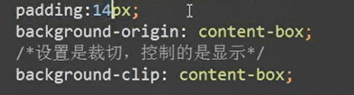

## transform 动画

可以写多个

```css
transform: translate(100px) rotate(20deg);
```

## text-indent 段落缩进

规定文本块中首行文本的缩进。

```css
p{
  text-indent:2em;
  }
```

## background背景

origin译起源 表示只显示内容盒 如果设置了padding 则显示padding除外的内部区域

配合clip使用 clip会把内容盒外盒显示的区域都剪切掉



## 百分比宽度

1、设置<meta name="viewport" content="width=device-width, initial-scale=1">

2、设置页面宽度为百分比

我们需要重新认识CSS里百分比的使用，见代码示例4-9.html

// 测试下列属性设置为百分比

width    参照父元素的宽度

height      参照父元素的高度

padding  参照父元素的宽度

border   不支持百分比设置

margin   参照父元素的宽度

## rem和em

em是当前元素的字体大小 如果当前元素未设置 就是父级元素 父级元素未设置就再往上 直至浏览器默认字体大小

rem是根元素html的字体大小 如果html根元素没设置就是浏览器默认字体大小

 

## 贝塞尔曲线

贝塞尔曲线就是动画速度曲线,对速度的展示

平常我们用的`transition:all .5s ease`这里的ease就是速度曲线,如果我们想展示其他速度,可以用工具,找到自己想要的速度,然后`transition: all 3.0s cubic-bezier(0.75, 0.25, 0.25, 0.75)`

替换对应位置即可

## nth-child选择器

**==-n表示小于等于   n表示大于等于==**


## 浮动巧妙布局

虽然大多时候用`flex`弹性盒子,但是这种情况就应该用`float`布局,会更简单，用后父元素高度为0则直接`overfloat:hidden`即可。浮动少用，但这种情况应该用，视情况而定


```css
// 父元素
overflow: hidden;

//子元素
float:left
width:30%

//当左浮动后会自动变成上面效果图样子，父元素清除浮动则有高度，这样不用再左右分开写html，可以直接循环标签布局，很方便
```

## 一行省略小圆点

```css
{
  white-space:nowrap;
	overflow:hidden;
	text-overflow:ellipsis;
}
```


## 两行省略小圆点

注意： 若只有一行就别用这个多行方法，会有部分露出来

```css
{
  display: -webkit-box;
  overflow: hidden;
  -webkit-box-orient: vertical;
  -webkit-line-clamp: 2;   /*几行省略 就写数字几,这里是两行省略所以写的2*/
}
```

## [filter](https://www.runoob.com/cssref/css3-pr-filter.html)图像模糊

filter(滤镜) 属性,更多效果看本地

```css
//图片使用高斯模糊效果：
img {
    -webkit-filter: blur(5px); /* Chrome, Safari, Opera */
    filter: blur(5px);
}
```

## 子元素设置margin后父元素需overflow:hidden

案例:当父元素,子元素,分别都有不同背景色时,子元素设置margin依旧看不到父元素的背景,

原因:[解决子元素设置margin，效果到父元素上的问题](https://www.cnblogs.com/yangwenbo/p/10718832.html), 原因就是margin重合 塌陷问题

解决办法

　　1为父元素设置内边距padding。来代替给子元素设置margin-top 
　　2为父元素设置边框border。 
　　3为父元素设置 `overflow: hidden` 。

## 字体外边框

```css
-webkit-text-stroke: 1px #F44336;
```


## 元素平面一直旋转

```css
div {
 animation: comphchanbgxz 2s linear infinite;
}
```

## 给滚动条设置样式

> .ranklistBox::-webkit-scrollbar-thumb
>
> .ranklistBox::-webkit-scrollbar-track

```css
.ranklistBox::-webkit-scrollbar-thumb {
   border-radius:5px;
   box-shadow   : inset 0 0 1px #A7834D;
   background: #FBDC3B;
   background: -webkit-linear-gradient(top, #FBDC3B, #FFC710);
   background: -o-linear-gradient(top, #FBDC3B, #FFC710);
   background: -moz-linear-gradient(top, #FBDC3B, #FFC710);
   background: linear-gradient(top, #FBDC3B, #FFC710);
}
.ranklistBox::-webkit-scrollbar-track {
   /*滚动条里面轨道*/
   /*box-shadow   : inset 0 0 5px rgba(0, 0, 0, 0.2);*/
   border-radius:5px;
   background: #CBA164;
}
```

### 滚动条宽高

```css
.ranklistBox::-webkit-scrollbar {
 width: 5px;
 height: 1px;
}
```

## 自定义input光标颜色和文字颜色

```css
综合上面两种方法，可以得到最佳实践如下：

如果浏览器支持caret-color属性，优先使用caret-color（Chrome/Firefox/Opera）；其次使用::first-line方法（Safari）；最后忽略（如IE）。

整合后CSS如下：

input {
    color: #333;
    caret-color: red;
}
@supports (-webkit-mask: none) and (not (cater-color: red)) {
    input { color: red; }
    input::first-line { color: #333; }
}
```

# 自定义右箭头

```css
:after {
    content: " ";
    display: inline-block;
    -webkit-transform: rotate(45deg);
    -ms-transform: rotate(45deg);
    transform: rotate(45deg);
    height: 0.4rem;
    width: 0.4rem;
    border-width: 1px 1px 0 0;
    border-color: #C8C8CD;
    border-style: solid;
    position: relative;
    top: 0px;
    margin-left: .3em;
}
```

# 圆形头像 cover

```html
<div>
    
</div>
```

```css
div{
    width: 100%;
    overflow: hidden;
    border-radius: 50%;
    position: relative;
    display: inline-block;
}
img{
    object-fit: cover;
    border-radius: inherit;
    display: block;
    width: 100%;
    height: 100%;
}
```

# jquery的底部滑出层

```html
		<div class="van-overlay" style="z-index: 2011; display: none;"></div>
		<div class="van-popup van-popup--bottom" style="height: 40vh; z-index: 2012; display: none;">
			<div class="title">
				<div></div>
				<span>我的推荐人</span>
				<div class="close">×</div>
			</div>
		</div>
```

```css
/*	弹出层样式*/
	.van-overlay {
		position: fixed;
		top: 0;
		left: 0;
		z-index: 1;
		width: 100%;
		height: 100%;
		background-color: rgba(0, 0, 0, 0.7);
	}
	.van-popup--bottom {
		bottom: 0;
		left: 0;
		width: 100%;
	}
	.van-popup {
		position: fixed;
		max-height: 100%;
		overflow-y: auto;
		background-color: #fff;
		-webkit-overflow-scrolling: touch;
		padding: 0 3vw;
	}
/*	弹出层内容的样式*/
	.van-popup .title{
			 display: flex;
			 justify-content: space-between;
			 font-size: 4.5vw;
			 color: #000;
		 }
	.van-popup span{
		display: flex;
		align-items: center;
	}
	.van-popup .close{
		font-size: 8vw;
	}
```

```js
	//弹出层淡入淡出和滑动
	$('.van-overlay').fadeIn();
	$(".van-popup").slideDown();
})
$(".close").click(function(){
	$('.van-overlay').fadeOut();;
	$(".van-popup").slideUp();
	return false;
});
$(".van-overlay").click(function(){
	$('.van-overlay').fadeOut();;
	$(".van-popup").slideUp();
	return false;
});
```

# jquery 提示框

```html
<div class="van-toast van-toast--middle van-toast--text" style="z-index: 2002; display: none;">
            <div class="van-toast__text">提示内容</div>
        </div>

```

```css

    .van-toast{
        min-width: 96px;
        min-height: 0;
        padding: 8px 12px;
        position: fixed;
        top: 50%;
        left: 50%;
        -webkit-box-orient: vertical;
        -webkit-box-direction: normal;
        flex-direction: column;
        -webkit-box-align: center;
        align-items: center;
        -webkit-box-pack: center;
        justify-content: center;
        box-sizing: content-box;
        color: #fff;
        font-size: 0.75rem;
        line-height: 20px;
        white-space: pre-wrap;
        text-align: center;
        word-wrap: break-word;
        background-color: rgba(50, 50, 51, 0.88);
        border-radius: 8px;
        transform: translate3d(-50%, -50%, 0);
    }
    .van-toast--text .van-toast__text, .van-toast--html .van-toast__text {
        margin-top: 0;
    }
```

```js
let toast = function(msg) {
        $('.van-toast__text').html(msg);
        $('.van-toast').fadeIn();
        setTimeout(function() {
            $('.van-toast').fadeOut();
    },1300)
    }
```

# css实现勾号 √

```css
.check {
    position: relative;
    display: inline-block;
    width: 25px;
    height: 25px;
    background: red;
    border-radius: 25px;
}
.check::after {
    content: "";
    position: absolute;
    left: 5px;
    top: 8px;
    width: 50%;
    height: 25%;
    border: 2px solid #000;
    border-radius: 1px;
    border-top: none;
    border-right: none;
    background: transparent;
    transform: rotate(-45deg);
}
```

