# 0.环境(补充老师写的)

 1. webpack

 2. es6

    [webpack配置]: http://caibaojian.com/react/webpack.html

# 1. 起步-create-react-app使用

==在使用脚手架时普遍都有配置文件被隐藏的情况 所以需百度搜索 执行特定命令 显示出配置文件 才可修改配置==

**1.什么是create-react-app**

搭建react项目的脚手架 创建一项目文件夹my-app也可自定义其他 第一次安装速度慢 但是安装一次后再搭建就特别快 因为有缓存

构建一个my-app的项目 运行命令

```sh
//npm下载方式
npx create-react-app my-app
//yarn下载方式
yarn create react-app my-app
```

**1.1 yarn create react-app antd-demo 文件名、目录名或卷标语法不正确 : **

[解决方案参考网站](https://faceghost.com/article/248601)

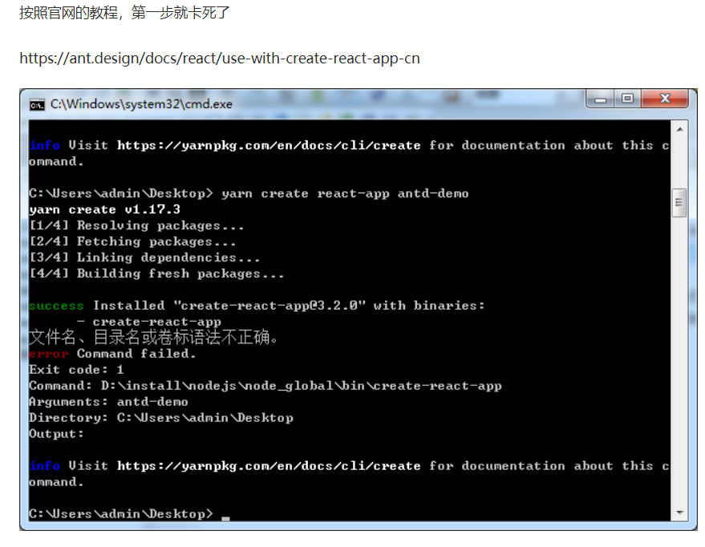

```shell
解决办法

第一步

查看出错执行的命令，我的是：

 D:\install\nodejs\node_global\bin\create-react-app
打开create-react-app.cmd文件

@"%~dp0\C:\Users\admin\AppData\Local\Yarn\Data\global\node_modules\.bin\create-react-app.cmd"   %*
修改为

@"C:\Users\admin\AppData\Local\Yarn\Data\global\node_modules\.bin\create-react-app.cmd"   %*
第二步

将create-react-app.cmd加入系统环境变量，不能在执行yarn create react-app antd-demo，这样会覆盖掉create-react-app.cmd文件

修改好环境变量后，新打开一个cmd执行命令
create-react-app.cmd antd-demo react-app
```

用此命令创建项目 中间的antd-demo是目录名: ==create-react-app.cmd antd-demo react-app==

**2.** `cd my-app`

进入到项目文件夹里

**3.**`npm run start/yarn start`<font color=red>(推荐)</font>

+ 运行项目 类似开启服务 如果启动后自动打开浏览器就表成功  推荐使用`yarn start`
+ 在打开网页时不能直接点击浏览器打开 要`yarn start`运行 打开

>脚手架什么都安装好配置好的,不过今天打包时scss文件不能打包 提示缺少node-sass 根据提示运行`yarn add node-sass`安装即可 配置好了的 一般别动脚手架
>
>


# **2. 虚拟DOM**

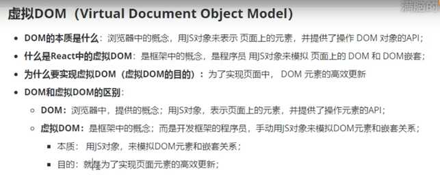

# **3. 创建虚拟DOM元素**

如果没用脚手架需下载React和ReactDOM 如果用了脚手架直接引入即可

```javascript
import React from 'react';
import ReactDOM from 'react-dom';
```

**创建虚拟DOM元素**

+ `React.createElement()`至少三参 共n参

  + 一参:字符串DOM元素名字

  + 二参:是obj里面写属性和对应值 若多个则多个键值对 若没属性直接把obj换为null

  + 三参:是元素的子节点(其他虚拟DOM元素或文本节点)

n参:其他子节点 继续写

```javascript
const myh = React.createElement('h1',{id:'my'},'我是一个大大的h1')
ReactDOM.render(myh1,document.getElementById('root'))
```

```
const myh = React.createElement('h1',null,'我是一个大大的h1')
```


# 4. JSX 简介

1. ==jsx不是字符串 也不是html 是JavaScript的扩展语法 是符合xml规范的js语法, jsx本身就是一表达式,==

   ==在js中,混合写入类似于HTML的语法,叫jsx语法, 这里的x指xml,==

   ==xml语法比HTML语法严格,所有标签必须要闭合 例`<hr>`错误,`<hr/>`正确==

2. 在js中我们可以直接写 `const element = <h1>你好</h1>`

3. 上面的element是React元素对象,内部调用了 `React.createElement() `创建元素对象

4. 在jsx中可以使用插值表达式`{ } `里面可以放js表达式 例变量 对象点属性 函数执行等,`{ }`内部的代码会当js代码执行

   例:

   ```javascript
   const name = ‘张三’
   
   const element = <h1>{name}</h1> //渲染为const element = <h1>张三</h1>
   ```

5. 当编译引擎在编译jsx时,如果遇到`<`会当html代码去编译,当遇到`{ }`会把内部代码当普通js代码编译

6. 在jsx上还可以写属性

   属性命名要求: <font color=red>属性必须小驼峰写法</font>

   在属性里若属性值为普通字符串 值用引号包裹 若为变量或其他 则用`{ }`写`{ }`里面

   注意`” ”`和`{ }`不能同时存在

7. **在jsx中添加class类名:** ==必须写为` className  `来替换`class`,用`htmlFor`替换lable中的`for`属性==,因为在js中它们都属于关键字 为了防止歧义所以用其他代替 class是类构造函数 for是for循环

8. jsx除了写给变量  还可以在if for循环 函数传参 函数返回值使用

9. jsx为了便于阅读 可以多行写 但是多行写时一定要用()括号将内容包裹起来 避免被自动加分号

   例 

   ```javascript
   const element = (
   	<div>
   		<h1>你也好</h1>
   	</div>
   )
   ```

10. 在js中看到`<h1>我是jsx</h1>`这种 不要想成标签 直接想成对象 因为这就是一个虚拟DOM即js对象

    + **数组里面可以直接放对象**

    ```javascript
    const arr = [<h1>你好</h1>, <div>哈哈</div>]
    ReactDOM.render(arr,document.getElementById('root'))
    ```

    渲染如下:

    

    若数组里是多个jsx直接把数组放进去即可 会自动转换 必须给每一项加key值否则会报错

    + **数组里面直接放字符串 直接丢数组 就会把里面的每项渲染进去**

      + ```javascript
        const arr = ['你好','我很好']
        ReactDOM.render(arr,document.getElementById('root'))
        ```

        效果如下:

      

    + **若想把字符串数组里的每个元素包裹一个h5标签再渲染**

      + 方法一:

        forEach循环每一项 包裹h5标签 组成新数组再渲染新数组即可

      + 方法二:

        map映射 循环数组每一项并把返回的结果组成新数组 不会改变原数组

        ```javascript
        const arr = ['你好','我很好']
        ReactDOM.render(arr.map(val=>val+123),document.getElementById('root'))
        ```

        

    ==注意:==

    ==1.直接丢数组和循环数组的都需要加key值作唯一标识符,否则和vue不加key时一样出现相同问题,==

    ==2.key值必须加给被Each map for循环直接控制的最外层元素,若元素是多层的 加给内层的元素依旧会报错==

11. <font color=red>jsx里只能有一个根元素</font>  可以包含很多子元素

    正常情况下会用div根元素包裹,但是若不想用div根元素包裹,又想用多个标签 则使用Fragment

12. 假如一个标签里面没有内容，你可以使用 /> 来闭合标签，就像 XML 语法一样：

     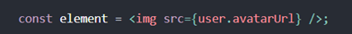

    若div没内容 也可直接<div/>

13. 标签必须成对出现 单标签必须自闭合/>

14. jsx内部调用`React.createElement()`创建元素对象,jsx是JavaScript扩展语法 dom标签和组件<component />都是此语法 所以React元素可以是dom标签也可以是组件

15. **在jsx内写注释**,推荐使用`/*这是注释*/`

    ```jsx
    {/* 123 推荐这个注释用法 */}
    {//123 这会把后面的花括号也注释 花括号是成对出现注释了会报错 }
    {//123 只能换行才不注释 但会多占一行 所以推荐第一种
    }
    ```

    在jsx内js代码只能写到{}内部 所以哪怕是注释也只能写到{}内部,综上在jsx中推荐用`/**/`注释

# 4.1 Fragment包裹元素不渲染自身

jsx里只能有一个根元素 可以包含很多子元素

正常情况下会用div根元素包裹,但是若不想用div根元素包裹,又想用多个标签 则使用Fragment 

```
<Fragment>
  <h1>好</h1>
  <i>hi</i>
</Fragment>
```


   # 5. 元素渲染

1. 和html dom元素不同, React元素是开销极小的普通对象,React元素是通过React DOM渲染为DOM的,React DOM会随时更新DOM来与React元素一致.即当React元素更新时 DOM也会实时更新

2. 通过React DOM将元素渲染为DOM

3. ```javascript
   const element = <div>你好</div>;
     ReactDOM.render(element,document.getElementById(‘root’))
   ```

4. 由id root获取到index.html内的根DOM节点,将element元素渲染进去

5. 通常React应用只有一个root根DOM节点,此节点内的所有内容由React DOM控制,如果有多个根节点 一般是React集成到已有应用

6. <font color=red>重点:React元素是不可变的</font> 一旦创建 其属性和子元素所有内容都不可改变,若想更新就是创建一全新React元素 重新render渲染

7. <font color=red>重点</font>:在4里面提到的创建全新元素且重新渲染,但是<font color=red>ReactDOM只会更新需要更新的部分</font>,即它会将React元素和子元素与它们之前的状态作对比,只更新需要更新的


# **6. 组件&props**

+ **组件:**接收唯一带有数据的props属性对象并返回React元素的叫组件

+ **组件分类:**有函数组件和类组件

+ **函数组件:**

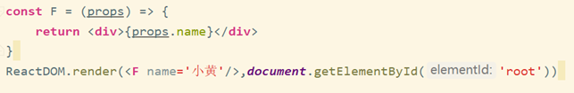

​	    此运行流程是:

1. 调用ReactDOM.render()并传入`<F/>`作为参数,这里也可以写`<F> </F>`不过因为前面说到没内容可以直接闭合 所以通常用的前者
2. 调用组件 并传入将{name:’小黄’}作为props属性对象 props是只读的
3. 返回React元素
4. 渲染DOM

+ **类组件**

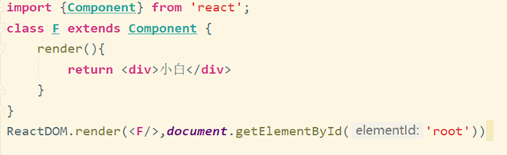

1. <font color=red>有组件的地方必须引入React 不管使不使用都必须引入 </font> 因为组件依赖React所以必须引入

2. React元素可以是dom标签 也可以是组件 例

   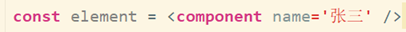

3. jsx内部调用React.createElement()创建元素对象,jsx是JavaScript扩展语法 <font color=red>dom标签和组件<component />都是jsx语法 所以React元素可以是dom标签也可以是组件</font>

4. 使用组件时 必须把组件用jsx表现出来即\<component /> 而不是component

5. <font color=red>组件的命名开头必须是大写</font>,React会把小写开头的当做dom标签,大写开头的当做组件

6. jsx接收的属性 会转为属性对象即`props`,在`function`是通过形参接收`props`,在class中不需要接收.直接通过`this.props`获取,<font color=red>在class内部第一层的this都是指向实例</font>. 在`constructor`中`props`不能通过`this.props`获取,只能通过形参`props`直接使用`props` 不用`this`

7. <font color=red>props传值或方法: 可以传递普通属性或者方法给props,都是一样的使用.</font>

8. 如果不想渲染任何组件可直接`return null`,`render()`函数作用是渲染当前组件返回的虚拟dom元素

9. 组件可以在输出中引用其他组件

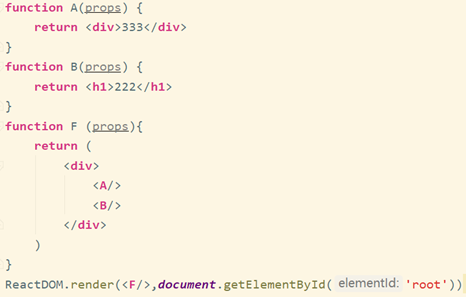

8. 组件的作用是可复用性,学会提取组件是必须的,最初看上去,提取组件可能是一种繁重的工作,但是在大型项目中构建可复用库完全值得,如果在UI中有一部分<font color=red>被多次使用或组件本身就比较复杂 那么它就是一个复用组件候选项</font>

**两种组件创建的对比方式**

1. function创建的组件,叫'' 无状态组件 ''(无状态组件今后用得不多)

2. class创建的组件,叫'' 有状态组件 ''

3. 本质区别就是: 有无state属性和有无生命周期函数

4. class创建的组件有自己的私有数据state和生命周期函数,function都没有

5. 什么情况使用不同组件?

   ==推荐父组件都使用有状态组件== 因为功能更强大 如果使用了无状态组件指不定哪天需要用有状态的到时候更换比较麻烦,==子组件都用无状态组件==因为子组件数据是通过父组件传递拿的,所以自己不需要私有数据

**`props`和`state/data`区别**

React的`state`相当于就是vue中的`data`,`props`相当于vue中的`props`

1. `props`是外界传来的数据
2. `state`是组件私有数据(通过ajax获取的数据一般都是私有数据)
3. `props`是只读的 
4. `state`是可读可写的

**总结**:组件多次使用或者<font color=red>组件本身比较复杂就提取组件</font>

 如图此组件嵌套多 代码复杂 不利于维护 符合提取组件条件 所以将其提取出后为图二图三结果 注意<font color=red>当多层嵌套提取时 先提取最里面的再一层一层从内向外提取</font>

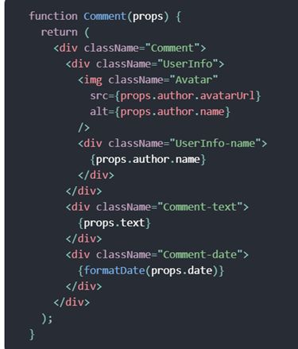

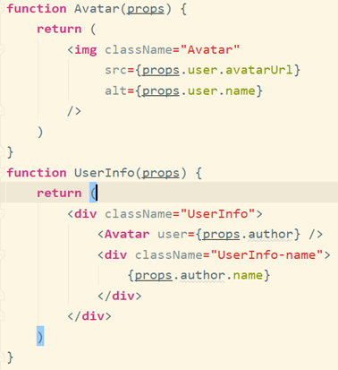

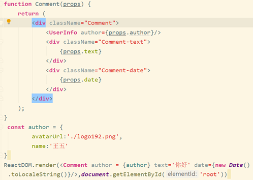

+ **纯函数:**

  + 函数不改变入参(传入的参数 例不执行赋值 ++ --这类),且当多次调用下入参相同时返回的结果相同,这样的函数叫纯函数

  + <font color=red>props只读 不可改变</font> , 在`constructor`中`props`不能通过`this.props`获取,只能通过形参`props`直接使用`props` 不用`this`
+ <font color=red>所有 React 组件都必须像纯函数一样保护它们的 props 不被更改。</font>

# 7. context类似数据共享仓库 局部全局数据

> 场景 : 当组件嵌套过多,最底层组件想使用顶层组件的数据时,一层层传递比较麻烦,所以这里用context.
>
> 作用 : 可以不通过层层传递的就能让任意子孙组件直接拿到顶层组件的数据

+ **步骤使用**

  + **方法一:**

    1. `React.createContext('我是默认值')`执行此方法将创建并返回一个`context`对象,参数一是默认值,当`MyContext.Provider`未提供value值时获取的数据显示undefined,当未写`MyContext.Provider`标签就直接使用`MyContext.Consumer`时,会使用默认值

    ```jsx
    //因要多次使用到此context 所以单独建立为MyContext.jsx文件导出
    import React from 'react'
    const MyContext = React.createContext('我是默认值')
    export default MyContext
    ```

    2. `Provider`译提供者,即提供传递的数据,用`MyContext.Provider`标签包裹住子组件,则被包裹的子孙组件都能拿到传递的数据,唯一属性value的值为传递的数据,可以是字符串 对象等.

       一个 Provider 可和多个消费组件有对应关系。多个 Provider 也可嵌套使用，里层的会覆盖外层的数据. 

       当 Provider 的 `value` 值发生变化时，它内部的所有消费组件都会重新渲染。Provider 及其内部 consumer 组件都不受制于 `shouldComponentUpdate` 函数，因此当 consumer 组件在其祖先组件退出更新的情况下也能更新。通过新旧值检测来确定变化.

    ```jsx
    //顶层组件
    import MyContext from './MyContext'
    export default class Index extends Component {
      render() {
        return (
            <MyContext.Provider value='哈哈哈'>
              <Sub></Sub>
            </MyContext.Provider>
        )
      }
    }
    ```

    ​	3.先引入`MyContext`再写`MyContext.Consumer`标签 , `Consumer` 译消费者, 标签内是`{function}` 此`function`的形参value将接收到`context`传递的数据,方法内`return`要渲染的元素,这样元素在方法内就可以直接使用value数据.

    ```jsx
    //子孙组件
    import React, { Component } from 'react'
    import MyContext from './MyContext'
    export default class sub extends Component {
        render() {
            return (
                <MyContext.Consumer>
                    {value =>(
                    <h1>
                        {value}
                    </h1>
                    )}
                </MyContext.Consumer>
            )
        }
    ```

    

    ==**缺点 :**== 因是标签形式,所以使用数据只能在标签内使用,无法直接在其他function中使用,有局限性.

    ==**优点 :**==  一个组件可以消费多个 context, 组件会从组件树中找到离自身最近的那个匹配的 `Provider` 中，然后使用它的值。

    ```jsx
    //消费多个context 例子:
    return (
        <ThemeContext.Consumer>
          {theme => (
            <UserContext.Consumer>
              {user => (
                <ProfilePage user={user} theme={theme} />
              )}
            </UserContext.Consumer>
          )}
        </ThemeContext.Consumer>
      );
    ```


+ **方法二:**

  1-2步和方法一中使用一样,第3步不同

  3.将`MyContext`赋值给class的静态属性`contextType`,可通过`this.context`在任何生命周期中访问到它，包括 render 函数中。

  ==**优点:**== 使用范围广

  ==**缺点:**== 不能用此方法同时消费多个`context`,因`contextType`只能指向一个`context`对象,如果想将多个`context`对象装在一个obj { }里再赋值给`contextType` 行不通

  ```jsx
  import React, { Component } from 'react'
  import MyContext from './MyContext'
  export default class sub extends Component {
      static contextType = MyContext
      render() {
          return (
              <h1>
                  {this.context}
              </h1>
          )
      }
  }
  ```

+ **注意事项**

  因为 context 会使用参考标识（reference identity）来决定何时进行渲染，这里可能会有一些陷阱，当 provider 的父组件进行重渲染时，可能会在 consumers 组件中触发意外的渲染,因当 Provider 的 `value` 值发生变化时，它内部的所有消费组件都会重新渲染.举个例子，当每一次 Provider 重渲染时，以下的代码会重渲染所有下面的 consumers 组件，因为 `value` 属性总是被赋值为新的对象：

  ```jsx
  //父组件重新渲染时 执行render函数 若value是一个{}引用值 则每次渲染时值都不同 因{}不等于{}
  class App extends React.Component {
    render() {
      return (
        <Provider value={{something: 'something'}}>
          <Toolbar />
        </Provider>
      );
    }
  }
  ```

  为了防止这种情况，将 value 状态提升到父节点的 state 里：

  ```jsx
  //组件的constructor只在创建时调用,若不通过this.setState改变值,那此值就不会变,render时不会影响此值.那么Provider内的value指向 不变 就不会重新渲染消费组件
  class App extends React.Component {
    constructor(props) {
      super(props);
      this.state = {
        value: {something: 'something'},
      };
    }
  
    render() {
      return (
        <Provider value={this.state.value}>
          <Toolbar />
        </Provider>
      );
    }
  }
  ```
  
  ```jsx
  //不会重新渲染 因为:
  const a = {name:123}
  console.log(this.a == this.a)//true
  console.log({name:123} == {name:123})//false
  ```
  
  

# 7. 单独提取组件

+ **组件一般为jsx文件**

  + 除了入口组件外 其他的一个组件一个文件 都放到Components文件夹内

  + 组件文件后缀可以是`.js`或者`.jsx`但是通常组件都放到`.jsx`内 因为:

    + 这些代码准确来说是jsx语法 所以放入jsx文件比较好

    + 后缀为`.js`也可以,但是在此文件内输入div再tab键不会快捷出`<div></div>`如果换成`.jsx`后缀就有效

+ **使用组件必须引入React**

  + 组件依赖React,不管表面上有没有用都必须引入,否则报错

+ **巧妙导出组件**

  + 一般我们都先写组件,再单独写组件名导出,实际可以写的时候就直接导出

    ```jsx
    export default class index extends Component {
        render() {
            return (
                <div>
                   <h1>要开心</h1>
                </div>
            )
        }
    }
    ```

+ **如何省略.jsx后缀名**

  导入文件时一般后缀名不可省略,但是大多时候我们都省略不写,因为脚手架对webpack进行了如下配置:

  用于引入文件时不写后缀名,和modules同级,有顺序要求从左

  ```	js
  resolve:{
  	extensions：[‘.js’,’.jsx’,’.json’]
  }
  ```

  

# 8. 在React中...扩展运算符的巧妙使用

+ obj的每一项分别通过属性传过去 而不是直接传obj

  ```jsx
  const obj = {
      name:'张三',
      age:18,
      sex:'男'
  }
  function F(props){
      console.log(props)//{name: "张三", age: 18, sex: "男"}
      return null
  }
  ReactDOM.render(<F {...obj} />,document.getElementById('root'))
  ```

+ 把一个obj内容放到另一个obj里

  ```jsx
  const obj = {
      name:'张三',
      age:18,
      sex:'男'
      
  }
  const obj1 = {
      student:'9999999',
      ...obj
  }
  console.log(obj1)//{student: "9999999", name: "张三", age: 18, sex: "男"}
  ```


# 9. style和class样式

### style

+ 在React中写行内样式,不能像平时这样写,会报错,例:

```jsx
<h5 style='color:red'>我是大标题</h5>//报错
```

+ 正确写法例:

```jsx
 <h5 style={{color:'red',fontWeight:'bold','font-size':'14px'}}>我是大标题</h5>//正确
```

+ 注意事项
  1. 最外层`{ }`代表里面要写js代码 里层代表obj对象,也可单独定义对象再把名字丢进去
  2. 值若是数字可不加引号,若为字符串必须引号,属性名若有`-`必须加引号,因js代码会解析为减号,若不写引号就小驼峰写法.

### class

#### 引入css文件

+ 一般不推荐写行内样式,所以通常是直接写样式文件,引入css文件.
+ 回顾vue组件中写样式`<style></style>`是在标签中写,这样写是全局生效,其他组件元素样式也会受影响,所以会写成`<style scoped></style>`这里的`scoped`会给HTML的DOM节点增加一个不重复的data属性,从而达到只对当前样式生效的效果.
+ 在React中若直接==引入css文件也是全局生效的.因====css没作用域==,打包后对整个项目都有效,js jsx这些都是有作用域的打包后不影响
+ 若不引入样式,打包不会打包css,所以只有引入.

+ **使样式文件模块化仅在导入的组件内生效 , 解决方案 ==( 重要 )==**

  1. ==这步不用看,仅了解,脚手架已配置好,直接第2点命名开始==

     ```js
   //第一步:弹出webpack配置(因脚手架的配置文件都是隐藏的)
     yarn|npm eject
   
     //第二步配置css-loader
   在webpack中配置,`css-loader`后`?`接固定参数'modules'表为普通css样式表启动模块化(模块有作用域) 脚手架已配置好不需手动配置,直接第二步开始(脚手架已经将css样式表模块化 但是对安装到node_moduls的第三方包不模块化 所以正常使用可不担心 脚手架的配置不会对第三方包模块化 若自己配会对第三方模块化)
     ```

  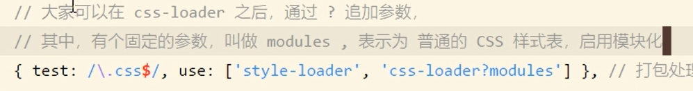

  2. 想要模块化的css文件命名有要求,必须 `名字.module.css` 例`index.module.css`
  
  3. 模块化只对css样式表里的类选择器和id选择器生效,标签选择器无效(标签选择器依然针对全局)
  
     不能直接引入,需用变量接收模块化后的样式对象,打印变量知变量是obj,类名和id名用的一串随机码替代,使用时需要obj点原来的名
  
     注意:虽然都是obj.名 但是id依旧要写id里 class写class里 否则无效
  
     ```css
     //css样式表
     #ziti{
       font-size: 40px;
   }
     .biaoti{
       color:red
     }
     h3{
       color: blue;
     }
     ```
  
     ```jsx	
     //组件内引入样式
   import obj from'./index.module.css';
     //打印
   console.log(obj)
     //打印结果
   {ziti: "MyComponent_ziti__2QzQ-", biaoti: "MyComponent_biaoti__1pCPg"}
     //使用
     <h3 id={obj.ziti} className={obj.biaoti}>我是大标题</h3>//class和id名字要对应 
     ```
  
  4. 给类名写格式 脚手架已配置可不管,
  
   模块化的 css文件 有类名的会模块化 若个别类名或id不想模块化见图第4点
  
     ```css
     //css样式表
   :global(#ziti){
       font-size: 40px;
   }
     ```
  
     ```jsx
      <h3 id='ziti'>我是大标题</h3>//全局的 直接使用 不需obj.名
     ```
  
     
  
  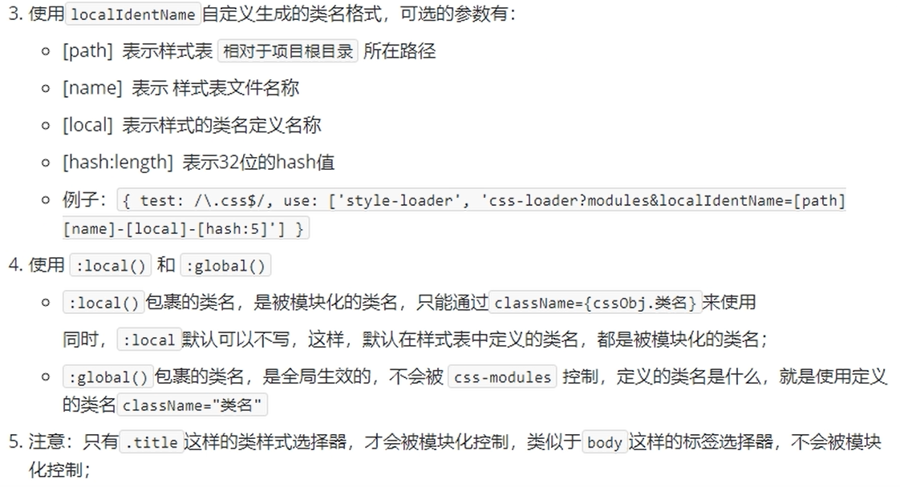

==注意 : react中的class属性必须写为className,只写为class无效==

#### 写多个class类名

+ 一般类名写法:`<h1 class='lei1 lei2'></h1>` 用空格连接的

+ 在React中

  + 方法一  空格字符串拼接

    `<h1 className={变量+' lei2'}></h1>`

  + 方法二  数组 join变成空格链接的字符串

    `<h1 className={[变量,'leiming1'].join(' ')}></h1>`

引入包时,若包已安装到node_modules下 可不写前面的路径直接写包名 会自动到node_modules下找

# 10. React绑定事件的注意点

1. 事件都是React提供的,名字必须小驼峰写法 例`onClick` 、`onMouseOver`

2. 为事件提供的处理函数必须是如下格式:

   ```jsx
   onClick={function}
   ```

3. 用得最多的绑定形式是:

   ```jsx
   <button onClick={ ( ) => this.show('传参') }>按钮</button>
   //事件的处理函数,需定义为一个箭头函数再赋值给 函数名称
   show = (arg1) => {
   	console.log('show方法' + arg1)
   }
   ```

   ==以后事件处理函数 建议都用箭头函数 避免出错==

# 11. State & 生命周期

## State

1. State组件的状态,props是不可改变的,State是可改变的.
2. 不能直接修改State,State只能在构造函数constructor中赋值 其他地方赋值会报错.其他地方只能用setState()来改变

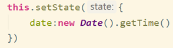

3. State的状态改变是合并 添加或覆盖相同key的值 其他key不受影响

4. 当组件状态更新时,render函数会重新执行并渲染,若是挂载到同一DOM节点上 只会有唯一的class组件的实例被创建使用,之前的组件会卸载.


5. this.setState是异步的,State的更新是异步的,如果在同一事件函数中多次调用setState()不会执行的时候就马上更新而是当事件函数执行结束后一次性渲染 所以setState()注意写的顺序 如果是相同key 后面的会覆盖前面的 且不要在setState()内部用this.State 因为此结果不会实时更新 放回调函数是因为执行结束(执行到函数最后一步)想一次性渲染也没办法 因为它是回调 你不知道什么时候执行完 就不会等待 进入回调队列中 轮到它就立即执行并渲染

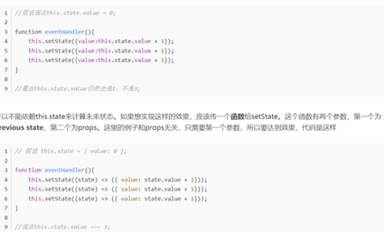

1. 如果想立即拿到State的值,可执行`settate({},callback)`第二个参数是回调,执行此函数时结果是最新的.

2. State是局部的 组件外部无法访问 父组件子组件都无法访问 除非是当前组件引用其他组件并将state传递过去 所以State是自上而下的 且 是单向的 是直接取值然后把值传过去

   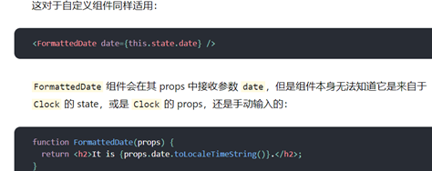

## 生命周期

可参考简书:https://www.jianshu.com/p/b331d0e4b398

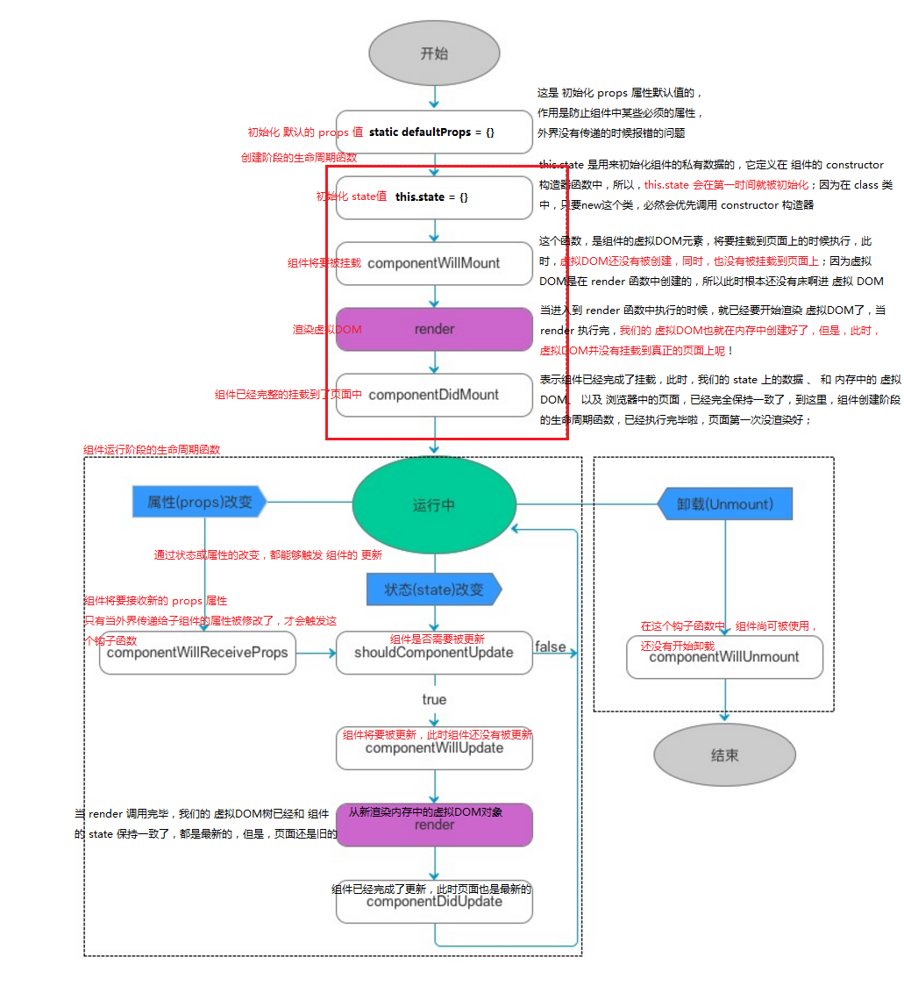

+ #### 生命周期: 

  组件的实例从创建、到运行、直到销毁,这整个阶段叫生命周期.

+ #### 生命周期函数: 

  组件的实例从创建 运行 到销毁,在这个过程中特定阶段会触发特定事件,这些事件就叫做组件的生命周期函数.

+ #### 组件生命周期分为三部分：

  - **组件创建阶段**：组件创建阶段的生命周期函数，有一个显著的特点：创建阶段的生命周期函数，在组件的一辈子中，只执行一次；

  > ==constructor==:当new时,第一时间初始化私有数据state和实例属性
  >
  > ==componentWillMount:== 组件将要被挂载，此时还没有开始渲染创建虚拟DOM,props和state及function都能获取,等同于vue中的created
  > ==render：==第一次开始渲染真正的虚拟DOM，当render执行完，内存中就有了完整的虚拟DOM了(创建阶段的render函数和更新时候的render函数是同一个 所以更新时也会运行此函数)
  >
  > ```jsx
  > //因为和更新运行的同一函数 若想更新时打印获取元素的内容 这样会报错 因为第一次渲染的时候执行render函数 此时还没return 虚拟dom元素还没创建完 页面也没有dom 所以会报错
  > console.log(this.refs.h3.innetText)
  > //正确用法
  > console.log(this.refs.h3 && this.refs.h3.innerText)
  > //注意: 正确用法中若第一次执行打印的是undefined 打印undefined没错但是打印undefined.innerText肯定会报错 所以这里用&&来解决
  > ```
  >
  > + <font color=red>&&运算符是个很小的知识点 但是以后会经常用到 要牢记</font>
  >
  > ==componentDidMount:== 组件完成了挂载，此时，组件已经显示到了页面上，当这个方法执行完，组件就进入都了 运行中 的状态

  - **组件运行阶段**：也有一个显著的特点，根据组件的state和props的改变，有选择性的触发0次或多次；

  > ==componentWillReceiveProps:== 父组件给子组件传递的值若更改或路由更改(开启路由后可通过this.props.match获取路由参数 若路由参数改了 相当于props也改了) 会触发函数 因这些都和props有关,只要props改了,就会触发此函数,,通常所说父组件传递的props属性改变,这里的props属性不是指父组件传的它的props而是指它传的任意东西,我们接收到的一切东西都是props.
  >
  > 在此函数直接this.props获取的是旧的props数据 若想获取新的需要通过参数列表nextProps获取
  >
  > 
  >
  > ==shouldComponentUpdate:== 当组件接收到新属性，或者组件的状态发生改变时触发,组件是否需要被更新，此时，组件尚未被更新，但是，state 和 props 肯定是最新的,。组件首次渲染时并不会触发,这个生命周期的返回值是布尔值，会显示后续是否进行重新的渲染.
  >
  > ```jsx
  > shouldComponentUpdate(newProps, newState) {
  > return this.state.count % 2 === 0? true:false
  > }
  > //该钩子函数可以接收到两个参数，新的属性和状态，返回`true/false`来控制组件是否需要更新。
  > ```
  >
  > ==//在这里面如果直接this.props或者this.state获取的是旧的数据 想要新的就必须通过参数nextProps和nextState获取==
  >
  > 我们使用这个生命周期一般用于优化，有的时候，我们在界面上只需要更新一个很小的组件，而一个父组件的更新会造成整个子组件都进行渲染，形成一个崭新的虚拟`DOM`，但是这样的话，会造成资源的浪费，我们可以根据实际的开发情况在`shouldComponentUpdate()`生命周期加入条件，来进行性能的优化。
  >
  > ==componentWillUpdate:== 组件将要被更新，此时，尚未开始更新,内存中的虚拟DOM树还是旧的
  > ==render:== 此时，又要重新根据最新的 state 和 props 重新渲染一棵内存中的 虚拟DOM树，当 render 调用完毕，<font color=red>内存中</font>的旧DOM树，已经被新DOM树替换了！此时页面还是旧的.在这个生命周期使用`setState`，会导致重新跑回到`updata`的生命周期，然后在跑到`componentWillUpdate`，如果不慎用的话，会导致反复的执行。不能在这里面进行手动更新操作 会陷入无限循环卡死报错,

  注意:(创建阶段的render函数和更新时候的render函数是同一个 所以更新时也会运行此函数)

  > ==componentDidUpdate:== 此时，页面又被重新渲染了，state 和 虚拟DOM 和 页面已经完全保持同步

  - **组件销毁阶段**：也有一个显著的特点，一辈子只执行一次；

  > ==componentWillUnmount:== 组件将要被卸载， 还没卸载 ,此时数据和方法正常可用 ；在这里可进行的操作有的是对轮询的请求的清理，有的是对定时器的清理，根据实际情况来定。

+ #### 将要废弃的生命周期

  + componentWillMount() -> 17版废弃
    - `componentWillMount`被废弃的理由：最初定的是最早在这里进行异步请求,但是如果在`componentWillMount`中发送异步请求，在`SSR`（服务端渲染）的情况下，服务端与客户端共用一套组件原代码，此时会发出两次请求（服务端请求一次、客户端请求一次），服务端的请求是多余的。如果将异步请求放在`componentDidMount`中，服务器不会执行`componentDidMount`生命周期函数，可以减少不必要的请求。
    - componentDidMount`:另外==提醒==在這邊綁定`DOM eventListener`，記得在`willUnMount`取消綁定`EventListener`，避免造成過多的綁定事件。 
  + componentWillReceiveProps(nextProps) -> 17版废弃
  + componentWillUpdate（nextProps, nextState)  -> 17版废弃

+ ### defaultProps

  > 在组件创建之前，会先初始化默认的props属性，这是全局调用一次，严格地来说，这不是组件的生命周期的一部分。在组件被创建并加载候，首先调用 constructor 构造器中的 this.state = {}，来初始化组件的状态。

  通过静态属性defaultProps设置默认值

  ```jsx
  //当未传值时会使用默认值
  static defaultProps = {
        number:'我是默认值'
      }
  ```

+ ### propTypes

  > 场景: 在团队协作中组件通常是给别人使用的,如果有必须使用的属性他们并不知道需要传什么类型的数据,所以此时就需要写组件的人对props进行类型校验.

>设置类型校验后作用:对传入的props进行校验, 使用组件的人若传的props不是规定类型的值,东西可以用但是控制台会报警告提醒使用者.以便使用者及时修改.

  + 安装React提供的第三方包, 叫prop-types;在v.15.\*之前并没有单独将包抽离出来,那时候和react一起的,后来v.15.*之后(2018年),官方把类型校验的模块单独抽离为一个包,叫prop-types.如果以后维护项目可能会遇到项目用到了类型校验但是因改革之前没单独包所以没安装的,此时就需要我们安装了.

  + 脚手架已经安装了此包所以这里不需要再单独安装,直接引入并使用

    ```jsx
    //1.引入包
    import ReactTypes from 'prop-types';
    export default class Index extends Component {
    //2.在静态属性propTypes上设置 此属性固定的一个大小写都不能错
    	static propTypes = {
                   // 3.传入的属性名是content(自定义),值是:此包里面有很多数据类型 所以值是引入的接收变量点对应类型
            content:ReactTypes.number
        }
    }
    ```

    错误传值后报错如下: (提示传入的string 期望得到number类型)

    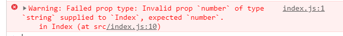

  > 注意:在vscod中如果包有.ts后缀文件可以按住ctrl再点击变量,可以跳转到对应文件里,在里面可以看到支持哪些类型的校验(如图第三列都是)

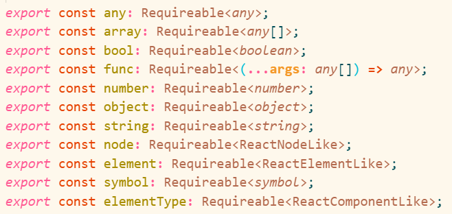

  React生命周期的回调函数总结成表格如下：


  **组件生命周期的执行顺序：**(可以在这里看参数列表)

 - Mounting：创建时

   - constructor()
   - componentWillMount()

   + render()

   - componentDidMount()

  + Updating：更新时

    + componentWillReceiveProps(nextProps)             

    + shouldComponentUpdate(nextProps, nextState)

    + componentWillUpdate(nextProps, nextState)

    + render()

    - componentDidUpdate(==prevProps, prevState==)     

    > 注意: 能获取参数列表的只有更新时的生命周期函数有(除render()),组件将要更改props函数只有一个形参,是否更新和即将更新有两个形参,形参都是新数据,旧数据通过this获取. 已经更新的函数通过this获取的都是新数据 通过形参获取的都是旧数据 这样可以保证每个钩子函数都能获取新旧数据防止特殊需求
    >
    > 一新 两两新 一两旧

  + Unmounting：渲染时

    + componentWillUnmount()

# 12. refs 获取当前元素

refs有三种方法 字符串 -> 回调 -> createRef  左旧右新 推荐使用新的

#### 12.0 e.target

+ 通过事件e获取

  触发事件时通过`e.target`获取,若元素为input,想获取value则:`e.targer.value`

+ 通过ref获取==(字符串方法已淘汰)==

  + 在vue中也有ref,回顾vue中是:

    ```jsx
    //在标签上属性ref 值为自定义名
    <h1 ref='h1'>标签</h1>
    //使用时
    this.$refs.h1
    //注意:定义时ref因是单个所以没s,获取时refs是对象 有多个所以有s
    ```

  + 在React中其他和vue相同,唯一不同的是获取直接`this.refs.自定义名` 没有$

    ```jsx
    <h1 ref='h1'>标签</h1>
    this.refs.h1
    ```

综上:两种方法自行选择

+ 案例 :  ==通过refs获取的value值是string类型的 可以parseInt()  或者*1==

  在input上直接设置value值 会导致input框只读 且会报警告

  + 取消警告的方法

    ```jsx
     <input type="text" value={this.state.age} readOnly/>//设置属性为`readOnly`
    ```

  + 不设只读,可写,取消警告 

    + 方法一 

    ```jsx
    <input type="text" defaultValue={this.state.age}/>//将`value`设为`defaultValue`
    ```

    + 方法二

    ```jsx
    <input type="text" value={this.state.age} onChange={'函数'} />
    //绑定onChange事件,让事件一发生就设置文本内容,通常value都是从state中获取数据 所以设置也是setState({})
    ```

#### 12.1 字符串 最早方式

dom节点上使用，通过this.refs[refName]来引用真实的dom节点

```jsx
<input ref="inputRef" /> //this.refs['inputRef']来访问
```

#### 12.2 回调函数  其次方式

 React 支持给任意组件添加特殊属性。ref 属性接受一个回调函数，它在组件被加载或卸载时会立即执行。

- 当给 HTML 元素添加 ref 属性时，ref 回调接收了底层的 DOM 元素作为参数。
- 当给组件添加 ref 属性时，ref 回调接收当前组件实例作为参数。
- 当组件卸载的时候，会传入null
- ref 回调会在componentDidMount 或 componentDidUpdate 这些生命周期回调之前执行。

```jsx
<input ref={(input) => {this.textInput = input;}} type="text" />   //HTML 元素添加 ref 属性时
```

```jsx
<CustomInput ref={(input) => {this.textInput = input;}} />   //组件添加 ref 属性
```

#### 12.3 React.createRef() 最新方式

`React.createRef` 创建一个能够通过 ref 属性附加到 React 元素的 `ref`

 在React 16.3版本后，使用此方法来创建ref。将其赋值给一个变量，通过ref挂载在dom节点或组件上，该ref的current属性
 将能拿到dom节点或组件的实例

```jsx
class Child extends React.Component{
    constructor(props){
        super(props);
        this.myRef=React.createRef();// 1.这个变量任意命名
    }
    componentDidMount(){
        console.log(this.myRef.current);// 3. current获取节点或组件 current译当前的
    }
    render(){// 2. 这里的名字就是上面React.createRef()后的变量
        return <input ref={this.myRef}/>
    }
}
```

```jsx
class MyComponent extends React.Component {
  constructor(props) {
    super(props);

    this.inputRef = React.createRef();
  }

  render() {
    return <input type="text" ref={this.inputRef} />;
  }

  componentDidMount() {
    this.inputRef.current.focus();
  }
}
```

**(2)根据ref获取dom**

React提供的这个ref属性，表示为对组件真正实例的引用，其实就是ReactDOM.render()返回的组件实例，但可以通过ReactDOM.findDOMNode(ref)来获取组件挂载后真正的dom节点

```jsx
var Parent = React.createClass({
  render: function(){
    return (
      <div className = 'parent'>
        <Child ref = 'child'/>
      </div>
    )
  },
  componentDidMount(){
    console.log(this.refs.child); // 访问挂载在组件上ref
    console.log(ReactDOM.findDOMNode(this.refs.child)); // 访问真正的dom节点
  }
})

var Child = React.createClass({
  render: function() {
    return (
        <div ref="test">
          <a ref="update">更新</a>
        </div>
    );
  }
});
```

打印结果

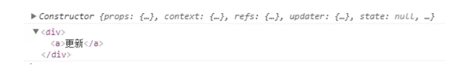

**(3)react-redux使用时利用ref调用子组件方法不可用报错**

在使用react的时候，我们难免会在父组件中调用子组件的方法，我们常用ref调用子组件的方法

如下在父组件中调用子组件的写法

**父组件**

```jsx
handleShowModalAdd = () => {
    this.add.handleToggle()//handleToggle为子组件中的方法
}
```

```csharp
<SystemAdd ref={(el) => this.add = el}/>
```

但是当我们在子组件中使用redux的时候，由于使用connect对子组件进行了包装，会导致获取不到子组件中的方法

下面的是使用redux后的ref使用方法

**父组件**

```jsx
handleShowModalAdd = () => {
    this.add.handleToggle()//handleToggle为子组件中的方法
}
```

```csharp
<SystemAdd onRef={(ref) => this.add = ref }/>
```

**子组件**

```kotlin
componentDidMount(){
    this.props.onRef(this)//将组件实例this传递给onRef方法
}
```


# 13. 路由react-router-dom

### 13.1 基本使用

[router官网链接](https://reacttraining.com/react-router/web/guides/quick-start)

在安装包时如果出错先检查记录依赖文件有没有记录下来,然后删除node_modules 再重新运行命令`npm i `或者`yarn`

1. 安装包(脚手架没有安 要手动安装)

   ` cnpm i react-router-dom -S`或者`yarn add react-router-dom`

2. 基本使用

   + 引入包  需要导出这三个东西 (还可导出Switch 见13.2路由匹配参数)

     ```jsx
      /*BrowserRouter的url和普通的url一至 推荐使用
       HashRouter 以锚点的方式 */
import { BrowserRouter as Router, Route, Link ，Switch} from 'react-router-dom'
     ```

     - `BrowserRouter`是路由的根容器 一个网站只需要一个路由根容器(这里是一个网站 而不是网页) 根容器内只能有唯一一个根元素 用根容器包裹元素就相当于启动路由了

     - ` Route`路由匹配规则,里面有两个属性`path`是匹配路径 `component`展示对应组件

       `Route`有两个身份 是匹配规则同时也是坑,在vue中坑是用`route-view`代替 但是这里是一个Route一个坑

       路由匹配是模糊匹配,只要有一部分匹配就可以展示对应路由组件

       哪怕为 路由启用了` exact `精确匹配模式，也会从上到下，把所有的 路由规则匹配一遍
     
     - `Link`相当于vue中的`router-link`
     
     - Switch 见13.2路由匹配参数
     
     注意: 这里匹配路由不会覆盖页面内容,和vue中不同,至于覆盖的方式待后续了解.
     
     ```js
     import React, { Component } from 'react'
     import { BrowserRouter as Router, Route, Link，Switch } from 'react-router-dom'
     import Home from '../Home'
     import About from '../About'
     import List from '../List'
     export default class Index extends Component {
         render() {
             return (
                 <Router>
                     <div>
                         <h1>我是app首页</h1>
                         <Link to='/Home'>Home</Link>&nbsp;&nbsp;&nbsp;&nbsp;
                         <Link to='/About'>About</Link>&nbsp;&nbsp;&nbsp;&nbsp;
                         <Link to='/List'>List</Link>&nbsp;&nbsp;&nbsp;&nbsp;
                         <hr/>
                         <Switch>
     //标签可以是单标签 也可以是双标签 只要标签中间没内容 就可自闭合 不影响
     //建议每个匹配规则都加上exact精确匹配 后续会介绍
     //建议将路径长的放前面,短的例'/'放后面
                         	<Route path='/Home' exact component={Home} />
                         	<Route path='/About' exact component={About} />
                         	<Route path='/List' exact component={List} />
     						<Route path='/' exact component={List}>
                             </Route>
                         </Switch>
                     </div>
                 </Router>
             )
         }
     }
     ```

### 13.1.1 重定向

> 表示匹配到`"/student-list"`时候会重定向即自动跳转到`"/student"`

```js
<Route exact path="/student-list">
    <Redirect to="/student" />
</Route>
```

### 13.1.2 网页404页面

> 1. 自己写个404页面 这里此页面组件叫`<NoMatch />`
>
> 2. 当用户乱输入url地址,而这path我们没有时,选择全都跳转到404页面
> 3. 写Route匹配规则

```js
<Route path="*">
    <NoMatch />
</Route>
```

==注意 :== 

==1. path中的*号表示匹配所有页面,所以请放到Route规则的最后一个,若放前面则会匹配到此404页面==

==2. Route的写法有很多种,前面说的都是component属性展示组件,而这里表示展示`<NoMatch />`404页面,正常情况哪种方式效果都一样,而我们用component居多,但是这里只能用这种方式,否则不会显示对应页面==

==总结 :==

平时都用`component`展示组件,特殊情况用以上方式即写在标签内.

### 13.2 路由匹配参数

#### exact精确匹配

+ React中的路由匹配是模糊匹配,只要有一部分匹配就可以展示对应路由组件,但是一般我们都需要精确匹配 所以可以在设置Route匹配规则时 给Route标签上添加第三个参数 exact 译精确,表示精确匹配

  ==注意: 写route时,最好将长的path的route放前面,短的放后面==

```jsx
//像这种只匹配一部分的也可以匹配上 但是这不是我们想要的
<Link to='/About/热门电影/10'>About</Link>
<Route path='/About' component={About}>
</Route>

//在匹配规则时加exact就不会被模糊匹配了 是精确匹配 同时我们还需要用:修饰符占坑 表示这里是参数
<Route path='/About/:type/:id' exact component={About}>
</Route>
```

#### switch 只匹配一个路由

+ **注意：**哪怕为 路由启用了 exact 精确匹配模式，也会从上到下，把所有的 路由规则匹配一遍

```jsx
//如果url路由为 /movie/detail/2158490

//那么下面这两个都会匹配上 但是我们只想匹配一个不想两个都匹配 可是哪怕精确模式也会从上到下把所有路由规则都匹配 那这里只能用Switch
<Route exact path="/movie/detail/:id" component={MovieDetail}>
</Route>
<Route exact path="/movie/:type/:page" component={MovieList}>
</Route>
```

+ **Swith作用:**在js中有个`switch case`用了`breack`后是只匹配一个就不匹配下一个了 这里的`Switch `类似, 能够指定，如果前面的路由规则优先匹配到了，则放弃匹配后续的路由

  ```jsx
  //用法 先将Switch导入 再用Switch将对应匹配规则包裹 表示匹配了一个就不匹配下一个
  //导入路由相关组件
  import { Switch } from 'react-router-dom'
  //用组件将相关匹配规则包裹起来
  <Switch>
    <Route exact path="/movie/detail/:id" component={MovieDetail}>
    </Route>
    <Route exact path="/movie/:type/:page" component={MovieDetail}>
    </Route>
  </Switch>
  ```
  

### 13.3 获取路由参数 url地址

#### 占位符方式获参params

+ 展示哪个组件就在哪个组件的内部通过`this.props.match.params.参数名`获取 参数值,东西都在this.props内
+ 注意: 在大组件内是获取不到的 展示哪个组件 就在哪个组件内获取(好像是因为传递了属性 把props规定死了所以才拿不到 可以试试不规定死 或者把值`this.props.match.params`传递过去)
+ ==在浏览器中有`window.location`可以任何页面获取当前页面的url地址== 操作BOM 尽量少用  偶尔可以

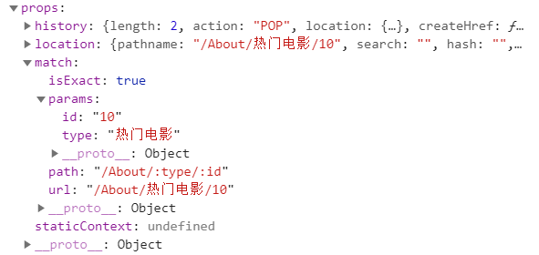

+ 前面提到的生命周期函数`componentWillReceiveProps`是props改变后就会触发此函数,当==组件未变 路由改变时 会触发此函数== 因可通过`this.props.match.params`获取路由参数

#### 字符串get请求获参

前面提到的占位符传参可通过params获取键值对形式参数,但是`to="/account?name=netflix"`这种类型的参数虽然loaction里面可获取但获取到的是一个字符串.还需自己处理字符串取参比较麻烦

==**new URLSearchParams(search)**==    ==<font color=red>**很重要**</font>== ( 浏览器自带的API )

```jsx
const search = this.props.location.search;
let query = new URLSearchParams(search);//把location的search字符串传进去

query.get("name")//根据键获取值
query.get('参数名');//取一个值, 返回值
query.getAll('参数名');//取多个值, 返回一个数组,数组里是每个值
```

#### URLSearchParams接口

https://developer.mozilla.org/zh-CN/docs/Web/API/URLSearchParams官网MDN

这不是redux里的 而是浏览器自带的 刚好知道了这个 所以学习

**`URLSearchParams`** 接口定义了一些实用的方法来处理 URL 的查询字符串。

它是构造函数 new URLSearchParams()返回一个 `URLSearchParams `对象。

```
方法
该接口不继承任何属性。

URLSearchParams.append()
 插入一个指定的键/值对作为新的搜索参数。
URLSearchParams.delete()
 从搜索参数列表里删除指定的搜索参数及其对应的值。
URLSearchParams.entries()
 返回一个iterator可以遍历所有键/值对的对象。
URLSearchParams.get()
 获取指定搜索参数的第一个值。
URLSearchParams.getAll()
 获取指定搜索参数的所有值，返回是一个数组。
URLSearchParams.has()
 返回 Boolean 判断是否存在此搜索参数。
URLSearchParams.keys()
返回iterator 此对象包含了键/值对的所有键名。
URLSearchParams.set()
 设置一个搜索参数的新值，假如原来有多个值将删除其他所有的值。
URLSearchParams.sort()
 按键名排序。
URLSearchParams.toString()
 返回搜索参数组成的字符串，可直接使用在URL上。
URLSearchParams.values()
 返回iterator 此对象包含了键/值对的所有值。
```

**示例**

```javascript
var paramsString = "q=URLUtils.searchParams&topic=api"
var searchParams = new URLSearchParams(paramsString);

for (let p of searchParams) {
  console.log(p);
}

searchParams.has("topic") === true; // true
searchParams.get("topic") === "api"; // true
searchParams.getAll("topic"); // ["api"]
searchParams.get("foo") === null; // true
searchParams.append("topic", "webdev");
searchParams.toString(); // "q=URLUtils.searchParams&topic=api&topic=webdev"
searchParams.set("topic", "More webdev");
searchParams.toString(); // "q=URLUtils.searchParams&topic=More+webdev"
searchParams.delete("topic");
searchParams.toString(); // "q=URLUtils.searchParams"
```


### 13.4 跳转新页面 编程式导航

##### 跳转页面

==this.props.history.push('path')==

> 场景: 当点击页码跳转时有两种方法 一种路由不变只获取新数据( 适用于url和页码无关的时候 )  另一种url有页码信息 那么数据变了假如是第二页数据 url还显示的第一页 此时就需要我们改变跳转url了

+ 通过`window.location.href="path"`可以跳转页面 这是浏览器的操作BOM方法 不推荐

+ 在React中推荐通过路由实现编程式导航  `this.props.history.push('path')` 参数是要跳转的路径  ,例`this.props.history.push('/login/1')` 在大组件内是获取不到的 展示哪个组件 就在哪个组件内通过`this.prop`获取`history`

+ 前面提到的生命周期函数`componentWillReceiveProps`是props改变后就会触发此函数,当组件未变 路由改变时 路由改变 就会触发函数 因可通过`this.props.match.params`获取路由参数 所以比较有用

##### 返回按钮 返回上一步

通过`this.props.history.go(-1) `可以实现后退返回上一步

### 13.5 API

在组件内通常可以通过`this.props`获取到`history`  `location` `match`(`params`在match内)  同时在组件内也可通过API获取 目前使用this.props获取 API等效 看个人需求

#### 钩子

React Router附带了一些[挂钩](https://reactjs.org/docs/hooks-intro.html)，可让您访问路由器的状态并从组件内部执行导航。

请注意：您必须使用React> = 16.8才能使用这些钩子中的任何一个！

- [`useHistory`](https://reacttraining.com/react-router/web/api/Hooks/usehistory)
- [`useLocation`](https://reacttraining.com/react-router/web/api/Hooks/uselocation)
- [`useParams`](https://reacttraining.com/react-router/web/api/Hooks/useparams)
- [`useRouteMatch`]

上面四个都从安装包导出的 名字()即可获取到对应的history location等

**useHistory **

```jsx
import { useHistory } from "react-router-dom";

function HomeButton() {
  let history = useHistory();

  function handleClick() {
    history.push("/home");
  }
```

**useParams**

`useParams`返回URL参数的键/值对的对象

```jsx
import {useParams} from "react-router-dom";
  let { slug } = useParams();
```

**useLocation**

该`useLocation`挂钩返回[`location`](https://reacttraining.com/react-router/web/api/location)代表当前URL 的对象。您可以将其视为类似于URL更改时`useState`会返回新值的a `location`。

这可能非常有用

```jsx
import {useLocation} from "react-router-dom";
let location = useLocation();
location.pathname
```


### 13.6 链接

##### 1. Link的to三种写法

```jsx
<Link to="/about">About</Link>
```

```jsx
<Link to="/courses?sort=name" />
```

也可传递对象跳转

```jsx
/*
pathname：代表链接路径的字符串。
search：查询参数的字符串表示形式。
hash：要放入网址中的哈希，例如#a-hash。
state：传递对象state且url不会显示到url链接上 适合传递多个数据的时候 通过loaction.state获取传过来的state
*/
<Link
  to={{
    pathname: "/courses",
    search: "?sort=name",
    hash: "#the-hash",
    state: { fromDashboard: true }
  }}
/>
```

##### 2. Link激活时的类名

> Link有两种,一种Link,另一种NavLink,而NavLink可以设置激活类名和样式

元素处于活动状态时提供的类。默认给定的类是`active`

可通过[activeClassName：字符串]设置激活时类名

```jSX
<NavLink to="/faq" activeClassName="selected">
  FAQs
</NavLink>
```

##### 3.Link激活时样式

元素处于活动状态时应用于元素的样式。可通过[activeStyle：对象]设置

```JSX
<NavLink
  to="/faq"
  activeStyle={{
    fontWeight: "bold",
    color: "red"
  }}
>
  FAQs
</NavLink>
```

### 13.7 Route

##### 1.点Link后展示组件的三方法

**component 方式**  ==一般用这种方式==        ( user是组件名)

```jsx
 <Route path="/user/:username" component={User} />
```

**render方式**                   ( 函数,返回一组件,展示此组件 )

在位置匹配时调用此函数,此函数可以访问所有相同的[路线道具](https://reacttraining.com/react-router/web/api/Route/route-props)（匹配，地理位置和历史）作为`component`渲染道具。

```jsx
<Route path="/home" render={() => <div>Home</div>} />
```

将routeProps扩展到渲染组件中 给组件传参

```jsx
<Route
      {...rest}
      render={routeProps => (
        <FadeIn>
          <Component {...routeProps} />
        </FadeIn>
      )}
    />
```

**警告：** ``优先级高，``因此请不要在同一个中使用两者\<Route>。

**children方式** 自行看文档

### 13.8 history

可通过`this.props.history`访问

==作用: 主要做页面url跳转的 , location的东西一般不在这获取因为location是可变的怕出错 最好从location专门提供的方法改 见下面==

`history` 对象通常具有以下属性和方法：

- `length` -（数字）历史记录堆栈中的条目数
- `action`- （字符串）当前动作（`PUSH`，`REPLACE`，或`POP`）
- `location`-（对象）当前位置。可能具有以下属性：
  - `pathname` -（字符串）URL的路径
  - `search` -（字符串）URL查询字符串
  - `hash` -（字符串）URL哈希片段
  - `state`-（对象）特定于位置的状态，例如`push(path, state)`在将该位置推入堆栈时所提供的状态。仅在浏览器和内存历史记录中可用。
- `push(path, [state])` -（功能）将新条目推入历史记录堆栈 简单来说就是跳转到新页面==(用得多)==
- `replace(path, [state])` -（函数）替换历史记录堆栈上的当前条目
- `go(n)`-（函数）通过`n`条目在历史记录堆栈中移动指针 若1则前进一个 -2后退两个==(用得多)==
- `goBack()` -（功能）等同于 `go(-1)`
- `goForward()` -（功能）等同于 `go(1)`
- `block(prompt)`-（功能）防止导航（请参阅[历史记录文档](https://github.com/ReactTraining/history#blocking-transitions)）

注意:历史对象是可变的。因此，建议this.props.location在组件内访问,而不是从`history.location`

### location

可通过`this.props.location`访问

==作用: 用于获取url位置( 仅params参数除外 params参数需单独用下方match获取)==

location在`history`也可得到 但是不推荐,因为历史对象是可变的。因此，建议`this.props.location`在组件内访问,而不是从`history.location`

位置。看起来像这样：

```jsx
{
  key: 'ac3df4', // not with HashHistory!
  pathname: '/somewhere',
  search: '?some=search-string',
  hash: '#howdy',
  state: {
    [userDefined]: true//其实也就是前面提到的传递一对象过来在这里获取
  }
}
```

### match

可通过`this.props.match`访问

一个`match`对象包含有关如何信息``相匹配的URL。`match`对象包含以下属性：

- `params` -（对象）从对应于路径动态段的URL解析的键/值对 ==(这个用得多 params从这里获取)==
- `isExact`-（布尔值）`true`如果整个URL都匹配（没有结尾字符）
- `path`-（字符串）用于匹配的路径模式。用于构建嵌套的``s
- `url`-（字符串）URL的匹配部分。用于构建嵌套的``s


# 14. 获取ajax数据

+ #### fetch受跨域限制 不推荐

  + 在React中可以通过fetch API获取数据,fetch译取得 拿到 ,fetch API是基于Promise封装的
  + 使用方法

  ```jsx
  //fetch是一个函数 函数调用第一个参数是url获取数据的地址  第一个.then 获取Response对象 Response.json()返回一个Promise 将它return出去 第二个.then获取到的data就是数据
     
  	fetch('../data/MenuData copy')
          .then(response=>response.json())
          .then(data=>{
        		console.log(data)
     		 })
  ```

  ==*注意： 默认的 window.fetch 受到跨域限制，无法直接是使用，这时候，我们使用 第三方包 fetch-jsonp 来发送 JSONP 请求,在github下载，它的用法，和 浏览器内置的 fetch 完全兼容*==

  

+ #### fetch-jsonp(发跨域请求)

  + [下载和使用文档](https://github.com/camsong/fetch-jsonp) 

  + 使用方法(下载包.导入,直接用,用法和fetch完全相同,具体看文档)

    ```jsx
    import fetchJsonp from 'fetch-jsonp'
    fetchJsonp('https://douban.uieee.com/v2/movie/in_theaters')
          .then(response => response.json())
          .then(data => {
            console.log(data);
          })
    ```

    

# 15. ant design 组件库

+ **介绍:** ant design是基于React的组件库,比较成熟, 基于vue的ant design组件库也有

+ **安装**

```bash
$ cnpm install antd --save
// 或者
$ yarn add antd
```

+ 其他使用参考官方文档 (按住ctrl点击跳转)

  [ant design官网](https://ant.design/docs/react/introduce-cn)

+ **<font size=5>Loading转圈圈加载案例 使用思路</font>** 

  例如Loading转圈圈加载提示的使用.  当state状态改变即值改变时会重新render.

  在state中设置flag为true 当为true时 render渲染转圈加载的提示内容

  发ajax请求 成功时将flag设置为false  此时设置后state状态改变会重新渲染执行render函数 render此时判断flag为flase就渲染数据相关的页面内容 

  这样就达到了一个好的效果 转圈提示比页面一片空白好 给用户好的体验