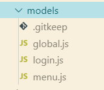
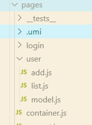
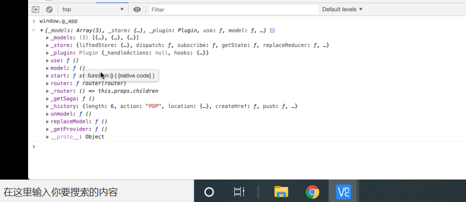

# 一：安装

#### 1. node环境安装

在[官网](https://nodejs.org/en/download/)下载与系统相应的node版本，node.js版本>=8.10

#### 2. 全局安装 umi(可安可不安)

```bash
$ yarn global add umi
$ umi -v
2.0.0 //确保版本是 2.0.0 或以上
```

FAQ：如果提示 **umi: command not found** 命令不存在，你需要将 `yarn global bin` 路径配置到环境变量中，方法如下：

```bash
# windows系统:
# 获取 global bin 的路径
$ yarn global bin
C:\Users\Administrator\AppData\Local\Yarn\bin
# 复制上面的 global bin 的路径，添加到系统环境变量 PATH。
```

3. #### 创建项目

   推荐使用 yarn create 命令，能确保每次使用最新的脚手架。

   ```
   yarn create umi / npm create umi
   ```

   在空目录执行以上命令 会把项目创建到空目录中

+ **解惑:** 如果运行 create-umi 报错“文件名、目录名或卷标语法不正确”

  + 找到“D:\nodemodules\module_global\bin”目录下的 create-umi.cmd，内容如下：

    ```bash
    @"%~dp0\C:\Users\PC\AppData\Local\Yarn\Data\global\node_modules\.bin\create-umi.cmd"   %*
    ```

  + 将 C: 盘符前的符号删了，如下：

    ```bash
    @"C:\Users\PC\AppData\Local\Yarn\Data\global\node_modules\.bin\create-umi.cmd"   %*
    ```

  + 把 "D:\nodemodules\module_global\bin" 路径加入系统的 path 环境变量中，加入之后，重新打开命令行运行 `create-umi`命令

  ```
  注意：
   修改了 create-umi.cmd 之后，不要再运行 yarn create umi，因为这会重新安装一次，然后就把你改的文件覆盖了。
   修改 create-umi.cmd 之后
   1、将 create-umi.cmd 所在的文件夹路径（“D:\nodemodules\module_global\bin”）此路径每个人的都不同，加入系统环境变量 path 中；
   2、重启命令行，之后直接在命令行运行 create-umi ，就可以了；
  ```

  ==**以上问题我都得到解决，再使用直接在空目录执行命令`create-umi`，或者执行`create-umi   [目录名]推荐后者 会自己创建空目录**==

# 二：创建选择

##### 1. 选择 project,选择app项目回车键确认 app是最基本的项目

```
? Select the boilerplate type (Use arrow keys)
  ant-design-pro  - Create project with an layout-only ant-design-pro boilerplate, use together with umi block.
❯ app             - Create project with a simple boilerplate, support typescript.
  block           - Create a umi block.
  library         - Create a library with umi.
  plugin          - Create a umi plugin.
```

##### 2. 选择是否使用 TypeScript,目前我选的N

```
? Do you want to use typescript? (y/N)
```

##### 3. 选择你需要的功能 (全都选上)

```
? What functionality do you want to enable? (Press <space> to select, <a> to toggle all, <i> to invert selection)
❯◯ antd
 ◯ dva
 ◯ code splitting
 ◯ dll
```

##### 4.项目创建完成

```
启动项目yarn start
yarn start / npm run start
```

参考链接：https://segmentfault.com/a/1190000018874245

# 三：配置全局变量

项目中请求资源我们一般会把域名设置为变量 而非如下这样写,因为在不同环境中请求资源的域名不同 例开发环境和生产环境 如果要一个个更改会很麻烦 且易出错

```javascript
// url = '/user/login'这是参数
//https://nei.netease.com/api/apimock/da68599b1e25ca4e8c9c1cdddaef9761这是域名

fetch(`https://nei.netease.com/api/apimock/da68599b1e25ca4e8c9c1cdddaef9761${url}`, conf)
```

设置为变量后在其他文件可以直接使用变量 使用前写/* eslint-disable no-undef */如下,

```javascript
//SERVICE_URL全局变量 不需引入 直接使用  下面这句注释必须写 否则会报错undefined


  /* eslint-disable no-undef */
fetch(`${SERVICE_URL}${url}`, conf)
```


设置步骤

在.umirc.js或者config.js 中配置 这两文件作用一样 但一个项目不能同时有两个文件

```javascript
const {NODE_ENV} = process.env;
export default {

define: {
    'SERVICE_URL': NODE_ENV === 'development' ? 			'https://nei.netease.com/api/apimock/da68599b1e25ca4e8c9c1cdddaef9761' : 'https://abc.aaa.com/api'
  }
}
```

配置为开发环境时用前面的url 是生产环境用后面的

/* eslint-disable no-undef */

==设置后在其他js文件直接使用,注意react使用的eslint检测代码 若直接使用会报错 在使用的地方前面加这句注释就不会报错` /* eslint-disable no-undef */`== 表示这句注释之后的代码 都忽略eslint的undefined未定义这种检查 

# 四:  modle中的subscriptions

**作用: ** 监听路由变化时执行(限启动当前组件和其子组件有效 此说法待确认) 

**场景:**  在很多时候我们会在组件`componentDidMount`钩子函数中发起异步请求数据,但是也可以在subscriptions中写,这样业务逻辑和组件相分离

```javascript
//固定写法:接收参数{ dispatch, history } ,history.listen监听路由变化 里面传个函数 可同步函数也可异步函数 我这里async写的异步 此函数接收的参数是location  解构可得到pathname 再根据路由 判断 发起异步请求
subscriptions: {
        setup({ dispatch, history }) {
            history.listen(async ({ pathname }) => {
                if (pathname === '/user') {
                    dispatch({ type: 'fetch' })
                }
            })
        }
    }
```

# 五: 配置文件

#####  .umirc.(js|ts) 和 config/config.(js|ts)

编译时配置文件，二选一，不可共存。里面内容都一样,前者直接根目录下 .umirc.js文件  后者是根目录下创建config目录 再里面config.js文件

# 六: models模块

**6.1 如果是全局很多地方要用的 就写在这里面 src/models内**



**6.2 如果不是全局要用的 只是某个小页面用 可以写在pages内** 

6.2.1 用文件夹写: pages下,或者pages的子目录下 写models目录 里面写很多模块 类似6.1 这里目录名不确定有没有s 待确认

6.2.2 也可单独写一个文件 名: model.js 

==注意:写在page里的特点是 仅此文件或目录的 父目录下的文件可以使用此模块==即可以connect ,其他都不行 例如这model.js在user目录下 只能user目录下的文件可以用 其他login目录就不行 这个container.js是pages根目录的也不行



# 七: url 的正则表达式：path-to-regexp

该工具库用来处理 url 中地址与参数，能够很方便得到我们想要的数据。不用再手写正则规则

js 中有 RegExp 方法做正则表达式校验，而 path-to-regexp 可以看成是 url 字符串的正则表达式。

https://www.jianshu.com/p/7d2dbfdd1b0f

# 八: widow.g_app._store.getState()

`widow.g_app._store.getState()`可获取全局的state

