# 实战经验

#### 1. 组件中操作DOM针对整个界面

>在组件中通过dom操作 可以拿到界面上任何元素 和组件没关系
>在dom世界里和组件没关系
>dom操作是对整个界面而言 不受组件影响

#### 2. 异步请求并不妨碍组件解析

#### 3. ajax获取的数据通过跨组件传值 需用watch监听 使用,否则拿到的会出问题

#### 4.vue方法的典型特征：实例方法首字符$

# vue中基本结构

```javascript
 	<div id="app">
    </div>
    <script src="./vue.js"></script>
    <script>
        //引入vuejs文件后有了Vue构造函数 通过new得出vue实例,el要控制的区域,data数据,methods方法
    let vm = new Vue({
            el: '#app',
            data: {
            },
            methods: {
            },
        })
    </script>
```

注意: 在实例中访问data数据或者methods方法必须通过this访问,data和methods是直接挂在实例上的

# 插值表达式{{}}

> 用插值表达式后 里面写的就是变量 可直接用data身上的数据

```javascript
<div id="app">
	{{msg}}
</div>

data: {
   msg:'嗯嗯'
},
```

# v-cloak

> cloak译斗篷 遮掩  人为给标签写上此属性 ,若插值表达式数据没渲染出来就有此属性,若渲染出来了会自动删除属性,可通过设置属性style解决闪烁问题(用得少)

```javascript
<style>
    [v-cloak]{
        display: none;
    }
</style>

<div id="app" v-cloak>
    {{msg}}
</div>
```

# v-text

> 覆盖标签所有内容 以文本字符串显示 不转化标签

```javascript
<div id="app" v-text='msg'>       
</div>

data: {
   	msg:'嗯嗯'
},
```

# v-html

> 覆盖标签所有内容 会转化标签

```javascript
<div id="app" v-html='msg'>       
</div>

data: {
   	msg:'<h1>嗯嗯</h1>'
},
```

## v-pre  

显示原始信息跳过编译过程 , 不对标签内容进行编译

```html
//正常情况会将这个当插值表达式进行编译
<div>{{msg}}</div>

//若只想展示{{msg}}字符串, 使用v-pre不对其编译, 写的什么就展示什么
<div v-pre>{{msg}}</div>
```


# v-bind缩写( : )

> 绑定后,里面写的就是变量

```javascript
<input type="button" :value="msg">

data: {
   	msg:'嗯嗯'
},
```

# v-on缩写( @ )

> 事件绑定 内写function或表达式(表达式必须是实例身上的变量 其他console.log('ok')这种不行)

```javascript
<button @click='show'>按钮</button>
// 也可show( )等效 区别是后者可传参
methods: {
    show(){
        console.log('ok')
    }
},
```

```javascript
<button @click='flag=!flag'>按钮</button>

data: {
  flag:true
},
```

==注意: 方法可以只写名字,也可名字(),例show和show( )等效,唯一的区别是后者可以传参==


若不传参,方法形参默认第一个接收参数是e, 若传了 第一个参数则是传的参数, 若又想要参数又想要事件源对象则

事件对象必须作最后参数显示传递,且$event名字固定:

```html
//也可传多参,show(123,456,$event)
<button @click='show(123,$event)'>按钮</button>

methods: {
    show(num,e){
        console.log(num,e)
    }
},
```


# v-model

> 数据双向绑定 ==仅限表单元素==可用
>
> 这里是v-model类似value 但是区别是可双向绑定 用户输入内容更改value值时data中msg也会改变

```javascript
<input type="text" v-model="msg">
```

# v-for 及 :key

> ==for循环 必须写key值(key只接受string或number) 两者配套==可循环如下:
>
> 1. 数组 (item,i)分别是值和下标
>
> 2. 对象(item,key,i) 分别是值 键 下标
> 3. 数字(item,i) 值和下标  值从1开始
>
> 以上下标都从0 开始

```javascript
<p v-for='(item,i) in list' :key='i'>{{item}}---{{i}}</p>

data: {
   list:[1,2,3]
},
```

**v-if 和 v-for 可以搭配使用 ,当循环时 ,只渲染符合条件的那一项**

```js
<div v-if="item==3" v-for="item in arr" :key="item">{{item}}</div>
//最后渲染出的结果是  <div>3</div>

data:{
 	arr:[1,3,6]
}
```

# v-if 

> 通过删除和创建元素 达到显示和隐藏元素目的,有较高切换消耗 为true则显示 false隐藏

```javascript
<p v-if='flag'>123</p>
data: {
   flag:true
},
```

# v-else-if 及 v-else

>  v-else 和 v-else-if 元素必须紧跟在带 v-if 或者 v-else-if 的元素之后, 否则无法识别

==类似js中的`if`和`else if`和`else`判断语句,有一个判断正确其他的就不会被执行,而`else`是只要前面的都不满足就执行`else`的,而`else`自己不管是true或false都不影响==

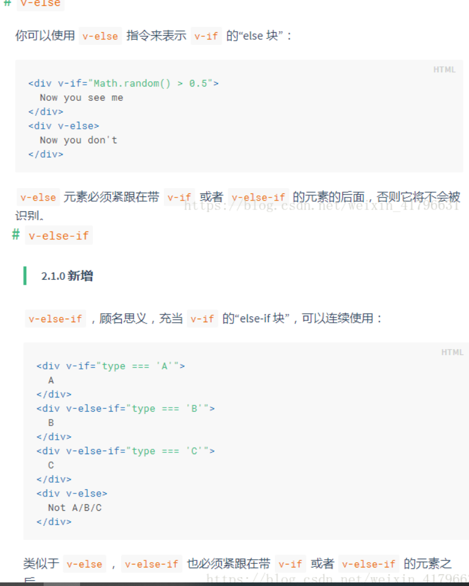

# v-show

> 通过设置display:none来显示隐藏元素,有较高初始渲染消耗

```javascript
<p v-show='flag'>123</p>
data: {
   flag:true
},
```

# .stop事件修饰符

> 停止冒泡

```
<button @click.stop='show'>按钮</button>
```

# .prevent事件修饰符

> 阻止默认行为 例a链接默认跳转

```
<button @click.prevent='show'>按钮</button>
```

# .capture事件修饰符

> 开启捕获 在需要捕获的外层元素上设置
>
> 例: 点击按钮后会先触发div事件 再触发按钮事件

```
<div @click.capture='show'>
     <button @click='btn'>按钮</button>
</div>
```

# .once事件修饰符

> 事件只触发一次

```
<button @click.once='btn'>按钮</button>
```

注意 事件修饰符可写多个 从左往右执行

```
<button @click.once.prevent='btn'>按钮</button>
```

# .self事件修饰符

> 不会因冒泡或捕获触发事件 只会因自己触发才触发(只管自己 若冒泡到别人身上是管不了的 例123, 2是自己 点击1后 触发1 冒泡3 不触发2)

```
<div @click.self='show'>
    <button @click='btn'>按钮</button>
</div>
```

# :class绑定类

```javascript
//数组
<h1 :class="['red', 'thin']">这是一个邪恶的H1</h1>

//数组中使用三元表达式
<h1 :class="['red', 'thin', isactive?'active':'']">这是一个邪恶的H1</h1>

//数组中嵌套对象
<h1 :class="['red', 'thin', {'active': isactive}]">这是一个邪恶的H1</h1>

//直接使用对象
<h1 :class="{red:true, italic:true, active:true, thin:true}">这是一个邪恶的H1</h1>

```

**若有class又有:class,则默认class不会被覆盖 而是合并在一起**

```js
<h1 class='a' :class="['red', 'thin']">这是一个邪恶的H1</h1> 
//h1此时拥有的类名是( a, red, thin )三个合并在一起了,若有相同则后覆盖前(此待测试)
```

**isActive以is开头的类名标识符一般是布尔值，给类设置布尔值判断时，用is更形象**

# :style绑定行内样式

```javascript
//1.直接写对象
<h1 :style="{color: 'red', 'font-size': '40px'}">这是一个善良的H1</h1>
//2.数组内写多个对象
<h1 :style="[h1StyleObj, h1StyleObj2]">这是一个善良的H1</h1>
data: {
        h1StyleObj: { color: 'red', 'font-size': '40px', 'font-weight': '200' },
        h1StyleObj2: { fontStyle: 'italic' }
}
```

# 全局过滤器

> 作用: 对显示的数据内容进行处理
>
> 定义: 全局过滤器,所有实例都可使用.通过Vue.filter()过滤器定义 一参是过滤器名字,二参是function,返回处理后的数据即显示此内容,function的一参固定为管道分隔符前面要处理的数据,一参之后都是传递的数据例guolv( 123 )
>
> 使用: 只能在v-bind 和{{ }}表达式中使用, | 管道分隔符后写过滤器名字.

```javascript
<div id="app">
     {{msg | guolv(123)}}  //若传多个参继续写{{msg | guolv(123,456)}}
</div>

Vue.filter('guolv',function(data,a){
	//data为msg数据  a为传的123
    return data.replace(/单纯/g,'邪恶')
})
data: {
    msg:'现在的我是一个单纯的少年'
},
```

==注意: 过滤器可同时使用多个,用 | 符号链接,每个过滤器处理的数据都是前面过滤器处理好的数据结果==

# 私有过滤器

> 全局过滤器是所有实例都可使用,若只想自己实例使用则定义私有过滤器
>
> 私有过滤器在实例内的filters上定义,其他不变.filters对象,内的键是过滤器名字,值为function即处理函数

```
 new Vue({
            filters: {
                guolv(data) {
                    return data.replace(/单纯/g, '美丽')
                }
            }
        })
```

# 字符串的padStart方法使用

> padStart是在前面补字符串内容,一参是补后的总长度(原长度+补的),二参是要补的字符串,若补后长度超过规定的长度,则截断到规定的长度,若满足总长度则不补
>
> str.padStart(补后的总长度,要补的字符串)

案例: 可用于进行补0操作,例时间为9秒时 使其为09秒

```
let str = '10'
console.log(str.padStart(2,0)) //10 不进行补

let str1 = '9'
console.log(str1.padStart(2,0)) //09 补0了
```


# 字符串的padEnd方法使用

> 和padStart类似 唯一的区别是从后面补字符串内容

# 按键修饰符

> 在事件后用按键修饰符 , 用来过滤, 当按键按到指定的键才触发
>
> 例: @keyup.enter表明只有在 `key` 是 `Enter` 时才调用`show`方法, 
>
> 用法和事件修饰符类似, 在事件后直接点

```
<input type="text" @keyup.enter='show' v-model='msg'>
```

**常见按键修饰符有哪些  :**

```
.enter =>  enter键

.tab => tab键

.delete (捕获“删除”和“退格”按键) => 删除键

.esc => 取消键

.space => 空格键

.up => 上

.down => 下

.left => 左

.right => 右
```

# 自定义按键修饰符

> 可以直接使用`@keyup.112='show'`,自定义按键修饰符就是为code起别名, 实际也会转换成code值, 但是使用别名更直观, 且数字不容易记住. 
>
> 有一些按键 (`.esc` 以及所有的方向键) 在 IE9 中有不同的 `key` 值, 如果你想支持 IE9，vue内置的别名应该是首选。特殊情况用自定义的,下面是方法:

可以通过全局 `config.keyCodes` 对象[自定义按键修饰符别名](https://cn.vuejs.org/v2/api/#keyCodes)：

```js
// 可以使用 `v-on:keyup.f1`
// f1名字自定义,112必须对应键盘的keycode值
Vue.config.keyCodes.f1 = 112
```

扩展: 查看按键code值

```js
//查看按键对应code值 通过e.keyCode获取
<input type="text" @keyup="handle">
  
 handle(e){
  console.log(e.keyCode)
}
```


# 自定义全局指令

**通过Vue.directive('指令名',{ })来自定义全局指令**

一参: 指令名,定义时不写`v-`,使用时必须写 `v-`这是规定

二参: 是`{ }`,对象里是指令函数**(指令函数接收第一个参数为绑定的元素,原生js对象,第二个参数是对象,对象身上的value属性获取传递的值),**类似钩子函数,特定时候自动调用

​			bind: 指令绑定到元素身上时调用,此时元素还未插入到dom中,只调用一次

​			inserted: 当元素插入到dom中调用,只调用一次

​			update: 被绑定元素所在的模板更新时调用,会调用多次

==总结: bind通常用于style样式设置,进行了样式设置哪怕此时未插入dom也不影响,会生效,==

​		  ==inserted通常用于行为,事件设置,若在bind中设置事件,此时压根就没插入dom中,事件不会生效==.

案例1: 所有函数第一个参数为绑定的元素(原生dom对象),使第一次进入页面, 文本框就自动获取焦点,原生js中有.focus()事件 自动获取焦点

```javascript
<input type="text" v-focus>
    
Vue.directive('focus', {
    bind(){

    },
    inserted(el){
        el.focus()
    },
    update(){

    }
})    
```

案例2: 可传参,通过第二个参数身上的value属性 获取传递的red值

```javascript
//自定义指令携带参数  通过v-指令名= “参数”
<input type="text" v-color="'red'">

bind(el,binding){
    el.style.backgroundColor = binding.value
},
```

# 自定义私有指令

>  在实例身上设置,其他不变

```javascript
new Vue({
    el: '#app',
    directives: {
        color: {
            bind(el, binding) {
                el.style.backgroundColor = binding.value
            }
        },
    }
})
```

# 指令的简写

> 可不写对象直接写函数,这样就相当于同时在bind和update函数中写,如果需要在inserted中写就不能用简写方式

```javascript
directives: {
     color(el, binding) {
         el.style.backgroundColor = binding.value
     }
 }
```

# 生命周期


# vue-resource( 了解 )

> 之前用ajax发请求,但这是jquery内的,jquery主要是操作dom,vue不推荐 所以vue发请求用vue-resource或者axios,推荐用axios,这里对vue-resource做了解
>
> 有get post jsonp 数据都必须点body

```javascript
//vue-resource基于vue,需先引入vue再引入vue-resource,引入后会在vue实例上多一个$http属性 用此发请求
<script src="./vue.js"></script>
<script src="./vue-resource.js"></script>

//1. get请求 通过.then从形参.body获取数据
this.$http.get('https://nei.netease.com/api/apimock/da68599b1e25ca4e8c9c1cdddaef9761/user/current').then(res=>{
       console.log(res.body)
})

//2. post请求
//一参:url请求地址  二参:body为对象 传的数据  三参:option为对象 指定post提交编码 二三参可选项 三参一般不写,    在旧的使用中post请求,默认没表单数据格式,会报错,所以需option设置为{ emulateJSON: true }表指定为一般表单格式,如今已解决,不设置也不会报错
this.$http.post(url,body,option).then(res=>{
      console.log(res.body)
})

//3.jsonp
//跨域请求 使用方式同get请求相同
this.$http.jsonp(url地址).then(res=>{
     console.log(res.body)
})
```

# axios

> axios也是发ajax请求的 里面只有ajax功能
> 有get post 没有jsonp
> jsonp用得少 后续有其他代替
> 数据必须点data获取
>
> axios不是vue官方提供的 所以不能通过Vue.use(‘axios’)安装 如果想挂在Vue上 让任何组件都能直接调用 就把它挂在prototype上

```js
//安装
npm install axios --save

//引入axios
import axios from 'axios'
Vue.prototype.axios = axios;
```


# 动画

## 动画基本使用和修改v-前缀类名

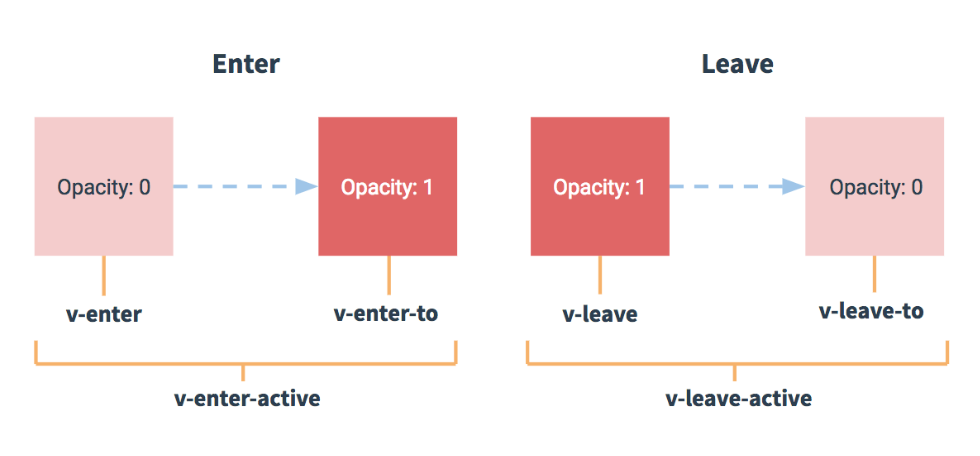

案例:

1. 用transition标签包裹需要动画的元素,transition标签是vue专门提供的.

2. 使用此标签包裹后,为其设置style样式,默认是v-开头的类名.
3. 所有被transition包裹的元素都是v-开头设置样式,全都能用,所以可通过name属性 设置v-前缀,例`<transition name='my'> </transition>`后需通过`.my-enter`设置样式 ,将`v-`改为`名字-`,设置后的对应元素需用特有命名设置样式,其他依旧v-,设置哪个就针对哪个.

```javascript
	<style>
        .v-enter,
        .v-leave-to{
            opacity: 0;
            transform: translateX(100px);
        }
        .v-enter-active,
        .v-leave-active{
            transition: all .8s ease;
        }
    </style>

    <div id="app">
        <button  @click='flag = !flag'>toggle</button>
        <transition>
            <p v-show="flag">我是动画元素</p>
        </transition>
    </div>

    <script>
        new Vue({
            el: '#app',
            data: {
                flag: false
            },
        })
    </script>
```

## 使用第三方库animate实现动画

> 1. 引入animate.css样式
>
> 2. 在transition上设置,
>
>      enter-active-class设置入场样式 leave-active-class设置出场样式,其中animated是固定必须写,后面的tada则是对应样式效果,
>      :duration设置样式时间默认毫秒,写4000表同时设置入场和出场时间,也可:duration={enter:2000,leave:3000}
>      ==注意:== duration设置时间有限制 只能设置动画默认时间之内的时间 大于默认时间的无效果

```javascript
<link rel="stylesheet" href="./animate.css">

<transition 
    enter-active-class="animated tada" 
    leave-active-class="animated bounceOutRight" 
    :duration='4000'
>
    <p v-show="flag">我是动画元素</p>
</transition>
```

## 动画生命周期函数

钩子函数如下: 相当于transition动画的钩子事件,指定对应函数,即为钩子函数

```javascript
<transition
  v-on:before-enter="beforeEnter"//动画开始前
  v-on:enter="enter"//动画开始后
  v-on:after-enter="afterEnter"//动画完成后
  v-on:enter-cancelled="enterCancelled"//动画取消,一般不用

  v-on:before-leave="beforeLeave"
  v-on:leave="leave"
  v-on:after-leave="afterLeave"
  v-on:leave-cancelled="leaveCancelled"
>
  <!-- ... -->
</transition>
```

案例:实现半场动画

```javascript
<transition 
    @before-enter='beforeEnter'
    @enter='enter'
    @after-enter='afterEnter'
    >
    <div class="ball" v-show='flag'></div>
</transition>

methods: {
    beforeEnter(el){
        el.style.transform = 'translate(0,0)'
    },
    enter(el,done){
        el.offsetWidth
        el.style.transform = 'translate(200px,300px)'
        el.style.transition = 'all .8s ease'
        done()
    },
    afterEnter(el){
        this.flag = !this.flag
    }
},
```

el :是被控制的要动画的元素,是原生js dom对象

done: 是函数afterEnter的引用,表立即执行函数,若不调用,而让此函数自动调用,则会出现延迟情况

​			==(在enter,leave中都有第二参数done,必须手动调用,否则bug)==

==el.offsetWidth此话没特殊含义 但是会强制浏览器刷新动画== 如果不写 浏览器默认不刷新动画就==没有过渡效果(==在函数前面写el.offsetWidth  el.offsetHeight  el.offsetTop  el.offsetLeft 只要和offset相关的任意一个就行)

## true和false在动画中作用

```
vue把完整的一场动画 用钩子函数分为:  上半场动画 + 下半场动画
动画的切换:          根据标识符true或false来决定是否切换  
上半场动画:          入场  false到true (从无到有)
下半场动画:          出场  true到false(从有到无)
```

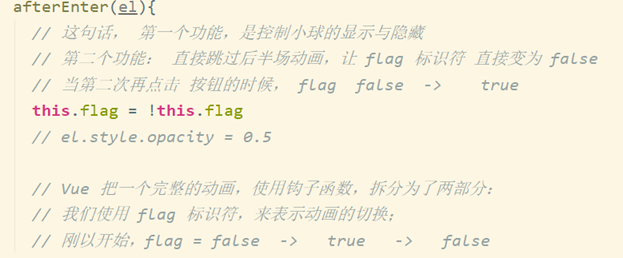

## transition-group

> 前面提到的transition标签只能实现单个元素动画,如果想实现多个元素动画,或者为v-for循环出来的元素设置动画 需使用transition-group标签,注意v-for的元素必须加:key属性

```javascript
<transition-group appear tag="div">
    <p v-for="(item,i) in list" :key="item.id" @click="show(i)">
        {{item.id}}-------{{item.name}}
    </p>
</transition-group>
```

1. `<transition-group></transition-group>`对多个元素实现动画

2. `appear`刚进入页面,实现元素入场动画

3. `transition-group`会渲染为`span`标签,可以用tag将其渲染为其他标签.

     注意: 只有`transition-group`会渲染成`span`标签,而`transition`不会渲染为其他任何标签.

     ​			==appear对`transition`也有效,tag对其无效==

## .v-move

实现元素移动时的动画,例一个元素被删除,其他元素会慢慢飘上来的效果

```javascript
//v-move 给列表后续元素设置移动效果 必须配合absolute使用
//不是非要v-show:true 只要是从无到有 或从有到无 例添加元素 都可直接设置动画
.v-move{
     transition: all 0.8s ease;
}
.v-leave-active{
    position: absolute
}
```

这里`.v-move`和`.v-leave-active`需配套使用,

# vue组件

## 创建全局组件的三种方式（推荐第三种）

   ==模板对象只能有且仅有一个唯一根元素==

1. ```javascript
     <div id="app">
        <myh1></myh1>
     </div>
     <script>
     //创建模板对象
       const a = Vue.extend({
         template:"<h1>我是一个大大的h1</h1>"
       })
     //注册组件 前为组件名，后为模板对象
       Vue.component('myh1', a)
     </script>
     ```

2. ```javascript
     <div id="app">
         <myh1></myh1>
     </div>
     
     //模板对象可以直接写为字面量对象
     Vue.component('myh1', {
        template:"<h1>我是一个大大的h1-----------</h1>"
     })
     ```

3. ```javascript
     /*
     1.将template模板抽离出来 放在template元素中,用的时候写对应选择器.
     2.template元素要写在被实例对象控制的区域的外部.不写内部.
     3.template里面的东西都属于模板内容(不含template元素),注意这是模板所以也只有有一个根元素
     */
     <div id="app">
       <myh1></myh1>
     </div>
      
     <template id="one">
       <div>
         <h1>哈哈</h1>
       </div>
     </template>
      
     <script>
       //在el控制区域外的template标签内写模板内容，注册组件时写对应的id名
       Vue.component('myh1', {
         template: "#one"
       })
     </script>
     ```

**推荐方式三，优点不用写字符串内，有代码提示和高亮。**

## template标签作用

+ 通常做组件模板使用，做组件模板时，必须有且仅有一个根元素

+ 在其他标签内做包裹标签使用时，不要求只一个根元素，可以多个根元素。

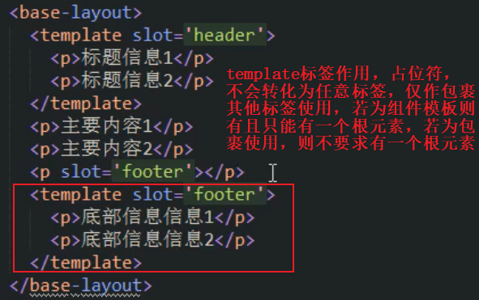

## 组件的命名规则

​		==**总结：**在react中用首字母大写命名表明这是组件，但在vue中别这么做，命名有要求，建议不用驼峰命名，若多个单词则全小写，用短横线连接。==

**方式一（全小写）：**组件命名时若全是小写，使用时使用相同名字。

```html
<helloworld></helloworld>

Vue.component('helloworld',{
template:"<h1>哈哈</h1>"
})
```

**方式二（短横线）：**组件命名可用短横线方式 ,全小写, 多个单词用短横线`-`连接，使用时使用相同名字。

```html
<hello-world></hello-world>

Vue.component('hello-world',{
  template:"<h1>哈哈</h1>"
})
```

**方式三（驼峰命名）：**==组件命名若为驼峰,那么使用组件时，只能在字符串模板中用驼峰方式使用组件，但是在普通标签中，则把驼峰大写字母变小写，两单词用 `-` 隔开，使用时不可直接小驼峰。==

```js
//驼峰命名组件，
//在字符串模板中用驼峰方式使用组件，或者单词全小写短横线隔开都行<hello-world></hello-world>
		Vue.component('HelloWorld',{
      template:"<h1>哈哈</h1>"
    })
    Vue.component('my',{
      template:`<div>
                  <h1>嘻嘻</h1>
                  <HelloWorld></HelloWorld>
                </div>`
    })
```

```javascript
//在普通标签中直接使用，例在根组件直接使用，必须全小写，短横线隔开，用驼峰名无效
<div id="app">
    <hello-world></hello-world>
</div>
  
Vue.component('HelloWorld',{
  template:"<h1>哈哈</h1>"
})
```


## 定义私有组件

> 在实例中定义 通过components定义,键为组件名,值为对象,内可写展示的模板内容或data或methods

```javascript
	new Vue({
      el: '#app',
      components:{
        login:{
          template:"#one"
        }
      }
    })
```

## 组件的生命周期

实例相当于大组件,组件相当于小组件,所以组件有自己的`data`,`methods`和生命周期函数,例created等,和实例一样的使用方法

## 组件的data和methods

> 模板对象并不是只能写template才叫模板  里面还可以写data methods 这个大的对象统称为模板对象

### 定义data

和实例中不同的是组件的data是一个函数,return一个对象 对象里是对应数据,自己身上的数据data是可读可写的.父组件上的数据是只读的. 在模板中可直接使用

```javascript
    Vue.component('login', {
      template: "#one",
      data(){
        return {
          msg:'哈哈'
        }
      }
    })

  <template id="one">
    <h1>{{msg}}</h1>
  </template>
```

### 定义methods

和实例中一样的使用

```javascript
Vue.component('login', {
      template: "#one",
      data() {
        return {
          msg:1
        }
      },
      methods: {
        add(){
          this.msg ++
        }
      },
    })
```

## component组件的切换

​		component标签相当于占位符 :is内写组件名字就展示对应组件 注意:is的:是固定写法,所以写组件名字一定要加引号 否则会当作变量 从而报错

```javascript
	<component :is="'register'">
    </component>
```

案例 : 点击链接切换组件

```javascript
  <div id="app">
    <a href="" @click.prevent="flag = 'login'">login</a>
    <a href="" @click.prevent="flag = 'register'">register</a>

    <component :is="flag">
    </component>
  </div>

	new Vue({
      el: '#app',
      data: {
        flag:"login"
      },
    })
```

## 组件切换的过渡动画

> 用transition动画包裹组件,设置对应样式,组件切换和元素切换的相同

```javascript
  <style>
    .v-enter,
    .v-leave-to{
      opacity: 0;
      transform: translateX(90px);
    }
    .v-enter-active,
    .v-leave-active{
      transition: all .5s ease;
    }
  </style>

    <transition mode="out-in">
        <component :is="flag"></component>
    </transition>
```

## 设置mode模式

==注意点== : 直接这样会导致切换时两组件同时出现即进来和出现同时进行,所以可通过`mode`设置模式,

`"out-in"`表示先出后进,`in-out`表示先进后出,案例见上.

通常用前者这样就不会同时出现

==注意: 若组件切换动画时出现往上飘的情况,给入场或离场任意方添加`position:absolute`==

## props父组件给子组件传值

> 通过属性绑定形式传值,子组件内通过props接收,值为数组[ ],内写绑定的属性名即可正常使用
>
> 若传的动态值用 `：`，传固定字符串可不用` :`,

==注意 : props是只读不可写的== 带`s`的只有`props`是数组,其他都是对象

```javascript
<div id="app">
    <login :msg="msg1"></login>
  </div>

Vue.component('login', {
      template:"<a>{{msg}}</a>",
      props:['msg']
    })
```

**从前笔记补充**：

```
		a).绑定的属性名自定义
		b).props是数组,内值为属性名是字符串需引号
		c).props接收的数据 只读不可写
		d).data和props中不能同名  
		e).使用:在插值语法中直接写自定义的属性名, 在方法中要this.自定义的属性名
```

### props的另一形式

> 上面的prop是数组 也可用下面这个对象 功能更全

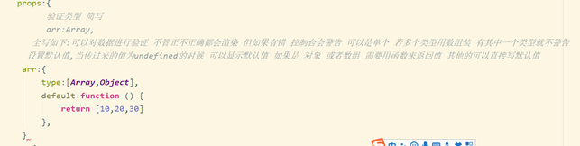

### props命名规则

**规则一：**

​		在props中使用驼峰形式的属性名字（接收时用的驼峰方式），那么模板中之前传递的属性名字必须需要使用短横线的形式，原因是dom元素属性不区分大小写，如果直接传驼峰会出警告且无效果。


**规则二：**

​		在字符串模板中可以传驼峰名字，接收也用驼峰接收，这没问题。但是若是普通标签中传递，例规则一，则必须短横线。

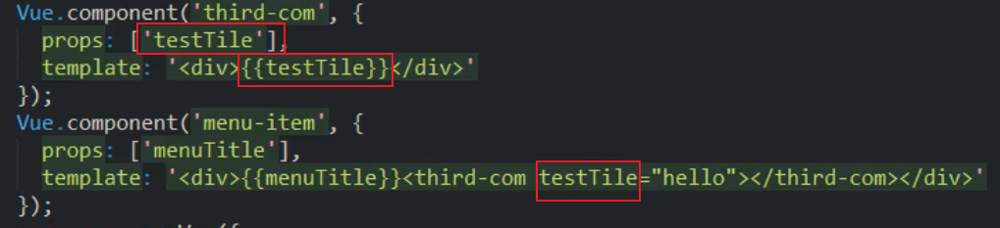

### props属性值类型

```
可以传递静态值
也可以传递动态值
动态值可以是 字符串  数字  布尔值 数组 对象
```

```js
:msg='1'  //传的msg是 数字    1
msg='1'   //传的msg是 字符串 '1'
```

## 父组件给子组件传方法

> 传值用属性绑定,传方法用事件@绑定, 通过调用自己的方法,进一步方法内再通过this.$emit('绑定的方法名')来调用传递的方法
>
> `$emit() `参数一为绑定的方法名,参数一之后都是传递的值,例`this.$emit("parent",123,456)`可传n个参

==注意 : 传方法时不能加()括号,加了就是立即调用,会把传递后的结果undefined传递过去,而平时写事件时可加可不加==

```javascript
<div id="app">
    //show为父组件的方法
   <son @parent="show"></son>
  </div>

const son = {
      template:"<h1 @click='add'>点我</h1>",
      methods: {
        add(){
          this.$emit("parent","传递的值一","传值二")
        }
      },
    }
```

# 非父子组件传值(基本使用和优化)

## 基本使用

实际就是创建一个事件中心，通过事件中心定义全局事件然后触发全局事件，注意定义全局事件在要更改数据的组件内的mounted函数中定义，这样一旦别人触发，那定义在自己组件内可以获取到自己组件数据，从而进行更改。

可以监听多个不同事件名的全局事件，$on是监听事件，$off是销毁事件（需自己手动触发若有需要则销毁），$emit是触发事件

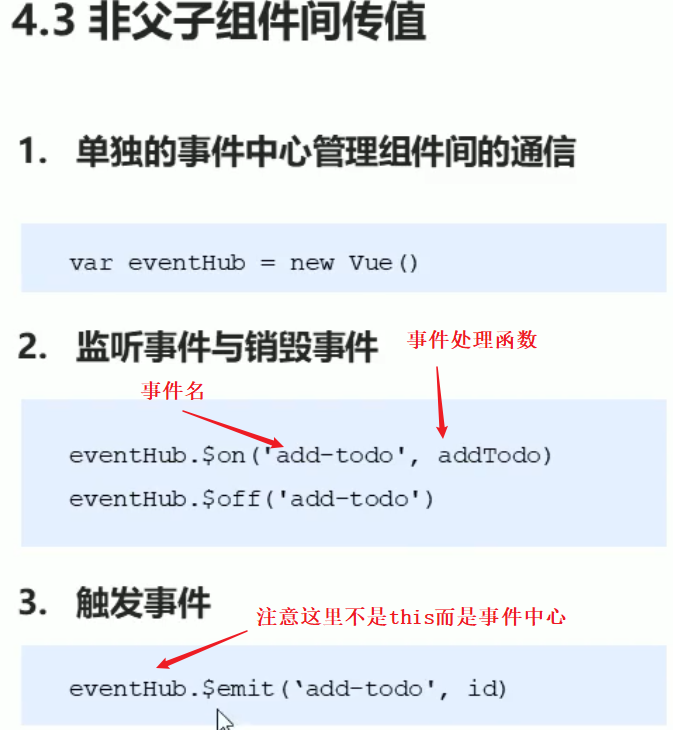


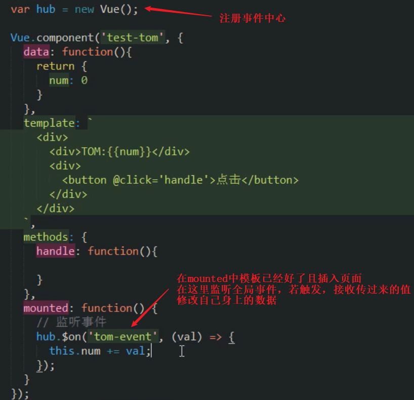

## 优化


## ref获取dom元素和组件引用

> ref 是 英文单词 【reference】  值类型 和 引用类型控制台报错 referenceError
>
> 若为组件,则可通过此方法拿到组件引用,直接使用组件的数据或方法,相当于拿的就是组件 没区别。如果把拿到的重新赋值 那组件内的数据也会改 因为这是引用。
>
> 只能获取自己组件内部的, 

> vue不提倡操作dom 所以提供此方法获取 其实此方法也是操作dom
>
> 在子组件标签上传 只能父组件里拿 祖父是不能拿的 需要一层一层传 好处是不同于组件传参中还需要调用方法传递

```
操作:
1.	在dom元素标签或组件标签上设置 属性ref=”自定义名” 
2.	在vue实例内部 this.$refs.自定义名        这样就获取dom或组件了

注意:	
设置属性时ref 不带s 因是单个元素,取元素时 
带s 是$refs 因里面是个对象存放多个元素或组件 键为自定义名 值为对应dom元素引用
```

```javascript
  <div id="app">
   <h1 @click="show">点我</h1>
   <span ref="myspan">我是span的内容</span>
   <son ref="myson"></son>
  </div>

	methods:{
        show(){
          console.log(this.$refs.myspan.innerText)//我是span的内容
          console.log(this.$refs.myson)//得到组件 可直接使用组件数据或方法
        }
      },
```

# slot **译插槽**

> 如果不写slot插槽,使用组件时 组件标签内放任何东西都不会显示,只会显示组件内容,相当于完全覆盖.
>
> 若想显示组件又显示自己在组件标签放的内容需要用到插槽slot
>
> slot 分为: 匿名插槽 和 实名插槽

插槽的作用：组件的最大特性就是复用性，而用好插槽能大大提高组件的可复用能力

若想显示组件又显示自己在组件标签放的内容需要用到插槽slot

slot 分为: 匿名插槽 和 实名插槽

1. 匿名插槽

     若不添加标签内容,默认显示插槽中内容 `<slot></slot>`是占位符 不会转化为任何标签

     若添加了 所有内容都会显示在添加的里面 slot顺序不要求

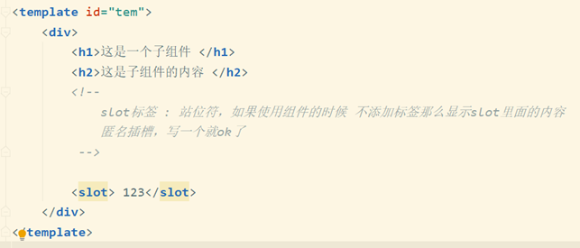

   2.实名插槽

​		若未写名则显示在无名的插槽内，<slot></slot>`是占位符 不会转化为任何标签

​		若添加了 对应名字的显示 若一个实名插槽 有多个标签写此名 则依次全显示

​		在slot中添加属性name=’自定义名’

​		使用时在使用的标签上 添加属性 slot = ‘name自定义名’ 只有一一对应才可以显示

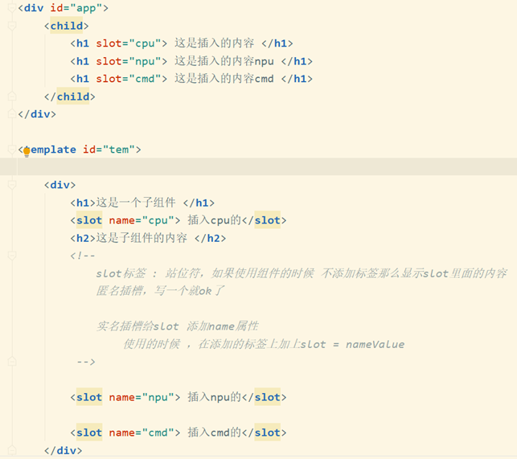


# 作用域插槽slot-scope='slotProps'

> 作用域插槽使用场景：父组件中得到子组件通过slot传递过来的数据，父组件对子组件内容加工处理
>
> 插槽可以提供一个默认内容，如果如果父组件没有为这个插槽提供了内容，会显示默认的内容。 如果父组件为这个插槽提供了内容，则默认的内容会被替换掉

使用方式：

		1. 子组件内部的slot标签上通过props绑定自定义属性形式，将子组件内部的值传递给父组件
  		2. 父组件通过写子组件名字来使用子组件，父组件中的 子组件标签内的标签（slot要显示的内容）用属性`slot-scope='slotProps'`获取，`slotProps`名自定义类似形参(通常写此名)，这是对象，对象点传递数据绑定的属性名，获取传递的数据

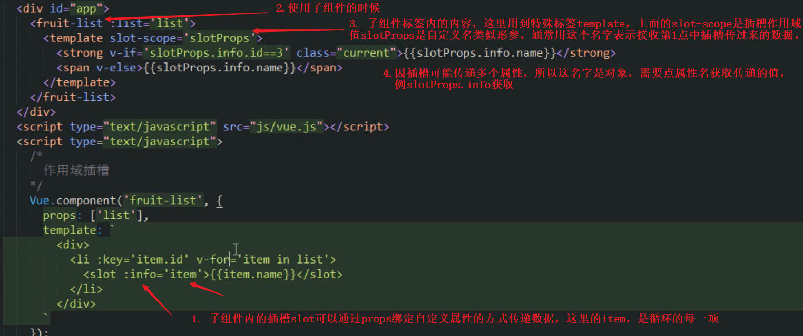

# 路由vue-router

## 什么是路由(仅了解)

```
1.后端路由:	对于网站来说,网站前端里面所能看到的任何资源,都要通过url地址从后端服务器拿,后端服务器每次都能监听到请求的url地址,根据对应的url地址返回对应的资源,这个处理过程是通过路由进行分发,后端路由就是把一个url地址对应到服务器对应的资源,这个对应关系叫路由.

2.前端路由:	前端路由是只在前端页面进行跳转,不会发请求给后端获取页面,只涉及前端页面的跳转.前端路由是通过hash来实现不同页面跳转,url中#号后面的都是hash.hash的特点是http请求中不会包含hash相关的内容,所以单页面程序的跳转就是通过hash来实现的.类似锚点就是hash

	在单页面应用程序中,通过hash来切换页面的方式,称为前端路由

```

## 基本使用

```javascript
//1.引入路由后会在全局window上挂一个构造函数 需在vue之后引入  
	<script src="./vue.js"></script>
	<script src="./vue-router.js"></script>

<body>
   
//5.使用 router-link会转为a标签,点击就会跳转路由,router-view是展示路由的坑 即占位符
  <div id="app">
    <router-link to='/login'>登录</router-link>
    <router-link to='/register'>注册</router-link>
    <router-view></router-view>
  </div>

  <script>
// 2.准备两个组件模板对象
    const login = {template: '<h1>登录页面</h1>'}
    const register = {template: '<h1>注册页面</h1>''}
    
//3.new VueRouter创建路由对象, routes:[]写路由匹配规则,内的每个对象就是一个路由规则,path是匹配的路径,component写展示的对应组件模板对象(变量 不加引号),注意是写模板对象,不是组件名
    const router = new VueRouter({
      routes: [
        { path: '/login', component: login },
        { path: '/register', component: register },
      ]
    })

// 4. 实例上注册router,将router和实例关联,监听路由变化,属性名为router,值是new出来的路由对象故这里简写
    new Vue({
      el: '#app',
      router
    })
  </script>
</body>
```

>**旧方法跳转: 仅了解**
>
>点击哪个链接 就跳转到对应组件 注意.`<a href="#/login">登录</a>`此写法可用但不推荐
>链接只写path中设置的链接地址 且必须以#开头 表hash
>跳转流程:
>a):点击链接 url改变
>b):监听到了url变化 
>c)匹配路由规则path 若有匹配的 则展示对应组件components

## tag渲染指定标签

`router-link`默认渲染为`a`标签,可通过`tag`将其渲染为指定标签

```javascript
<router-link to='/login' tag='ul'>登录</router-link>
```

## redirect重定向

`redirect`网页重定向,使一进入网页`/`就直接跳转到`/login`

```javascript
{ path: '/', redirect: '/login' },
```

## linkActiveClass路由激活类

路由默认激活类名为`router-link-active`,可用构造函数中属性`linkActiveClass`更改激活类名,可为激活路由设置样式.

有时候我们用的插件加类会显示样式 将linkActiveClass设置为此样式类 方便

```javascript
const router = new VueRouter({
      linkActiveClass:'myactive',
      routes: [
        { path: '/login', component: login },
        { path: '/register', component: register },
      ]
    })
```

## 路由组件切换动画

用`transition`将`router-view`包裹,再设置样式

```javascript
   //style省略...
	<transition mode="out-in">
      <router-view></router-view>
    </transition>
```

## 获取路由参数的两种方式

### 方式一 : query

> 可直接使用?键=值进行传参 不需要修改path, 路由匹配规则不变,直接在`router-link`的`to`中拼接参数,可在钩子函数`created`内通过`this.$route.query`获取

```javascript
<router-link to='/login?name=zs&age=18'>登录</router-link>

const login = {
      template: '<h1>登录页面</h1>',
      created() {
        console.log(this.$route)//得出结果见下图
      },
    }

{ path: '/login', component: login },
```

如图可通过`this.$route.query得出对应参数`


> 补充 : 
>
> 在{{}}插值表达式中 我们使用data数据是直接使用msg 不会this.msg
>
> 其实this.msg和msg等效 只是在插值表达式中this可省略 在插值表达式中也可直接$route.query.键 

### 方式二 : params

通过`this.$route.params获取`

**注意:**   path中设置的name和age 若传参只传name的值 不传age 就不符合匹配规则 无法匹配 必须该有的都有 

```javascript
<router-link to='/login/zs/18'>登录</router-link>

{ path: '/login/:name/:age', component: login }

```


## 嵌套路由

> 1. 父路由正常写,子路由的的`router-link`和`router-view`写在父路由内

```javascript
<template id="account">
    <div> account 
      <router-link to='/account/login'>login</router-link>
      <router-link to='/account/register'>register</router-link>
      <router-view></router-view>
    </div>
 </template>
```

> 2.  写匹配规则时不是直接写同级的,而是父路由匹配规则中有`children`属性,写在这里面

注意 : ==`children`内的path不要加`/`只写`login`==,加了就是默认以根路径开始,不加就会默认接在父路由路径后面,相当于`/account/login`,所以子路由写规则时只写半截,不加`/`,==`link`中就要写全即`to='/account/login'`==

综上 子路由 to中写层级 path中写子 不写斜杠 此为最佳

```javascript
routes: [
        {
          path: '/account',
          component: account,
          children: [
            { path: 'login', component: login },
            { path: 'register', component: register },
          ]
        },
      ]
```

> 补充
>
> 只要不是通过children的组件 都是显示到app的坑里,只有通过children的组件 才显示到组件内的坑里.
>
> 实例控制区域为app,有显示组件的坑,当路由变化就通过坑显示对应组件,并且将除自身以外的组件都覆盖掉. 想不覆盖就只有通过路由嵌套children方式写.否则都是直接覆盖(即用的区域app控制的坑)

## 路由的命名空间

> 前面提到的都是一个坑只展示一个组件,若想同时展示多个组件就需要用到命名空间

1. 平时都是`component`展示对应组件,若想同时展示多个组件则用`components`,它是对象,`default`表默认展示的组件,而属性名`left`表命名,值为要展示的组件模板对象.

2. 在`router-view`通过name属性,若不写则展示默认default,若写了,例left则展示属性名为left的.

```javascript
  <div id="app">
    <router-view></router-view>
    <router-view name='left'></router-view>
    <router-view name='main'></router-view>
  </div>
  
  
    const header = {
      template:"<h1>header</h1>"
    }
    const left = {
      template:"<h1>left</h1>"
    }
    const main = {
      template: "<h1>main</h1>",
    }

    const router = new VueRouter({
      routes: [
        {path: '/',components:{
          default:header,
          left:left,
          main:main
        }},
      ]
    })
```

# watch监听

> 绑定的属性为data中的数据或路由.不写this,写了this会出错,若数据更改则触发对应函数,不会初始化,不更改就不会执行
>

1. 监听`data`数据改变,属性省略`this`

     函数有两参,一参 newVal 是最新的数据 , 二参oldVal 是旧的数据即更新前一次的数据
     
     **应用场景: **若父组件传值为子组件,传的值是发异步请求获取的,那么可能导致子组件拿的值是undefined,此时数据还没获取回来,所以子组件通常不会直接使用父组件传的异步数据,而是监听,再将值存data中,使用的data中的值.

```javascript
<input type="text" v-model='msg'>
    
 	data:{
        msg:123
      },
      watch: {
        msg(newVal,oldVal){
          console.log('msg改变了')
        }
      }
```

2. ==监听路由变化( 推荐 )==

`watch`主要是监听路由变化的,同样不要绑定属性不写`this`. 可以直接写`$route`,而`$route.path`是对象下的一个属性,没区别

```javascript
watch: {
        '$route.path':function(){
          console.log(this.$route.path)
        }
      }
```

### 另一种方式获取到路由

路由不是dom元素,没有事件,所以只有通过watch来监听路由的变化,确实如此.

还有一种就是,刚进新页面就可以直接访问到路由,例图

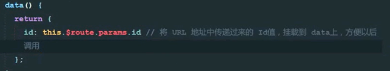

# computed计算属性

> 1. ==计算属性是自定义属性名然后直接使用,不需在data中定义==,值为`function`,函数内需`return`,使用时直接当属性使用,不能当函数调用, 在插值语法中 直接写 自定义的属性名,在方法中 直接this.自定义的属性名
> 2. 函数内相关联的data数据若发生改变则会触发函数进行计算
> 3. 计算属性有缓存,若未改变,则直接使用上次的计算结果不会重新计算,利于性能
> 4. 计算属性有初始化,即第一次进入网页会默认计算一次
> 5. 不在data上写只在computed上写
> 6. 计算属性的本质是方法,即属性名为属性名  值为function函数  但是我们使用的时候是把名称直接当属性用 不是当方法用所以不能加()调用 加了反而报错

```javascript
	<input type="text" v-model='one'>+
    <input type="text" v-model='two'>=
    <input type="text" v-model="full">
    
     data:{
        one:'',
        two:''
      },
      computed: {
        full(){
          return this.one +'-'+ this.two
        }
      } 
```

# render

render是vue实例上的属性

```js
render(createElements){//createElements是一个方法,调用它可以将指定的组件模板渲染为html结构
    return createElements (login1) //return的结果,会将el选定的元素替换为login1指定的组件,里面的内容也全部替换
}
```

# 获取元素位置类似offsetleft

正常情况下获取元素位置 如果是当前元素可以通过ref=’元素自定义名’ 再let a = this.$ref. ’元素自定义名’ 获取当前元素 最后通过a.getBoundingClientRect()来获取当前元素位置 返回一个对象从而获取位置

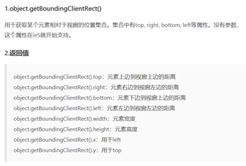

但是如果是父组件用了子组件 需要拿到子组件的某元素位置 就不能通过ref来获取(ref只能适用于当前组件的元素 若为子组件内的不适用) 所以此时怎么获取子组件内部某元素的位置内 通过传值比较麻烦 vue不提倡操作dom(vue提倡在数据渲染和数据双向绑定上不操作dom) 但是在一些不涉及数据绑定的情况小的细节上 如果不操作dom会比较麻烦的情况下 我们可以稍微操作下dom 小的细节不用那么严谨

==注意：在组件中 只要在界面上 你就可以拿到任何一个组件内的元素 和组件没关系 在dom世界里和组件没任何关系==

例在子组件内给元素定一个id 再父组件中 可以直接通过id选择器获取                               

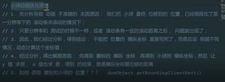

# url 的正则表达式：path-to-regexp

该工具库用来处理 url 中地址与参数，能够很方便得到我们想要的数据。不用再手写正则规则

js 中有 RegExp 方法做正则表达式校验，而 path-to-regexp 可以看成是 url 字符串的正则表达式。

https://www.jianshu.com/p/7d2dbfdd1b0f

# js 里面的键盘事件对应的键码

http://www.cnblogs.com/wuhua1/p/6686237.html


# 2019新视频补充-------------------------------------------------------------------------------------------------------------------

# v-once 

> 作用: 执行一次性的插值【只编译一次, 当数据改变时，插值处的内容不会继续更新, 依旧是第一次的值】
>
> 场景: vue数据绑定是响应式的, 对于绑定的数据需监听变化, 此举消耗性能, 若数据后续不会再修改可用`v-once`让vue不进行监听,从而提高性能.

```html
<div v-once>{{info}}</div>
```


# 表单基本操作

#### **单选框如何实现单选**

​		1、 两个单选框需要同时通过v-model 双向绑定 一个值 

​		2、 每一个单选框必须要有value属性 且value 值不能一样

​		3、 当某一个单选框选中的时候 v-model 会将当前的 value值 改变 data 中的 数据

```html
<label> 男: 
  <input type="radio" value="1" v-model="dan">
</label>
<label> 女: 
  <input type="radio" value="2" v-model="dan">
</label>

data: {
  dan: 2
}
```

#### **复选框如何实现复选**

​		1、 复选框需要同时通过v-model 双向绑定 一个值 ,复选框可以选多个所以值是数组

​		2、 每一个复选框必须要有value属性 且value 值不能一样 

​		3、 当某一个复选框选中的时候 v-model 会将当前的 value值 改变 data 中的 数据

```html
<label> 男: 
  <input type="checkbox" value="1" v-model="dan">
</label>
<label> 女: 
  <input type="checkbox" value="2" v-model="dan">
</label>

data: {
  dan: [1,2] //因是多选所以必须是数组,若为单独数字,会出错
},
```

#### **如何实现获取下拉框的选中状态**

​		1、 需要给select 通过v-model 双向绑定 一个值 

​		2、 每一个option 必须要有value属性 且value 值不能一样 

​		3、 当某一个option选中的时候 v-model 会将当前的 value值 改变 data 中的 数据

```html
<select v-model="dan">
  <option value="1">篮球</option>
  <option value="2">足球</option>
</select>

data: {
  dan: 3
}
```

#### 如何获取文本域中的值

​		1、 通过v-model 绑定一个值

# **表单域修饰符**

> .number 、 .trim 、 .lazy

**使用方法:**  对`v-model`值的处理, 类似事件修饰符, 不同的是这个在`v-model`后点

## **.number 转换为数值** 

> 用户input输入的值默认是字符串, 将其值转换为数字, 便于计算, 无需再拿值进行`parseInt`可直接计算.

```html
<input type="text" v-model.number="msg" >
{{msg + 123}} //设置.number后,可直接计算

data: {
		msg:''
}
```

**注意点：**当开始输入非数字的字符串时，因为Vue无法将字符串转换成数值 ,所以属性值将实时更新成相同的字符串,即使后面输入数字，也将被视作字符串,例'哈哈123'--->转为''哈哈123'',   若先数字后字符串则转换数字省略字符串,例'123哈哈'-->转为123。

## **.trim** 

> 去掉用户开头和结尾的空格 ,不能去除中间的空格

```html
<input type="text" v-model.trim="msg" >

data: {
    msg:''
},
```

## **.lazy** 

1. 作用

     将input事件切换成change事件  .lazy 修饰符延迟了同步更新属性值的时机。

​	2. 区别

​		input事件: 默认事件, 值改变, 立即触发.

​		change事件: 值改变, 失去焦点才触发.

 3. 应用场景

     通常用于用户注册账号, 设置用户名后, 当失去焦点再对用户名值进行验证, 验证是否已有该名

```html
<input type="text" v-model.lazy="msg" >

data: {
   msg:''
}
```

# 数组更新检测

## 编译方法和替换数组

> vue对数据处理一般都是响应式的（数据和视图同步）, 而数组操作默认不是响应式的, 所以vue对数组做了专门处理使其变成响应式.

改变原数组的API叫变异方法, vue将其处理成响应式方式。不会改变原数组的API需要对原数组重新赋值使原数组值变化，从而达到响应式效果，所以这种API叫替换数组。这里就是理论知识，知道有这东西就行。

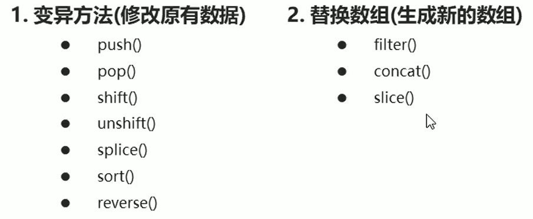

## Vue.set或this.$set  处理数组或对象

> 通过索引直接改变数组的某一项，并不是响应式的(数据改变视图不会重新更新)，例：this.arr[0]=1，所以这里可以用到`arr.splice截取又插入`或者`Vue.set或this.$set`

下图的vm就是this实例，在组件内直接this.$set。

参数一：准确来说是原数组，非单纯字符串名，例应该是`this.arr`而非`'arr'`

参数二：要修改的下标索引（若处理的对象，则将索引改为属性名）

参数三：新的值，更新后的值

**修改对象：通过key键直接改变对象的某一项也不是响应式的，和数组类似。这里也可用set方法，把参数二的下标索引改为key键名（单纯键的名字string），其他参数不变**

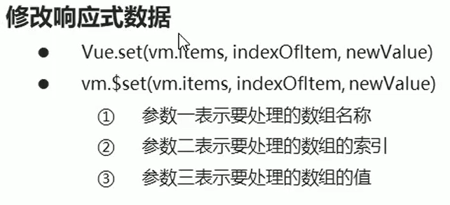

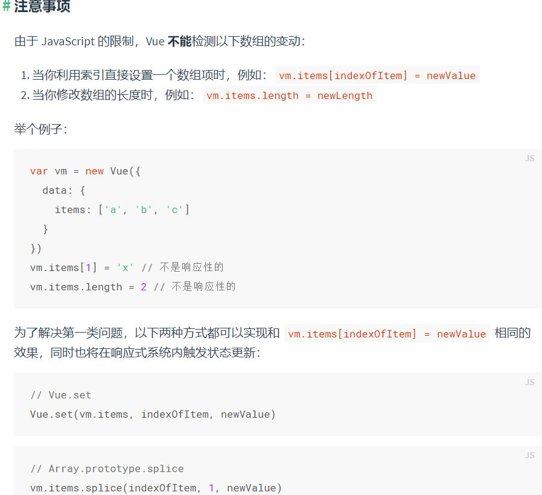

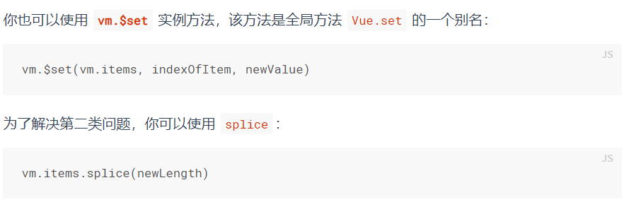

# 接口调用方式

- 原生ajax
- 基于jQuery的ajax
- fetch    是标准化组织出的新的接口，比传统ajax强
- axios   比fetch强

> 最终版建议用axios

# URL地址格式

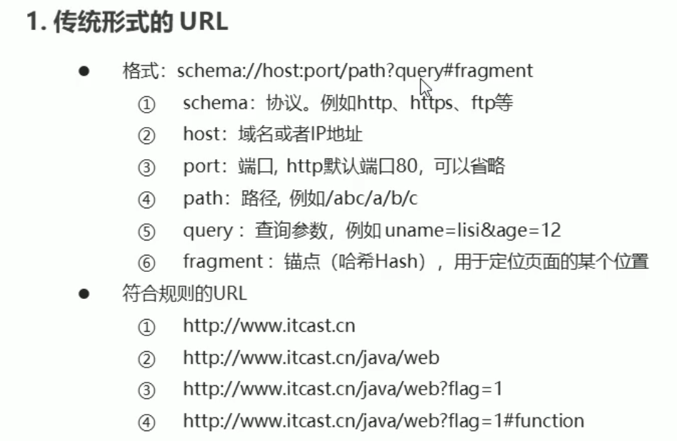

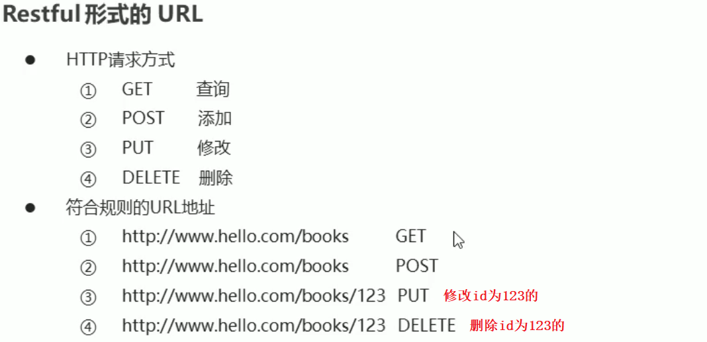


#  异步

- JavaScript的执行环境是「单线程」

- 所谓单线程，是指JS引擎中负责解释和执行JavaScript代码的线程只有一个，也就是一次只能完成一项任务，这个任务执行完后才能执行下一个，它会「阻塞」其他任务。这个任务可称为主线程

- 异步模式可以一起执行**多个任务**

- JS中常见的异步调用

     - 定时任务
     - ajax
     - 事件函数

- 多次异步调用的依赖分析

     - 多次异步调用的结果顺序不确定
     - 异步调用结果如果存在依赖需要嵌套

     所以通过promise和async await方式来解决以上两个问题

# promise

> 是异步编程的一种解决方案

- 主要解决异步深层嵌套的问题
- promise 提供了简洁的API  使得异步操作更加容易

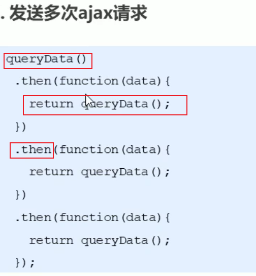

## then参数中的函数返回值

then返回值有几种:

 	1. 返回Promise实例对象
     + 返回的该实例对象会调用下一个then

 	2. 返回普通值
     + 返回的普通值会直接传递给下一个then，通过then参数中函数的参数接收该值
     + 返回普通值，会产生一个新的promise对象（根据不同值决定成功和失败状态）来调用下一个then，下一个then接收的参数就是前面返回的普通值

## Promise  基本API

###  实例方法（实例点方法）

##### .then()

- 得到异步任务正确的结果

##### .catch()

- 获取异常信息，它是reject的回调函数(写在不同位置而已和写then的第二个参数函数等效)，也可以捕获resolve的回调函数的异常，所以我们通常不写第二个reject函数，而是直接catch

##### .finally()

- 成功与否都会执行（暂时不是正式标准，目前仅谷歌开始支持） 

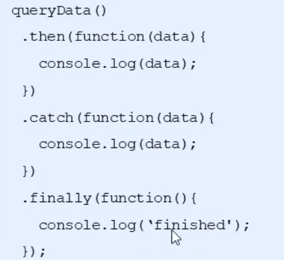

### 静态方法（Promise点方法）

#####  .all()

- `Promise.all`方法接受一个数组作参数，数组中每项（p1、p2、p3）均为promise实例对象，每个实例对象完成一个异步操作（如果不是一个promise，该项会被用`Promise.resolve`转换为一个promise)。它的状态由这三个promise实例决定，所有任务完成后得最终结果

     .then里面的参数得三个异步请求传过来的数据，参数也是数组，数组的每一项数据顺序是传参promise实例对象的顺序，一一对应的，例p1的结果就是。then参数中数组的第一项

#####  .race()

- `Promise.race`方法同样接受一个数组作参数。当p1, p2, p3中有一个实例的状态发生改变（变为`fulfilled`或`rejected`），p的状态就跟着改变。并把第一个改变状态的promise的返回值，传给p的回调函数，**只能拿到最先返回的结果**即只能拿到一个数据，另外的任务依然在进行没有终止，只不过我们并不关心

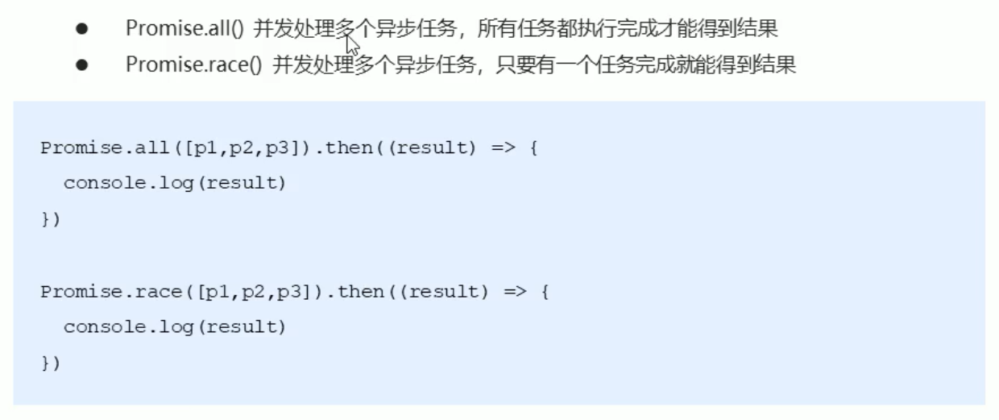

#  fetch

是标准化组织出的新的ajax解决方案,不需要引入别的东西,就是原生的js直接使用即可，比传统的ajaxAPI要强大很多，是传统ajax升级版。axios比fetch更强大。

- 基于promise来实现的，Fetch会返回Promise，所以语法结构和promise类似，调用后可以.then，也可通过catch处理异常信息（注意要then第二次才能得到最终数据）

     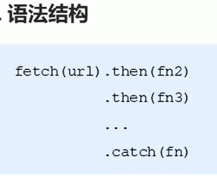

     第一个then里面的data不可以直接拿到实际数据，需要得到调用fetch的API .text()返回的promise并将其return出去,通过第二次.then拿到数据

     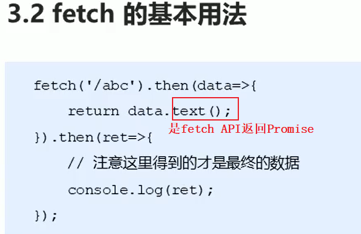

- **fetch不是ajax的进一步封装，而是原生js，没有使用XMLHttpRequest对象**。

- fetch(url, options).then(）

```html
  <script type="text/javascript">
    /*
      Fetch API 基本用法
      	fetch(url).then()
     	第一个参数请求的路径   Fetch会返回Promise   所以我们可以使用then 拿到请求成功的结果 
    */
    fetch('http://localhost:3000/fdata').then(function(data){
      // text()方法属于fetchAPI的一部分，它返回一个Promise实例对象，用于获取后台返回的数据，所以都要then第二次才能得到最终数据
      return data.text();
    }).then(function(data){
      //   在这个then里面我们能拿到最终的数据  
      console.log(data);
    })
  </script>
```

##  fetch API  中的 HTTP  请求

- fetch(url, options).then(）
- HTTP协议，它给我们提供了很多的方法，如POST，GET，DELETE，UPDATE，PATCH和PUT
     - 默认的是 GET 请求
     - 需要在 options 对象中 指定对应的 method       method:请求使用的方法 
     - post 和 普通 请求的时候 需要在options 中 设置  请求头 headers   和  body

```html
   <script type="text/javascript">
        /*
              Fetch API 调用接口传递参数
        */
       #1.1 GET参数传递 - 传统URL  通过url  ？ 的形式传参 
        fetch('http://localhost:3000/books?id=123', {
            	# get 请求可以省略不写 默认的是GET 
                method: 'get'
            })
            .then(function(data) {
            	# 它返回一个Promise实例对象，用于获取后台返回的数据
                return data.text();
            }).then(function(data) {
            	# 在这个then里面我们能拿到最终的数据  
                console.log(data)
            });

      #1.2  GET参数传递  restful形式的URL  通过/ 的形式传递参数  即  id = 456 和id后台的配置有关   
        fetch('http://localhost:3000/books/456', {
            	# get 请求可以省略不写 默认的是GET 
                method: 'get'
            })
            .then(function(data) {
                return data.text();
            }).then(function(data) {
                console.log(data)
            });

       #2.1  DELETE请求方式参数传递      删除id  是  id=789
        fetch('http://localhost:3000/books/789', {
                method: 'delete'
            })
            .then(function(data) {
                return data.text();
            }).then(function(data) {
                console.log(data)
            });

       #3 POST请求传参
        fetch('http://localhost:3000/books', {
                method: 'post',
            	# 3.1  传递数据 
                body: 'uname=lisi&pwd=123',
            	#  3.2  设置请求头 
                headers: {
                    'Content-Type': 'application/x-www-form-urlencoded'
                }
            })
            .then(function(data) {
                return data.text();
            }).then(function(data) {
                console.log(data)
            });

       # POST请求传参
        fetch('http://localhost:3000/books', {
                method: 'post',
                body: JSON.stringify({
                    uname: '张三',
                    pwd: '456'
                }),
                headers: {
                    'Content-Type': 'application/json'
                }
            })
            .then(function(data) {
                return data.text();
            }).then(function(data) {
                console.log(data)
            });

        # PUT请求传参     修改id 是 123 的 
        fetch('http://localhost:3000/books/123', {
                method: 'put',
                body: JSON.stringify({
                    uname: '张三',
                    pwd: '789'
                }),
                headers: {
                    'Content-Type': 'application/json'
                }
            })
            .then(function(data) {
                return data.text();
            }).then(function(data) {
                console.log(data)
            });
    </script>
```

##  fetchAPI 中 响应格式

- 用fetch来获取数据，如果响应正常返回，我们首先看到的是一个response对象，其中包括返回的一堆原始字节，这些字节需要在收到后，需要我们通过调用方法将其转换为相应格式的数据，比如`JSON`，`BLOB`或者`TEXT`等等

```js
    /*
      Fetch响应结果的数据格式
    */
    fetch('http://localhost:3000/json').then(function(data){
      // return data.json();   //  将获取到的数据使用 json 转换对象
      return data.text(); //  //  将获取到的数据 转换成字符串 
    }).then(function(data){
      // console.log(data.uname)
      // console.log(typeof data)
      var obj = JSON.parse(data);
      console.log(obj.uname,obj.age,obj.gender)
    })

```

#  axios

第三方的库，专门用来请求数据的，axios比fetch更强大。

- 基于promise用于浏览器和node.js的http客户端
- 支持浏览器和node.js
- 支持promise
- 能拦截请求和响应
- 自动转换JSON数据
- 能转换请求和响应数据

## axios基础用法

- get和 delete请求传递参数
     - 通过传统的url  以 ? 的形式传递参数
     - restful 形式传递参数 
     - 通过params  形式传递参数 
- post  和 put  请求传递参数
     - 通过选项传递参数
     - 通过 URLSearchParams  传递参数 

```js
    # 1. 发送get 请求 
	axios.get('http://localhost:3000/adata').then(function(ret){ 
      #  拿到 ret 是一个对象      所有的对象都存在 ret 的data 属性里面
      // 注意data属性是固定的用法，用于获取后台的实际数据
      // console.log(ret.data)
      console.log(ret)
    })
	# 2.  get 请求传递参数
    # 2.1  通过传统的url  以 ? 的形式传递参数
	axios.get('http://localhost:3000/axios?id=123').then(function(ret){
      console.log(ret.data)
    })
    # 2.2  restful 形式传递参数 
    axios.get('http://localhost:3000/axios/123').then(function(ret){
      console.log(ret.data)
    })
	# 2.3  通过params  形式传递参数 
    axios.get('http://localhost:3000/axios', {
      params: {
        id: 789
      }
    }).then(function(ret){
      console.log(ret.data)
    })
	#3 axios delete 请求传参     传参的形式和 get 请求一样
    axios.delete('http://localhost:3000/axios', {
      params: {
        id: 111
      }
    }).then(function(ret){
      console.log(ret.data)
    })

	# 4  axios 的 post 请求
    # 4.1  通过选项传递参数
    axios.post('http://localhost:3000/axios', {
      uname: 'lisi',
      pwd: 123
    }).then(function(ret){
      console.log(ret.data)
    })
	# 4.2  通过 URLSearchParams  传递参数 
    var params = new URLSearchParams();
    params.append('uname', 'zhangsan');
    params.append('pwd', '111');
    axios.post('http://localhost:3000/axios', params).then(function(ret){
      console.log(ret.data)
    })

 	#5  axios put 请求传参   和 post 请求一样 
    axios.put('http://localhost:3000/axios/123', {
      uname: 'lisi',
      pwd: 123
    }).then(function(ret){
      console.log(ret.data)
    })

```

## axios 全局配置

```js
#  配置公共的请求头 
axios.defaults.baseURL = 'https://api.example.com';
#  配置 超时时间
axios.defaults.timeout = 2500;
#  配置公共的请求头
axios.defaults.headers.common['Authorization'] = AUTH_TOKEN;
# 配置公共的 post 的 Content-Type
axios.defaults.headers.post['Content-Type'] = 'application/x-www-form-urlencoded';


```

##  axios 拦截器

- 请求拦截器
     - 请求拦截器的作用是在请求发送前进行一些操作
          - 例如在每个请求体里加上token，统一做了处理如果以后要改也非常容易
- 响应拦截器
     - 响应拦截器的作用是在接收到响应后进行一些操作
          - 例如在服务器返回登录状态失效，需要重新登录的时候，跳转到登录页

```js
	# 1. 请求拦截器 
	axios.interceptors.request.use(function(config) {
      console.log(config.url)
      # 1.1  任何请求都会经过这一步   在发送请求之前做些什么   
      config.headers.mytoken = 'nihao';
      # 1.2  这里一定要return   否则配置不成功  
      return config;
    }, function(err){
       #1.3 对请求错误做点什么    
      console.log(err)
    })
	#2. 响应拦截器 
    axios.interceptors.response.use(function(res) {
      #2.1  在接收响应做些什么  
      var data = res.data;
      return data;
    }, function(err){
      #2.2 对响应错误做点什么  
      console.log(err)
    })
```

#  async  和 await

是ES7新的语法结构，专门用来实现异步调用，解决毁掉地狱

- async作为一个关键字放到函数前面
     - 任何一个`async`函数都会隐式返回一个`promise`
- `await`关键字只能在使用`async`定义的函数中使用
     - ​    await后面可以直接跟一个 Promise实例对象
     - ​     await函数不能单独使用
- **async/await 让异步代码看起来、表现起来更像同步代码**

```js
 	# 1.  async 基础用法
    # 1.1 async作为一个关键字放到函数前面
	async function queryData() {
      # 1.2 await关键字只能在使用async定义的函数中使用      await后面可以直接跟一个 Promise实例对象
      var ret = await new Promise(function(resolve, reject){
        setTimeout(function(){
          resolve('nihao')
        },1000);
      })
      // console.log(ret.data)
      return ret;
    }
	# 1.3 任何一个async函数都会隐式返回一个promise   我们可以使用then 进行链式编程
    queryData().then(function(data){
      console.log(data)
    })

	#2.  async    函数处理多个异步函数
    axios.defaults.baseURL = 'http://localhost:3000';

    async function queryData() {
      # 2.1  添加await之后 当前的await 返回结果之后才会执行后面的代码   
      
      var info = await axios.get('async1');
      #2.2  让异步代码看起来、表现起来更像同步代码
      var ret = await axios.get('async2?info=' + info.data);
      return ret.data;
    }

    queryData().then(function(data){
      console.log(data)
    })
```

# 图书列表案例

#### 1. 基于接口案例-获取图书列表

- 导入axios   用来发送ajax 
- 把获取到的数据渲染到页面上 

```html
  <div id="app">
        <div class="grid">
            <table>
                <thead>
                    <tr>
                        <th>编号</th>
                        <th>名称</th>
                        <th>时间</th>
                        <th>操作</th>
                    </tr>
                </thead>
                <tbody>
                    <!-- 5.  把books  中的数据渲染到页面上   -->
                    <tr :key='item.id' v-for='item in books'>
                        <td>{{item.id}}</td>
                        <td>{{item.name}}</td>
                        <td>{{item.date }}</td>
                        <td>
                            <a href="">修改</a>
                            <span>|</span>
                            <a href="">删除</a>
                        </td>
                    </tr>
                </tbody>
            </table>
        </div>
    </div>
    <script type="text/javascript" src="js/vue.js"></script>
	1.  导入axios   
    <script type="text/javascript" src="js/axios.js"></script>
    <script type="text/javascript">
        /*
             图书管理-添加图书
         */
        # 2   配置公共的url地址  简化后面的调用方式
        axios.defaults.baseURL = 'http://localhost:3000/';
        axios.interceptors.response.use(function(res) {
            return res.data;
        }, function(error) {
            console.log(error)
        });

        var vm = new Vue({
            el: '#app',
            data: {
                flag: false,
                submitFlag: false,
                id: '',
                name: '',
                books: []
            },
            methods: {
                # 3 定义一个方法 用来发送 ajax 
                # 3.1  使用 async  来 让异步的代码  以同步的形式书写 
                queryData: async function() {
                    // 调用后台接口获取图书列表数据
                    // var ret = await axios.get('books');
                    // this.books = ret.data;
					# 3.2  发送ajax请求  把拿到的数据放在books 里面   
                    this.books = await axios.get('books');
                }
            },

            mounted: function() {
				#  4 mounted  里面 DOM已经加载完毕  在这里调用函数  
                this.queryData();
            }
        });
    </script>
```

#### 2   添加图书

- 获取用户输入的数据   发送到后台
- 渲染最新的数据到页面上

```js
 methods: {
    handle: async function(){
          if(this.flag) {
            // 编辑图书
            // 就是根据当前的ID去更新数组中对应的数据
            this.books.some((item) => {
              if(item.id == this.id) {
                item.name = this.name;
                // 完成更新操作之后，需要终止循环
                return true;
              }
            });
            this.flag = false;
          }else{
            # 1.1  在前面封装好的 handle 方法中  发送ajax请求  
            # 1.2  使用async  和 await 简化操作 需要在 function 前面添加 async   
            var ret = await axios.post('books', {
              name: this.name
            })
            # 1.3  根据后台返回的状态码判断是否加载数据 
            if(ret.status == 200) {
             # 1.4  调用 queryData 这个方法  渲染最新的数据 
              this.queryData();
            }
          }
          // 清空表单
          this.id = '';
          this.name = '';
        },        
 }         
```

#### 3  验证图书名称是否存在

- 添加图书之前发送请求验证图示是否已经存在
- 如果不存在 往后台里面添加图书名称
     - 图书存在与否只需要修改submitFlag的值即可

```js
 watch: {
        name: async function(val) {
          // 验证图书名称是否已经存在
          // var flag = this.books.some(function(item){
          //   return item.name == val;
          // });
          var ret = await axios.get('/books/book/' + this.name);
          if(ret.status == 1) {
            // 图书名称存在
            this.submitFlag = true;
          }else{
            // 图书名称不存在
            this.submitFlag = false;
          }
        }
},
```

#### 4.  编辑图书

- 根据当前书的id 查询需要编辑的书籍
- 需要根据状态位判断是添加还是编辑 

```js
 methods: {
        handle: async function(){
          if(this.flag) {
            #4.3 编辑图书   把用户输入的信息提交到后台
            var ret = await axios.put('books/' + this.id, {
              name: this.name
            });
            if(ret.status == 200){
              #4.4  完成添加后 重新加载列表数据
              this.queryData();
            }
            this.flag = false;
          }else{
            // 添加图书
            var ret = await axios.post('books', {
              name: this.name
            })
            if(ret.status == 200) {
              // 重新加载列表数据
              this.queryData();
            }
          }
          // 清空表单
          this.id = '';
          this.name = '';
        },
        toEdit: async function(id){
          #4.1  flag状态位用于区分编辑和添加操作
          this.flag = true;
          #4.2  根据id查询出对应的图书信息  页面中可以加载出来最新的信息
          # 调用接口发送ajax 请求  
          var ret = await axios.get('books/' + id);
          this.id = ret.id;
          this.name = ret.name;
        },
```

####   5 删除图书

- 把需要删除的id书籍 通过参数的形式传递到后台

```js
   deleteBook: async function(id){
          // 删除图书
          var ret = await axios.delete('books/' + id);
          if(ret.status == 200) {
            // 重新加载列表数据
            this.queryData();
          }
   }
```

