# 微信小程序基本使用

## 1. 什么是微信小程序

微信⼩程序，简称⼩程序，英⽂名 `Mini Program` ，微信小程序是微信内部的,是⼀种不需要下载安装即可使⽤的应⽤，它实现 了应⽤“触⼿可及”的梦想，⽤⼾扫⼀扫或搜⼀下即可打开应⽤

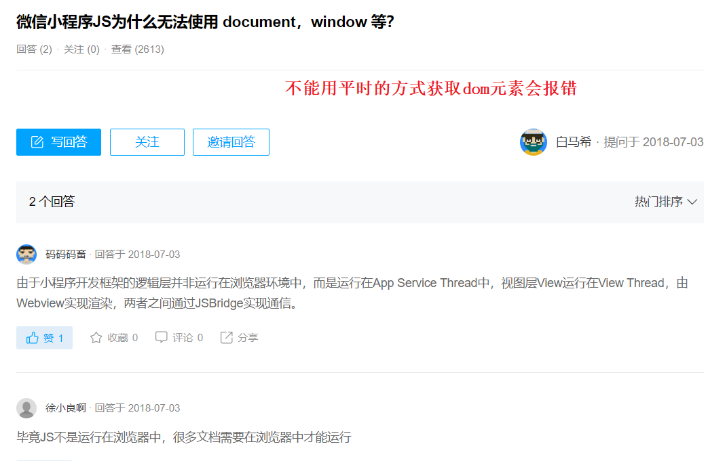

## 2. 环境准备

### 2.1 注册账号

> 微信小程序是谁开发的，它有一个唯一的开发者信息，所以需要注册账号，作为开发者信息证明。
>
> 建议使用全新的邮箱,没有注册过其他小程序和公众号的，也没绑定过微信。

访问[注册页面](https://mp.weixin.qq.com/wxopen/waregister?action=step1)，耐⼼完成注册即可。

### 2.2 获取APPID 

由于后期调⽤微信⼩程序的接⼝(例获取手机信息,微信支付)等功能或者发布上线，需要索取开发者的⼩程序中的 APPID ，所以在注册成功后， 可登录，然后获取APPID。

[登录](https://mp.weixin.qq.com/)，成功后可看到如下界⾯
然后复制你的APPID,悄悄的保存起来，不要给别⼈看到😄

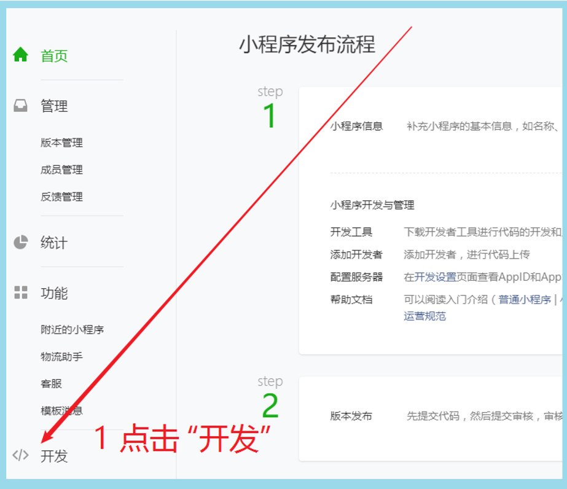

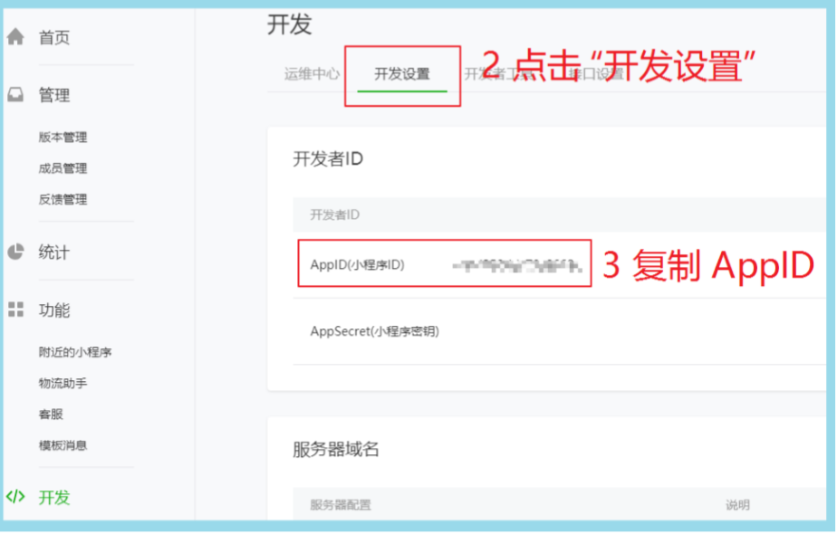

### 2.3. 开发⼯具 

[下载微信开发者工具](https://developers.weixin.qq.com/miniprogram/dev/devtools/download.html)(点击安装包一直next即可)

> 开发网页可以通过浏览器预览，而开发小程序应用，需要有自己的开发环境。

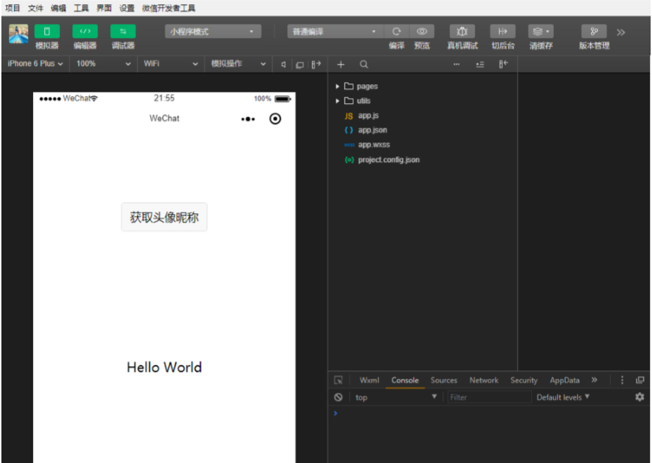

微信⼩程序⾃带开发者⼯具，集**开发、预览、调试、发布**于⼀⾝的完整环境。
但是由于编码的体验不算好，因此建议使⽤`vs code` + `微信小程序编辑工具`来实现编码
`vs code `负责敲代码，` 微信编辑工具`负责预览

## 3. 第⼀个微信⼩程序

### 3.1 打开微信开发者⼯具 

注意：第⼀次登录的时候需要扫码登录

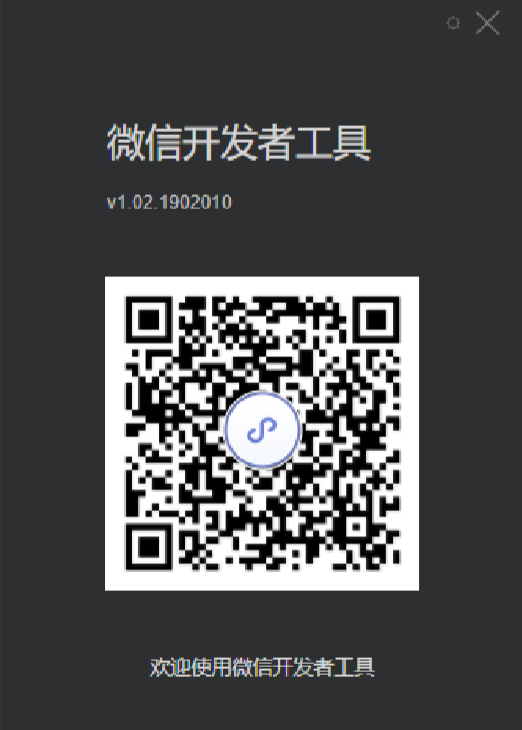

### 3.2 新建小程序项目

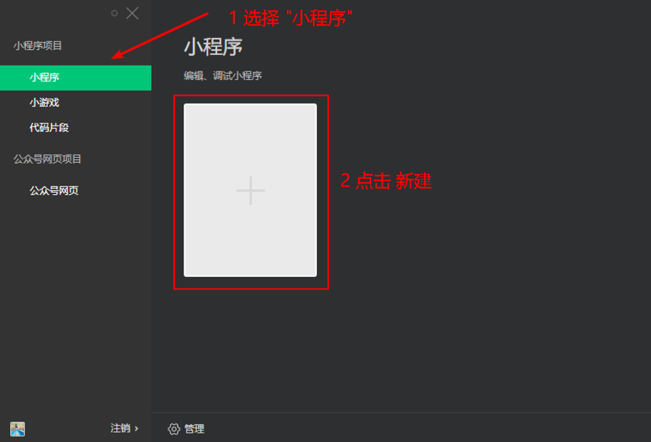

### 3.3 填写项⽬信息 

目前AppID是用的测试号，测试号不能选择云开发，所以默认没有后端服务此栏，后期可以更改AppID。

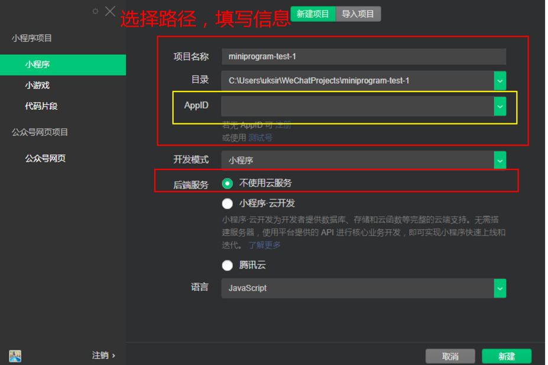

选择测试号后界面如下，新建。

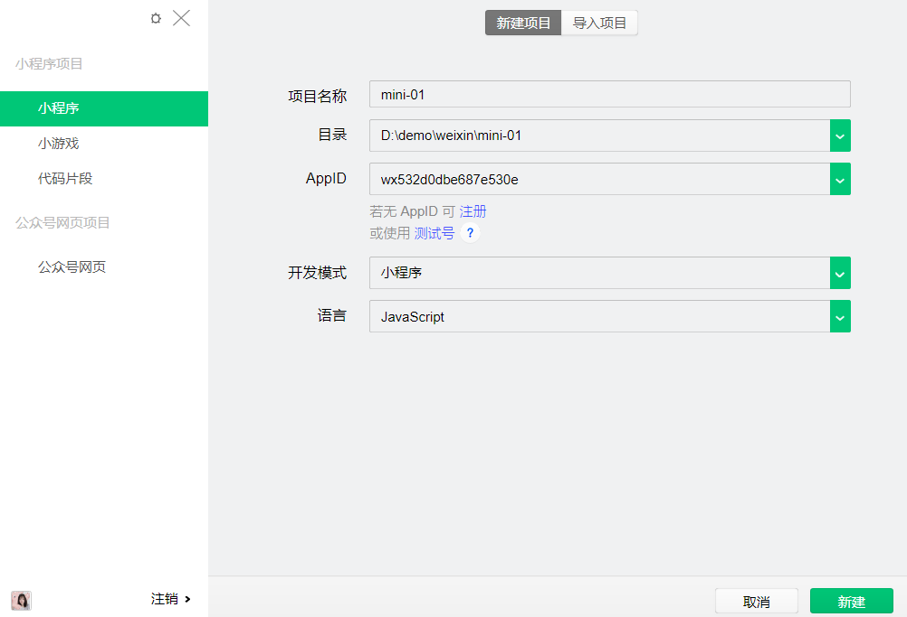

### 3.4 成功

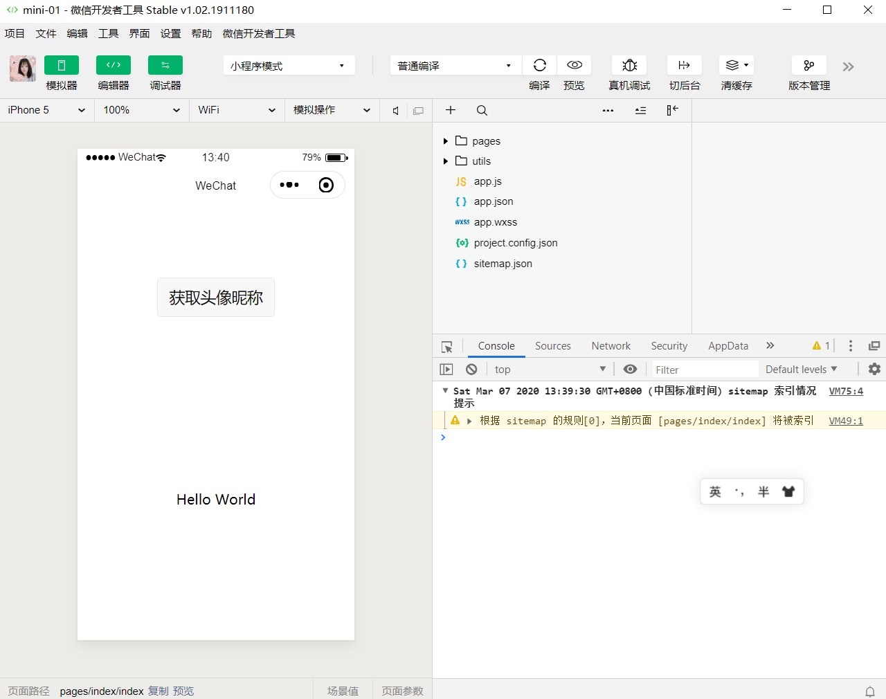

## 4. 微信开发者⼯具介绍 

详细的使⽤，可以查看[官网](https://developers.weixin.qq.com/miniprogram/dev/devtools/devtools.html)

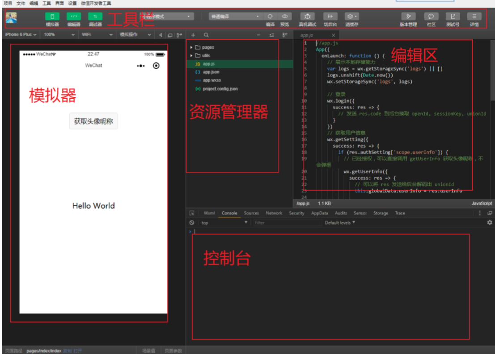

## 5. ⼩程序结构⽬录 

[⼩程序框架](https://developers.weixin.qq.com/miniprogram/dev/framework/MINA.html)的⽬标是通过尽可能简单、⾼效的⽅式让开发者可以在微信中开发具有原⽣APP体验的服务。
⼩程序框架提供了⾃⼰的视图层描述语⾔`WXML`和`WXSS `，以及` JavaScript` ，并在视图层与逻辑层间提供了数据传输和事件系统，让开发者能够专注于数据与逻辑。

### 5.1 ⼩程序⽂件结构和传统web对比

| 结构 | 传统web    | 微信⼩程序 |
| ---- | ---------- | ---------- |
| 结构 | HTML       | WXML       |
| 样式 | CSS        | WXSS       |
| 逻辑 | Javascript | Javascript |
| 配置 | ⽆         | JSON       |

通过以上对⽐得出，**传统web**是三层结构。⽽微信⼩程序 是四层结构，多了⼀层**配置.json**

### 5.2 基本的项⽬⽬录

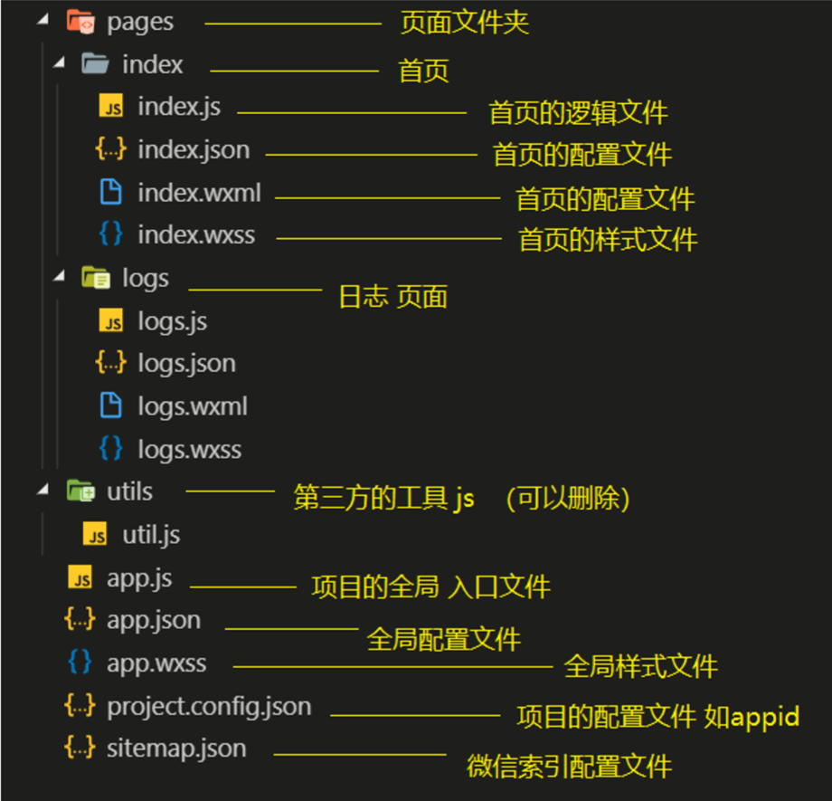

## 6. ⼩程序配置⽂件

⼀个⼩程序应⽤程序会包括最基本的两种配置⽂件。⼀种是全局的`app.json`和⻚⾯⾃⼰的`page.json`

> 注意：配置文件中不能出现注释。

==建议配置文件都在`微信开发者工具`中写，标签类的代码在`vscode`中写，因配置文件在前者才有代码提示==

### 6.1 [全局配置app.json](https://developers.weixin.qq.com/miniprogram/dev/framework/config.html)

`app.json`是当前⼩程序的全局配置，包括了⼩程序的所有⻚⾯路径、界⾯表现、⽹络超时时间、底部 tab 等。**普通快速启动**项⽬⾥边的`app.json`配置

```json
{  
  "pages":[
    "pages/index/index",
    "pages/logs/logs"  
  ],
  "window":{
    "backgroundTextStyle":"light",
    "navigationBarBackgroundColor": "#fff",
    "navigationBarTitleText": "WeChat",
    "navigationBarTextStyle":"black"
  }
}
```

字段的含义

1. `pages`字段——⽤于描述当前⼩程序所有⻚⾯路径，这是为了让微信客⼾端知道当前你的⼩程序⻚⾯定义在哪个⽬录。 

     页面默认展示`pages`下第一个路径的页面，顺序可修改。	

     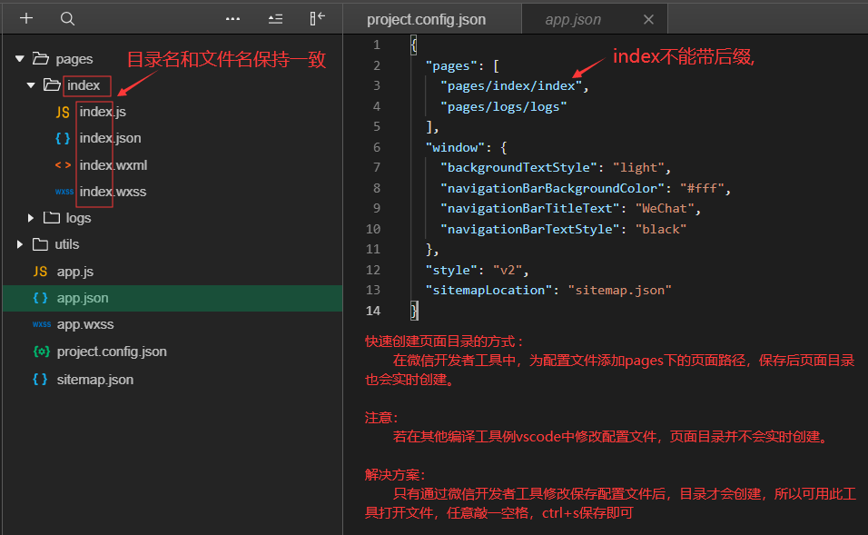

2. `window`字段——定义⼩程序所有⻚⾯的顶部背景颜⾊，⽂字颜⾊定义等。 

3. 完整的配置信息请参考[app.json](https://developers.weixin.qq.com/miniprogram/dev/reference/configuration/app.html)配置

#### 6.1.1 [tabbar](https://developers.weixin.qq.com/miniprogram/dev/reference/configuration/app.html) 

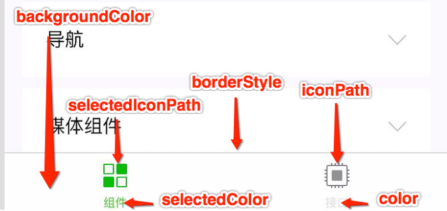

**和pages同级属性，定义导航栏**

**tabBar属性：**

​	list，

​	selectedColor（激活的文字颜色），

​	position（支持bottom默认/top，若为top则不展示图标）,

​	更多属性参考[tabbar](https://developers.weixin.qq.com/miniprogram/dev/reference/configuration/app.html) 

**list中属性：**

​	pagePath：点击图标展示对应路径页面，路径和pages下定义的相同

​	text：图标下的文字

​	iconPath：未激活展示的图标，路径和写图片路径一样

​	selectedIconPath：激活时展示的图标

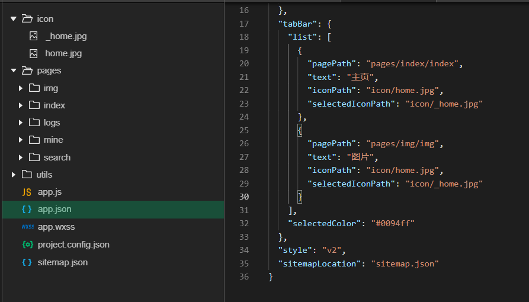

### 6.2 [⻚⾯配置page.json](https://developers.weixin.qq.com/miniprogram/dev/reference/configuration/page.html)更多参数看文档

这⾥的` page.json`是⻚⾯⽬录下的`page.json`，是和⼩程序⻚⾯相关的配置。

作用：单独定义某个页面的属性，如顶部颜⾊、是否允许下拉刷新等等。

⻚⾯的配置只能设置`app.json`中部分`window`配置项的内容，⻚⾯中配置项会覆盖`app.json`的`window`中相同的配置项，其他页面不受影响仅指定页面生效。

注意：**下拉刷新**和**触底加载下一页**的功能**都是生命周期钩子函数**

**有配置全局的下拉刷新,但是推荐使用对应页面的下拉刷新, 哪个页面需要刷新, 就在对应页面进行配置**

**使用**

> widow下的属性直接写在单个页面配置文件内，在这里是第一属性，作用单独为某个页面进行配置。

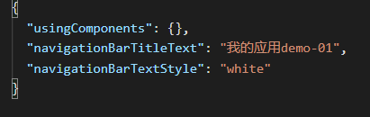

### 6.3 [sitemap 配置-了解即可](https://developers.weixin.qq.com/miniprogram/dev/reference/configuration/sitemap.html)

⼩程序根⽬录下的`sitemap.json`⽂件⽤于配置⼩程序及其⻚⾯是否允许被微信索引。

作用：让别人可以搜索到页面，详情查阅文档

## 7. 标签补充

text：类似span标签，行内元素，不会换行。

view：类似div标签，块集元素，会换行。

checkbox：类似复选框，checked值用`{{}}`表变量,`checked='false'`表示字符串即为`true`

block：占位符，不会渲染为dom元素

```html
<text> ----1</text>

<view>333</view>

<checkbox checked="{{true}}" />

<block></block>
```

## 7. 模板语法

WXML（WeiXin Markup Language）是框架设计的⼀套标签语⾔，结合[基础组件](https://developers.weixin.qq.com/miniprogram/dev/component/)、[事件系统](https://developers.weixin.qq.com/miniprogram/dev/framework/view/wxml/event.html)，可以构建出⻚⾯的结构。

### 7.1 数据绑定

#### 7.1.1 普通写法 

```html
<view> {{ message }} </view>
```

```js
Page({
  data: {
    message: 'Hello MINA!'
  }
})
```

#### 7.1.2 组件属性

**属性使用变量：**

​	在vue中，用v-bind，例  `:属性="msg"`

​	在react中，用{ }，例  `属性={msg}`

​	在微信小程序中，用“{{  }}”，例  `属性="{{ msg }"`，注意{{ }}必须写单引号或双引号内

==注意：自定义属性，有些属性名不生效，解决方案未知，怀疑自定义属性必须`data-`开头。==

属性使用变量，属性=“{{变量}}”，一定要用单引号或者双引号包裹

```js
<view id="item-{{id}}"> </view>
```

```js
Page({
  data: {
    id: 0
  }
})
```

#### 7.1.3 bool类型 

不要直接写 checked="false"，其计算结果是⼀个字符串

正确写法：

```js
<checkbox checked="{{false}}"> </checkbox>
```

### 7.2 运算 

==`{{ }}`内可以当变量使用，还可写`表达式`，但不可写`语句`，否则会报错。==

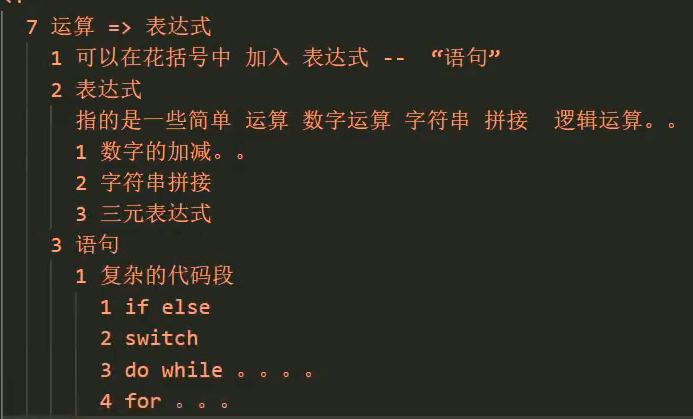

#### 7.2.1 三元运算

```js
<view hidden="{{flag ? true : false}}"> Hidden </view>
```

#### 7.2.2 算数运算 

```js
<view> {{a + b}} + {{c}} + d </view>
```

```js
Page({
  data: {
    a: 1,
    b: 2,
    c: 3  
  }
})
```

#### 7.2.3 逻辑判断 

```js
<view wx:if="{{length > 5}}"> </view>
```

#### 7.2.4 字符串运算

```js
<view>{{"hello" + name}}</view>
```

```js
Page({
  data:{
    name: 'MINA'
  }
})
```

#### ==7.2.5 注意==

花括号和引号之间如果有空格，将最终被解析成为字符串。

错误示范：

```html
<checkbox checked=" {{false}}" />
```


### 7.3 列表渲染 

#### 7.3.1 wx:for 循环数组、对象

==**代码：**==

​	循环数组

```jsx
<view>
  <view wx:for="{{list}}" wx:for-item="item" wx:for-index="index" wx:key="id">
  索引：{{index}}--值：{{item.name}}
  </view>
</view>
```

```js
Page({
  data: {
    list: [{id:0,name: 'foo',}, {id:1,name: 'bar'}]
  }
})
```

​	循环对象

```html
<view wx:for="{{obj}}" wx:for-item="value" wx:for-index="key" wx:key="name">
  {{value}}------{{key}}
</view>
```

```
obj:{name:'张三',age:18,sex:'男'}
```

==**解释**==

**wx:for**

```
wx:for="{{数组或对象}}" 放循环的数组或对象
```

**wx:for-item		wx:for-index**

```
wx:for-item="这里写变量,表示循环的每一项"
wx:for-index="这里写变量,表示循环项的下标"

项的变量名默认为item
下标变量名默认为index
默认设置,可不写wx:for-item="item" wx:for-index="index"

注意:
	1.多层循环时写防止命名重复，引号内的item和index变量可自行命名,等号前均关键字不可改。
	2.若循环对象则将item命名为value，index命名key,语义更明确。
```

**wx:key**

> wx:key⽤来提⾼数组渲染的性能 

`wx:key`	绑定的值 有如下选择

1. `string`类型，表⽰循环数组中的对象的唯⼀属性如：

     ```js
     list:[{id:0,name:"炒饭"},{id:1,name:"炒面"}]
     
     wx:key="id"
     ```

2. 保留字`*this`，当循环单层数组时，例[1,2,3]或者['1','2','3']，则需用`*this`，`*this`表循环的每一项

     ```js
     list:[1,2,3,4,5]
      
     wx:key="*this"
     ```

注意：key值若随意乱写,不会报错,但应避免乱写.

#### 7.3.2 block

渲染⼀个包含多节点的结构块block最终不会变成真正的dom元素，block标签不会渲染

```js
<block wx:for="{{[1, 2, 3]}}" wx:key="*this" >
  <view> {{index}}: </view>
	<view> {{item}} </view>
</block>
```

### 7.4 条件渲染 

#### 7.4.1 wx:if

> 类似vue中的，通过添加或删除元素实现。

在框架中，使⽤	`wx:if="{{condition}}"`	来判断是否需要渲染该代码块：

```js
<view wx:if="{{false}}">1</view>
<view wx:elif="{{true}}">2</view>
<view wx:else>3</view>
```

#### 7.4.2 hidden 

> 类似vue中show，不同的是hidden译隐藏，hidden不写值等效于hidden='{{true}}'隐藏，false显示
>
> 通过display实现

```js
<view hidden="{{condition}}"> True </view>
```


频繁切换  ⽤  `hidden`

不常使⽤  ⽤  `wx:if`

## 8. ⼩程序事件的绑定 

⼩程序中绑定事件，通过bind关键字来实现。如`bindtap`、`bindinput`、` bindchange`等
不同的组件⽀持不同的事件，具体看组件的说明即可。不是小驼峰，全小写。

**例：**

​	`bindtap`：绑定`tap`事件，小程序中用`tap`代替`click`，点击时触发事件。

​	`bindinput`：`input`输入框值改变时触发事件。

### 8.1 绑定事件 

```html
<input bindinput="handleInput" />
```

注意：

 1. 是直接写方法名，不用`{{ }}`。

 2. 小程序中标签严格，必须闭合，否则报错。

 3. input标签默认没样式。

 4. 绑定事件时不能带参数、不能带括号、**以下为错误写法**

     ```html
     <!--会直接将'handleInput(100)'整个都解析为方法名,报错:找不到此方法--> 
     
     <input bindinput="handleInput(100)" />
     ```

### 8.2 定义处理函数

事件函数直接写，和data属性同级,无需写在其他属性内部。

接收 `e事件源对象` 为参数，很多东西可通过 `e` 获取

==若在方法内想用其他方法，通过`this.方法名`获取==

```js
Page({
  data:{},
  // 绑定的事件
  handleInput: function(e) {
    console.log(e);
    console.log("值被改变了");
  }
})
```

### 8.3 为事件传参 

1. 事件传值，通过标签⾃定义属性的⽅式

     **注意：**
     	a. 必须`data-`开头，`num`为属性名，不以`data-`开头无效。
     	b. 值获取：在函数中`e.currentTarget.dataset.num`获取 ,这里不写`data-num`直接`num`。

     ​	c. 若属性是小驼峰，也会隐式转化为全小写，例`data-itemLeft`会变成``data-itemleft`只能凭全小写的属性取参，不能用小驼峰的取参。

     ```html
     <input bindinput="handleInput" data-num="100" />
     ```

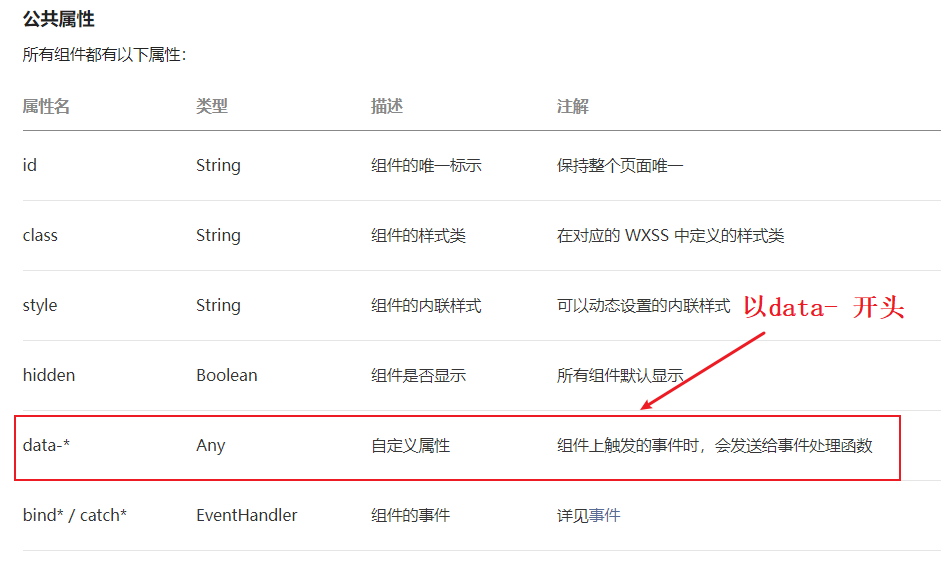

### 8.4 事件触发时获取数据

```js
 handleInput: function(e) {
    // 获取自定义属性传的值{num:100}
    console.log(e.currentTarget.dataset)
    
    // 获取输入框的值
    console.log(e.detail.value);
  }
```

### 8.4 获取、更改data值

**获取：**

```js
//在方法内获取data值

this.data.数据名
```

**赋值：**

```js
// 给data上数据赋值方式和vue不同
// 需通过此方式赋值,类似react中的this.setState({})

this.setData({
  num:1
})
```

 ==注意 遍历数组时修改循环项item,则data中的源数据也会被修改,但是页面并不会更新,所以需setData==

## 9. 样式 WXSS 

WXSS( `WeiXin Style Sheets` )是⼀套样式语⾔，⽤于描述`WXML`的组件样式。
与**CSS**相⽐，**WXSS**扩展的特性有：

响应式⻓度单位`rpx`样式导⼊

### 9.0 注意事项

1. 无需自己引入样式，小程序会自行帮忙寻找所在文件夹的同名文件`wcss`并引入，所以目录下文件命名一致

2. `pages`内的样式文件，模块化，仅对指定页面有效。

3. `@import`引入的样式文件，模块化，仅对指定页面有效，不污染全局。注意，若引入`app.wxss`则全局生效

4. `app.wxss`是全局样式文件，对所有页面都有效。

     ==总结：==

     ​	==`app.wxss`是全局样式文件，其他都局部有效。==

     ​	==可自己建目录`styles`里面分功能放公共样式，若直接引入页面则仅对页面有效，若想全局生效可引入`app.wxss`==

     

### 9.1 尺⼨单位 

`rpx` （responsive pixel）: 可以根据屏幕宽度进⾏⾃适应。规定屏幕宽px等于`750rpx` 。如在 `iPhone6 `上，屏幕宽度为`375px` ，共有750个物理像素，则 `750rpx = 375px = 750物理像素 `， `1rpx = 0.5px = 1物理像素`。

| 设备         | rpx换算px (屏幕宽度/750) | px换算rpx (750/屏幕宽度) |
| ------------ | ------------------------ | ------------------------ |
| iPhone5      | 1rpx = 0.42px            | 1px = 2.34rpx            |
| iPhone6      | 1rpx=0.5px               | 1px=2rpx                 |
| iPhone6 Plus | 1rpx = 0.552px           | 1px = 1.81rpx            |

 **建议**：  开发微信⼩程序时设计师可以⽤  iPhone6  作为视觉稿的标准。
使⽤步骤：

1.  确定设计稿宽度  pageWidth
2.  计算⽐例   `750rpx = pageWidth px` (规定屏幕宽始终等于`750rpx`由此可得出比例关系)  ,因此   ` 1px=750rpx/pageWidth `。 
3.  在less⽂件中，只要把设计稿中的   `px`   =>   `750/pageWidth rpx`   即可。

```
css和wxss都支持calc属性

注意:
	1.若750rpx,则数字和rpx中间不能有空格。
	2.运算符两边必须有空格。
```

==wxss中也支持vw,偶尔可用==

### 9.2 样式导⼊    

wxss中⽀持样式导⼊功能。使⽤`@import` 语句导⼊外联样式表，只⽀持**相对路径**就 `../` 这类的。

`@import`引入的样式文件，模块化，仅对指定页面有效，不污染全局。

⽰例代码：

```less
/** 结束一定要加 ; 分号 **/
@import "../../common.wxss";		
```

### 9.3 选择器 

特别需要注意的是 ⼩程序 不⽀持通配符` * `因此以下代码⽆效！

```less
*{
  margin:0;
  padding:0;
  box-sizing:border-box;
}
```

解决方案:

只有手写标签,  注意小程序中标签和web页面不同,  最外层根标签是page

```css
page,view,text,swiper,swiper-item,image,navigator{
  padding: 0;
  margin: 0;
  box-sizing: border-box;
}
```

⽬前⽀持的选择器有：

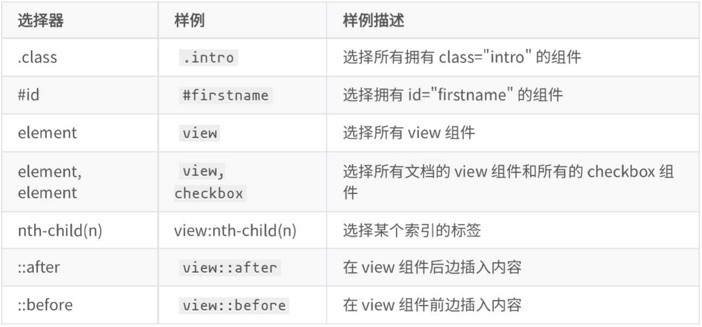

### 9.4 ⼩程序中使⽤less 

原⽣⼩程序不⽀持`less` ，其他基于⼩程序的框架⼤体都⽀持，如`wepy `， `mpvue `， `taro `等。 但是仅仅因为⼀个less功能，⽽去引⼊⼀个框架，肯定是不可取的。因此可以⽤以下⽅式来实现。

1. 编辑器是`vscode `

2. 安装插件 `easy less`

     

3. 在vs code的设置中加⼊如下，配置

     ```json
       "less.compile": {
         "outExt":".wxss"
       }
     ```

4. 在要编写样式的地⽅，新建`less` ⽂件，如`index.less` ,然后正常编辑即可。

     配置后会在当前目录下创建一份`.wxss`后缀的样式文件。

     

     **拓展内容：**

     此插件也可将`less`转为`css`，所以要转哪个时就配置哪个,注释另一个。

     ```json
     //转为css的配置,插件默认转css,此设置是将转后的css文件放到当前目录  
     "less.compile": {
          "out":".\\"
       },
     ```

### 9.5 注释

**less注释**

​	在less文件写注释：转换时，//注释不会被编译 /**/才会被编译

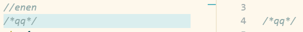

**wxss注释**

​		1. 单独在wxss写注释，`//`不支持，编译器爆红，注释不了

​		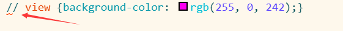

​		2. 支持`/*    */`写法

```less
/*view {background-color: rgb(255, 0, 242);}  */ 
```


**综上：不管写`less`还是`wxss`都写多行注释，防止出错，养成好习惯。**

## 10. [常⻅组件](https://developers.weixin.qq.com/miniprogram/dev/component/)

重点讲解⼩程序中常⽤的布局组件

`view,text,rich-text,button,image,navigator,icon,swiper,radio,checkbox。 ` 等

### 10.1 [view](https://developers.weixin.qq.com/miniprogram/dev/component/view.html) 

代替 原来的`div `标签

```html
<view hover-class="h-class">
   点击我试试
</view>
```

### 10.2 [text](https://developers.weixin.qq.com/miniprogram/dev/component/text.html)   

1. ⽂本标签
2. 只能嵌套text
3. ⻓按⽂字可以复制（只有该标签有这个功能） 
4. 可以对空格  回⻋  进⾏编码

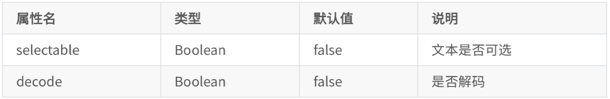

#### 10.2.1 代码 

```html
<text selectable="{{false}}" decode="{{false}}">
   普&nbsp;通  
</text>
```

### 10.3 [image](https://developers.weixin.qq.com/miniprogram/dev/component/image.html) 

> 微信规定项目打包上线不超过2M，所以建议静态资源都放到外网或服务器，通过网络请求获取，外网例[图床](https://images.ac.cn/)，图床使用步骤附后面。

1. 图⽚标签，image组件默认宽度320px、⾼度240px
2. ⽀持懒加载

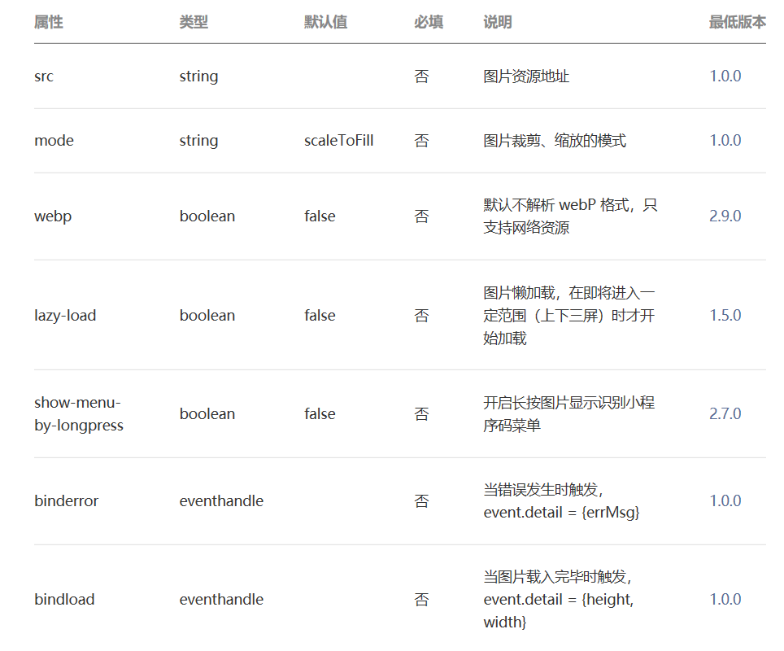

**注意：**

**`aspectfit`：类似`container`，居中**

**`aspectfill`：类似`cover`，居中**

**小程序会自动判断图片的哪边长哪边短，不是固定指宽高，所以`aspectfit`长边完全显示即`container`，另一个则`cover`**

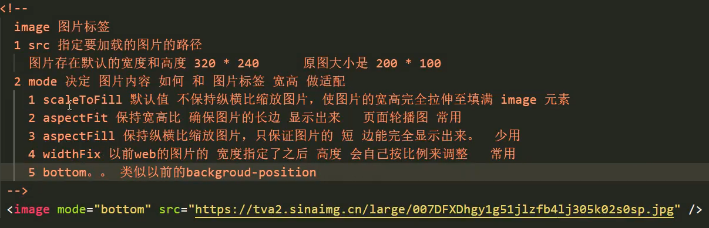

mode   有效值：
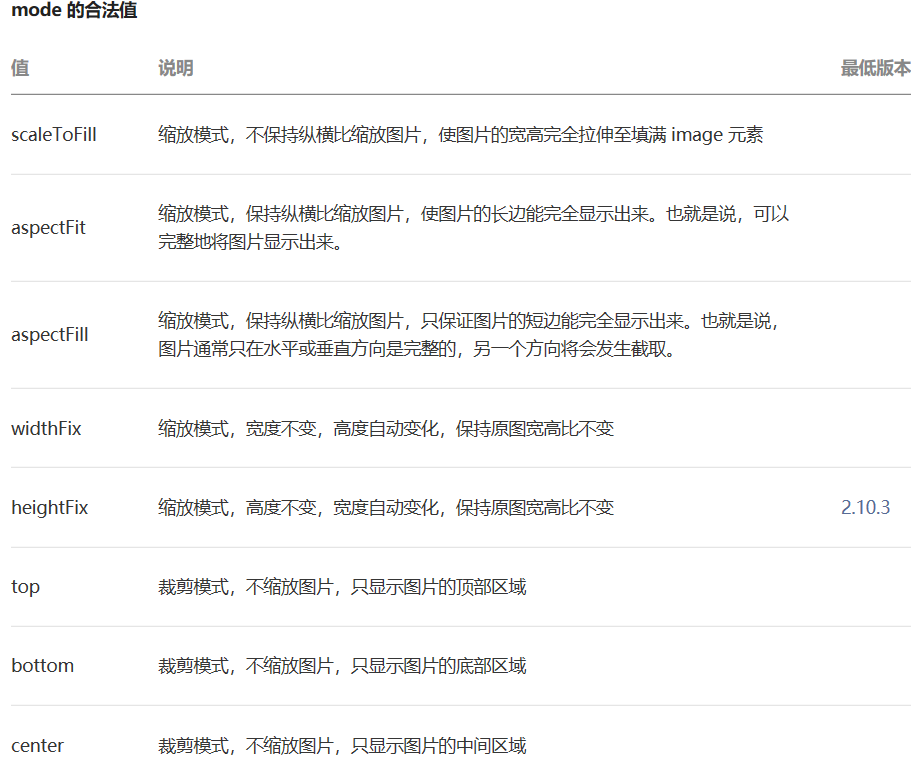

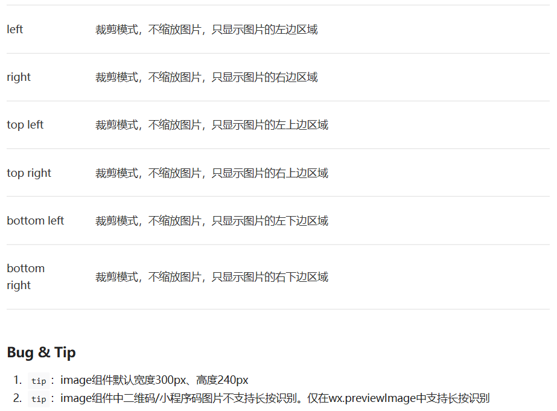

**额外拓展**

**图床使用步骤：**

> 因微信小程序限制项目不超过2M，所以若把图片都放项目文件夹中会造成体积过大，解决方案就是通过网络请求获取资源。一种是自己的服务器请求，另一种是图床：把图片放别人的网站托管，相当于网络图片，节省自己的服务器。
>
> 这里图床仅做了解，因我们做项目肯定是从服务器获取资源，不是图床，放别人家始终不长久。

步骤:  选择图片--->上传--->复制url--->直接使用即可

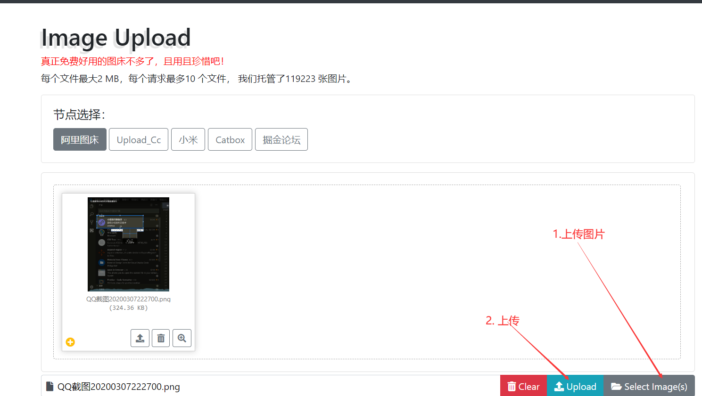

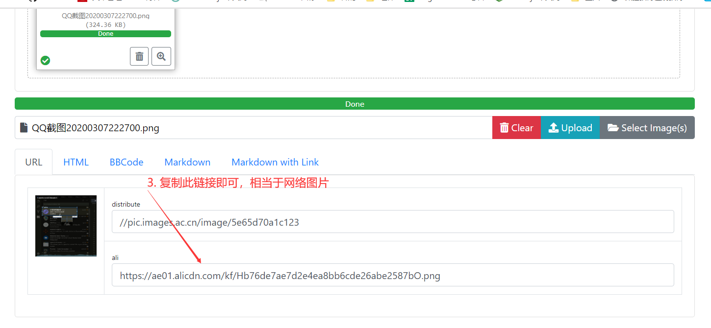

### 10.4 [swiper](https://developers.weixin.qq.com/miniprogram/dev/component/swiper.html) 

> 微信内置轮播图组件

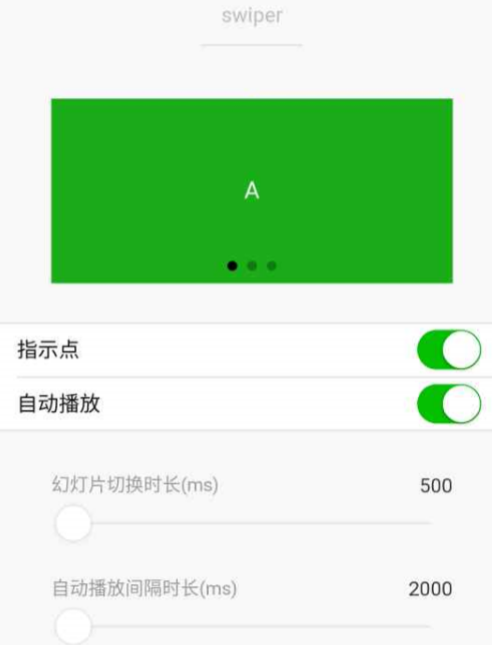

==仅部分属性，更多功能看文档：==

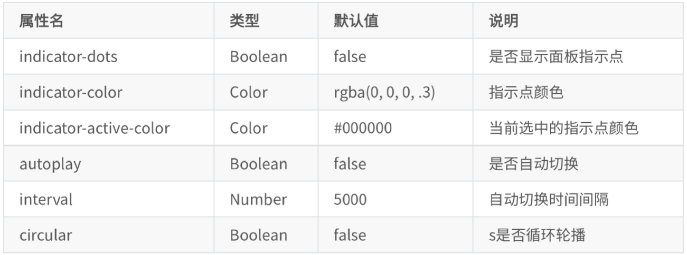

#### 10.4.1 swiper 

轮播图外层容器。

存在默认样式宽度 100% ⾼度 150px ，不会被内容撑开高度需自行设置高度

#### 10.4.2 swiper-item 

轮播图的每一项。

默认宽度和⾼度都是100%，类似`view`，里面可以放`a`链接或`image`组件等，

**注意：轮播图的`swiper `和`swiper-item `必须配套使用。**

#### 10.4.3 基本使用

**一般*autoplay* *circular*  indicator-dots 这三个会一起使用,注意若为true可不写,直接属性名即可,布尔属性,只写属性名表true**

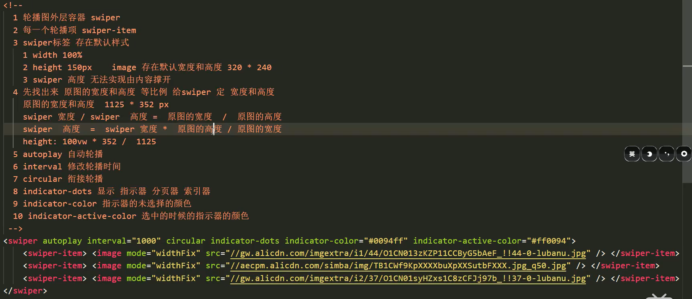

### 10.5 [navigator](https://developers.weixin.qq.com/miniprogram/dev/component/navigator.html) 导航组件

> 导航组件 类似超链接标签

**注意: 当点击链接无法跳转,且路径没写错时,检查跳的页面,小程序支持吗,因为不同open-type:设置,支持的页面不同.**

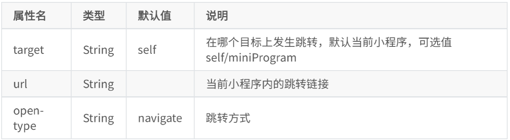

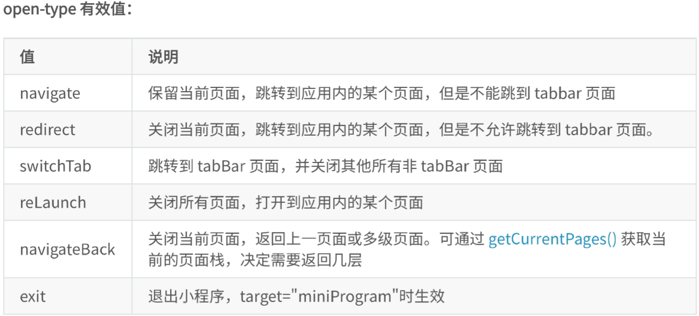

`self`：指跳转到自己小程序内的页面

`miniprogram`: 指跳转到别人小程序的页面

**open-type:**(不同类型的组件跳转 都有对应的js编程式导航跳转事件)

`navigate`：保留当前页面指头部左上角会出现后退按钮,但不能调到tabbar页面 默认值

`redirect`: 关闭当前页面不会出现返回按钮 不允许跳到`tabbar`页面

不允许跳到`tabbar`页面：指点击`tarbar`上的选项会跳转的页面,选项内指向的多个页面，这些页面不行

`switchTab`:跳转到`tabbar`页面,没有返回按钮

`reLauch`: 跳转到应用内任意页面,无返回按钮

`navigatBack`: 类似回退,返回上一页面或多级页面

`exit`: 指退出别人的小程序, 不是自己的小程序  

**代码示例**

```html
// 注意: 跳转到当前小程序的页面,所以目录从/开始,其他类似全局配置中的pages的路径设置,没有后缀
// url: 可以相对路径也可以绝对路径,/开始的就叫绝对。
<navigator url="/pages/index/index">跳转到首页</navigator>
```

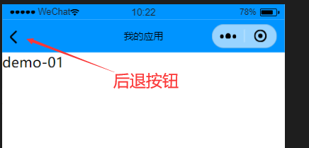


**路径传参**

```html
<!--和正常方式传参一样-->
<navigator url="/pages/index/index?cid={{5}}">跳转到首页</navigator>
```

**获取参数**

```js
//在onLoad生命周期函数中 通过option接收参数
onLoad: function (options) {
    console.log(options) //{cid: "5"}
  }
```

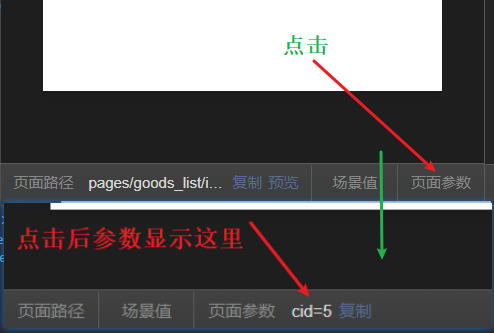

### 10.5 [wx.navigateTo](https://developers.weixin.qq.com/miniprogram/dev/api/route/wx.navigateTo.html)导航事件

保留当前页面，跳转到应用内的某个页面。但是不能跳到 tabbar 页面。使用 [wx.navigateBack](https://developers.weixin.qq.com/miniprogram/dev/api/route/wx.navigateBack.html) 可以返回到原页面。小程序中页面栈最多十层。

```js
wx.navigateTo({
      url: '/pages/pay/index',
      success: (result)=>{
        
      },
      fail: ()=>{},
      complete: ()=>{}
    });
```

**想跳转到tab页面的用其他事件, 如下**

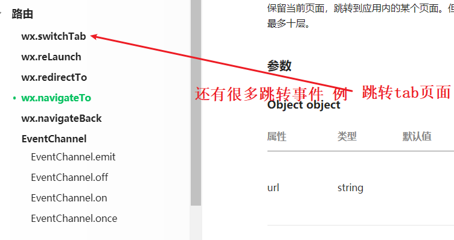

### 10.6 [rich-text](https://developers.weixin.qq.com/miniprogram/dev/component/rich-text.html) 

>  富文本标签 rich译富有

可以将字符串解析成 对应标签，类似 vue中`v-html`功能

**两种方式：**

第一种 （字符串标签）

```html
<rich-text nodes="{{html}}"></rich-text>
```

```js
Page({
  data: {
    html:"<h1>我是大大的h1</h1>"
  },
})
```

第二种（节点数组）用的少

==注意：name属性支持部分标签，并非所有都支持，具体看文档==

```html
<rich-text nodes="{{html}}"></rich-text>
```

```js
Page({
  data: {
    // 1. 数组对象
    html: [
      {
        // 2. name: 指定标签类型
        name: "h1",
        // 3. 指定标签上的属性
        attrs: {
          //注意 这里style是字符串 所以值不用再引号,里面分号隔开，背景色不用小驼峰
          style: 'color:red;background-Color:yellow',
          class: "my"
        },
        // 4. 指定子节点，要写的东西可以和上面的一样再重复次，但是文本节点特殊不一样
        children: [
          {
            name: 'p',
            attrs: {},
            children: [
              {//文本节点用type指定，text属性指定内容
                type: 'text',
                text: '我是text内容'
              }
            ]
          }
        ]
      }
    ]
  },
})
```


#### 10.6.1 nodes属性

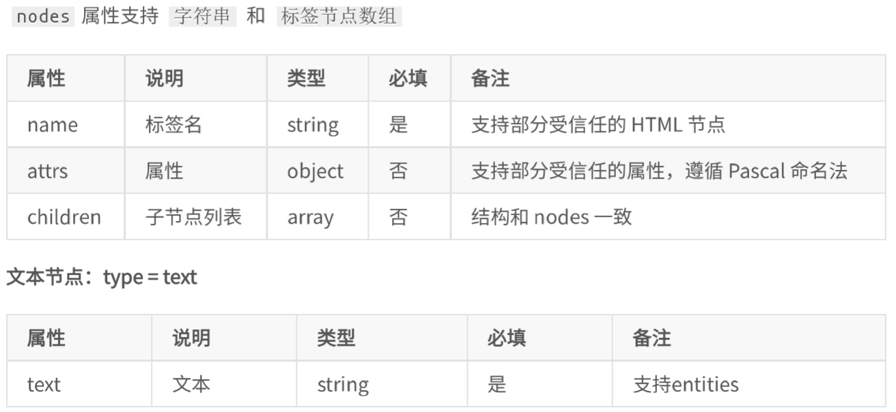


+ `nodes`不推荐使⽤ `String `类型，性能会有所下降。
+ `rich-text`组件内屏蔽所有节点的事件。
+ `attrs ` 属性不⽀持 id ，⽀持 class 。
+ `name`  属性⼤⼩写不敏感。
+ 如果使⽤了不受信任的 `HTML`  节点，该节点及其所有⼦节点将会被移除。
+ `img`  标签仅⽀持⽹络图⽚。

### 10.7 [input](https://developers.weixin.qq.com/miniprogram/dev/component/input.html)

```html
  <input placeholder="请输入您要搜索的商品内容" bindinput="handleInput"></input>
```

`bindinput`事件 输入框值改变触发此函数，可以通过`e.tedail.value`获取到输入的value值

input标签默认没样式

**后面有输入框输入值弹出搜索提示并解决防抖的方法: 见项目 --->  10标题**


还有很多组件 自行看官方文档

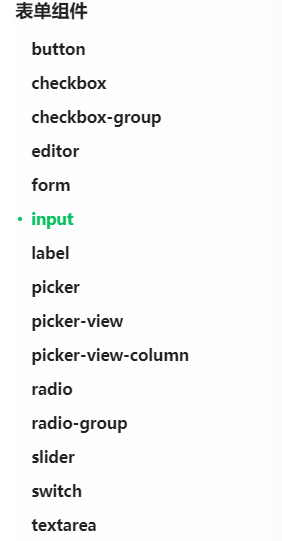

### 10.7 [button](https://developers.weixin.qq.com/miniprogram/dev/component/button.html)

button按钮指定opentype="contact"可以打开联系客服对话,但是有很多默认样式,在特定需求上我们可以用障眼法实现,即 把button设置透明,浮在其他标签上,

opentype="share"转发分享

**直接使用button时候 有默认padding 自己记得清除**

```css
button{
        position: absolute;
        top: 0;
        left: 0;
        width: 100%;
        height: 100%;
        opacity: 0;
    	padding:0;
      }
```


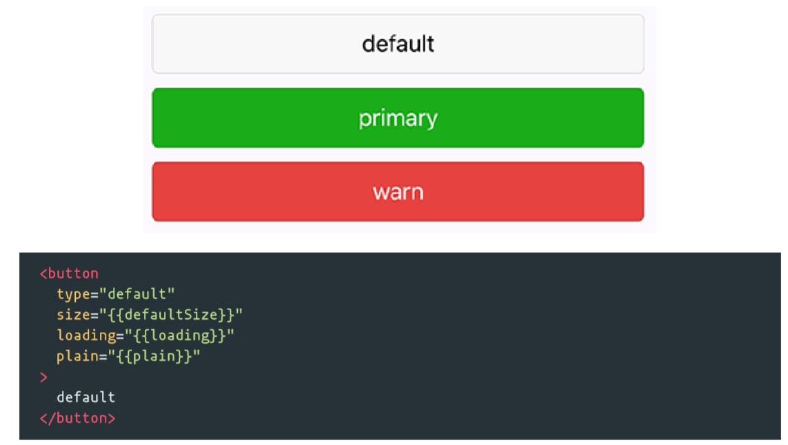

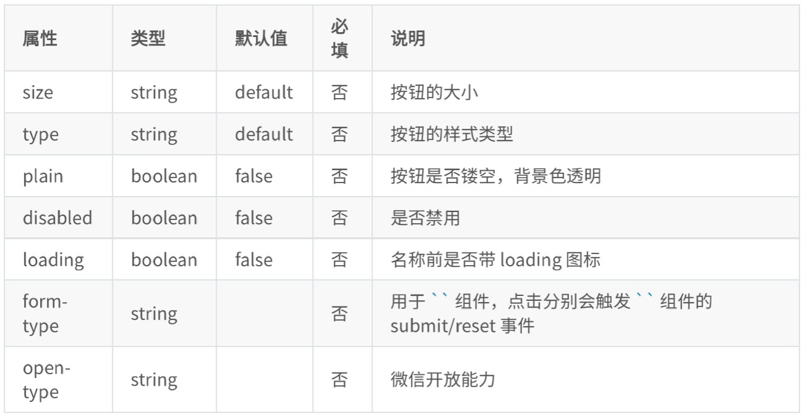

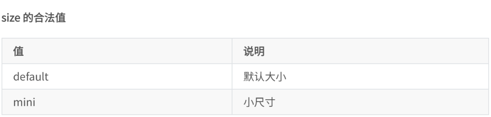

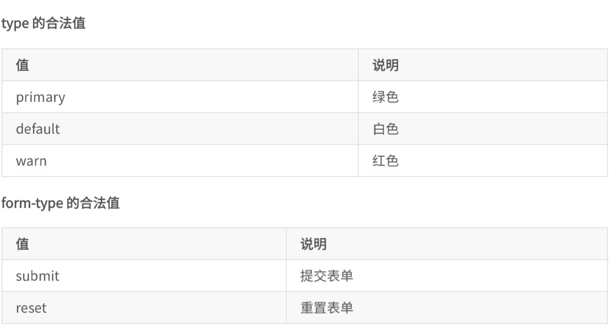


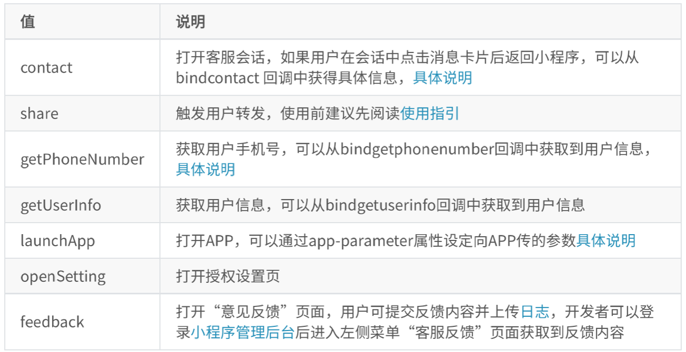

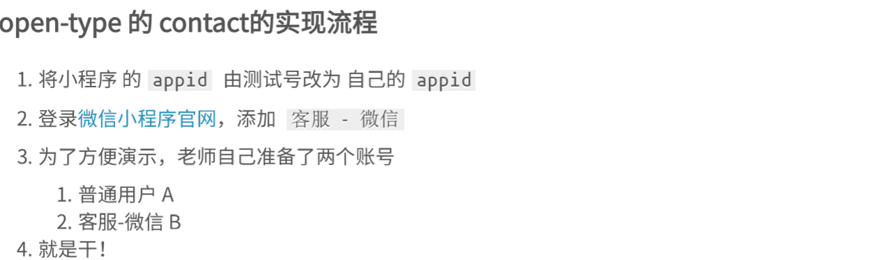

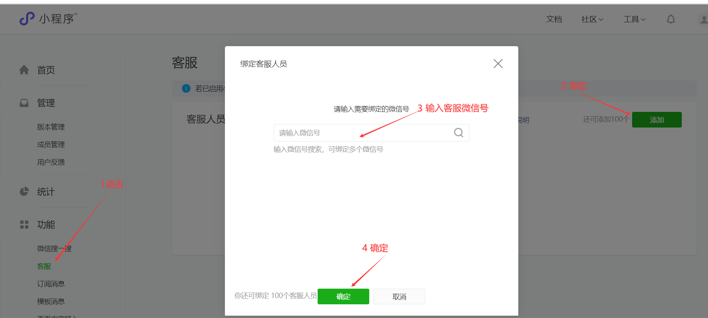

==注意： openSetting在电脑上没效果，在手机上可以==

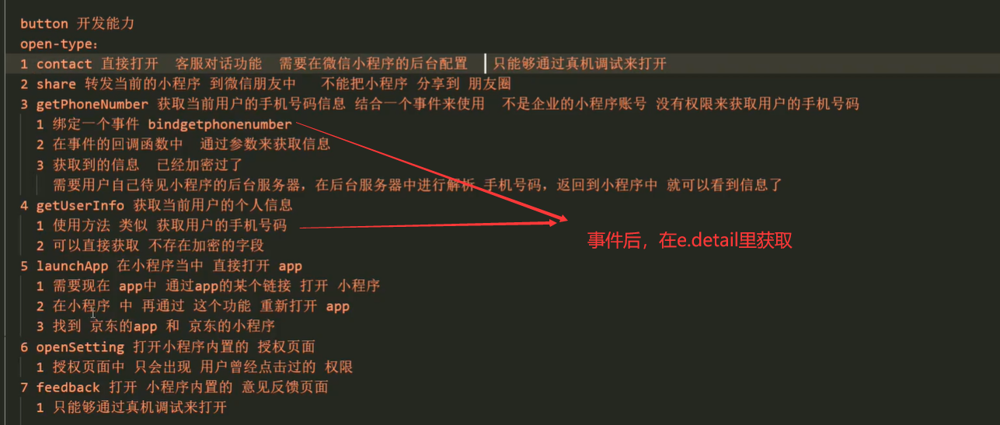

### 10.8 [icon](https://developers.weixin.qq.com/miniprogram/dev/component/icon.html) 

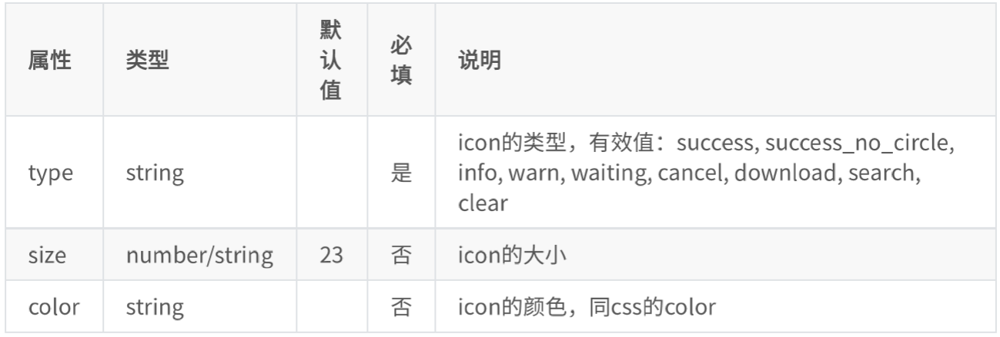

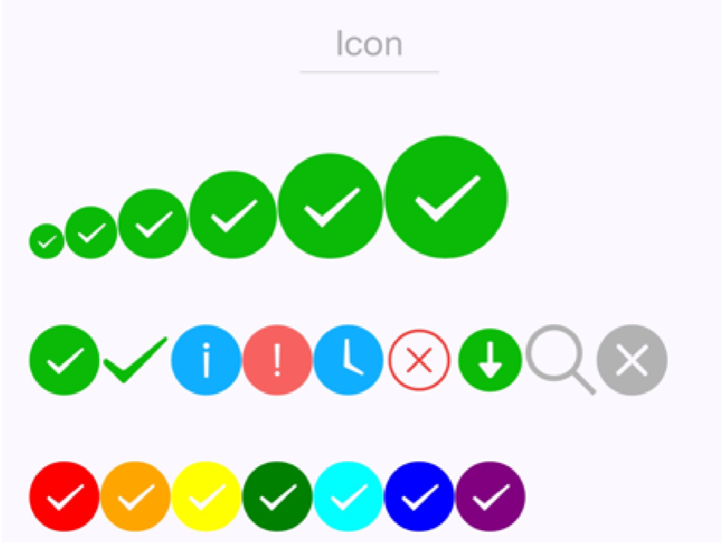

**代码：**

```html
<icon type="success" size="23" color="pink"></icon>

<icon type="success" size="23" color="#0099ff"></icon>
```


### 10.9 [radio](https://developers.weixin.qq.com/miniprogram/dev/component/radio.html) 

1. `radio`可以通过自身 `color`属性来修改选中的单选颜色

2. ==`radio`标签必须和父元素[radio-group](https://developers.weixin.qq.com/miniprogram/dev/component/radio-group.html)⼀起使⽤==

3. 需要给`radio-group`绑定`change`事件

4. `radio`的`value`是选中的单选框的值，通过`e.detail.value`获取

   ​    

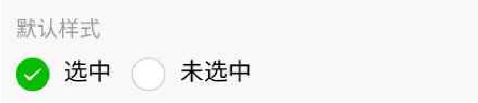

### 10.9 [checkbox](https://developers.weixin.qq.com/miniprogram/dev/component/checkbox.html) 

和单选框类似，区别就是复选框可以选多个。

单选框的value值是字符串，多选框的value是数组，数组里放字符串

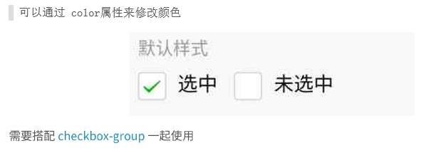

## 10. 做项目用的组件或事件效果

> 做项目可能会用到的组件，不要求掌握，但需要知道这东西，用的时候查文档

### 10.1 [scroll-view](https://developers.weixin.qq.com/miniprogram/dev/component/scroll-view.html)

#### 10.1.1 基本使用

==注意:固定高度时,设置page100%高度,不要直接设置scroll-view:100vh, 否则h5页面时,会出现滚动无效问题==

==解决方案: 设置page:100% , scroll-view:100%,==

**例如：**一个菜单固定宽度，可以左右滑动区域，或者固定高度，可以上下滚动区域

**要求**：使用竖向滚动时，需要给[scroll-view](https://developers.weixin.qq.com/miniprogram/dev/component/scroll-view.html)一个固定高度，并给组件加属性`scroll-y`.

具体属性看官方文档，简单代码示例如下：

```html
<!--根据类名固定高度，此时scroll-view相当于大的view,里面有多个小view，可以上下滑动-->   
<scroll-view class="类名" scroll-y>
  <view>大家电</view>
  <view>热门推荐</view>
  <view>海外购</view>
</scroll-view>
```

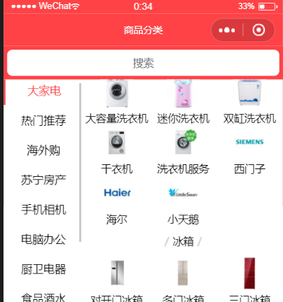

#### 10.1.2 使用的问题

> 点击左边菜单，右边会显示不同的内容，但是若右边滑动到其他位置后，再点击左边菜单，会出现，右边的滚动条在其他位置。我们想要的效果是每次点击后， 右边内容都从顶部开始。

**解决方案:**

设置属性：`scroll-top` 值为number/string   设置竖向滚动条位置

不会出现写了就固定位置、滚动不了的情况，因为当滚动时，系统内部从自动为其赋值：

```html
<!--错误写法 直接写死数据-->
<!--这里写了0，但是滚动后会为其赋值别的，所以没用-->
<scroll-view scroll-top='0'  scroll-y>
  <view>大家电</view>
</scroll-view>

<!--正确写法 写变量-->
<!--设置每次点击后为其重新设置为0 -->
<scroll-view scroll-top="{{flag}}"  bindtap='handleTap' scroll-y>
  <view>大家电</view>
</scroll-view>

handleTap(){
	this.setData({
      flag:0
    })
}
```

### 10.2 上滑触底事件 加载下一页

[**onReachBottom()**](https://developers.weixin.qq.com/miniprogram/dev/reference/api/Page.html)

这是page页面中的生命周期函数，作用：监听用户上拉触底事件的处理函数。

- 可以在`app.json`的[`window`](https://developers.weixin.qq.com/miniprogram/dev/reference/configuration/app.html#window)选项中或[页面配置](https://developers.weixin.qq.com/miniprogram/dev/reference/configuration/page.html)中设置触发距离`onReachBottomDistance`。
- 在触发距离内滑动期间，本事件只会被触发一次

基本使用(和data同级定义此函数，可进行加载下一页操作)

```js
 //此函数触底会自动触发，内部根据个人需要写业务代码
onReachBottom(){
    if(当前页面 >= 总页数){
      // 此方法是消息提示框，提示已经没有下一页数据
      wx.showToast({
        title: '已经触底了',
      });
    }else{
      //有下一页则页码++,并发起请求
      this.queryParams.pagenum++
      this.getGoodsList()
    }
  }
```

默认距底50px时触发事件，也可自行设置触发距离

```json
  //例：在app.json的window选项中
"window": {
    "onReachBottomDistance":100,
  },
```


### 10.3 下拉刷新页面

- 当处理完数据刷新后，[wx.stopPullDownRefresh](https://developers.weixin.qq.com/miniprogram/dev/api/ui/pull-down-refresh/wx.stopPullDownRefresh.html)可以停止当前页面的下拉刷新。

**步骤**:

1.需要在`app.json`的[`window`](https://developers.weixin.qq.com/miniprogram/dev/reference/configuration/app.html#window)选项中或[页面配置](https://developers.weixin.qq.com/miniprogram/dev/reference/configuration/page.html)中开启`enablePullDownRefresh`。

​	开启支持页面下拉刷新的功能

**有配置全局的下拉刷新,但是推荐使用对应页面的下拉刷新, 哪个页面需要刷新, 就在对应页面进行配置**

```json
//在页面的json文件中配置
{
  "usingComponents": {},
  "enablePullDownRefresh":true， //表示支持当前页面下拉刷新功能
  "backgroundTextStyle":"dark" //下拉 loading 的样式（加载的小圆点颜色），仅支持 dark / light
}
```

2.监听下拉刷新事件**[onPullDownRefresh()](https://developers.weixin.qq.com/miniprogram/dev/reference/configuration/page.html)**

```js
//是page页面的生命周期函数 和data同级定义
Page({
  data:{},
  onPullDownRefresh(){
    //1.将之前请求的数据清空，
    //原因：之前为实现触底加载下一页功能 数据是用concat拼接的，若不清空，数据会继续拼接，导致有问题，正常刷新只显示第一页
    this.setData({
      goodsList:[]
    })
    //2.将页码设置为初始值 否则会加载其他页码内容
    this.queryParams.pagenum = 1
    //3.发新请求 请求数据
    this.getGoodsList()
  }
})
```

3.停止刷新

当数据都回来了且已显示在页面上，可能刷新动画还在执行（动画由时间设置的），所以数据一回来我们就应该关闭动画，用[wx.stopPullDownRefresh()](https://developers.weixin.qq.com/miniprogram/dev/api/ui/pull-down-refresh/wx.stopPullDownRefresh.html)停止当前页面下拉刷新。

```js
//请求数据的函数，会根据返回结果进行一系列处理，我们就把停止刷新的事件调用写在这里面，因处理数据时就代表数据已经请求成功
  async getGoodsList() {
    //这里省略数据请求及处理的代码
    //停止下拉刷新 只写这一句就行，注意：哪怕没有开启下拉刷新，写此句也不会报错，对页面不影响
      wx.stopPullDownRefresh()
  },
```

 

扩展：可以通过[wx.startPullDownRefresh](https://developers.weixin.qq.com/miniprogram/dev/api/ui/pull-down-refresh/wx.startPullDownRefresh.html)触发下拉刷新，调用后触发下拉刷新动画，效果与用户手动下拉刷新一致。

### 10.4  消息提示框

**[wx.showToast(Object object)](https://developers.weixin.qq.com/miniprogram/dev/api/ui/interaction/wx.showToast.html)**具体参数看文档

显示消息提示框，会自动消失

```js
//简单使用和效果图如下
wx.showToast({
  title: '已经触底了',
});
```


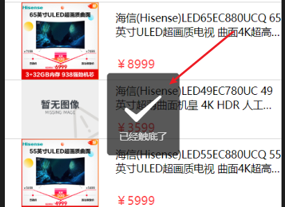

### 10.4  模态对话框(确定、取消)

**[wx.showModal(Object object)](https://developers.weixin.qq.com/miniprogram/dev/api/ui/interaction/wx.showModal.html)**

显示模态对话框

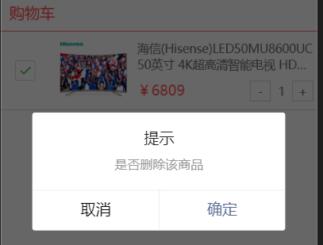

```js
wx.showModal({
  title: '提示',
  content: '这是一个模态弹窗',
  success (res) {
    if (res.confirm) {
      console.log('用户点击确定')
    } else if (res.cancel) {
      console.log('用户点击取消')
    }
  }
})
```


### 10.5 全局loading加载提示框

> loading是加载中的提示框，请求前数据还没回来显示正在加载，数据请求回来后就关闭提示框，但若每次发请求前写一次开启loading的代码，每次请求回来后又写一次关闭loading代码，代码冗余，且不利于维护，若要进行loading代码更改会特别麻烦，所以建议设置为全局的loading，不必多处写，只写一次。

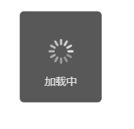

**[loading](https://developers.weixin.qq.com/miniprogram/dev/api/ui/interaction/wx.showLoading.html)**

```js
//1. 显示loading提示框
wx.showLoading({
  title: '加载中',	 //提示的文本
  mask：true				//显示透明蒙层（蒙板），防止触摸穿透，添加后用户无法进行其他操作
})

//2. 关闭loading提示框
wx.hideLoading()

//显示和关闭配合使用
```

在13.2中对发请求的代码进行了封装，每次发请求都会调用此方法所以loading的代码也写这里。

**代码解释：**

1. 在发请求前开启loading

2. 因不管请求成功或失败都需关闭loading，所以在complete函数内关闭loading

3. 若同时发多个异步请求，loading会开启三次，但是只会显示一次，所以不影响

4. 若同时发多个请求，请求结果第一次回来就会关闭loading，此时其他几个请求可能结果还没回来，所以应该请求全都回来后再关闭，解决如下：

     4.1 设置变量`let ajaxTime=0 `表示发送请求次数为0，

     4.2 每发起一次请求，次数加一：` ajaxTime++`

     4.3 请求结果每回来一次，次数减一：`ajaxTime--`

     4.4 当请求都回来完了，次数为0,再调用关闭loading

```js
//这是自定义的request目录，专门写自己封装的异步请求代码
let ajaxTime = 0
export const request = (params) => {
  ajaxTime++
  //1.开启loading
  wx.showLoading({
    title: '加载中',
    mask: true
  });
  return new Promise((resolve, reject) => {
    wx.request({
      success: (result) => {},
      fail: (error) => {},
      //此函数时不管成功还是失败都会被调用
      complete:()=>{
        ajaxTime--
        if(ajaxTime==0){
          //2.关闭loading
          wx.hideLoading();
        }
      }
    });
  })
}
```

### 10.6 图片放大预览效果

**[wx.previewImage(Object object)](https://developers.weixin.qq.com/miniprogram/dev/api/media/image/wx.previewImage.html)**

点击图片,放大预览图片。预览的过程中用户可以进行保存图片、发送给朋友等操作。

```js
wx.previewImage({
  current: '', // 当前显示图片的http链接
  urls: [], // 需要预览的图片http链接列表 所有的图片路径组成的列表,以便于左右滑动显示其他图
  loop:true,//是否循环预览
  indicator:"default" //图片指示器样式，可取值："default" - 底部圆点指示器； "number" - 顶部数字指示器； "none" - 不显示指示器。
})
```

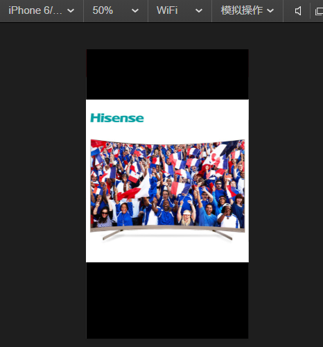

**案例:**

> 拿轮播图为例,实现点击轮播图,进行图片放大预览.

```html
<!--  1.给每个swiper-item标签添加点击事件 并 传入当前项的图片路径 -->
<swiper-item bindtap="handlePreviewImage" data-src="{{image.src}}">
  <image></image>
</swiper-item>
```

```js
//2.点击触发事件,在事件内部调用
  handlePreviewImage(e){
    //2.1存放要预览的图片链接列表 自己习惯src 而事件属性是url 不用管 都是一个意思
    const urls = this.data.imageList.map(v=>v.src)
    //2.2取当前点击项的图片路径
    const current = e.currentTarget.dataset.src
    //2.3调用方法
    wx.previewImage({
      current, 
      urls 
    })
  }
```

### 10.7 点击联系客服或分享转发

button按钮指定opentype="contact"可以打开联系客服对话,但是有很多默认样式,在特定需求上我们可以用障眼法实现来避免默认样式造成的麻烦,即 把button设置透明,浮在其他标签上,

opentype="share"转发分享

```css
button{
        position: absolute;
        top: 0;
        left: 0;
        width: 100%;
        height: 100%;
        opacity: 0;
      }
```

### 10.8 获取用户地址、获取权限、设置权限

**==注意:==**

​		有使用==**设置权限**==这类功能的,设置时会跳转到微信内置的设置功能,相当于后台,从后台跳回前台, 函数onload并不会再执行, ==**onload**==指页面加载时执行, 只会执行一次 ,那么页面并不会重新渲染,即信息得不到及时更新显示

==**综上:**==

​		有进行设置, ==**跳转后台**==的,或者像==**购物车**==这类频繁打开和隐藏的页面,或者用户交互多的页面,别用onload,请使用==**onshow**==生命函数, 此函数是当从后台切回前台或页面显示都会执行的函数,作用每次打开和隐藏都进行一个初始化,会执行多次

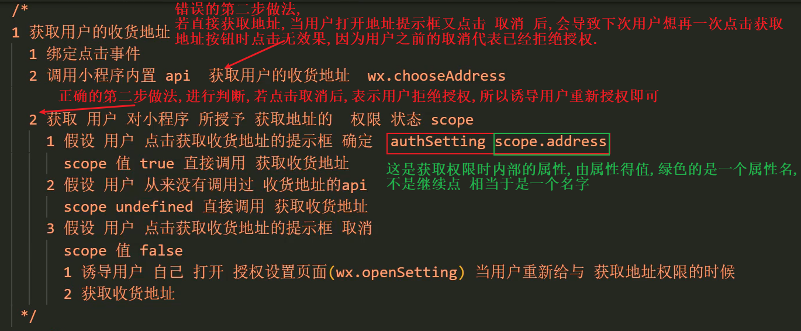

#### 10.8.1 API

**[wx.chooseAddress(Object object)](https://developers.weixin.qq.com/miniprogram/dev/api/open-api/address/wx.chooseAddress.html)获取地址**

获取用户收货地址。调起用户编辑收货地址原生界面，并在编辑完成后返回用户选择的地址。

> 任何小程序执行获取地址代码 都会显示出此页面 这是微信内置的界面，所以收货地址-信息也是可以各个小程序共用的,地址需要用户提前在微信个人信息中进行编辑的,我们直接获取即可

```js
wx.chooseAddress({
      success: (result)=>{
        console.log(result)//打印出地址信息
      }
    });
```

**[wx.getSetting(Object object)](https://developers.weixin.qq.com/miniprogram/dev/api/open-api/setting/wx.getSetting.html)获取权限**

权限结果有三种情况,见10.8中图,即上图,

点击确定后--->状态true   点击取消后--->状态false  从未点击任何--->状态属性没有,则结果undefined

```
wx.getSetting({
  success (res) {
    console.log(res.authSetting['scope.address'])
  }
})
```

`console.log(res)`结果:

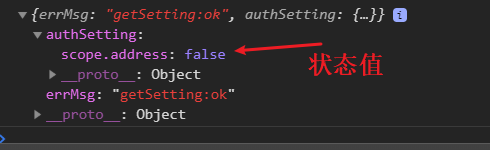

[**wx.openSetting(Object object)**](https://developers.weixin.qq.com/miniprogram/dev/api/open-api/setting/wx.openSetting.html)授权设置

```js
wx.openSetting({
  success (res) {
    //给予授权后执行的操作写这里面,例调用获取地址函数
  }
})
```

#### 10.8.2**代码**(这是最浅显的代码，后面有进行优化的代码,用优化后的代码)

```js
  handleChooseAddress(){
    wx.getSetting({
      success: (result1)=>{
        //1.获取权限状态 发现属性名怪异时 用[]形式获取属性值
        const scopeAddress = result1.authSetting['scope.address']
        //2.若为true或undefined 直接获取地址
        if(scopeAddress===true||scopeAddress===undefined){
          wx.chooseAddress({
            success: (result2)=>{
              console.log(result2)
            }
          })
        }else{
          //3.用户以前拒绝过授予权限,先诱导用户打开授权页面
          wx.openSetting({
            success: (result3)=>{
              //4.调用获取地址代码
              wx.chooseAddress({
                success: (result4)=>{
                  console.log(result4)
                }
              })
            }
          });
        }
      }
    });
  }
```

#### 10.8.3 代码优化

**第一次优化**

>//新建工具utils目录，内有文件asyncWx.js，里面写工具函数
>//以下代码可直接复制

```js
/* promise形式的 getSetting*/
export const getStting = () =>{
  return new Promise((resolve,reject)=>{
    wx.getSetting({
      success: (result)=>{
        resolve(result)
      },
      fail: (err)=>{
        reject(err)
      }
    });
  })
}
/* promise形式的 openSetting*/
export const openSetting = () =>{
  return new Promise((resolve,reject)=>{
    wx.openSetting({
      success: (result)=>{
        resolve(result)
      },
      fail: (err)=>{
        reject(err)
      }
    });
  })
}
/* promise形式的 chooseAddress*/
export const chooseAddress = () =>{
  return new Promise((resolve,reject)=>{
    wx.chooseAddress({
      success: (result)=>{
        resolve(result)
      },
      fail: (err)=>{
        reject(err)
      }
    })
  })
}
```

> 使用

```js
//引入
import { getStting, openSetting, chooseAddress } from '../../utils/asyncWx.js'
//使用
async handleChooseAddress() {
  //1. 获取 权限状态
    const res1 = await getStting()
    const scopeAddress = res1.authSetting['scope.address']
    //2. 判断 权限状态
    if (scopeAddress === true || scopeAddress === undefined) {
      // 3. 调用获取收货地址的 api
      const res2 = await chooseAddress()
      console.log(res2)
    } else {
      //3. 诱导用户打开授权页面
      await openSetting()
      //4. 调用获取收获地址的api
      const res3 = await chooseAddress()
      console.log(res3)
    }
}
```

**第二次优化**

> 在if判断中，两种情况都调用了获取地址API，所以将其写在一起
>
> (此处省略工具函数定义和引入的  代码 和前面一样)

```js
  async handleChooseAddress() {
    //1. 获取 权限状态
    const res1 = await getStting()
    const scopeAddress = res1.authSetting['scope.address']
    //2. 判断 权限状态
    if (scopeAddress === false) {
      //3. 诱导用户打开授权页面
      await openSetting()
    }
    //4.此时状态必然支持获取地址 所以直接写
    const res2 = await chooseAddress()
    console.log(res2)
  }
```

**第三次优化** 解决报错和储存地址信息

+ 当用户点击取消后,虽然功能会正常使用,但是控制台会报错,因为我们没有处理reject错误,这里用try catch错误捕获

     把上面正常代码放try里面就行,然后catch时根据需求操作,这里进行打印.

     这样就不会报错

+ 把地址存到缓存中以便当前页面和其他页面使用

```js
  async handleChooseAddress() {
    try {
      //1. 获取 权限状态
      const res1 = await getStting()
      const scopeAddress = res1.authSetting['scope.address']
      //2. 判断 权限状态
      if (scopeAddress === false) {
        //3. 诱导用户打开授权页面
        await openSetting()
      }
      //4.此时状态必然支持获取地址 所以直接写
      const address = await chooseAddress()
      //4.1把省市区组成详细地址,使用时直接用,不用拼接
address.all= address.provinceName+address.cityName+address.countyName+address.detailInfo
      //5.存储地址
      wx.setStorageSync("address", address);
    } catch (error) {
      console.log(error)
    }
  }
```


#### **10.8.4 效果图**

+ 点击确定的效果


+ 点击取消的效果（bug效果 和 正确效果  两种）

     + 若不按正确代码写会出现的bug

          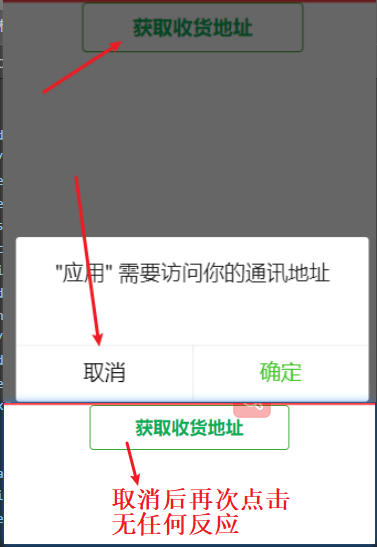

     - 正确效果(按上面要求写代码后 会出现授权页 这才是正确效果)

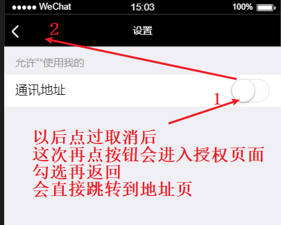

### 10.9 [wx.navigateTo](https://developers.weixin.qq.com/miniprogram/dev/api/route/wx.navigateTo.html)页面跳转

保留当前页面，跳转到应用内的某个页面。但是不能跳到 tabbar 页面。使用 [wx.navigateBack](https://developers.weixin.qq.com/miniprogram/dev/api/route/wx.navigateBack.html) 可以返回到原页面。小程序中页面栈最多十层。

```js
wx.navigateTo({
      url: '/pages/pay/index',
      success: (result)=>{
        
      },
      fail: ()=>{},
      complete: ()=>{}
    });
```

### 10.10选择本地相册图片wx.chooseImage

[wx.chooseImage(Object object)](https://developers.weixin.qq.com/miniprogram/dev/api/media/image/wx.chooseImage.html), 更多参数看文档

**从本地相册选择图片或使用相机拍照。**

用于上传图片功能时需要用此API选择图片

```js
  //  一般这几个都是必填项 如下面缩写 注意保存时记得用数组拼接,而非直接赋值,担心客户点两次选择图片导致后面图片数组覆盖了前面的内容
//图片格式和来源 写得多 就代表支持的方式就多 例如写了相册和相机 就两个都支持 只写一个就只支持一个
wx.chooseImage({
      //最多可以选择的图片张数
      count: 9,
      //图片格式    原图        压缩
      sizeType: ['original', 'compressed'],
      //图片来源     相册       相机
      sourceType: ['album', 'camera'],
      //成功的回调
      success (res) {
        // tempFilePath可以作为img标签的src属性显示图片
        //成功则返回图片的本地文件路径列表 tempFilePaths
        const tempFilePaths = res.tempFilePaths
      }
    })
```

**这是==uni==文档的图,仅供参考,帮助了解,具体的还是看微信小程序官方文档,避免信息错误:**

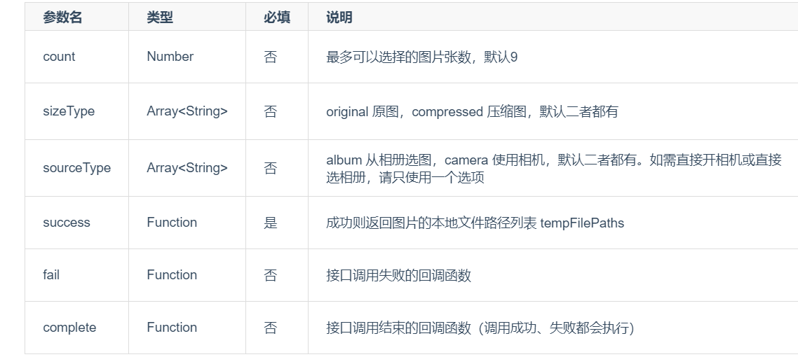

### 10.11提交上传图片[wx.uploadFile(Object object)](https://developers.weixin.qq.com/miniprogram/dev/api/network/upload/wx.uploadFile.html)

**这里会用到微信内置API： wx.uploadFile  案例的第3点用得到，此事件提交的参数filePath路径实际就是wx.chooseImage事件返回的路径即res.tempFilePaths**

将本地资源上传到服务器。客户端发起一个 HTTPS POST 请求，其中 `content-type` 为 `multipart/form-data`。

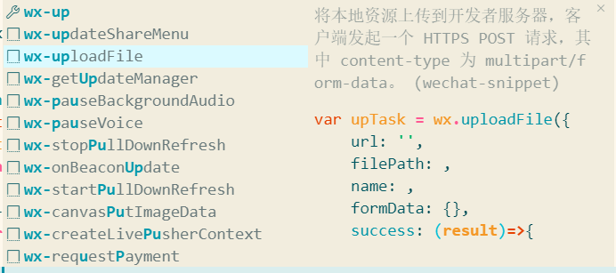

```js
var upTask = wx.uploadFile({
      url: '',
      filePath: ,
      name: ,
      formData: {},
      success: (result)=>{
        
      },
      fail: ()=>{},
      complete: ()=>{}
    })
```

**（意见反馈案例）**


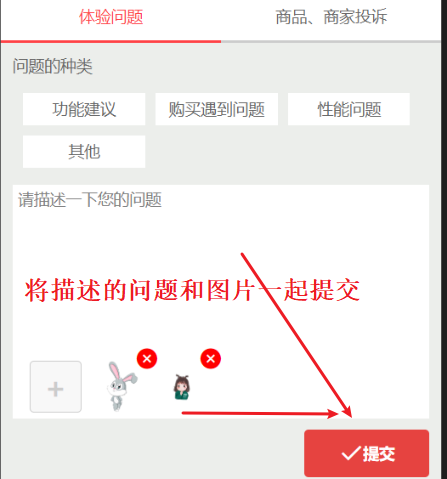

// 这里第4点没接口 所以只是暂时模拟

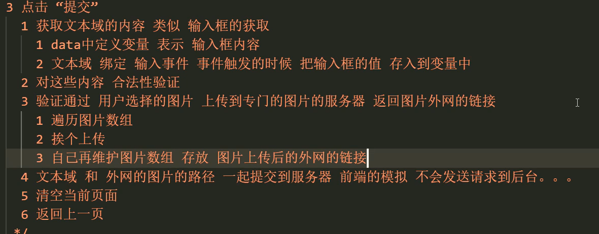

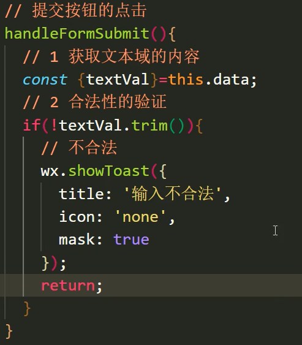

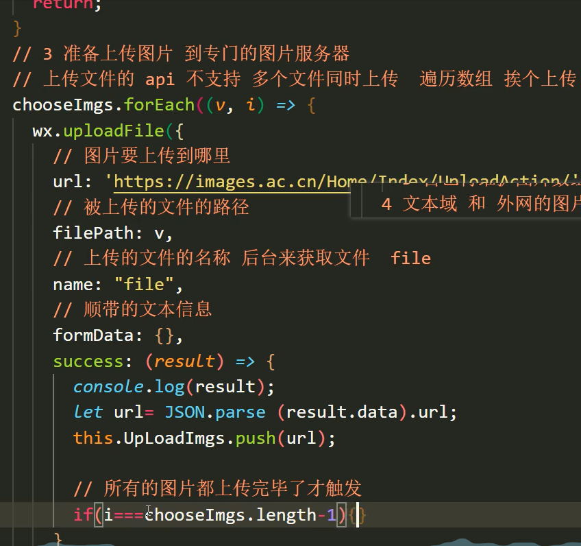

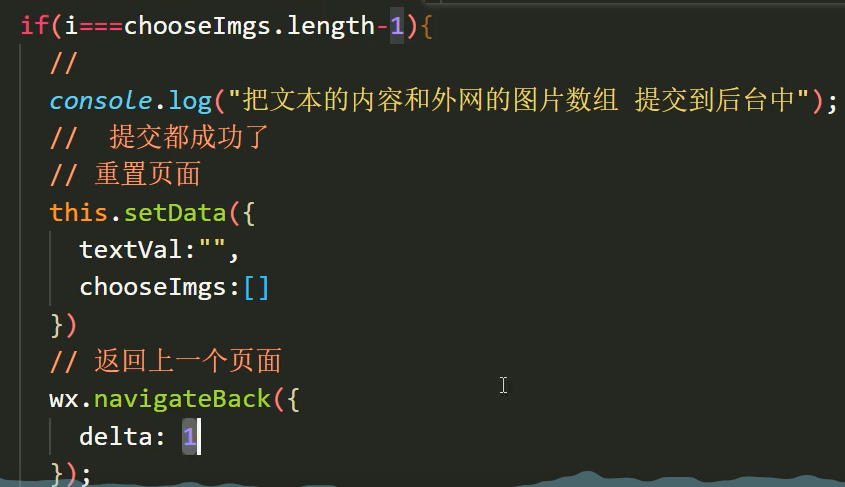

#### 补充： 

判断若有图片就按上面流程走，若没有就单独提交文本，所以进行判断，并将代码写在对应判断内

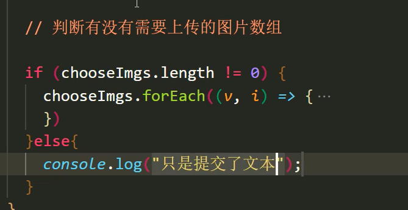

### [10.12 地图组件map](https://uniapp.dcloud.io/component/map)

```html
		<!-- longitude经度、latitude纬度 -->
		<!-- 地图通过经度和纬度确定当前坐标,因为我们这里不涉及获取当前位置,所以经度纬度写死数据 -->
		<!-- scale地图缩放级别 -->
		<!-- markers设置标记点 这是一个数组 数组里是对象-->
		<!-- <map> 组件的宽/高推荐写直接量，比如：750rpx，不要设置百分比值。 -->
		<map class="map" :longitude="longitude" :latitude="latitude" :scale="scale" :markers="covers"></map>
```

```js
		data() {
			return {
				longitude: 106.53826,
				latitude: 29.580773,
				scale: 14,
				covers: [
					//根据经度和纬度设置标记点 最好与当前位置数据一致
					//iconPath：是标记点图片路径
					//width,height:设置标记点图片大小 数字number 单位未知
					{
						longitude: 106.53826,
						latitude: 29.580773,
						iconPath: '/static/marke.jpg',
						width: 30,
						height: 30
					}
				]
			};
		}
```

效果如图：

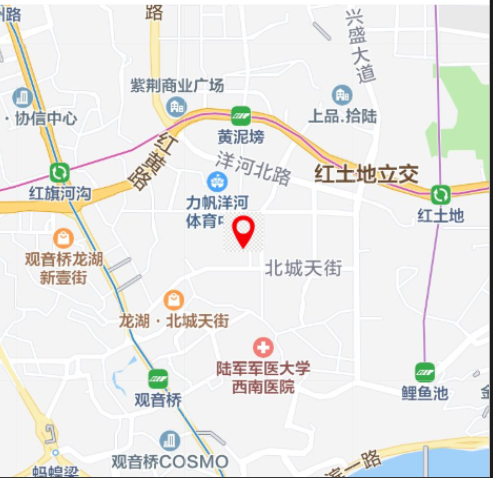

写死数据的坐标获取方法：

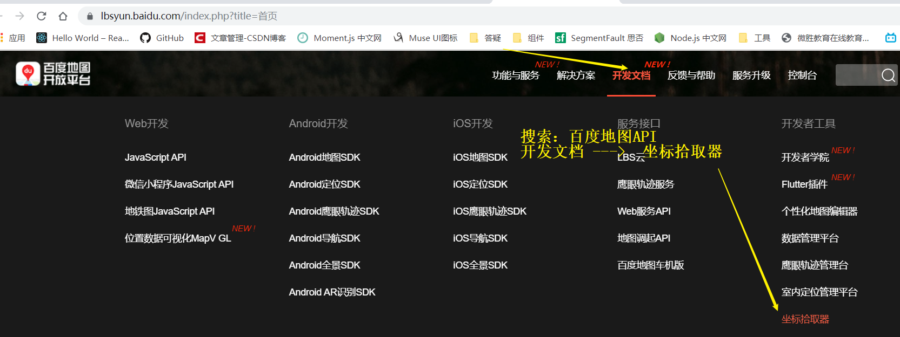

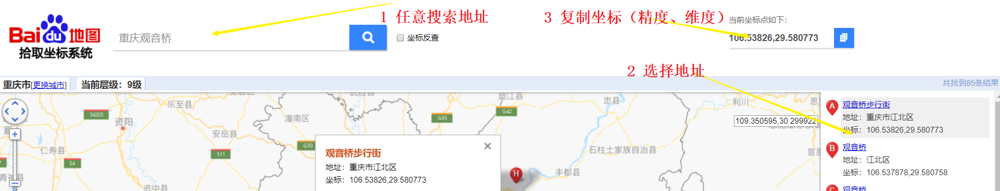

### 10.13拨打电话uni.makePhoneCall

[uni.makePhoneCall(OBJECT)](https://uniapp.dcloud.io/api/system/phone?id=makephonecall)

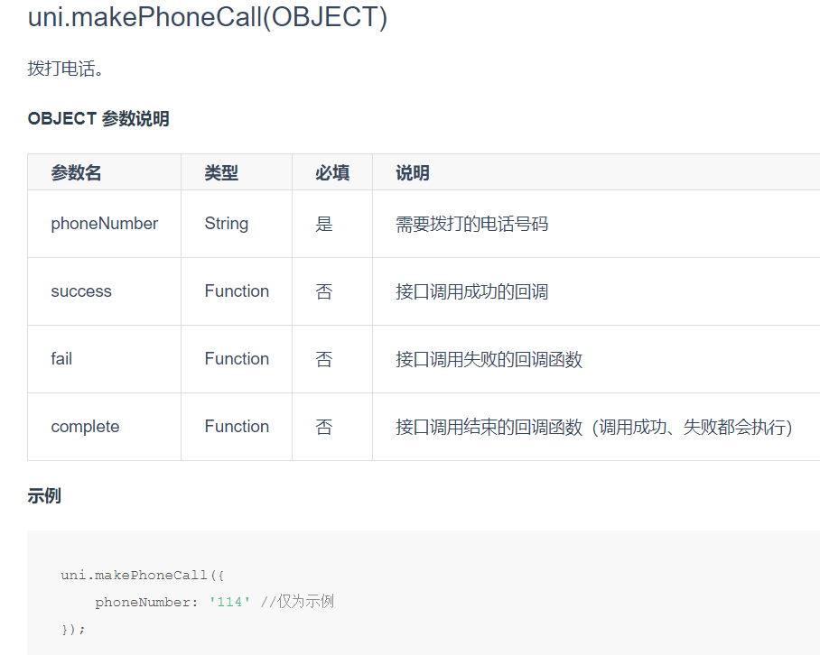

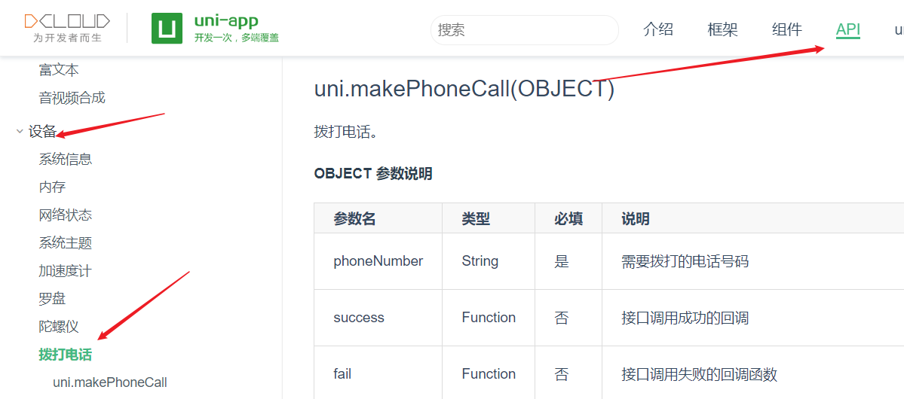


## 10. 查询页面路径(url)参数

> 有两种方式查询

**方式一:onload函数的option参数**

仅onload生命周期函数中有参数option, 可通过option获取, 注意: 其他生命周期函数中没有option,其他生命周期函数通过方式二获取页面路径信息

```js
  onLoad: function (options) {
    console.log(option)
  }
```

**方式二:页面栈获取**

若进入a页面,跳转到b页面,b页面又跳到c页面,  这些页面会进入页面栈, 页面栈是一个数组,数组长度为10, 即最多能保存10个页面, 距离最近的页面(当前页面,在数组最后一个,即arr[arr.length-1])

```js
onShow: function () {
    let curPages =  getCurrentPages();
    console.log(curPages)
  }
```

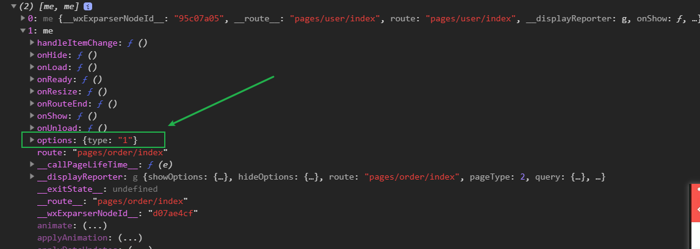


## 11. [⾃定义组件](https://developers.weixin.qq.com/miniprogram/dev/framework/custom-component/)

> 类似vue或者react中的自定义组件

⼩程序允许我们使⽤⾃定义组件的⽅式来构建⻚⾯。

### 11.1 创建⾃定义组件 

> 类似于页面，一个自定义组件由`json` ` wxml` `wxss` ` js` 4个文件组成

在根目录下创建目录components（后续所有组件放components目录中），内部一个组件一个目录，目录下四文件，可以在微信开发者⼯具中快速创建组件的⽂件结构

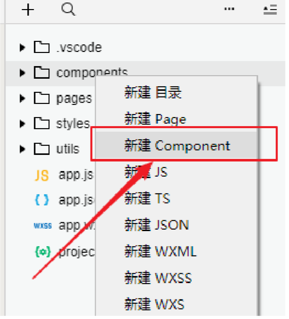

在⽂件夹内 `components/myHeader` ，创建组件名为` myHeader `

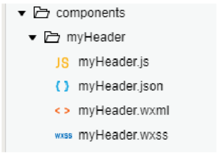

#### 11.1.1 声明组件 

⾸先需要在==**组件**==的` json`⽂件中进⾏⾃定义组件声明
`myHeader.json `

```js
//声明这是一个组件
{  "component": true }
```

#### 11.1.2 编辑组件 

同时，还要在组件的` wxml `⽂件中编写组件模板，在` wxss `⽂件中加⼊组件样式
`slot` 表⽰插槽，类似vue中的slot
`myHeader.wxml `

```html
<!-- 这是自定义组件的内部WXML结构 -->
<view class="inner">
  {{innerText}}
  <slot></slot>
</view>
```

在组件的` wxss `⽂件中编写样式

> 注意：在组件wxss中不应使用ID选择器、属性选择器和标签名选择器。

`myHeader.wxss`

```js
/* 这里的样式只应用于这个自定义组件 */
.inner {  color: red; }
```

#### 11.1.3. 注册组件  

在组件的 ` js ` ⽂件中，需要使⽤`Component()  `来注册组件，并提供组件的属性定义、内部数据和 ⾃定义⽅法

`myHeader.js`

```js
Component({
  properties: {
  // innerText属性是传过来的属性名
    //父组件向子组件传值,在这里接收,使用时就像是data上的数据,直接使用,不用存,可以直接this.setData修改,怀疑内部自动存data上了
    innerText: {
      // 期望要的数据是 string类型
      type: String,
      // 若不传参要使用的默认值
      value: 'default value',
    }
  },
  data: {
    // 这里是一些组件内部数据 定义要使用的数据
    someData: {}
  },
  methods: {
    // 这里是一个自定义方法 组件的方法写在methods内 和页面js放方法的不同
    customMethod: function(){}
  }
})
```

### 11.2 声明引⼊⾃定义组件 

⾸先要在==**⻚⾯**==的` json`⽂件中进⾏引⽤声明（哪个页面要使用组件，就在哪个里面声明）。还要提供对应的组件名和组件路径

`index.wxml `

```js
{    
  // 引用声明
  "usingComponents": {
    // 要使用的组件的名称		// 组件的路径 不能要后缀
    "my-header":"/components/myHeader/myHeader"
  }
}
```

### 11.3 ⻚⾯中使⽤⾃定义组件

```html
<!-- 直接用标签形式使用组件名即可 -->
<view>
  <!-- 以下是对一个自定义组件的引用 -->
  <my-header inner-text="Some text">
    <view>用来替代slot的</view>
  </my-header>
</view>
```

### 11.4 其他属性 

### 11.5 定义段与⽰例⽅法 

`Component `构造器可⽤于定义组件，调⽤`Component `构造器时可以指定组件的属性、数据、⽅法 等。

+ `observers`类似`vue`中的`watch`,此属性只存在组件中,不存在页面中.
+ `attached`组件的实例化都做完了,要开始渲染页面了,此时可以进行`setData`处理数据了
+ `ready`表示在页面中已经能看到完整的组件了

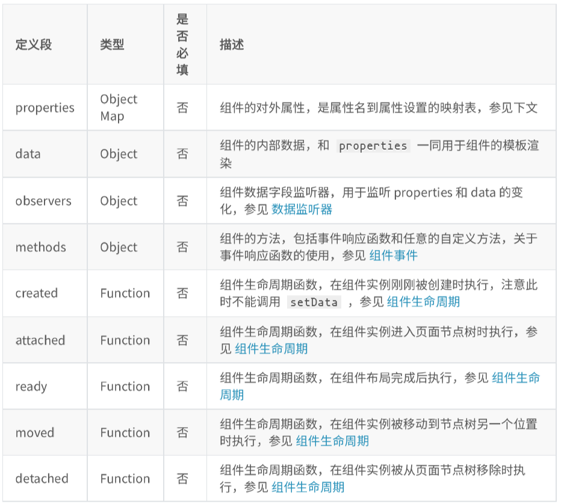

### 11.6 组件-⾃定义组件传参 

#### 11.6.1 父向子传值

**⽗组件通过==属性==的⽅式给⼦组件传递参数** 

+ 父组件通过属性传值给子组件

+ 子组件在js中的`properties`接收，`value`  表值若不传则使用默认值。type指定接收数据的类型,若类型错误,则会转换为指定类型,例若传个undefined则显示的值是false.

+ 在子组件直接使用数据,就像定义在data上一样

+ ==方法内部可通过`this.data.数据名`获取`properties`的数据，详细叙述如下：==

     ```
     总结：
     当data内无指定名字数据，properties有此数据时，通过this.data.数据名不会报错，而是获取到properties内的数据，若data有，则优先获取data内的。不管data有没有此数据，只要进行了this.setData那么就会赋值给data，后续再改数据就是改data内的，而不是properties中的，这种并非改变源数据，而是改的copy的数据，所以不好。
     
     解决方法：
     父组件传方法给子组件，子组件调用父组件传递的方法并向方法传参，父组件方法接收传递的参数并根据接收的东西更改源数据。
     ```

     

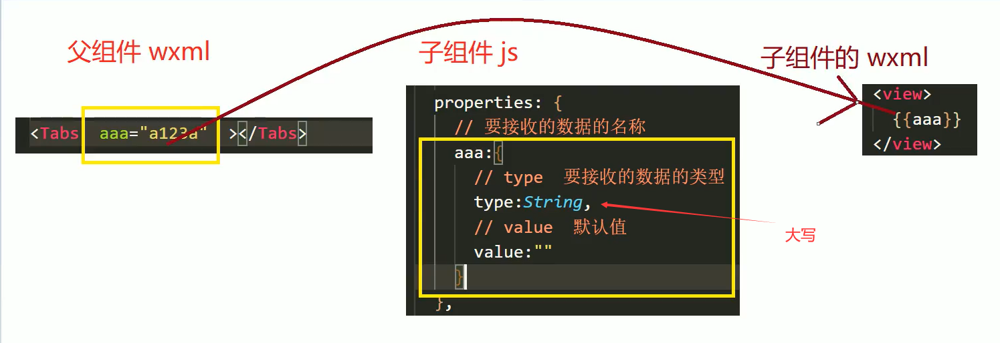

#### 11.6.2 父向子传方法 子通过调用方法向父传数据

**父组件代码:**

```html
<!--wxml
				1. 父组件通过绑定自定义事件向子组件传递方法,把handleItemChange方法通过itemchange传过去
-->

<tabbar binditemchange="handleItemChange"></tabbar>
```

```js
// js
Page({
  handleItemChange(e){
    //	4. 通过e.detail获取传过来的值
    console.log(e.detail)
  }
})
```

**子组件代码:**

```html
<!--wxml
				2. 子组件调用自己的方法,内部写调用父组件方法的代码
-->
<view bindtap="handleTap">点我触发自己事件,进一步触发父组件事件</view>
```

```js
// js
Component({
  methods: {
    handleTap(){
//			3. 通过this.triggerEvent触发父组件的方法,一参:绑定的自定义事件名,二参:传递的数据,通常用对象形式传
      this.triggerEvent("itemchange",123)
    }
  }
})
```

### 11.7 ⼩结 

1. 标签名 是 中划线的⽅式
2. 属性的⽅式 也是要中划线的⽅式 

3. 其他情况可以使⽤驼峰命名 

​		1. 组件的⽂件名如  `myHeader.js ` 的等 

​		2. 组件内的要接收的属性名 如  `innerText`

4. [更多。。](https://developers.weixin.qq.com/miniprogram/dev/framework/custom-component/component.html)

## 11. slot插槽

> `vue`中的`slot`插槽和`react`中的`children`类似
>
> 而`miniprogram`微信小程序的`slot`也是一样的

**作用:**  父组件使用子组件时，组件标签中间包裹的内容会被替换到插槽`slot`中,  插槽只是占位符,  不会转换为任何标签。

通过插槽可以实现点击不同的选项显示不同的内容。这里`list[0].isActive`就是选中的标识符,选中为`true`则显示。

```html
<!--父组件中使用<tabbar/>子组件-->
<tabbar>
  <block wx:if="{{list[0].isActive}}">0</block>
  <block wx:elif="{{list[1].isActive}}">1</block>
</tabbar>

<!--子组件-->
  <view>
    <slot></slot>
  </view>
```


## 12. ⼩程序⽣命周期 

分为**应⽤⽣命周期**和**⻚⾯⽣命周期**

> 关于小程序前后台的定义和小程序的运行机制，请参考运行机制章节。

[简书参考](https://www.jianshu.com/p/ee7c11d691c1)

### 12.1 [应⽤⽣命周期](https://developers.weixin.qq.com/miniprogram/dev/reference/api/App.html) 

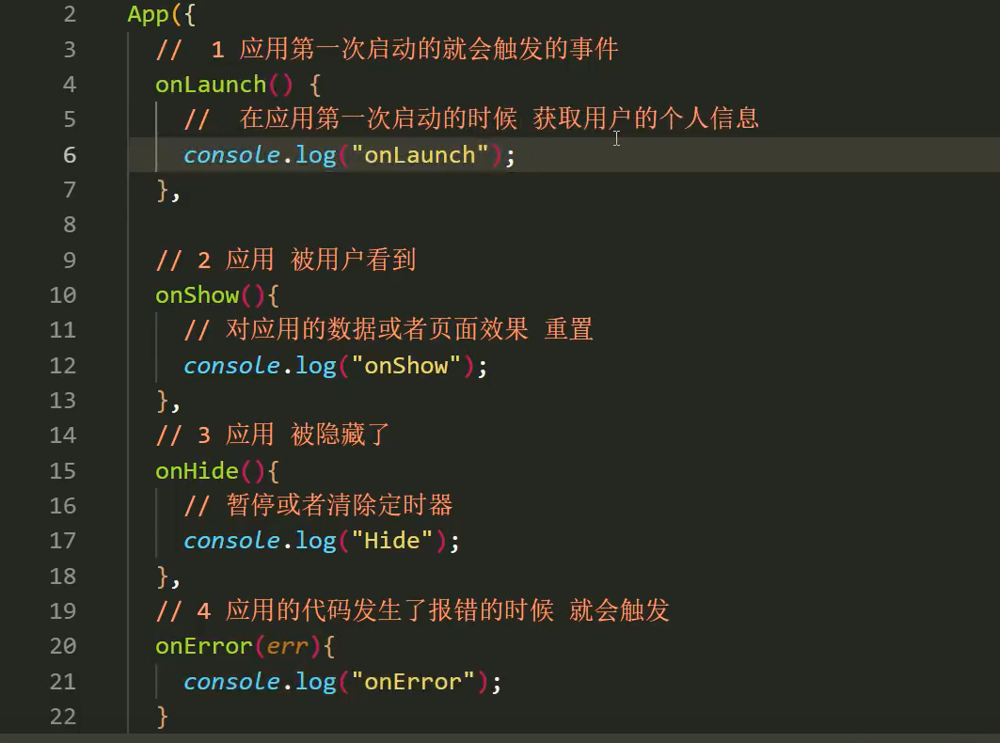

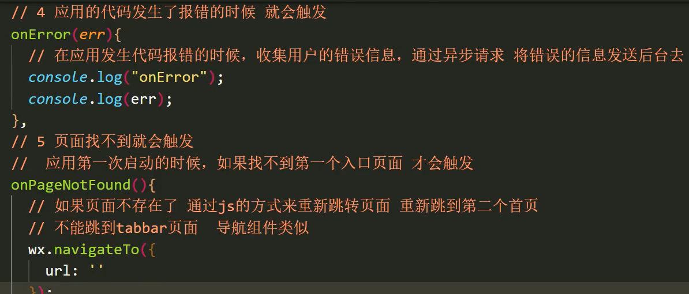

注意:   4中接收一个`err`参数，是错误信息

​			5中仅入口页面找不到才会触发，入口页面指进入小程序看到的第一个页面

### 12.2 [⻚⾯⽣命周期](https://developers.weixin.qq.com/miniprogram/dev/reference/api/Page.html) 

**tabbar 的页面展现过一次后就保留在内存中，再次切换 tabbar 页面，只会触发每个页面的onShow，不会再触发onLoad。页面也只是单纯的显示和隐藏, 页面不会重新加载和渲染**

**==注意:==**

​		有使用==**设置权限**==这类功能的,设置时会跳转到微信内置的设置功能,相当于后台,从后台跳回前台, 函数onload并不会再执行, ==**onload**==指页面加载时执行, 只会执行一次 ,那么页面并不会重新渲染,即信息得不到及时更新显示

==**综上:**==

​		有进行设置, ==**跳转后台**==的,或者像==**购物车**==这类频繁打开和隐藏的页面,或者用户交互多的页面,别用onload,请使用==**onshow**==生命函数, 此函数是当从后台切回前台或页面显示都会执行的函数,作用每次打开和隐藏都进行一个初始化,会执行多次

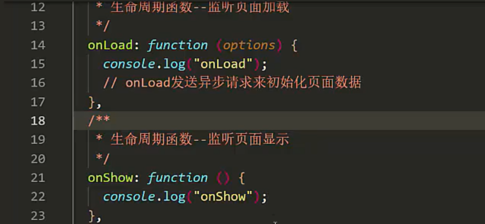

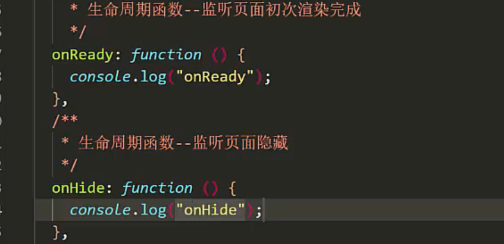

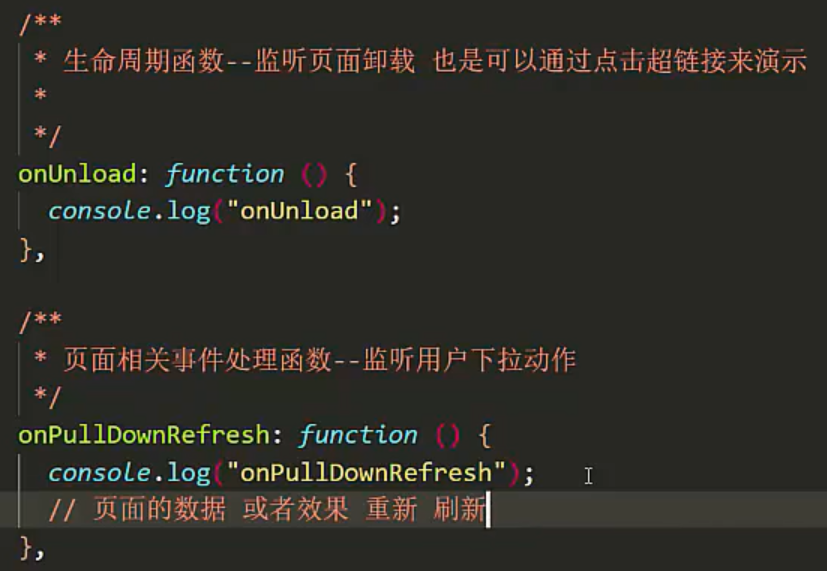

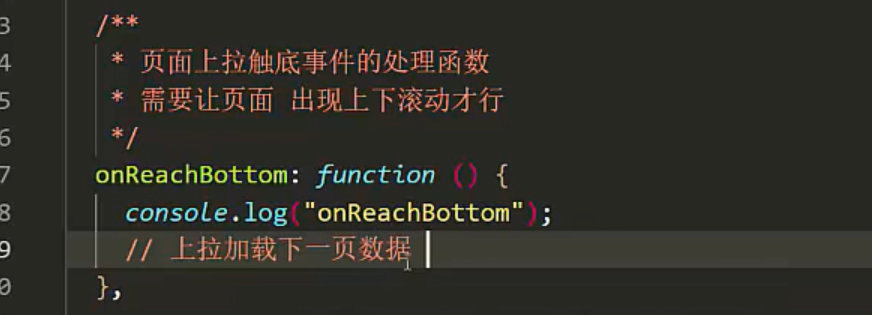

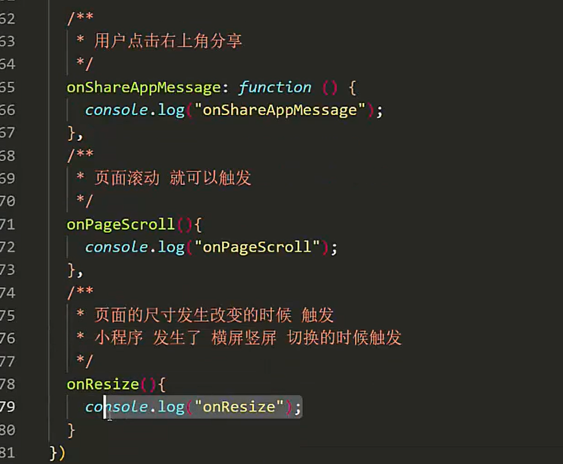

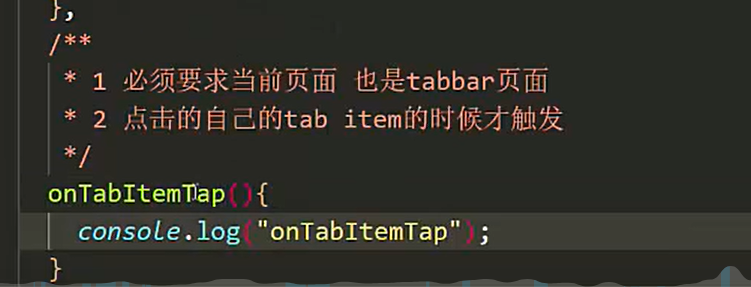

### 12.3 ⻚⾯⽣命周期图解 


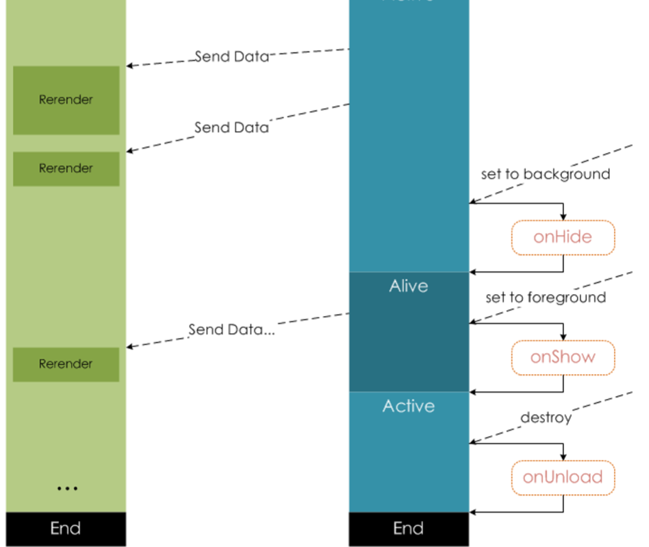

## 13. [wx.request请求资源](https://developers.weixin.qq.com/miniprogram/dev/api/network/request/wx.request.html)

### 13.1 基本使用

**wx.request(Object object)，更多参数看文档**

```js
    wx.request({
      url: 'https://api-hmugo-web.itheima.net/api/public/v1/home/swiperdata',
      data:{id:1,page:2}//若要传参可通过data传
      success: (result)=>{
        this.setData({
          swiperList:result.data.message
        })
      },
    })
```

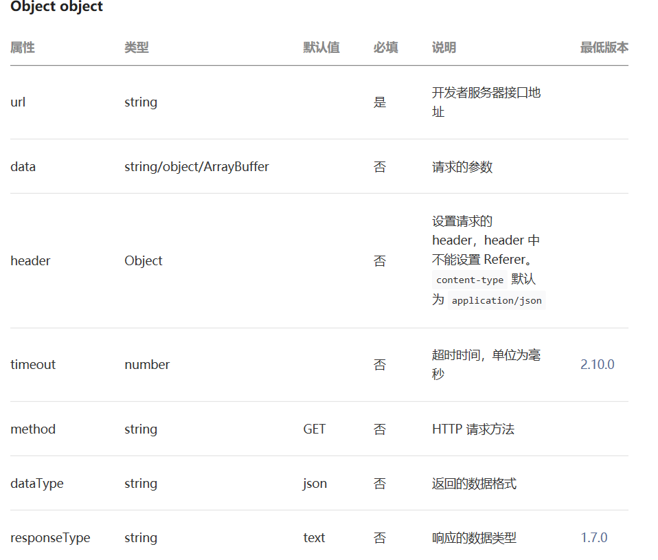

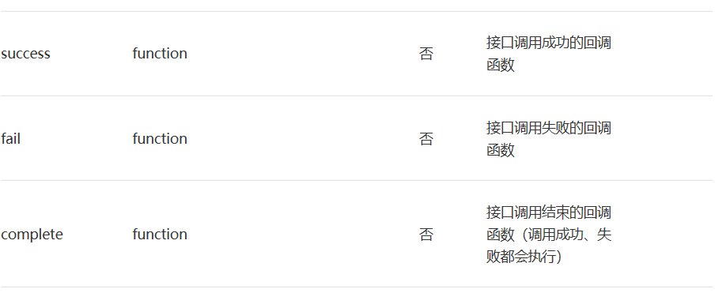

### 13.2 优化（掌握）

若直接老老实实写代码发请求，很容易陷入回调地狱，这里做一个简单的优化

```js
//创建request目录，专门写异步请求代码，里面根据功能分类建文件
//例：建index.js文件

export const request = (params) => {
  return new Promise((resolve, reject) => {
    wx.request({
      ...params,
      success: (result) => {
        resolve(result)
      },
      fail: (error) => {
        reject(error)
      }
    });
  })
}
```

```js
//其他js文件需要发请求，直接引入此函数

import {request} from '../../request/index.js'

request({url: 'https://api-hmugo-web.itheima.net/api/public/v1/home/swiperdata'})
  .then(result=>{
  		this.setData({
    		swiperList:result.data.message
  		})
	})
	.then()//若需要多个，可继续.then 可以换行
```


这里引入后，函数执行，传参传的url，工具函数执行后会把请求结果即资源返回，再用.then方式进行相应操作。

==注意：在`vue`或`react`中引入文件，若文件为`index.js`我们写路径时会到目录处停止，不会写文件名，但是在微信小程序中，路径必须补全，哪怕是`index.js`也必须写。==

```js
//错误写法
import {request} from '../../request'

//正确写法
import {request} from '../../request/index.js'
```

### 13.3 优化公共路径（掌握)

> 将发请求的公共路径提取出来，
>
> 后期利于维护，否则上线了改域名，一个个改忙不过来还极易出错

**定义：**

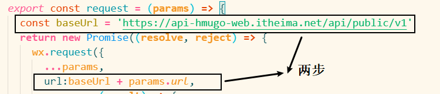

**使用：**

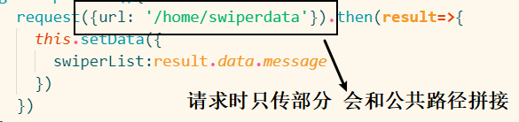

## 14.请求域名加白名单

默认小程序不能随意发请求,两种解决方式

#### 方式一: 仅限开发时用(不推荐)

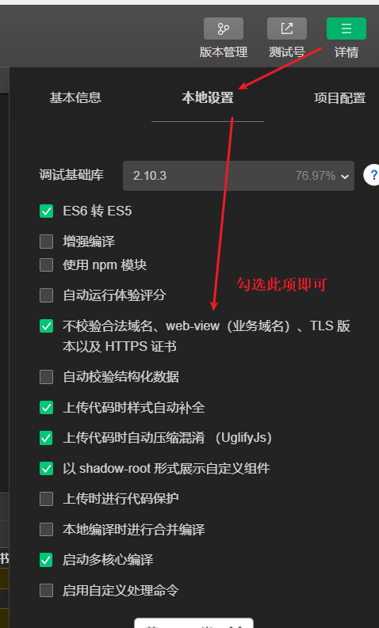

#### 方式二:项目上线时用

**项目上线时会要求请求必须是合法的,所以用方式一就不行了.**

**合法指：**1. 域名必须是https的, 

​				2.必须把它添加到小程序后台里

**这里进行演示如何把小程序添加到后台白名单中:**

1. 登录[小程序后台](https://mp.weixin.qq.com/)  

     若在文档中可由图一方式进入,或者点击链接[小程序后台](https://mp.weixin.qq.com/),成功后均显示图二页面

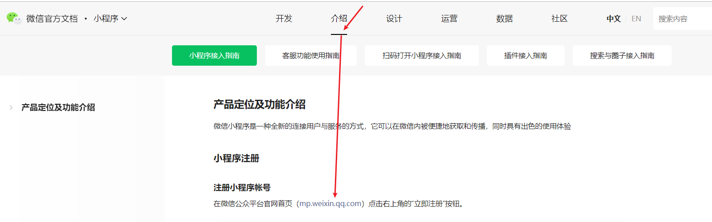


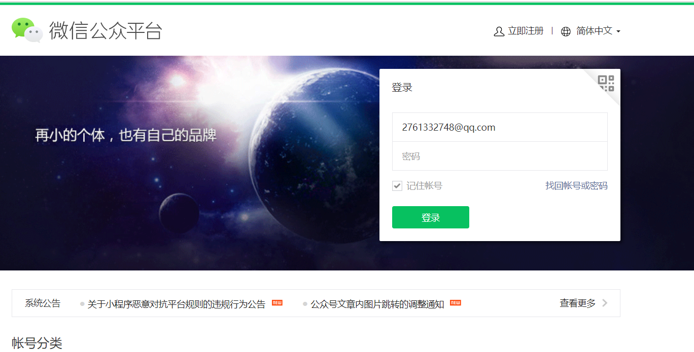

**2. 开始配置**

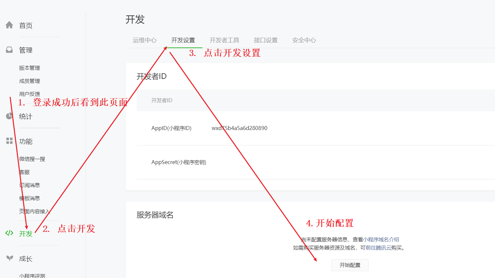

**3. 扫码后添加域名并确定**

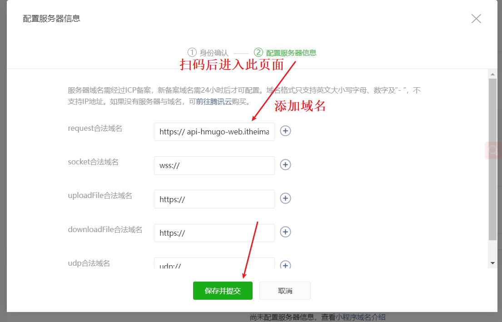

**4. 成功后如图(注意是加域名,不带其他参数),**

**把域名加到白名单后无需方式一操作即可使用,上线时都要求这么做即加白名单**

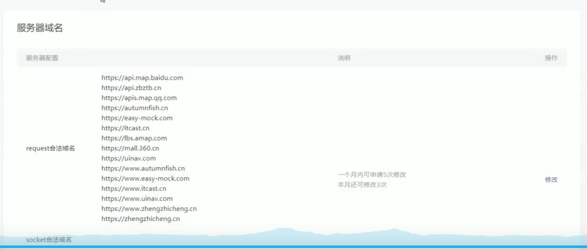

**微信开发者工具,刷新域名配置**


## 15.  [微信小程序的本地存储](https://developers.weixin.qq.com/miniprogram/dev/api/storage/wx.setStorageSync.html)

> 每次进入页面都会发起新的请求,当请求的数据体积过大时,此举极耗性能.此时可以考虑本地存储,提高性能,
>
> 在微信小程序中也有本地存储技术.

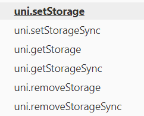

**存、取、删除数据(分别有同步接口和异步接口, 具体看文档链接)**  :

1. 方法名有Sync的表同步操作,没有Sync的表异步操作, **推荐用同步操作**

2. 异步接口, **参数是obj对象**,因还有成功回调和失败回调,及不管成功还是失败都执行的回调, 

     同步接口, **参数是key , data**,不是obj对象,因是同步,所以没回调函数

###  **15.1 web本地存储和小程序的区别:**

1. **代码书写区别**

 web:               localStorage**.**setItem('key','value')           localStorage**.**getItem('key')

 微信小程序:   wx**.**setStorageSync('key','value')              wx**.**getStorageSync('key') 

2. **传参区别**

 web:参数value的存取都需要进行转换

 微信小程序: 参数value的存取都不需要转换,存进去是什么,取出来就是什么,例可直接存对象进去,不需转为字符串,取出来也直接用

### **15.2 代码示例**

```js
//存
wx.setStorageSync('categoryList',{time: Date.now(),data: this.categoryList})
//取
const {time,data} = wx.getStorageSync('categoryList');
```

## 16. ⼩程序中⽀持es7的async语法

es7的`async` 号称是解决回调地域的最终⽅案

#### 16.1 方法一:(推荐)

现在的小程序开发工具已经支持ES7语法了，需要进行如下步骤

```
1.勾选ES6转ES5

2.勾选增强编译

3.使用ES7时方法名前加【async】关键字 内部使用【await】
```

如下示例：用对象简洁语法写async函数

> 当键和方法名相同时可以简写, 而async的区别就是 在前面加一个async
>
> await后面的request({ url: '/categories' }) 这是promise对象,返回的结果左边变量接收

```js
{
  async getCategoryList() {
    let result = await request({ url: '/categories' })
    this.categoryList = result
  }
}
```


#### 16.2 方法二: (仅做了解)

老视频时小程序不支持es7的解决方案,但解决后依然会有兼容问题,今天是2020-3-14号,网上说已经支持es7了,这里依旧记录下 旧的解决方案 仅做了解.

**说明**  **(旧视频的言论 如今已支持es7)**

​	小程序中明确说明只支持es6转es5，但未说明支持es7，所以==直接使用es7会报错==, 这里进行解决方案（仅适合大部分机型，不能完全解决），==在一些旧的机型上依旧会报错，所以当需要适配一些旧的机型时就不要用这个技术,==就需要改为es6的promise语法.这里暂时不考虑兼容性,根据步骤配置和使用

**解决方案及使用步骤**

1. 在⼩程序的开发⼯具中，勾选 es6转es5语法

     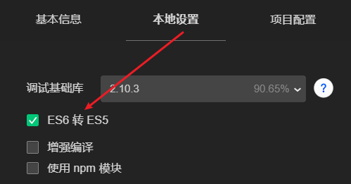

2. 下载 facebook的regenerator库中的 [regenerator/packages/regenerator-runtime/runtime.js](https://github.com/facebook/regenerator/blob/5703a79746fffc152600fdcef46ba9230671025a/packages/regenerator-runtime/runtime.js ) ,它是专门用来编译`async`语法的.

     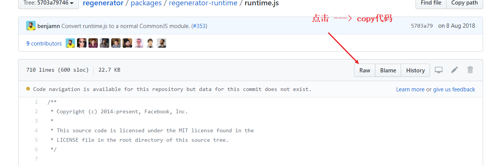

3. 在⼩程序⽬录下新建⽂件夹 ` lib/runtime/runtime.js `，将代码拷⻉进去 

4. 在每⼀个需要使⽤`async`语法的⻚⾯js⽂件中引⼊,只能单个引入（不能全局引⼊,否则无效）,

     ```js
     import regeneratorRuntime from '../../lib/runtime/runtime.js';
     ```

     只引入就可以了, 无需使用, 不用管`regeneratorRuntime`这些,然后按平时写es7的async语法 直接写就行.

## 17. 微信支付(仅企业账户使用)

### 17.1 简单介绍

[微信支付接口文档](https://pay.weixin.qq.com/wiki/doc/api/wxa/wxa_api.php?chapter=7_3&index=1)

[wx.requestPayment(Object object)](https://developers.weixin.qq.com/miniprogram/dev/api/open-api/payment/wx.requestPayment.html)

微信支付功能有权限要求: 必须使用企业账号角色(且给开发者加入企业白名单) 个人账号没有此权限, 没有权限进行如下操作会获取不到数据导致报错.

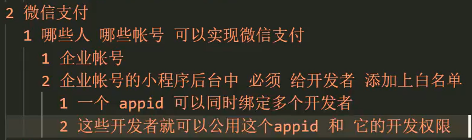


**我是个人账户,所以无法演示支付功能,这里会根据视频做讲解:**

想要实现微信支付也是需要有自己的后台服务器的.

### 17.2 ⽀付流程图

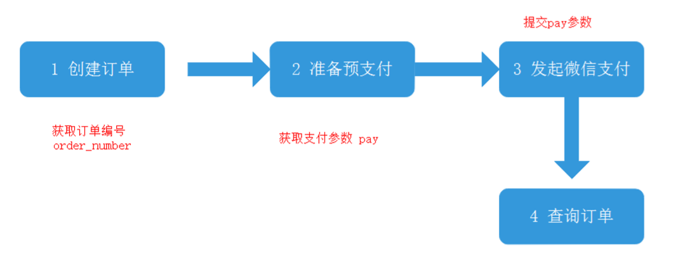

### 17.3 具体步骤

**1. 给结算按钮绑定点击事件,判断如果购物车无商品,弹窗提示并return,判断如果地址为空,弹窗提示并return,**

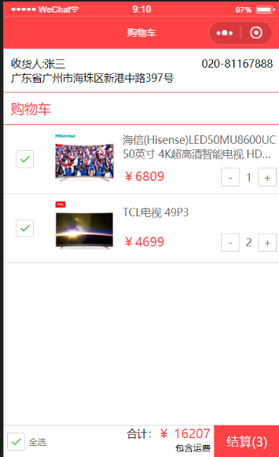

**2. 第1步满足后跳转到支付页面**

**2.1 给支付按钮绑定点击事件**

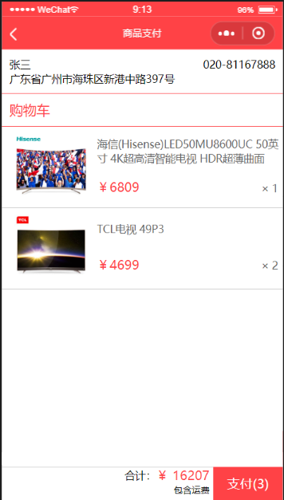

支付事件要用到的东西我单独建立小标题讲解 如后

### 17.3.1获取token-获取用户信息

```html
<!--为button指定open-type类型 并通过bindgetuserinfo事件中的e源对象获取用户信息-->
<button  plain type="primary" open-type="getUserInfo" bindgetuserinfo="handleGetUserInfo">
  授权
</button>

```

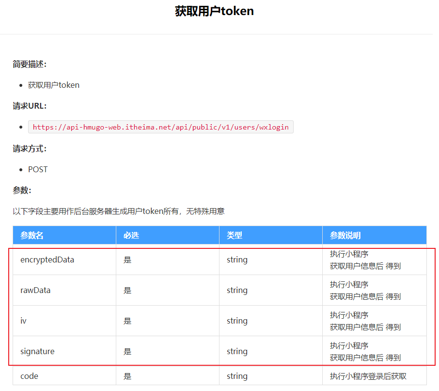

### 17.3.2获取token-获取code值

通过wx.login()事件获取code值

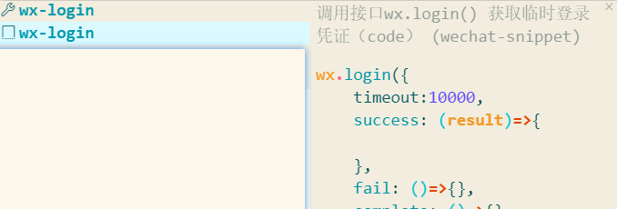

### 17.3.3获取订单号

拿到token后根据接口文档可以获取订单号

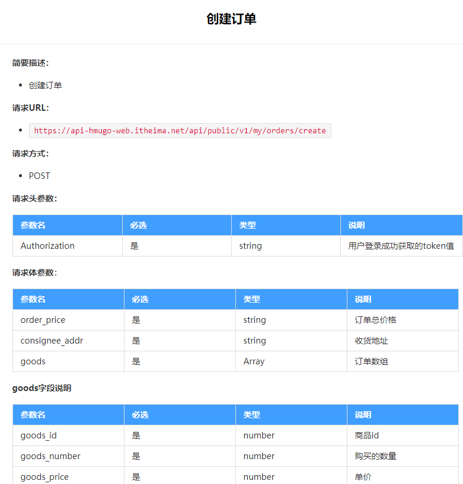

### 17.3.4获取pay支付参数

根据订单号和token可获取支付参数  这里的pay支付参数是调用微信内部支付方法所需的参数

```json
//返回示例
{
  "message": {
    "pay": {
      "timeStamp": "1564730510",
      "nonceStr": "SReWbt3nEmpJo3tr",
      "package": "prepay_id=wx02152148991420a3b39a90811023326800",
      "signType": "MD5",
      "paySign": "3A6943C3B865FA2B2C825CDCB33C5304"
    },
    "order_number": "HMDD20190802000000000422"
  },
  "meta": {
    "msg": "预付订单生成成功",
    "status": 200
  }
}
```


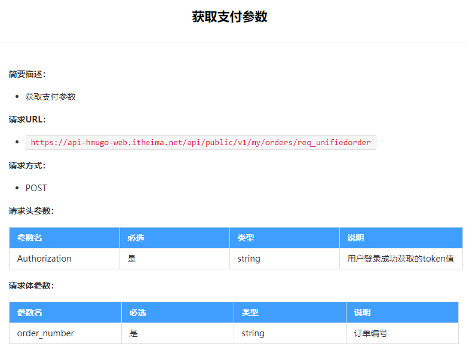

### 17.3.5发起微信支付[wx.requestPayment(Object object)](https://developers.weixin.qq.com/miniprogram/dev/api/open-api/payment/wx.requestPayment.html)

这里调用微信内部的支付功能， 参数需要用到前面获取的pay参数发起支付

[wx.requestPayment(Object object)](https://developers.weixin.qq.com/miniprogram/dev/api/open-api/payment/wx.requestPayment.html)

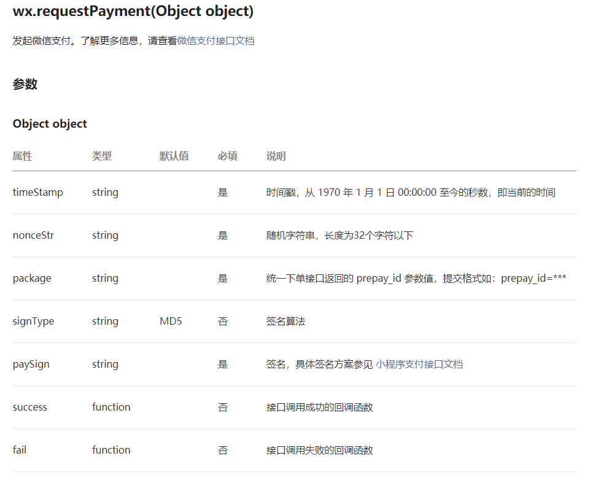

### 17.3.6查询订单状态

最后根据接口查看是否支付成功 成功或失败都要弹窗提示，若成功直接跳转到个人中心页面，以便用户查看订单

将购买成功的商品从购物车移除，买成功的商品存起来 以便订单页面使用

## 18. 项目发布

1. 不勾选 不校验选项, 把要用的接口加小程序后台白名单

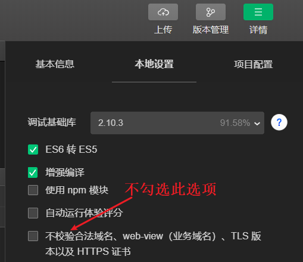

2. 项目id一定是个人的或企业的id,别再使用测试id, 否则你是不能看到上传按钮的

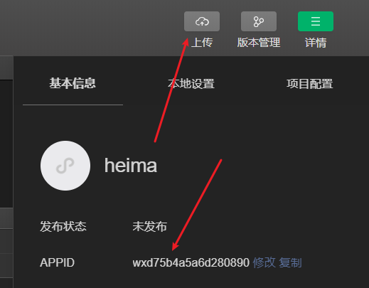

3.上线前进行真机调试, 且保证整个项目代码大小不超过两M,这是小程序规定的, 当然后面我们可以通过分包技术来解决大小两M的限制, 分包也是程序里面提供的功能, 它可以把整个项目打包成不同的模块来分别上传和发布,但是不管怎么分包,总大小不能超过10M, 所以还需对代码优化减小代码体积,

4.对项目版本讲解

例版本1.1.2

第一数字:一般情况下大版本的迭代会对第一个数字1做改变,例1到2, 2到3, 首字母(第一数字)改变代表最大版本的更新

第二数字:主要是对一些重要功能进行更新

第三数字:最小的功能,比如补bug  补丁  局部优化, 是这类很小的优化的,小细节的.

5.点击上传按钮进行发布

填写信息并上传，然后登录微信小程序后台，再版本管理里面看

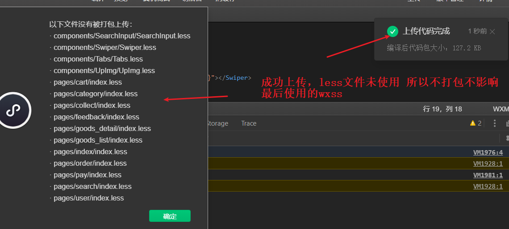

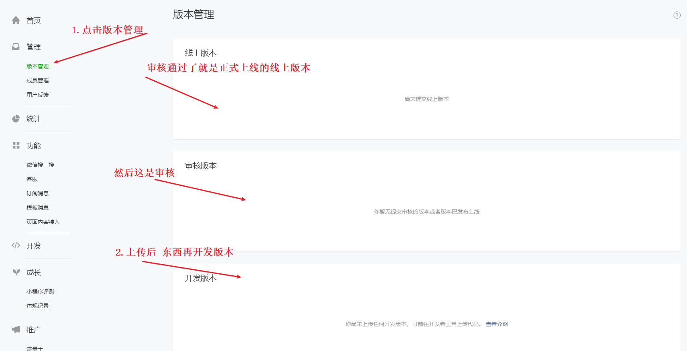

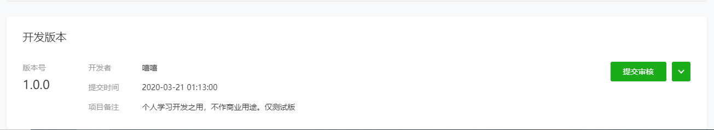

# 项目

## 1. 使用阿里巴巴图标库

**1.图标加入购物车 ---> 点击class ---> 搜索链接 ---> copy内容粘贴到自己wxss文件**（推荐创建`styles`目录存放公共样式文件，将对应文件引入到`app.wxss`中全局生效，所有页面都能用）


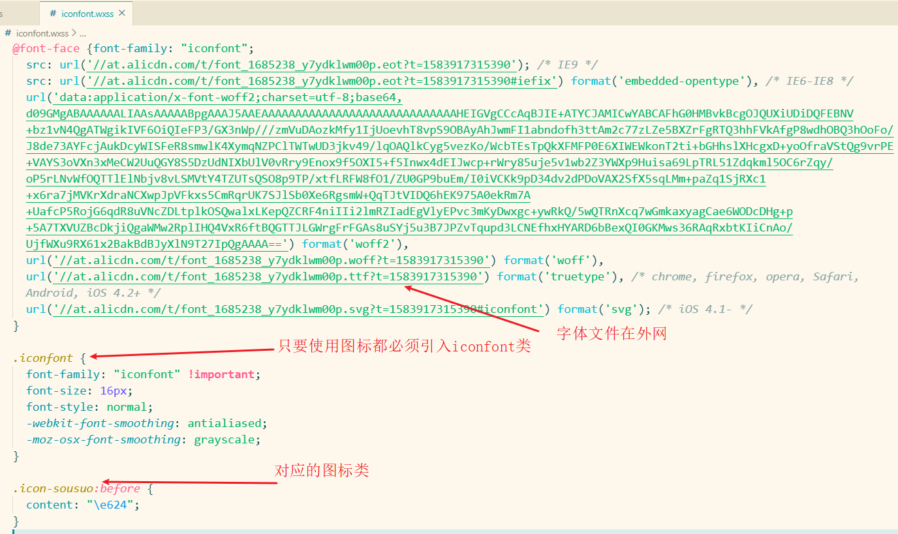

**2. 使用**

将对应文件引入到`app.wxss`中全局生效，所有页面都能用,

通过类名使用图标：基础类每次使用都要写`iconfont`  + `要用的图标类` 


## 2. wxss变量设置主题色

**定义**

主题颜色一般通过变量实现，`wxss`也有变量，需在`page`选择器中定义

```css
<!--在全局样式文件app.wxss的page选择器中定义变量 ,这里的 -- 是关键字      -->
page{
  --themeColor:#ff4246;
}
```

**使用**

全局样式文件中定义的变量其他页面都能使用, 通过`var(`变量名) `

```css
view{
  color: var(--themeColor);
}
```

## 3. 设置入口页面 及传参

**做项目的使用技巧:**

每次更改代码就会重新跳转页面,为避免多次点击切换页面,可通过编译模式设置入口页面

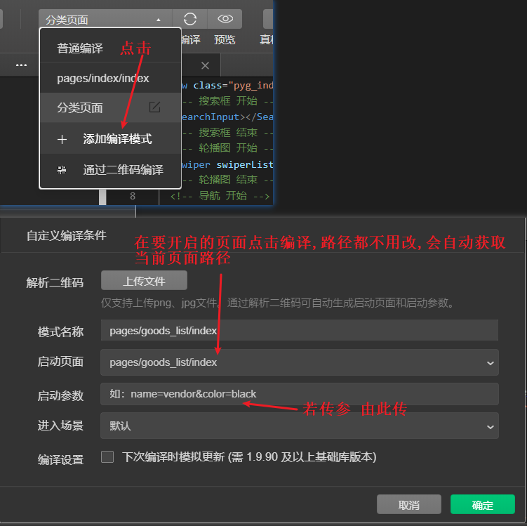

页面路径和参数,都可以由此查看:


## 4. 加载图片时进行判断

对图片src进行判断，若无值则使用`暂无图片`的提示

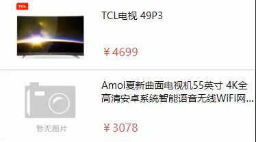

```html
<image src="{{img.src?img.src:'暂无图片的路径'}}" mode="widthFix"></image>
```

## 5.小程序官方建议

小程序官方建议data中只存放标签需要用到的数据, 例一个obj中有22个属性, 但我们只用到其中4个属性, 若把22个都存进去会导致程序性能卡, 所以最好进行数据处理, 只存放需要用的那几个.

**仅数据类似这种数量差异大时再用,若每个都这样也麻烦**

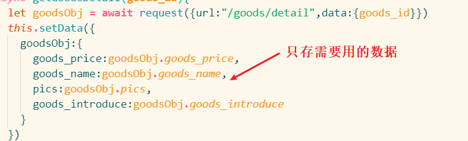

## 6.部分苹果手机不支持webp后缀图片

一般图文详情都是富文本, 即返回的数据是标签+内容, 因每个商品详情页格式不同,我们无法写固定格式统一渲染. 

**注意:** 部分苹果手机不支持webp后缀的图片( 在小程序中会正确渲染,但真机调试不能识别 ),所以若遇到返回的数据有这种的,需对其解决

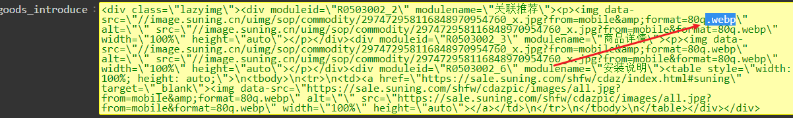

**解决方案一: (真正开发中 采用方案一)**

联系后端,将其换成普通的png、jpg等后缀的图片, 以便适配所有机型

**解决方案二:**

在确保后端也**有其他后缀**且**同名**图片的情况下,例`1.webp` ===`1.jpg`,我们手动将后缀全部替换为`jpg`.

```js
str.replace(/\.webp/g,'.jpg')
```

## 7.page的height100%

page的height100% 指除了头部和tabbar（如果有）剩下的所有高度


## 8. 加入购物车流程

**==注意:==**

​		有使用==**设置权限**==这类功能的,设置时会跳转到微信内置的设置功能,相当于后台,从后台跳回前台, 函数onload并不会再执行, ==**onload**==指页面加载时执行, 只会执行一次 ,那么页面并不会重新渲染,即信息得不到及时更新显示

==**综上:**==

​		有进行设置, ==**跳转后台**==的,或者像==**购物车**==这类频繁打开和隐藏的页面,或者用户交互多的页面,别用onload,请使用==**onshow**==生命函数, 此函数是当从后台切回前台或页面显示都会执行的函数,作用每次打开和隐藏都进行一个初始化,会执行多次

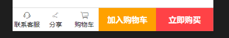

**流程:**

+ 正常来说有接口, 若没有就把数据存到本地存储,对其进行存取操作,购物车是数组,里面每项是obj,一个obj对应一个商品
+ 点击按钮,
     - 取本地存储数据(取数据要进行判断,本地存储若无值会返回空字符串而非undefined,所以应返回`[ ]`避免报错)用`Array.findIndex`并对其循环,判断存储内数据(商品id)和此时商品id是否一致,若有则返回下标,若无则返回`-1`
     - 判断`下标`和`-1`
     - 若有下标表示之前存过此商品,对该商品购买数量++
     - 若为`-1`,组织商品信息`obj`,`push`进去

**代码:**

```js
  handleCarAdd(){
    //取本地存储数据购物车 数组,若无值会返回空字符串,布尔值表false,这里进行处理返回[] 避免数组循环报错
    const car = wx.getStorageSync("car") || [];
    //当前商品信息
    const goodsObj = this.data.goodsObj
    //判断购物车有无此商品
    const index = car.findIndex(v=>v.goods_id==goodsObj.goods_id)
    //若无此商品
    if(index===-1){
      goodsObj.num=1
      car.push(goodsObj)
    }else{
      //若有此商品
      car[index].num++
    }
    //不管有没有都需重新设置到本地存储中
    wx.setStorageSync('car', car);
    //添加成功后弹出提示框
    wx.showToast({
      title: '添加成功',
      icon:"success",
      mask: true,
    });
  }
```

## 9. 点击购物车跳转到购物车页面

跳转到购物车页面后,有**获取收货地址**的按钮,具体获取方式,见**10.8** , 有对应的API

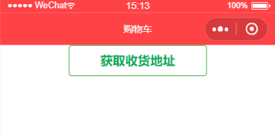

**判断有没有值,用wx:if决定展示不同数据**

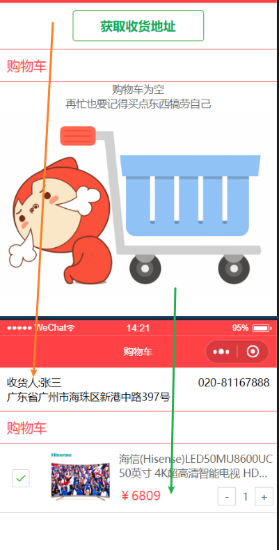


## 10 输入框搜索提示 解决防抖

案例是在微信小程序项目写的, 微信小程序输入框值改变触发的事件和日常input事件不同, 把绑定的事件名字改了就行, 其他没有任何区别

**搜索关键字，弹出提示**

+ 给input组件，绑定事件`bindinput`,输入框值改变触发此函数，可以通过`e.tedail.value`获取到输入的value值
+ 对value值进行合法性判断，例如空格这类的就不发送请求
+ value值合法后，根据值发送请求给后台，获取数据
+ 把获取到的数据渲染出来

```html
  <input placeholder="请输入您要搜索的商品内容" bindinput="handleInput"></input>
```

```js
  handleInput(e){
    //1. 获取输入框值
    const {value} = e.detail
    //2. 检测合法性 判断去除两端空格后的结果
    if(!value.trim()){
      //不合法 清空数据
      this.setData({
        goods: [],
      })
      return
    }
    //3.准备发送请求获取数据
    //有关异步请求的最好用async函数，但是不能将handleInput函数设为async函数，因为async函数执行完后会返回一个promise,而handleInput事件本身特点就是会用处理函数的返回值替换掉输入框的内容。所以这里把函数单独写出去
      this.getSearchRes(value)
  },
  //发送请求获取搜索建议的数据
  async getSearchRes(query){
    const goods = await request({url:"/goods/qsearch",data:{query}})
    //把拿到的数据存到data中，会将goods内的数据渲染到也米娜
    this.setData({
      goods
    })
  }
```

**解决防抖问题**

+ **防抖介绍**：是防止抖动。若每输入一个字符就发起一次请求并渲染结果，那么页面就一直在切换显示不同的内容，这样就像不停的抖动一样。

+ **防抖（防止抖动）节流  使用场景:**
     - 防抖 一般用户输入框中，防止重复输入、重复发送请求。
     - 节流 一般是用在页面下拉和上拉。

+ **解决方案(使用延时器解决)**
     - 解决思路 直接看1.2.3点文字即可 很简单, 具体代码看下面
     - 4点必须清除延时器否则有bug

```js
import { request } from '../../request/index.js'
Page({
  data: {
    goods: []
  },
  //1.定义全局TimeId, 数字任意, 不影响
  TimeId: -1,
  handleInput(e) {
    const { value } = e.detail
    //4.若用户手动键盘删除value值就清空数据,同时必须清除延时,如果不清除延时器会依旧显示内容,因为手动键盘删除搜索值时 还发了个数据请求,清空后,请求才回来 又会重新覆值 
    if (!value.trim()) {
      this.setData({
        goods: [],
      })
      clearTimeout(this.TimeId)
      return
    }
    //2. 每次发请求前清除延时器(哪怕没有开启延时器即TimeId值不存在,清除无效,也不会报错)
    clearTimeout(this.TimeId)
    // 3. 开启延时器,将发请求的代码写在延时器内, handleInput事件每次触发都会清除上一个的延时器(把此延时器返回值TimeId赋值给全局TimeId),若触发时间短,则上一个延时器还没执行内部代码,就被清除,这样可以达到不发多次请求的作用,而最后一次触发handleInput事件 必然会发起请求.
    this.TimeId = setTimeout(() => {
      this.getSearchRes(value)
    }, 1000);

  },
  async getSearchRes(query) {
    const goods = await request({ url: "/goods/qsearch", data: { query } })
    this.setData({
      goods
    })
  }
})
```

   