# 微信小程序基本使用

## 1. 什么是微信小程序

微信⼩程序，简称⼩程序，英⽂名 `Mini Program` ，微信小程序是微信内部的,是⼀种不需要下载安装即可使⽤的应⽤，它实现 了应⽤“触⼿可及”的梦想，⽤⼾扫⼀扫或搜⼀下即可打开应⽤

## 2. 环境准备

### 2.1 注册账号

> 微信小程序是谁开发的，它有一个唯一的开发者信息，所以需要注册账号，作为开发者信息证明。
>
> 建议使用全新的邮箱,没有注册过其他小程序和公众号的，也没绑定过微信。

访问[注册页面](https://mp.weixin.qq.com/wxopen/waregister?action=step1)，耐⼼完成注册即可。

### 2.2 获取APPID 

由于后期调⽤微信⼩程序的接⼝(例获取手机信息,微信支付)等功能或者发布上线，需要索取开发者的⼩程序中的 APPID APPID ，所以在注册成功后， 可登录，然后获取APPID。

[登录](https://mp.weixin.qq.com/)，成功后可看到如下界⾯
然后复制你的APPID,悄悄的保存起来，不要给别⼈看到😄

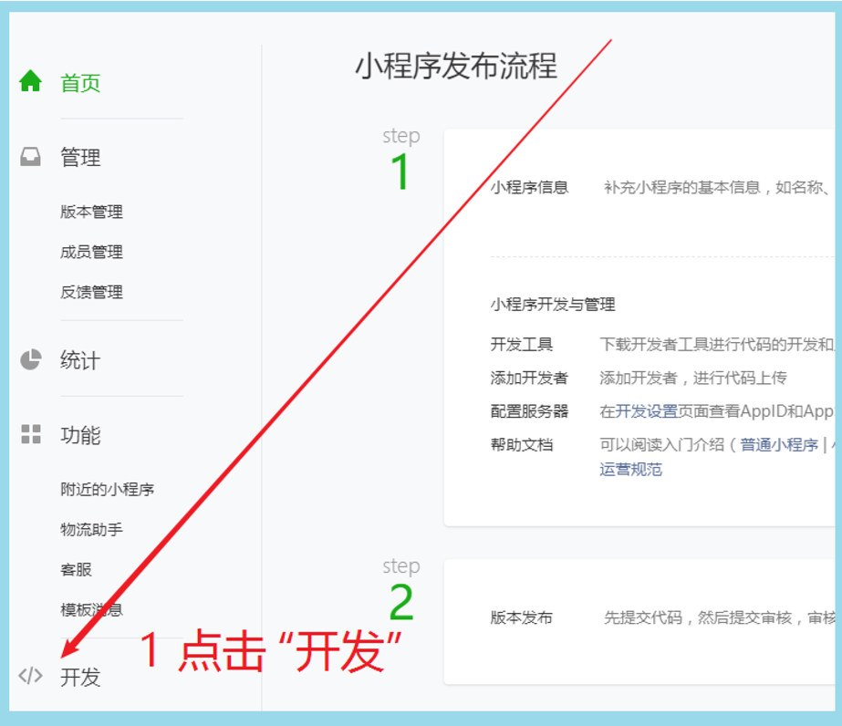

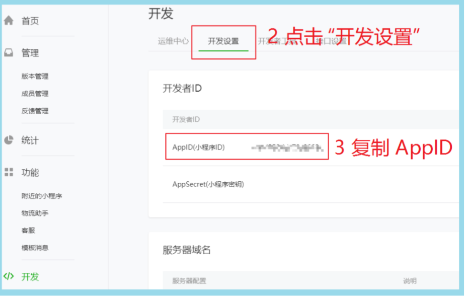

### 2.3. 开发⼯具 

[下载微信开发者工具](https://developers.weixin.qq.com/miniprogram/dev/devtools/download.html)(点击安装包一直next即可)

> 开发网页可以通过浏览器预览，而开发小程序应用，需要有自己的开发环境。

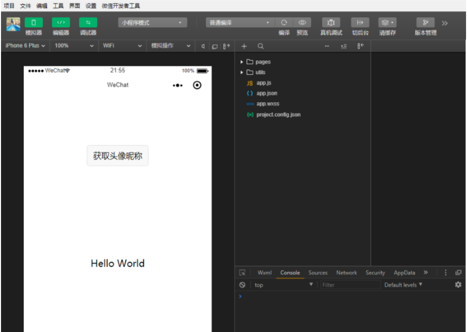

微信⼩程序⾃带开发者⼯具，集**开发、预览、调试、发布**于⼀⾝的完整环境。
但是由于编码的体验不算好，因此建议使⽤`vs code` + `微信小程序编辑工具`来实现编码
`vs code `负责敲代码，` 微信编辑工具`负责预览

## 3. 第⼀个微信⼩程序

### 3.1 打开微信开发者⼯具 

注意：第⼀次登录的时候需要扫码登录

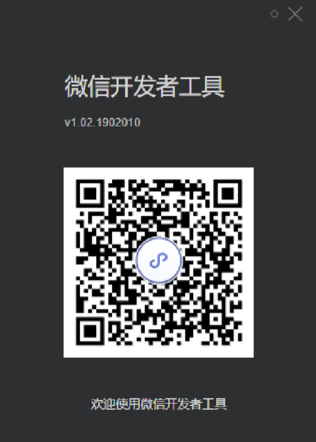

### 3.2 新建小程序项目

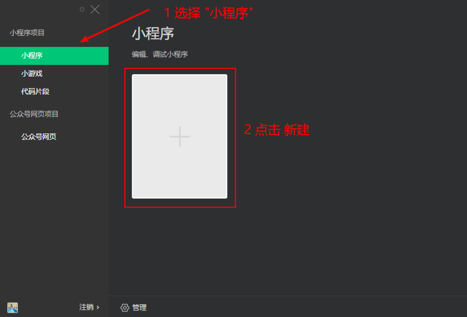

### 3.3 填写项⽬信息 

目前AppID是用的测试号，测试号不能选择云开发，所以默认没有后端服务此栏，后期可以更改AppID。

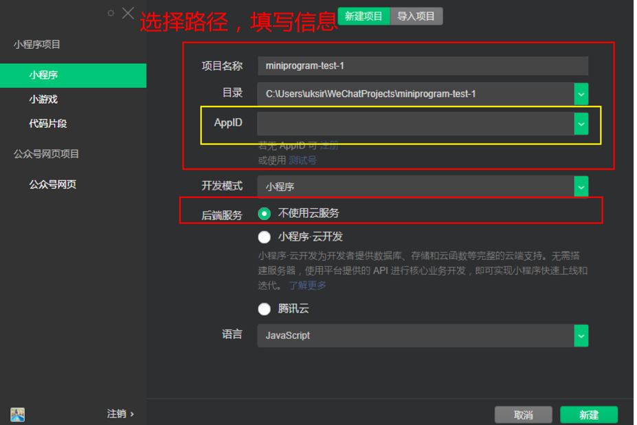

选择测试号后界面如下，新建。

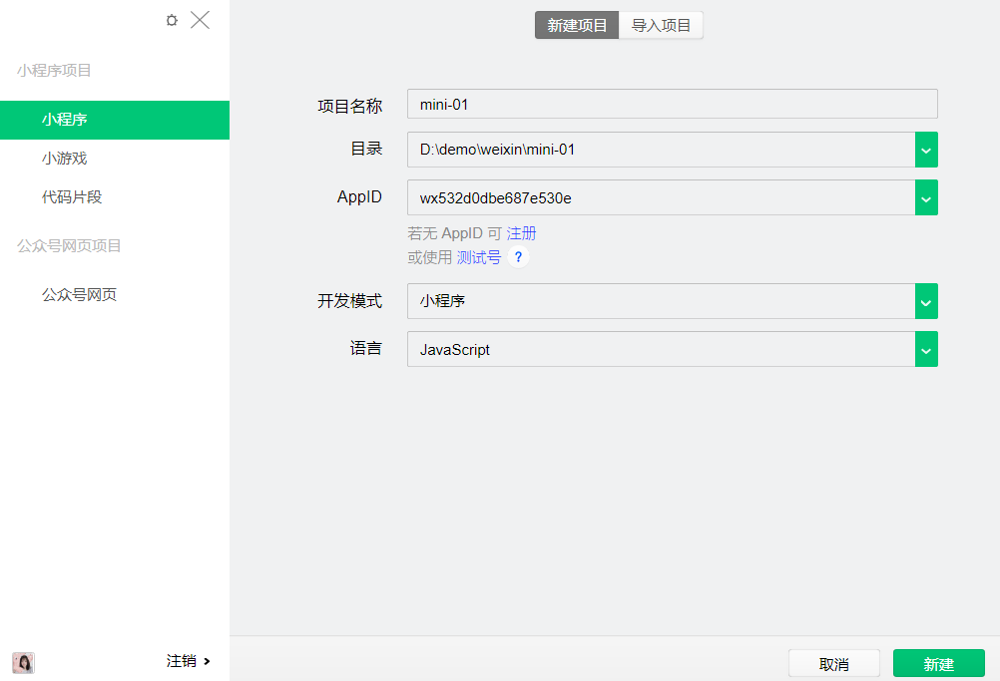

### 3.4 成功

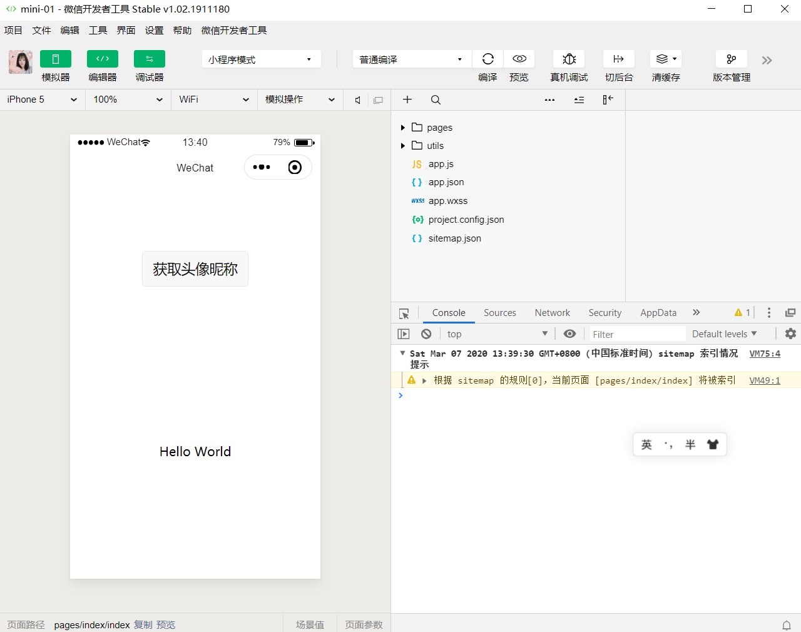

## 4. 微信开发者⼯具介绍 

详细的使⽤，可以查看[官网](https://developers.weixin.qq.com/miniprogram/dev/devtools/devtools.html)

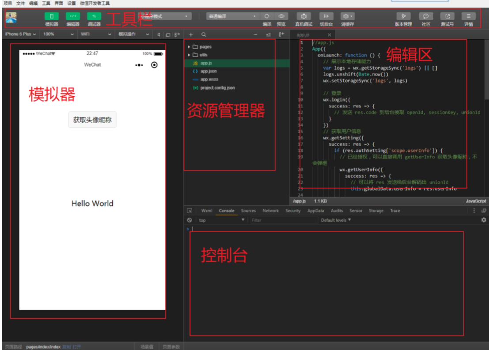

## 5. ⼩程序结构⽬录 

[⼩程序框架](https://developers.weixin.qq.com/miniprogram/dev/framework/MINA.html)的⽬标是通过尽可能简单、⾼效的⽅式让开发者可以在微信中开发具有原⽣APP体验的服务。
⼩程序框架提供了⾃⼰的视图层描述语⾔`WXML`和`WXSS `，以及` JavaScript` ，并在视图层与逻辑层间提供了数据传输和事件系统，让开发者能够专注于数据与逻辑。

### 5.1 ⼩程序⽂件结构和传统web对比

| 结构 | 传统web    | 微信⼩程序 |
| ---- | ---------- | ---------- |
| 结构 | HTML       | WXML       |
| 样式 | CSS        | WXSS       |
| 逻辑 | Javascript | Javascript |
| 配置 | ⽆         | JSON       |

通过以上对⽐得出，**传统web**是三层结构。⽽微信⼩程序 是四层结构，多了⼀层**配置.json**

### 5.2 基本的项⽬⽬录

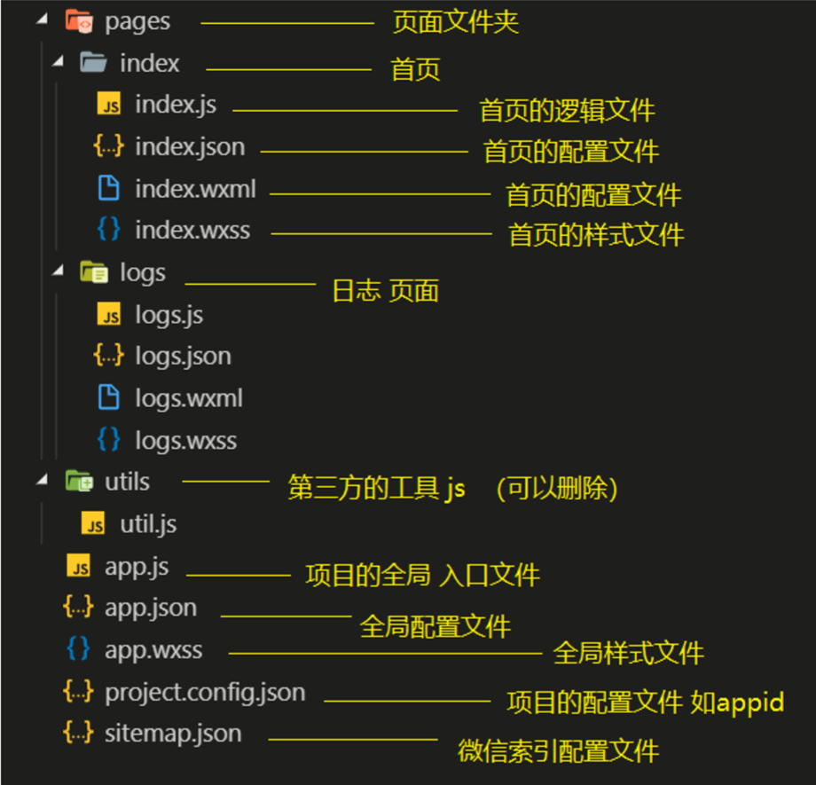

## 6. ⼩程序配置⽂件

⼀个⼩程序应⽤程序会包括最基本的两种配置⽂件。⼀种是全局的`app.json`和⻚⾯⾃⼰的`page.json`

> 注意：配置文件中不能出现注释。

==建议配置文件都在`微信开发者工具`中写，标签类的代码在`vscode`中写，因配置文件在前者才有代码提示==

### 6.1 [全局配置app.json](https://developers.weixin.qq.com/miniprogram/dev/framework/config.html
)

`app.json`是当前⼩程序的全局配置，包括了⼩程序的所有⻚⾯路径、界⾯表现、⽹络超时时间、底部 tab 等。**普通快速启动**项⽬⾥边的`app.json`配置

```json
{  
  "pages":[
    "pages/index/index",
    "pages/logs/logs"  
  ],
  "window":{
    "backgroundTextStyle":"light",
    "navigationBarBackgroundColor": "#fff",
    "navigationBarTitleText": "WeChat",
    "navigationBarTextStyle":"black"
  }
}
```

字段的含义

1. `pages`字段——⽤于描述当前⼩程序所有⻚⾯路径，这是为了让微信客⼾端知道当前你的⼩程序⻚⾯定义在哪个⽬录。 

     页面默认展示`pages`下第一个路径的页面，顺序可修改。	

     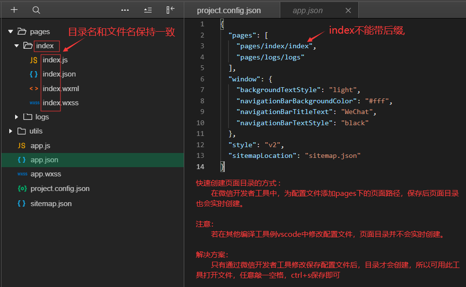

2. `window`字段——定义⼩程序所有⻚⾯的顶部背景颜⾊，⽂字颜⾊定义等。 

3. 完整的配置信息请参考[app.json](https://developers.weixin.qq.com/miniprogram/dev/reference/configuration/app.html)配置

#### 6.1.1 [tabbar](https://developers.weixin.qq.com/miniprogram/dev/reference/configuration/app.html) 

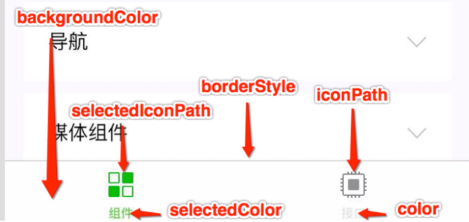

**和pages同级属性，定义导航栏**

**tabBar属性：**

​	list，

​	selectedColor（激活的文字颜色），

​	position（支持bottom默认/top，若为top则不展示图标）,

​	更多属性参考[tabbar](https://developers.weixin.qq.com/miniprogram/dev/reference/configuration/app.html) 

**list中属性：**

​	pagePath：点击图标展示对应路径页面，路径和pages下定义的相同

​	text：图标下的文字

​	iconPath：未激活展示的图标，路径和写图片路径一样

​	selectedIconPath：激活时展示的图标

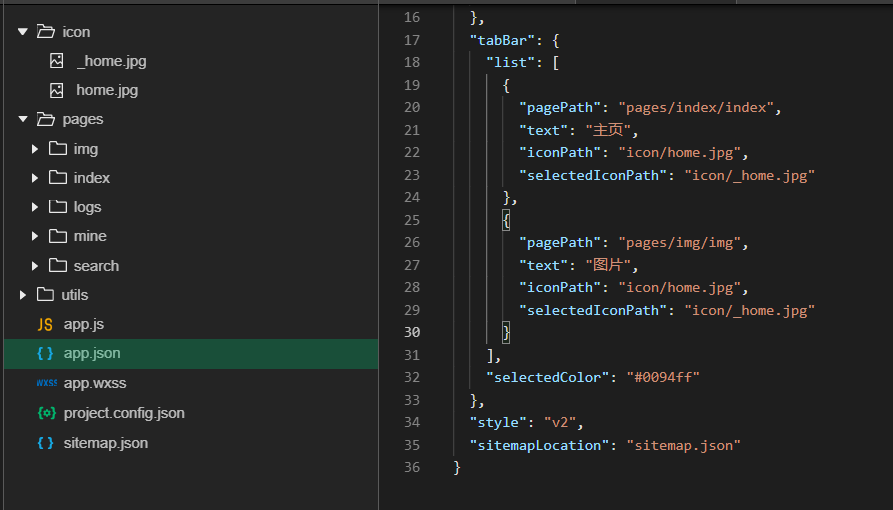

### 6.2 [⻚⾯配置page.json](https://developers.weixin.qq.com/miniprogram/dev/reference/configuration/page.html)

这⾥的` page.json`是⻚⾯⽬录下的`page.json`，是和⼩程序⻚⾯相关的配置。

作用：单独定义某个页面的属性，如顶部颜⾊、是否允许下拉刷新等等。

⻚⾯的配置只能设置`app.json`中部分`window`配置项的内容，⻚⾯中配置项会覆盖`app.json`的`window`中相同的配置项，其他页面不受影响仅指定页面生效。

| 属性                         | 类型     | 默认值  | 描述                                                         |
| ---------------------------- | -------- | ------- | ------------------------------------------------------------ |
| navigationBarBackgroundColor | HexColor | #000000 | 导航栏背景颜⾊，如`#000000`                                  |
| navigationBarTextStyle       | String   | white   | 导航栏标题颜⾊，仅⽀持` black`/`white`                       |
| navigationBarTitleText       | String   |         | 导航栏标题⽂字内容                                           |
| backgroundColor              | HexColor | #ffffff | 下拉刷新的loading区域背景色                                  |
| backgroundTextStyle          | String   | dark    | 下拉loading的样式，仅⽀持`dark`/`light`                      |
| enablePullDownRefresh        | Boolean  | false   | 是否全局开启下拉刷新。详⻅[Page.onPullDownRefresh](https://developers.weixin.qq.com/miniprogram/dev/framework/app-service/page.html#onpulldownrefresh) |
| onReachBottomDistance        | Number   | 50      | ⻚⾯上拉触底事件触发时距⻚⾯底部距离，单位为px。详⻅ [Page.onReachBottom](https://developers.weixin.qq.com/miniprogram/dev/framework/app-service/page.html#onreachbottom) |
| disableScroll                | Boolean  | false   | 设置为`true`则⻚⾯整体不能上下滚动；只在⻚⾯配置中有效，⽆法在`app.json`中设置该项 |

**使用**

> widow下的属性直接写在单个页面配置文件内，在这里是第一属性，作用单独为某个页面进行配置。

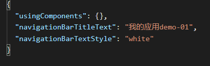

### 6.3 [sitemap 配置-了解即可](https://developers.weixin.qq.com/miniprogram/dev/reference/configuration/sitemap.html)

⼩程序根⽬录下的`sitemap.json`⽂件⽤于配置⼩程序及其⻚⾯是否允许被微信索引。

作用：让别人可以搜索到页面，详情查阅文档

## 7. 标签补充

text：类似span标签，行内元素，不会换行。

view：类似div标签，块集元素，会换行。

checkbox：类似复选框，checked值用`{{}}`表变量,`checked='false'`表示字符串即为`true`

```html
<text> ----1</text>

<view>333</view>

<checkbox checked="{{true}}" />
```

## 7. 模板语法

WXML（WeiXin Markup Language）是框架设计的⼀套标签语⾔，结合[基础组件](https://developers.weixin.qq.com/miniprogram/dev/component/)、[事件系统](https://developers.weixin.qq.com/miniprogram/dev/framework/view/wxml/event.html)，可以构建出⻚⾯的结构。

### 7.1 数据绑定

#### 7.1.1 普通写法 

```html
<view> {{ message }} </view>
```

```js
Page({
  data: {
    message: 'Hello MINA!'
  }
})
```

#### 7.1.2 组件属性

**属性使用变量：**

​	在vue中，用v-bind，例  `:属性="msg"`

​	在react中，用{ }，例  `属性={msg}`

​	在微信小程序中，用“{{  }}”，例  `属性="{{ msg }"`，注意{{ }}必须写单引号或双引号内

==注意：自定义属性，有些属性名导致属性不生效，有些会生效，解决方案未知。==

react中：用{}，例`属性={}`

属性使用变量，属性=“{{变量}}”，一定要用单引号或者双引号包裹

```js
<view id="item-{{id}}"> </view>
```

```js
Page({
  data: {
    id: 0
  }
})
```

#### 7.1.3 bool类型 

不要直接写 checked="false"，其计算结果是⼀个字符串

正确写法：

```js
<checkbox checked="{{false}}"> </checkbox>
```

### 7.2 运算 

==`{{ }}`内可以当变量使用，还可写`表达式`，但不可写`语句`，否则会报错。==

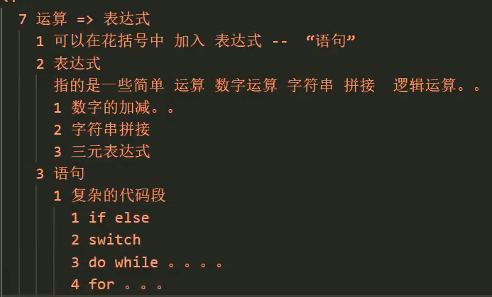

#### 7.2.1 三元运算

```js
<view hidden="{{flag ? true : false}}"> Hidden </view>
```

#### 7.2.2 算数运算 

```js
<view> {{a + b}} + {{c}} + d </view>
```

```js
Page({
  data: {
    a: 1,
    b: 2,
    c: 3  
  }
})
```

#### 7.2.3 逻辑判断 

```js
<view wx:if="{{length > 5}}"> </view>
```

#### 7.2.4 字符串运算

```js
<view>{{"hello" + name}}</view>
```

```js
Page({
  data:{
    name: 'MINA'
  }
})
```

#### ==7.2.5 注意==

花括号和引号之间如果有空格，将最终被解析成为字符串。

错误示范：

```html
<checkbox checked=" {{false}}" />
```


### 7.3 列表渲染 

#### 7.3.1 wx:for 

> 循环数组或对象

项的变量名默认为	` item`	 `wx:for-item`	可以指定数组当前元素的变量名
下标变量名默认为	`index`	`wx:for-index`	可以指定数组当前下标的变量名
`wx:key`	⽤来提⾼数组渲染的性能
`wx:key`	绑定的值 有如下选择

1. `string`类型，表⽰循环数组中的对象的唯⼀属性如

     ```js
     list:[{id:0,name:"炒饭"},{id:1,name:"炒面"}]
     
     wx:key="id"
     ```

2. 保留字`*this`，它的意思是`item`本⾝，*this 代表的必须是 唯⼀的字符串和数组。

     ```js
     list:[1,2,3,4,5]
      
     wx:key="*this"
     ```

**代码：**

```js
<view wx:for="{{array}}" wx:key="id">
  {{index}}: {{item.message}}
</view>
```

```js
Page({
  data: {
    array: [{
      id:0,
      message: 'foo',
    }, {      
      id:1,
      message: 'bar'
    }]
  }
})
```

#### 7.3.2 block

渲染⼀个包含多节点的结构块block最终不会变成真正的dom元素

```js
<block wx:for="{{[1, 2, 3]}}" wx:key="*this" >
  <view> {{index}}: </view>
	<view> {{item}} </view>
</block>
```

### 7.4 条件渲染 

#### 7.4.1 wx:if

在框架中，使⽤	`wx:if="{{condition}}"`	来判断是否需要渲染该代码块：

```js
<view wx:if="{{false}}">1</view>
<view wx:elif="{{true}}">2</view>
<view wx:else>3</view>
```

#### 7.4.2 hidden 

```js
<view hidden="{{condition}}"> True </view>
```

类似  ` wx:if`
频繁切换  ⽤  `hidden`

不常使⽤  ⽤  `wx:if`

## 8. ⼩程序事件的绑定 