# 微信小程序基本使用

## 1. 什么是微信小程序

微信⼩程序，简称⼩程序，英⽂名 `Mini Program` ，微信小程序是微信内部的,是⼀种不需要下载安装即可使⽤的应⽤，它实现 了应⽤“触⼿可及”的梦想，⽤⼾扫⼀扫或搜⼀下即可打开应⽤

## 2. 环境准备

### 2.1 注册账号

> 微信小程序是谁开发的，它有一个唯一的开发者信息，所以需要注册账号，作为开发者信息证明。
>
> 建议使用全新的邮箱,没有注册过其他小程序和公众号的，也没绑定过微信。

访问[注册页面](https://mp.weixin.qq.com/wxopen/waregister?action=step1)，耐⼼完成注册即可。

### 2.2 获取APPID 

由于后期调⽤微信⼩程序的接⼝(例获取手机信息,微信支付)等功能或者发布上线，需要索取开发者的⼩程序中的 APPID APPID ，所以在注册成功后， 可登录，然后获取APPID。

[登录](https://mp.weixin.qq.com/)，成功后可看到如下界⾯
然后复制你的APPID,悄悄的保存起来，不要给别⼈看到😄

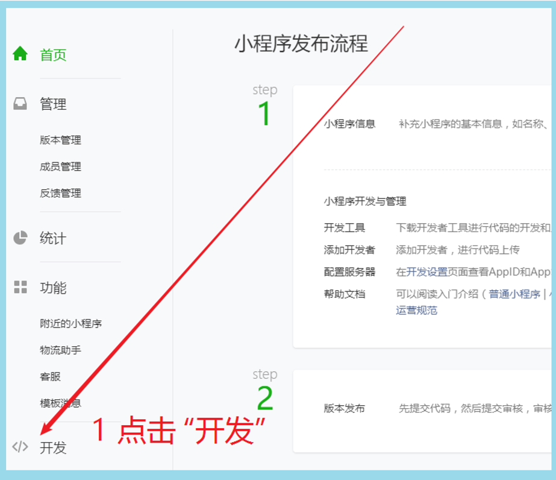

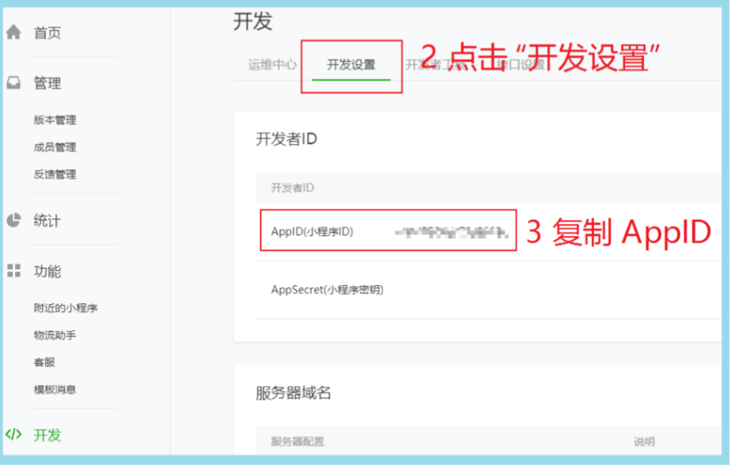

### 2.3. 开发⼯具 

[下载微信开发者工具](https://developers.weixin.qq.com/miniprogram/dev/devtools/download.html)(点击安装包一直next即可)

> 开发网页可以通过浏览器预览，而开发小程序应用，需要有自己的开发环境。

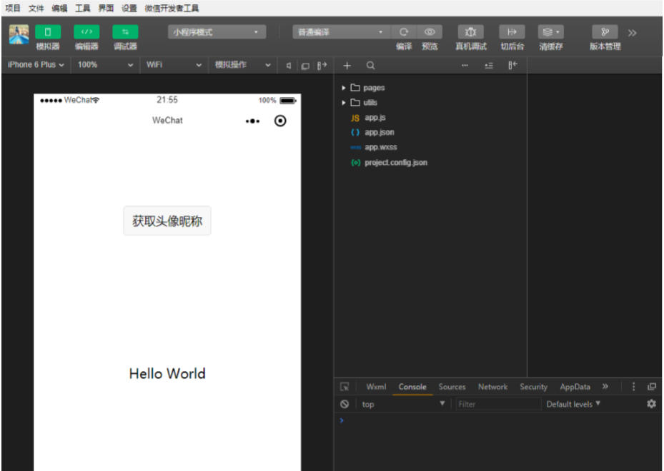

微信⼩程序⾃带开发者⼯具，集**开发、预览、调试、发布**于⼀⾝的完整环境。
但是由于编码的体验不算好，因此建议使⽤`vs code` + `微信小程序编辑工具`来实现编码
`vs code `负责敲代码，` 微信编辑工具`负责预览

## 3. 第⼀个微信⼩程序

### 3.1 打开微信开发者⼯具 

注意：第⼀次登录的时候需要扫码登录

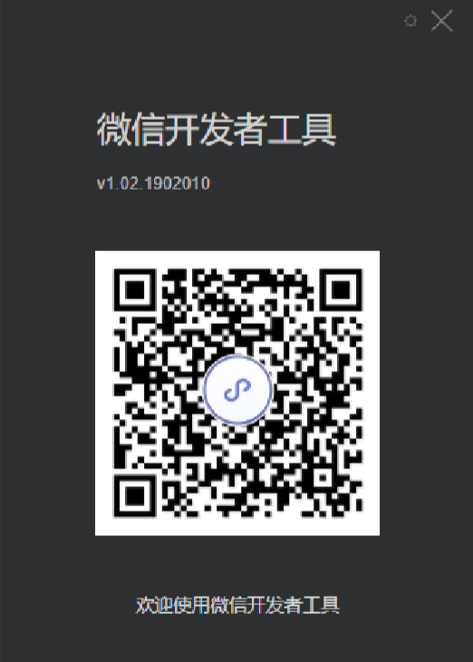

### 3.2 新建小程序项目

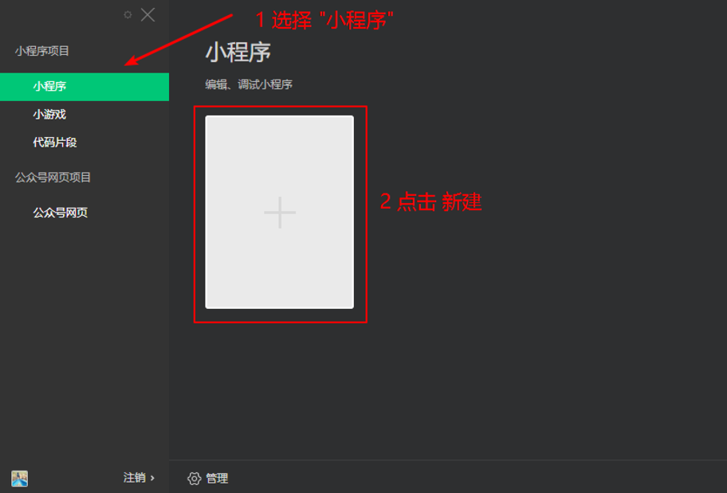

### 3.3 填写项⽬信息 

目前AppID是用的测试号，测试号不能选择云开发，所以默认没有后端服务此栏，后期可以更改AppID。

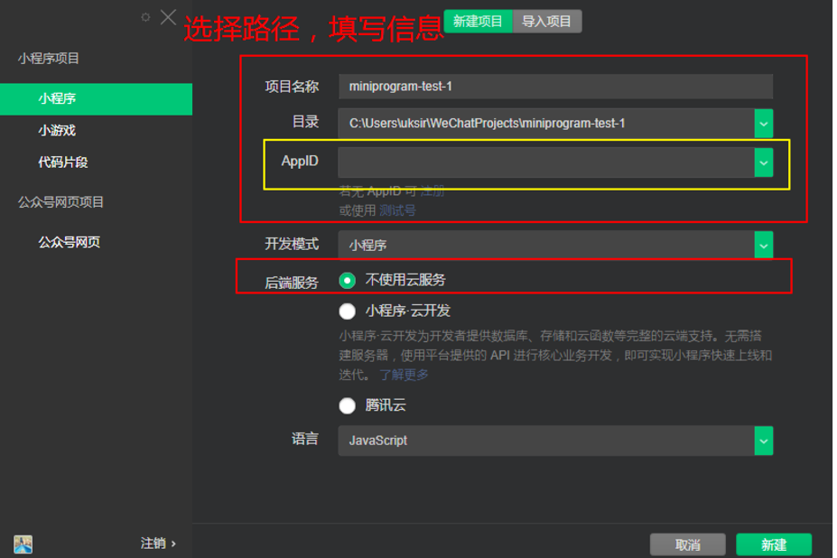

选择测试号后界面如下，新建。

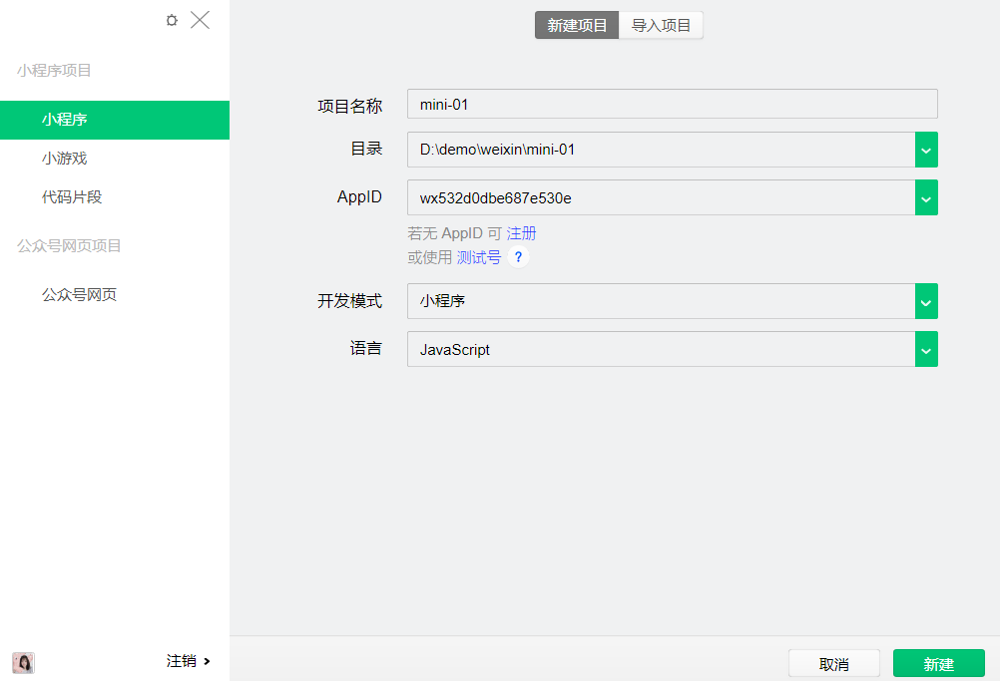

### 3.4 成功

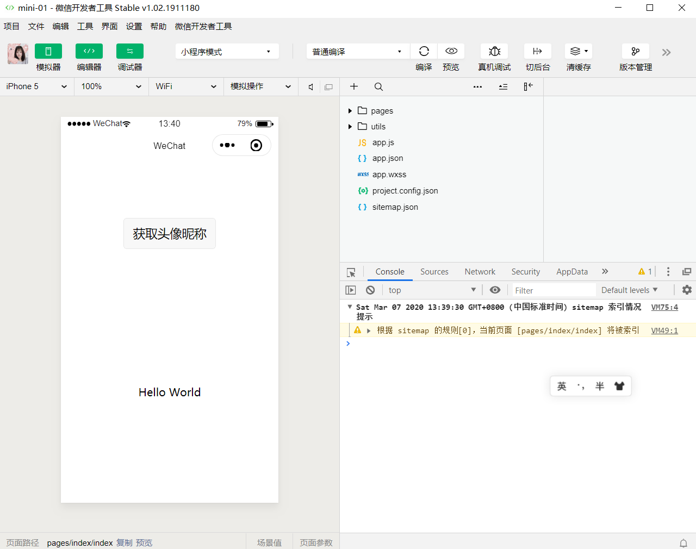

## 4. 微信开发者⼯具介绍 

详细的使⽤，可以查看[官网](https://developers.weixin.qq.com/miniprogram/dev/devtools/devtools.html)


## 5. ⼩程序结构⽬录 

[⼩程序框架](https://developers.weixin.qq.com/miniprogram/dev/framework/MINA.html)的⽬标是通过尽可能简单、⾼效的⽅式让开发者可以在微信中开发具有原⽣APP体验的服务。
⼩程序框架提供了⾃⼰的视图层描述语⾔`WXML`和`WXSS `，以及` JavaScript` ，并在视图层与逻辑层间提供了数据传输和事件系统，让开发者能够专注于数据与逻辑。

### 5.1 ⼩程序⽂件结构和传统web对比

| 结构 | 传统web    | 微信⼩程序 |
| ---- | ---------- | ---------- |
| 结构 | HTML       | WXML       |
| 样式 | CSS        | WXSS       |
| 逻辑 | Javascript | Javascript |
| 配置 | ⽆         | JSON       |

通过以上对⽐得出，**传统web**是三层结构。⽽微信⼩程序 是四层结构，多了⼀层**配置.json**

### 5.2 基本的项⽬⽬录

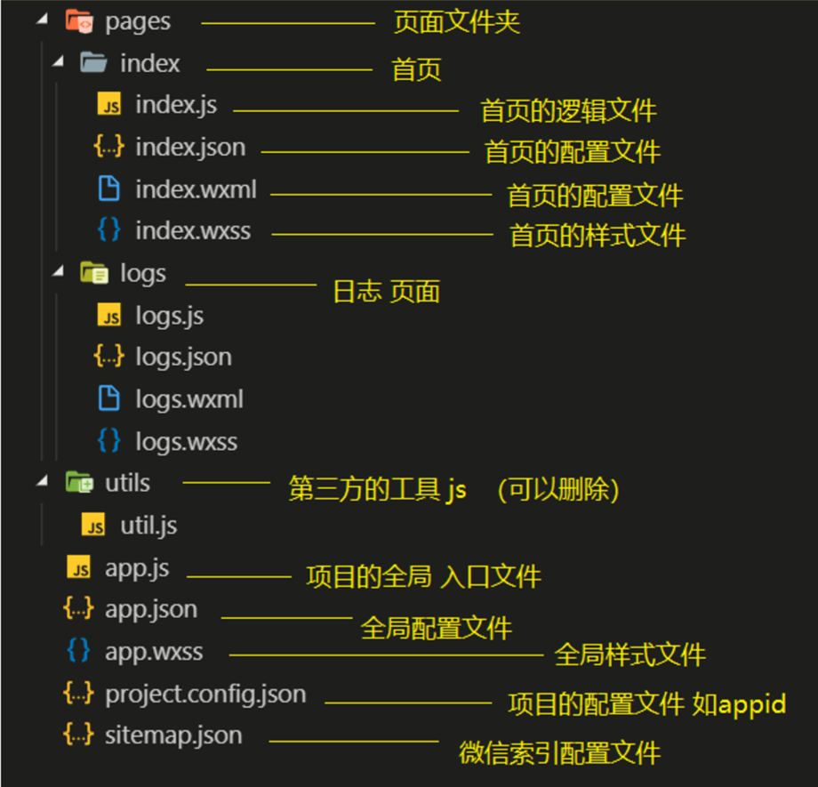

## 6. ⼩程序配置⽂件

⼀个⼩程序应⽤程序会包括最基本的两种配置⽂件。⼀种是全局的`app.json`和⻚⾯⾃⼰的`page.json`

> 注意：配置文件中不能出现注释。

==建议配置文件都在`微信开发者工具`中写，标签类的代码在`vscode`中写，因配置文件在前者才有代码提示==

### 6.1 [全局配置app.json](https://developers.weixin.qq.com/miniprogram/dev/framework/config.html
)

`app.json`是当前⼩程序的全局配置，包括了⼩程序的所有⻚⾯路径、界⾯表现、⽹络超时时间、底部 tab 等。**普通快速启动**项⽬⾥边的`app.json`配置

```json
{  
  "pages":[
    "pages/index/index",
    "pages/logs/logs"  
  ],
  "window":{
    "backgroundTextStyle":"light",
    "navigationBarBackgroundColor": "#fff",
    "navigationBarTitleText": "WeChat",
    "navigationBarTextStyle":"black"
  }
}
```

字段的含义

1. `pages`字段——⽤于描述当前⼩程序所有⻚⾯路径，这是为了让微信客⼾端知道当前你的⼩程序⻚⾯定义在哪个⽬录。 

     页面默认展示`pages`下第一个路径的页面，顺序可修改。	

     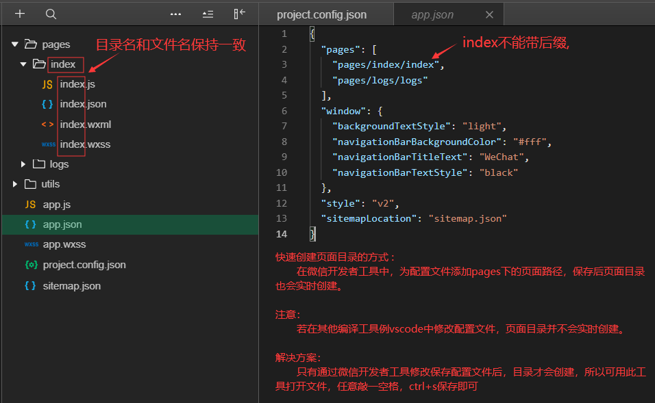

2. `window`字段——定义⼩程序所有⻚⾯的顶部背景颜⾊，⽂字颜⾊定义等。 

3. 完整的配置信息请参考[app.json](https://developers.weixin.qq.com/miniprogram/dev/reference/configuration/app.html)配置

#### 6.1.1 [tabbar](https://developers.weixin.qq.com/miniprogram/dev/reference/configuration/app.html) 

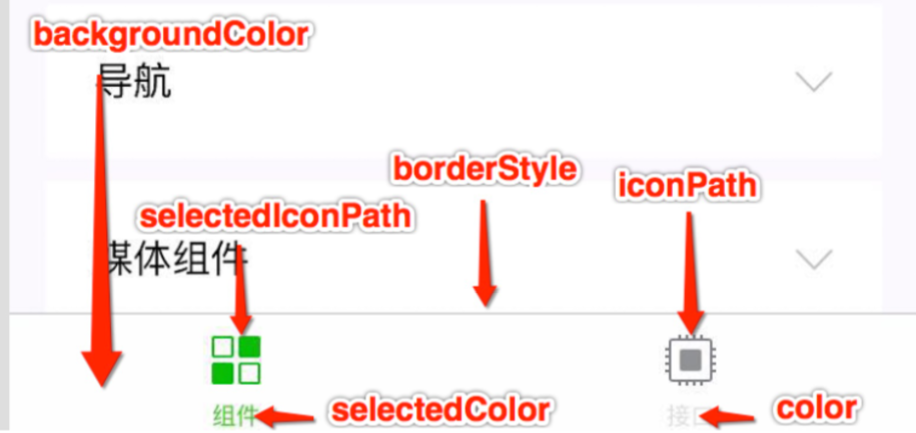

**和pages同级属性，定义导航栏**

**tabBar属性：**

​	list，

​	selectedColor（激活的文字颜色），

​	position（支持bottom默认/top，若为top则不展示图标）,

​	更多属性参考[tabbar](https://developers.weixin.qq.com/miniprogram/dev/reference/configuration/app.html) 

**list中属性：**

​	pagePath：点击图标展示对应路径页面，路径和pages下定义的相同

​	text：图标下的文字

​	iconPath：未激活展示的图标，路径和写图片路径一样

​	selectedIconPath：激活时展示的图标

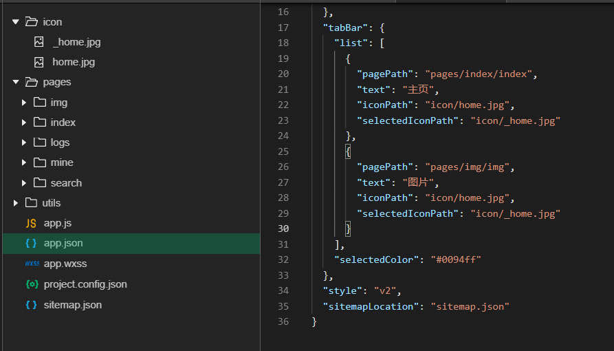

### 6.2 [⻚⾯配置page.json](https://developers.weixin.qq.com/miniprogram/dev/reference/configuration/page.html)

这⾥的` page.json`是⻚⾯⽬录下的`page.json`，是和⼩程序⻚⾯相关的配置。

作用：单独定义某个页面的属性，如顶部颜⾊、是否允许下拉刷新等等。

⻚⾯的配置只能设置`app.json`中部分`window`配置项的内容，⻚⾯中配置项会覆盖`app.json`的`window`中相同的配置项，其他页面不受影响仅指定页面生效。

注意：**下拉刷新**和**触底加载下一页**的功能**都是生命周期钩子函数**

| 属性                         | 类型     | 默认值  | 描述                                                         |
| ---------------------------- | -------- | ------- | ------------------------------------------------------------ |
| navigationBarBackgroundColor | HexColor | #000000 | 导航栏背景颜⾊，如`#000000`                                  |
| navigationBarTextStyle       | String   | white   | 导航栏标题颜⾊，仅⽀持` black`/`white`                       |
| navigationBarTitleText       | String   |         | 导航栏标题⽂字内容                                           |
| backgroundColor              | HexColor | #ffffff | 下拉刷新的loading区域背景色                                  |
| backgroundTextStyle          | String   | dark    | 下拉loading的样式，仅⽀持`dark`/`light`                      |
| enablePullDownRefresh        | Boolean  | false   | 是否全局开启下拉刷新。详⻅[Page.onPullDownRefresh](https://developers.weixin.qq.com/miniprogram/dev/framework/app-service/page.html#onpulldownrefresh) |
| onReachBottomDistance        | Number   | 50      | ⻚⾯上拉触底事件触发时距⻚⾯底部距离，单位为px。详⻅ [Page.onReachBottom](https://developers.weixin.qq.com/miniprogram/dev/framework/app-service/page.html#onreachbottom) |
| disableScroll                | Boolean  | false   | 设置为`true`则⻚⾯整体不能上下滚动；只在⻚⾯配置中有效，⽆法在`app.json`中设置该项 |

**使用**

> widow下的属性直接写在单个页面配置文件内，在这里是第一属性，作用单独为某个页面进行配置。

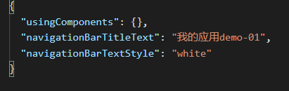

### 6.3 [sitemap 配置-了解即可](https://developers.weixin.qq.com/miniprogram/dev/reference/configuration/sitemap.html)

⼩程序根⽬录下的`sitemap.json`⽂件⽤于配置⼩程序及其⻚⾯是否允许被微信索引。

作用：让别人可以搜索到页面，详情查阅文档

## 7. 标签补充

text：类似span标签，行内元素，不会换行。

view：类似div标签，块集元素，会换行。

checkbox：类似复选框，checked值用`{{}}`表变量,`checked='false'`表示字符串即为`true`

block：占位符，不会渲染为dom元素

```html
<text> ----1</text>

<view>333</view>

<checkbox checked="{{true}}" />

<block></block>
```

## 7. 模板语法

WXML（WeiXin Markup Language）是框架设计的⼀套标签语⾔，结合[基础组件](https://developers.weixin.qq.com/miniprogram/dev/component/)、[事件系统](https://developers.weixin.qq.com/miniprogram/dev/framework/view/wxml/event.html)，可以构建出⻚⾯的结构。

### 7.1 数据绑定

#### 7.1.1 普通写法 

```html
<view> {{ message }} </view>
```

```js
Page({
  data: {
    message: 'Hello MINA!'
  }
})
```

#### 7.1.2 组件属性

**属性使用变量：**

​	在vue中，用v-bind，例  `:属性="msg"`

​	在react中，用{ }，例  `属性={msg}`

​	在微信小程序中，用“{{  }}”，例  `属性="{{ msg }"`，注意{{ }}必须写单引号或双引号内

==注意：自定义属性，有些属性名不生效，解决方案未知，怀疑自定义属性必须`data-`开头。==

react中：用{}，例`属性={}`

属性使用变量，属性=“{{变量}}”，一定要用单引号或者双引号包裹

```js
<view id="item-{{id}}"> </view>
```

```js
Page({
  data: {
    id: 0
  }
})
```

#### 7.1.3 bool类型 

不要直接写 checked="false"，其计算结果是⼀个字符串

正确写法：

```js
<checkbox checked="{{false}}"> </checkbox>
```

### 7.2 运算 

==`{{ }}`内可以当变量使用，还可写`表达式`，但不可写`语句`，否则会报错。==

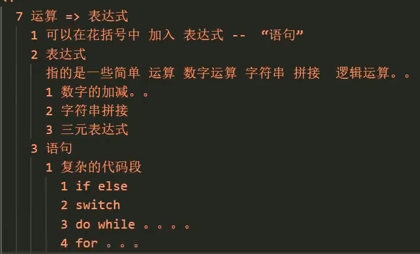

#### 7.2.1 三元运算

```js
<view hidden="{{flag ? true : false}}"> Hidden </view>
```

#### 7.2.2 算数运算 

```js
<view> {{a + b}} + {{c}} + d </view>
```

```js
Page({
  data: {
    a: 1,
    b: 2,
    c: 3  
  }
})
```

#### 7.2.3 逻辑判断 

```js
<view wx:if="{{length > 5}}"> </view>
```

#### 7.2.4 字符串运算

```js
<view>{{"hello" + name}}</view>
```

```js
Page({
  data:{
    name: 'MINA'
  }
})
```

#### ==7.2.5 注意==

花括号和引号之间如果有空格，将最终被解析成为字符串。

错误示范：

```html
<checkbox checked=" {{false}}" />
```


### 7.3 列表渲染 

#### 7.3.1 wx:for 循环数组、对象

==**代码：**==

​	循环数组

```jsx
<view>
  <view wx:for="{{list}}" wx:for-item="item" wx:for-index="index" wx:key="id">
  索引：{{index}}--值：{{item.name}}
  </view>
</view>
```

```js
Page({
  data: {
    list: [{id:0,name: 'foo',}, {id:1,name: 'bar'}]
  }
})
```

​	循环对象

```html
<view wx:for="{{obj}}" wx:for-item="value" wx:for-index="key" wx:key="name">
  {{value}}------{{key}}
</view>
```

```
obj:{name:'张三',age:18,sex:'男'}
```

==**解释**==

**wx:for**

```
wx:for="{{数组或对象}}" 放循环的数组或对象
```

**wx:for-item		wx:for-index**

```
wx:for-item="这里写变量,表示循环的每一项"
wx:for-index="这里写变量,表示循环项的下标"

项的变量名默认为item
下标变量名默认为index
默认设置,可不写wx:for-item="item" wx:for-index="index"

注意:
	1.多层循环时写防止命名重复，引号内的item和index变量可自行命名,等号前均关键字不可改。
	2.若循环对象则将item命名为value，index命名key,语义更明确。
```

**wx:key**

> wx:key⽤来提⾼数组渲染的性能 

`wx:key`	绑定的值 有如下选择

1. `string`类型，表⽰循环数组中的对象的唯⼀属性如：

     ```js
     list:[{id:0,name:"炒饭"},{id:1,name:"炒面"}]
     
     wx:key="id"
     ```

2. 保留字`*this`，当循环单纯数组时，例[1,2,3]或者['1','2','3']，则需用`*this`，`*this`表循环的每一项

     ```js
     list:[1,2,3,4,5]
      
     wx:key="*this"
     ```

注意：key值若随意乱写,不会报错,但应避免乱写.

#### 7.3.2 block

渲染⼀个包含多节点的结构块block最终不会变成真正的dom元素，block标签不会渲染

```js
<block wx:for="{{[1, 2, 3]}}" wx:key="*this" >
  <view> {{index}}: </view>
	<view> {{item}} </view>
</block>
```

### 7.4 条件渲染 

#### 7.4.1 wx:if

> 类似vue中的，通过添加或删除元素实现。

在框架中，使⽤	`wx:if="{{condition}}"`	来判断是否需要渲染该代码块：

```js
<view wx:if="{{false}}">1</view>
<view wx:elif="{{true}}">2</view>
<view wx:else>3</view>
```

#### 7.4.2 hidden 

> 类似vue中show，不同的是hidden译隐藏，hidden不写值等效于hidden='{{true}}'隐藏，false显示
>
> 通过display实现

```js
<view hidden="{{condition}}"> True </view>
```


频繁切换  ⽤  `hidden`

不常使⽤  ⽤  `wx:if`

## 8. ⼩程序事件的绑定 

⼩程序中绑定事件，通过bind关键字来实现。如`bindtap`、`bindinput`、` bindchange`等
不同的组件⽀持不同的事件，具体看组件的说明即可。不是小驼峰，全小写。

**例：**

​	`bindtap`：绑定`tap`事件，小程序中用`tap`代替`click`，点击时触发事件。

​	`bindinput`：`input`输入框值改变时触发事件。

### 8.1 绑定事件 

```html
<input bindinput="handleInput" />
```

注意：

 1. 是直接写方法名，不用`{{ }}`。

 2. 小程序中标签严格，必须闭合，否则报错。

 3. input标签默认没样式。

 4. 绑定事件时不能带参数、不能带括号、**以下为错误写法**

     ```html
     <!--会直接将'handleInput(100)'整个都解析为方法名,报错:找不到此方法--> 
     
     <input bindinput="handleInput(100)" />
     ```

### 8.2 定义处理函数 

事件函数直接写，和data属性同级,无需写在其他属性内部。

接收 `e事件源对象` 为参数，很多东西可通过 `e` 获取

==若在方法内想用其他方法，通过`this.方法名`获取==

```js
Page({
  data:{},
  // 绑定的事件
  handleInput: function(e) {
    console.log(e);
    console.log("值被改变了");
  }
})
```

### 8.3 为事件传参 

1. 事件传值，通过标签⾃定义属性的⽅式

     **注意：**
     	a. 必须`data-`开头，`num`为属性名，不以`data-`开头无效。
     	b. 值获取：在函数中`e.currentTarget.dataset.num`获取 ,这里不写`data-num`直接`num`。

     ​	c. 若属性是小驼峰，也会隐式转化为全小写，例`data-itemLfet`会变成``data-itemlfet`只能凭全小写的属性取参，不能用小驼峰的取参。
     
     ```html
     <input bindinput="handleInput" data-num="100" />
     ```

### 8.4 事件触发时获取数据

```js
 handleInput: function(e) {
    // 获取自定义属性传的值{num:100}
    console.log(e.currentTarget.dataset)
    
    // 获取输入框的值
    console.log(e.detail.value);
  }
```

### 8.4 获取、更改data值

**获取：**

```js
//在方法内获取data值

this.data.数据名
```

**赋值：**

```js
// 给data上数据赋值方式和vue不同
// 需通过此方式赋值,类似react中的this.setState({})

this.setData({
  num:1
})
```

 ==注意 遍历数组时修改循环项item,则data中的源数据也会被修改,但是页面并不会更新,所以需setData==

## 9. 样式 WXSS 

WXSS( `WeiXin Style Sheets` )是⼀套样式语⾔，⽤于描述`WXML`的组件样式。
与**CSS**相⽐，**WXSS**扩展的特性有：

响应式⻓度单位`rpx`样式导⼊

### 9.0 注意事项

1. 无需自己引入样式，小程序会自行帮忙寻找所在文件夹的同名文件`wcss`并引入，所以目录下文件命名一致

2. `pages`内的样式文件，模块化，仅对指定页面有效。

3. `@import`引入的样式文件，模块化，仅对指定页面有效，不污染全局。注意，若引入`app.wxss`则全局生效

3. `app.wxss`是全局样式文件，对所有页面都有效。

     ==总结：==
     
     ​	==`app.wxss`是全局样式文件，其他都局部有效。==
     
     ​	==可自己建目录`styles`里面分功能放公共样式，若直接引入页面则仅对页面有效，若想全局生效可引入`app.wxss`==
     
     

### 9.1 尺⼨单位 

`rpx` （responsive pixel）: 可以根据屏幕宽度进⾏⾃适应。规定屏幕宽px等于`750rpx` 。如在 `iPhone6 `上，屏幕宽度为`375px` ，共有750个物理像素，则 `750rpx = 375px = 750物理像素 `， `1rpx = 0.5px = 1物理像素`。

| 设备         | rpx换算px (屏幕宽度/750) | px换算rpx (750/屏幕宽度) |
| ------------ | ------------------------ | ------------------------ |
| iPhone5      | 1rpx = 0.42px            | 1px = 2.34rpx            |
| iPhone6      | 1rpx=0.5px               | 1px=2rpx                 |
| iPhone6 Plus | 1rpx = 0.552px           | 1px = 1.81rpx            |

 **建议**：  开发微信⼩程序时设计师可以⽤  iPhone6  作为视觉稿的标准。
使⽤步骤：

1.  确定设计稿宽度  pageWidth
2.  计算⽐例   `750rpx = pageWidth px` (规定屏幕宽始终等于`750rpx`由此可得出比例关系)  ,因此   ` 1px=750rpx/pageWidth `。 
3.  在less⽂件中，只要把设计稿中的   `px`   =>   `750/pageWidth rpx`   即可。

```
css和wxss都支持calcs属性

注意:
	1.若750rpx,则数字和rpx中间不能有空格。
	2.运算符两边必须有空格。
```

==wxss中也支持vw,偶尔可用==

### 9.2 样式导⼊    

wxss中⽀持样式导⼊功能。使⽤`@import` 语句导⼊外联样式表，只⽀持**相对路径**就 `../` 这类的。

`@import`引入的样式文件，模块化，仅对指定页面有效，不污染全局。

⽰例代码：

```less
/** 结束一定要加 ; 分号 **/
@import "../../common.wxss";		
```

### 9.3 选择器 

特别需要注意的是 ⼩程序 不⽀持通配符` * `因此以下代码⽆效！

```less
*{
  margin:0;
  padding:0;
  box-sizing:border-box;
}
```

解决方案:

只有手写标签,  注意小程序中标签和web页面不同,  最外层根标签是page

```css
page,view,text,swiper,swiper-item,image,navigator{
  padding: 0;
  margin: 0;
  box-sizing: border-box;
}
```

⽬前⽀持的选择器有：

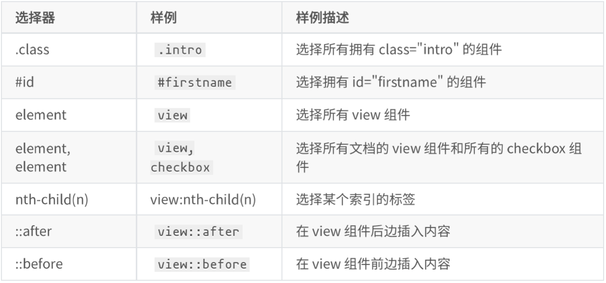

### 9.4 ⼩程序中使⽤less 

原⽣⼩程序不⽀持`less` ，其他基于⼩程序的框架⼤体都⽀持，如`wepy `， `mpvue `， `taro `等。 但是仅仅因为⼀个less功能，⽽去引⼊⼀个框架，肯定是不可取的。因此可以⽤以下⽅式来实现。

1. 编辑器是`vscode `

2. 安装插件 `easy less`

     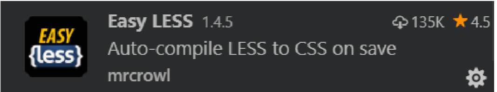

3. 在vs code的设置中加⼊如下，配置

     ```json
       "less.compile": {
         "outExt":".wxss"
       }
     ```

4. 在要编写样式的地⽅，新建`less` ⽂件，如`index.less` ,然后正常编辑即可。

     配置后会在当前目录下创建一份`.wxss`后缀的样式文件。

     

     **拓展内容：**

     此插件也可将`less`转为`css`，所以要转哪个时就配置哪个，注销另一个。

     ```json
     //转为css的配置,插件默认转css,此设置是将转后的css文件放到当前目录  
     "less.compile": {
          "out":".\\"
       },
     ```

### 9.5 注释

**less注释**

​	在less文件写注释：转换时，//注释不会被编译 /**/才会被编译

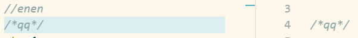

**wxss注释**

​		1. 单独在wxss写注释，`//`不支持，编译器爆红，注释不了

​		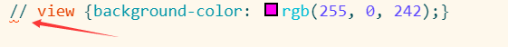

​		2. 支持`/*    */`写法

```less
/*view {background-color: rgb(255, 0, 242);}  */ 
```


**综上：不管写`less`还是`wxss`都写多行注释，防止出错，养成好习惯。**

## 10. [常⻅组件](https://developers.weixin.qq.com/miniprogram/dev/component/)

重点讲解⼩程序中常⽤的布局组件

`view,text,rich-text,button,image,navigator,icon,swiper,radio,checkbox。 ` 等

### 10.1 [view](https://developers.weixin.qq.com/miniprogram/dev/component/view.html) 

代替 原来的`div `标签

```html
<view hover-class="h-class">
   点击我试试
</view>
```

### 10.2 [text](https://developers.weixin.qq.com/miniprogram/dev/component/text.html)   

1. ⽂本标签 
2.  只能嵌套text
3.  ⻓按⽂字可以复制（只有该标签有这个功能） 
4. 可以对空格  回⻋  进⾏编码

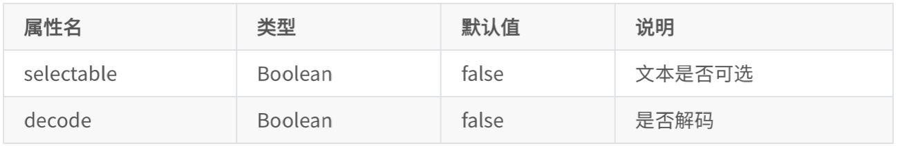

#### 10.2.1 代码 

```html
<text selectable="{{false}}" decode="{{false}}">
   普&nbsp;通  
</text>
```

### 10.3 [image](https://developers.weixin.qq.com/miniprogram/dev/component/image.html) 

> 微信规定项目打包上线不超过2M，所以建议静态资源都放到外网或服务器，通过网络请求获取，外网例[图床](https://images.ac.cn/)，图床使用步骤附后面。

1. 图⽚标签，image组件默认宽度320px、⾼度240px
2. ⽀持懒加载

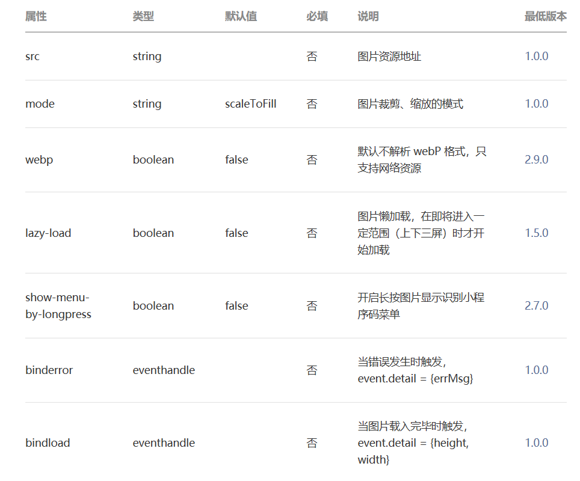

**注意：**

**`aspectfit`：类似`container`，居中**

**`aspectfill`：类似`cover`，居中**

**小程序会自动判断图片的哪边长哪边短，不是固定指宽高，所以`aspectfit`长边完全显示即`container`，另一个则`cover`**

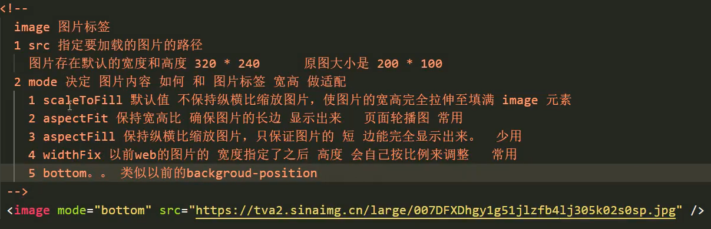

mode   有效值：
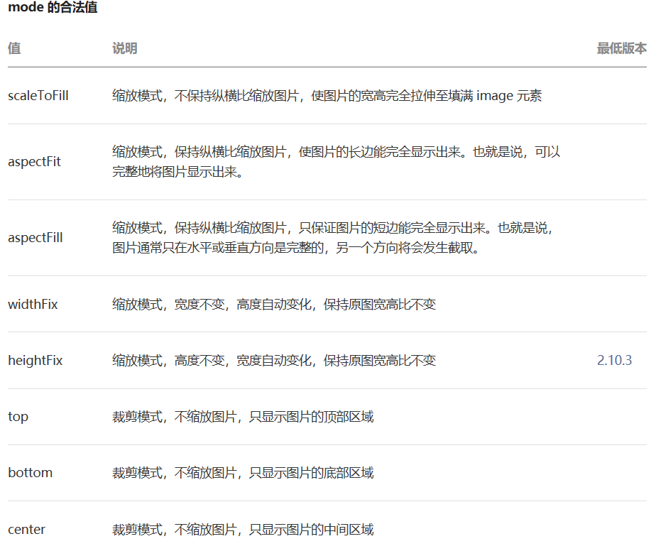

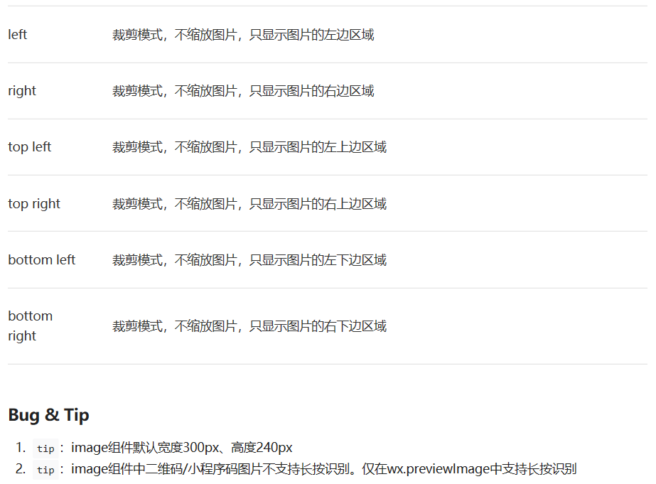

**额外拓展**

**图床使用步骤：**

> 因微信小程序限制项目不超过2M，所以若把图片都放项目文件夹中会造成体积过大，解决方案就是通过网络请求获取资源。一种是自己的服务器请求，另一种是图床：把图片放别人的网站托管，相当于网络图片，节省自己的服务器。
>
> 这里图床仅做了解，因我们做项目肯定是从服务器获取资源，不是图床，放别人家始终不长久。

步骤:  选择图片--->上传--->复制url--->直接使用即可

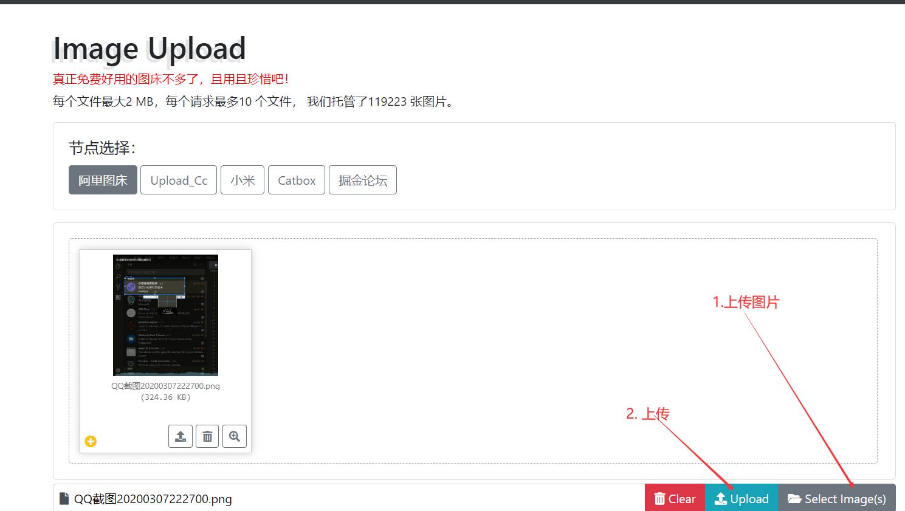

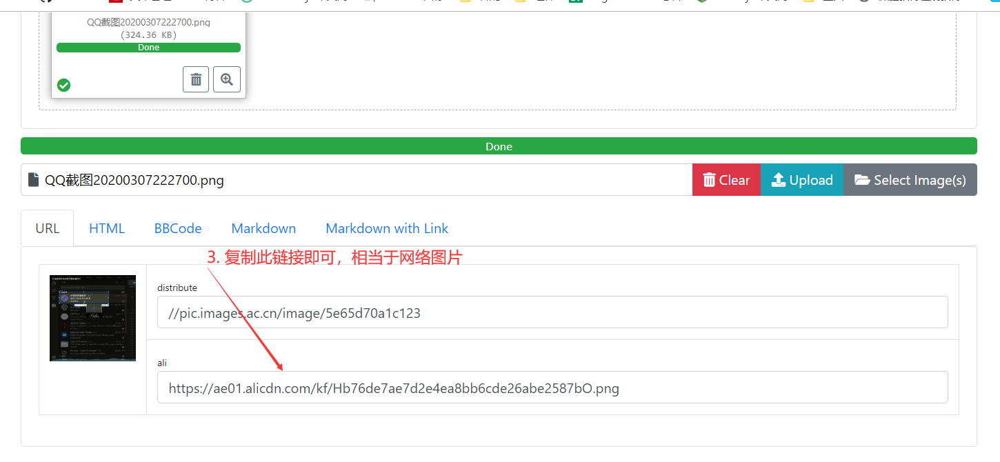

### 10.4 [swiper](https://developers.weixin.qq.com/miniprogram/dev/component/swiper.html) 

> 微信内置轮播图组件

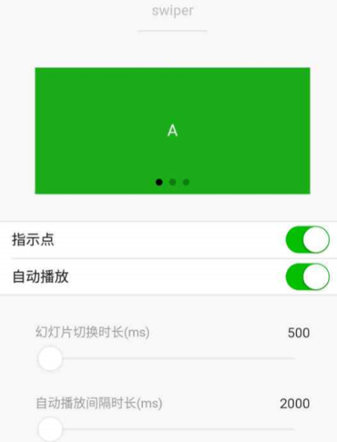

==仅部分属性，更多功能看文档：==


#### 10.4.1 swiper 

轮播图外层容器。

存在默认样式宽度 100% ⾼度 150px ，不会被内容撑开高度需自行设置高度

#### 10.4.2 swiper-item 

轮播图的每一项。

默认宽度和⾼度都是100%，类似`view`，里面可以放`a`链接或`image`组件等，

**注意：轮播图的`swiper `和`swiper-item `必须配套使用。**

#### 10.4.3 基本使用

**一般*autoplay* *circular*  indicator-dots 这三个会一起使用,注意若为true可不写,直接属性名即可,布尔属性,只写属性名表true**

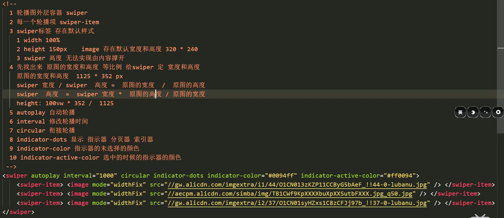

### 10.5 [navigator](https://developers.weixin.qq.com/miniprogram/dev/component/navigator.html) 

> 导航组件 类似超链接标签

`self`：指跳转到自己小程序内的页面

`miniprogram`: 指跳转到别人小程序的页面

**open-type:**

`navigate`：保留当前页面指头部左上角会出现后退按钮

`redirect`: 不会出现返回按钮

不允许跳到`tabbar`页面：指点击`tarbar`上的选项会跳转的页面,选项内指向的多个页面，这些页面不行

`switchTab`:跳转到`tabbar`页面,没有返回按钮

`reLauch`: 跳转到应用内任意页面,无返回按钮

`navigatBack`: 类似回退,返回上一页面或多级页面

`exit`: 指退出别人的小程序, 不是自己的小程序  

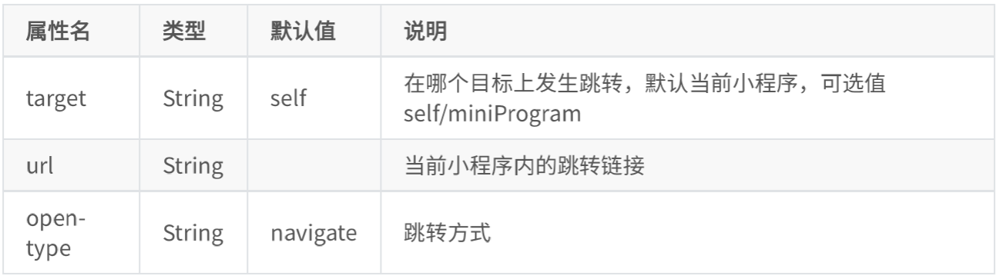

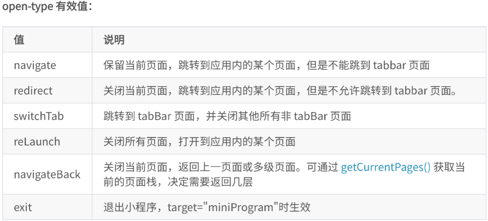

**代码示例**

```html
// 注意: 跳转到当前小程序的页面,所以目录从/开始,其他类似全局配置中的pages的路径设置,没有后缀
// url: 可以相对路径也可以绝对路径,/开始的就叫绝对。
<navigator url="/pages/index/index">跳转到首页</navigator>
```

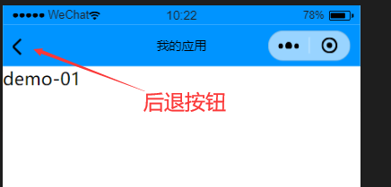


**路径传参**

```html
<!--和正常方式传参一样-->
<navigator url="/pages/index/index?cid={{5}}">跳转到首页</navigator>
```

**获取参数**

```js
//在onLoad生命周期函数中 通过option接收参数
onLoad: function (options) {
    console.log(options) //{cid: "5"}
  }
```

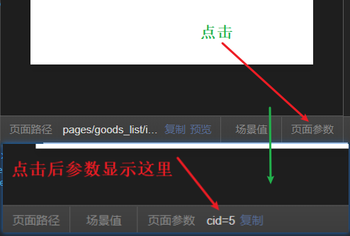

### 10.6 [rich-text](https://developers.weixin.qq.com/miniprogram/dev/component/rich-text.html) 

>  富文本标签 rich译富有

可以将字符串解析成 对应标签，类似 vue中`v-html`功能

**两种方式：**

第一种 （字符串标签）

```html
<rich-text nodes="{{html}}"></rich-text>
```

```js
Page({
  data: {
    html:"<h1>我是大大的h1</h1>"
  },
})
```

第二种（节点数组）用的少

==注意：name属性支持部分标签，并非所有都支持，具体看文档==

```html
<rich-text nodes="{{html}}"></rich-text>
```

```js
Page({
  data: {
    // 1. 数组对象
    html: [
      {
        // 2. name: 指定标签类型
        name: "h1",
        // 3. 指定标签上的属性
        attrs: {
          //注意 这里style是字符串 所以值不用再引号,里面分号隔开，背景色不用小驼峰
          style: 'color:red;background-Color:yellow',
          class: "my"
        },
        // 4. 指定子节点，要写的东西可以和上面的一样再重复次，但是文本节点特殊不一样
        children: [
          {
            name: 'p',
            attrs: {},
            children: [
              {//文本节点用type指定，text属性指定内容
                type: 'text',
                text: '我是text内容'
              }
            ]
          }
        ]
      }
    ]
  },
})
```


#### 10.6.1 nodes属性

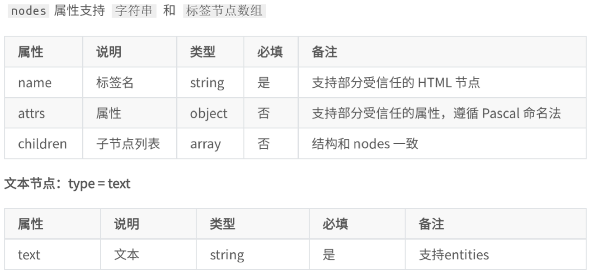


+ `nodes`不推荐使⽤ `String `类型，性能会有所下降。
+ `rich-text`组件内屏蔽所有节点的事件。
+  `attrs ` 属性不⽀持 id ，⽀持 class 。
+  `name`  属性⼤⼩写不敏感。
+  如果使⽤了不受信任的 `HTML`  节点，该节点及其所有⼦节点将会被移除。
+ `img`  标签仅⽀持⽹络图⽚。

### 10.7 [button](https://developers.weixin.qq.com/miniprogram/dev/component/button.html)

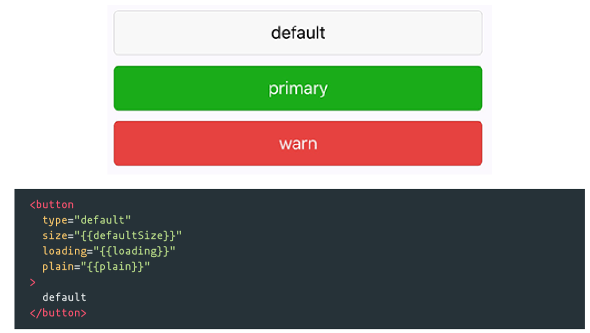

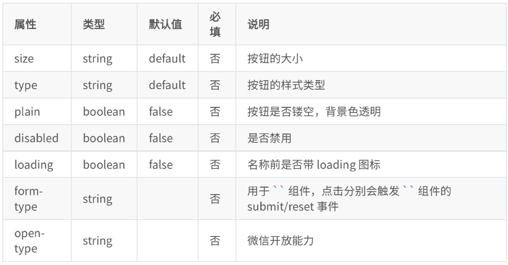

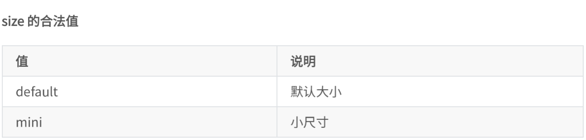

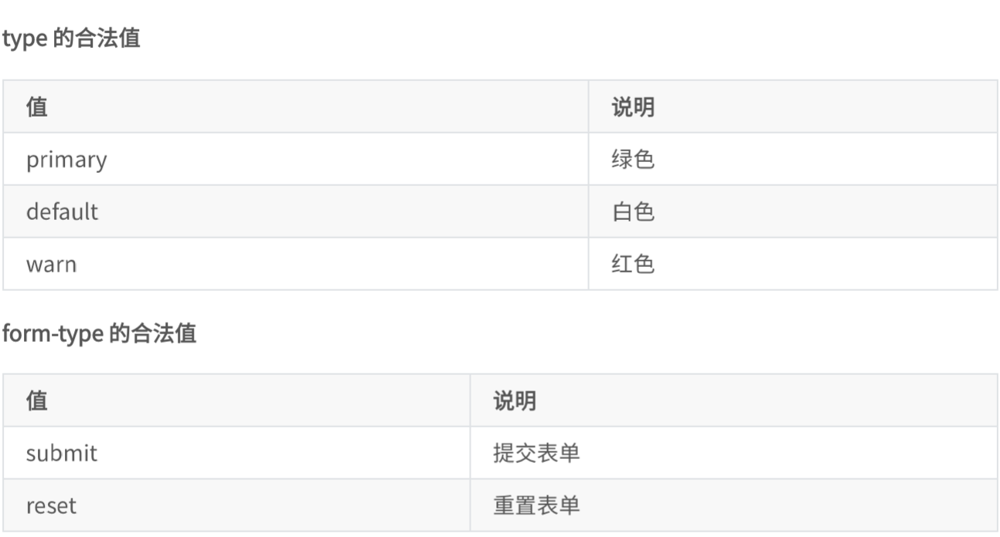

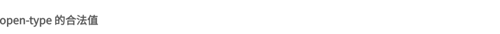

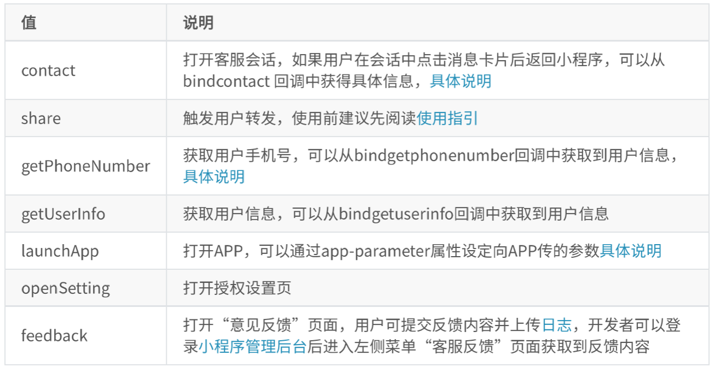

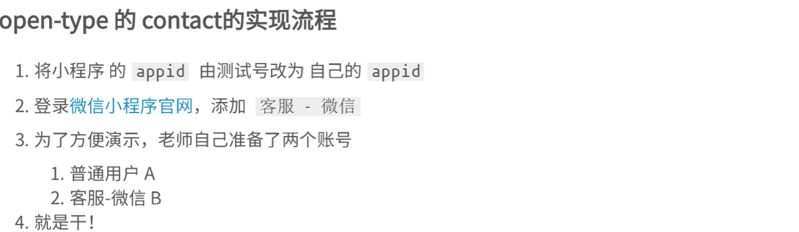

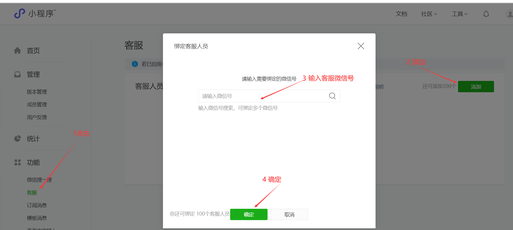

==注意： openSetting在电脑上没效果，在手机上可以==

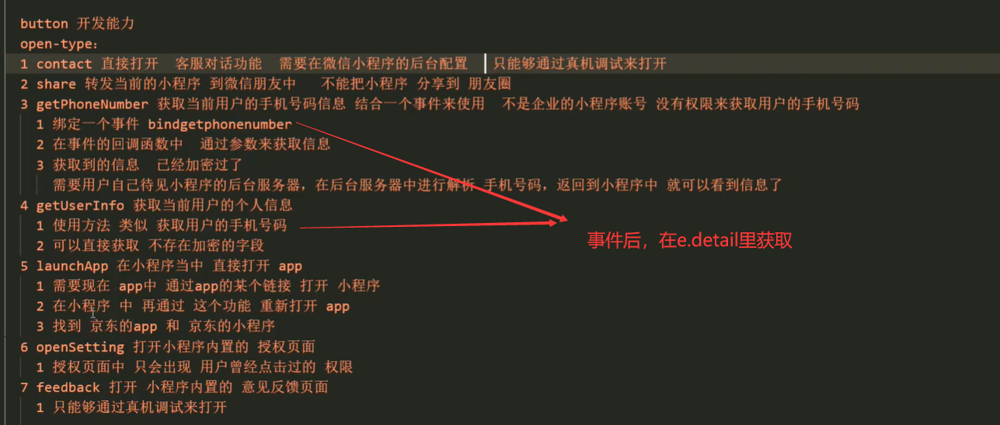

### 10.8 [icon](https://developers.weixin.qq.com/miniprogram/dev/component/icon.html) 

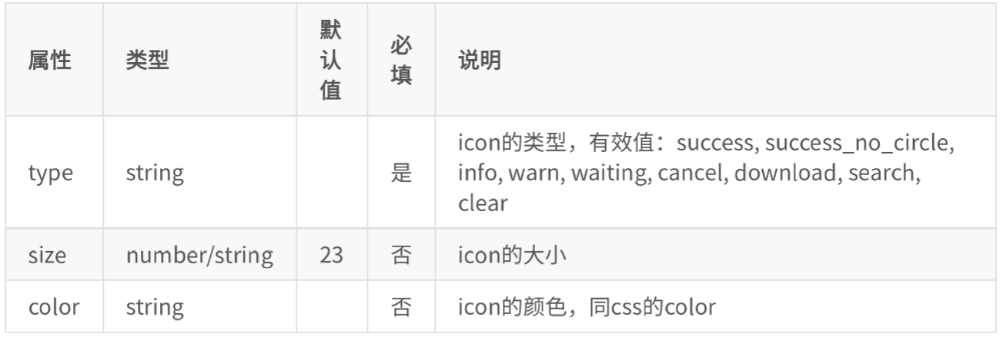

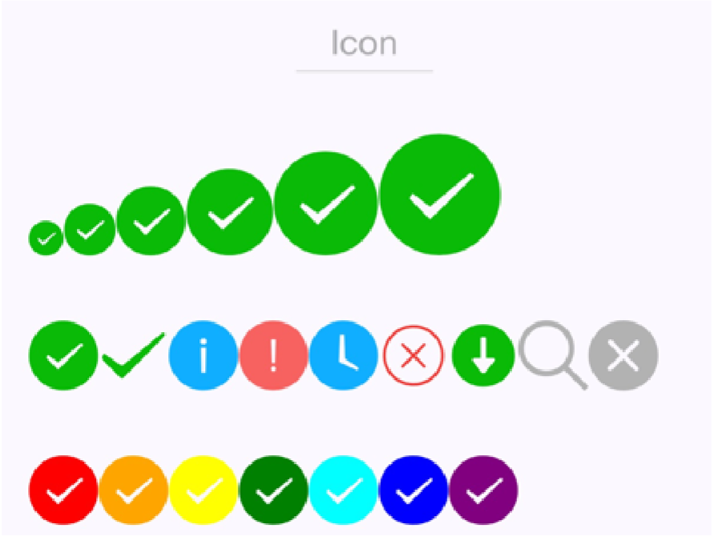

**代码：**

```html
<icon type="success" size="23" color="pink"></icon>

<icon type="success" size="23" color="#0099ff"></icon>
```


### 10.9 [radio](https://developers.weixin.qq.com/miniprogram/dev/component/radio.html) 

1. `radio`可以通过自身 `color`属性来修改选中的单选颜色

2. ==`radio`标签必须和父元素[radio-group](https://developers.weixin.qq.com/miniprogram/dev/component/radio-group.html)⼀起使⽤==

3. 需要给`radio-group`绑定`change`事件

4. `radio`的`value`是选中的单选框的值，通过`e.detail.value`获取

     

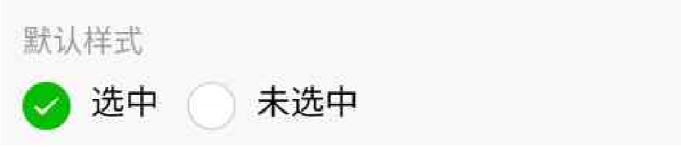

### 10.9 [checkbox](https://developers.weixin.qq.com/miniprogram/dev/component/checkbox.html) 

和单选框类似，区别就是复选框可以选多个。

单选框的value值是字符串，多选框的value是数组，数组里放字符串

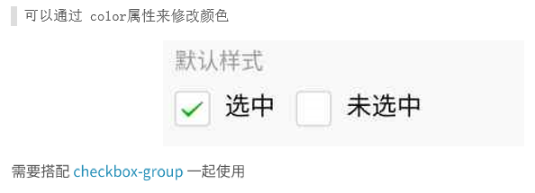

## 10. 做项目用的组件或事件效果

> 做项目可能会用到的组件，不要求掌握，但需要知道这东西，用的时候查文档

### 10.1 [scroll-view](https://developers.weixin.qq.com/miniprogram/dev/component/scroll-view.html)

#### 10.1.1 基本使用

**例如：**一个菜单固定宽度，可以左右滑动区域，或者固定高度，可以上下滚动区域

**要求**：使用竖向滚动时，需要给[scroll-view](https://developers.weixin.qq.com/miniprogram/dev/component/scroll-view.html)一个固定高度，并给组件加属性`scroll-y`.

具体属性看官方文旦，简单代码示例如下：

```html
<!--根据类名固定高度，此时scroll-view相当于大的view,里面有多个小view，可以上下滑动-->   
<scroll-view class="类名" scroll-y>
  <view>大家电</view>
  <view>热门推荐</view>
  <view>海外购</view>
</scroll-view>
```

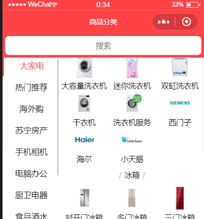

#### 10.1.2 使用的问题

> 点击左边菜单，右边会显示不同的内容，但是若右边滑动到其他位置后，再点击左边菜单，会出现，右边的滚动条在其他位置。我们想要的效果是每次点击后， 右边内容都从顶部开始。

**解决方案:**

设置属性：`scroll-top` 值为number/string   设置竖向滚动条位置

不会出现写了就固定位置、滚动不了的情况，因为当滚动时，系统内部从自动为其赋值：

```html
<!--错误写法 直接写死数据-->
<!--这里写了0，但是滚动后会为其赋值别的，所以没用-->
<scroll-view scroll-top='0'  scroll-y>
  <view>大家电</view>
</scroll-view>

<!--正确写法 写变量-->
<!--设置每次点击后为其重新设置为0 -->
<scroll-view scroll-top="{{flag}}"  bindtap='handleTap' scroll-y>
  <view>大家电</view>
</scroll-view>

handleTap(){
	this.setData({
      flag:0
    })
}
```

### 10.2 上滑触底事件 加载下一页

[**onReachBottom()**](https://developers.weixin.qq.com/miniprogram/dev/reference/api/Page.html)

这是page页面中的生命周期函数，作用：监听用户上拉触底事件的处理函数。

- 可以在`app.json`的[`window`](https://developers.weixin.qq.com/miniprogram/dev/reference/configuration/app.html#window)选项中或[页面配置](https://developers.weixin.qq.com/miniprogram/dev/reference/configuration/page.html)中设置触发距离`onReachBottomDistance`。
- 在触发距离内滑动期间，本事件只会被触发一次

基本使用(和data同级定义此函数，可进行加载下一页操作)

```js
 //此函数触底会自动触发，内部根据个人需要写业务代码
onReachBottom(){
    if(当前页面 >= 总页数){
      // 此方法是消息提示框，提示已经没有下一页数据
      wx.showToast({
        title: '已经触底了',
      });
    }else{
      //有下一页则页码++,并发起请求
      this.queryParams.pagenum++
      this.getGoodsList()
    }
  }
```

默认距底50px时触发事件，也可自行设置触发距离

```json
  //例：在app.json的window选项中
"window": {
    "onReachBottomDistance":100,
  },
```


### 10.3 下拉刷新页面

1. 启⽤下拉⻚⾯功能 

+ ⻚⾯的json⽂件中开启设置  `enablePullDownRefresh:true`

+ ⻚⾯的js中，绑定事件  `onPullDownRefresh`

### 10.4  消息提示框

**[wx.showToast(Object object)](https://developers.weixin.qq.com/miniprogram/dev/api/ui/interaction/wx.showToast.html)**具体参数看文档

显示消息提示框，会自动消失

```js
//简单使用和效果图如下
wx.showToast({
  title: '已经触底了',
});
```


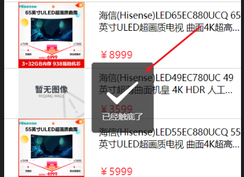

## 11. [⾃定义组件](https://developers.weixin.qq.com/miniprogram/dev/framework/custom-component/)

> 类似vue或者react中的自定义组件

⼩程序允许我们使⽤⾃定义组件的⽅式来构建⻚⾯。

### 11.1 创建⾃定义组件 

> 类似于页面，一个自定义组件由`json` ` wxml` `wxss` ` js` 4个文件组成

在根目录下创建目录components（后续所有组件放components目录中），内部一个组件一个目录，目录下四文件，可以在微信开发者⼯具中快速创建组件的⽂件结构

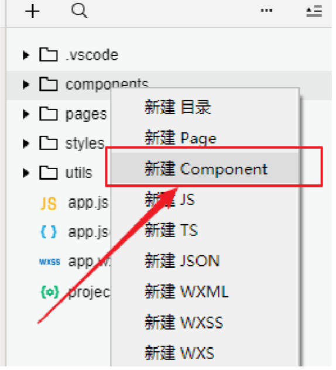

在⽂件夹内 `components/myHeader` ，创建组件名为` myHeader `

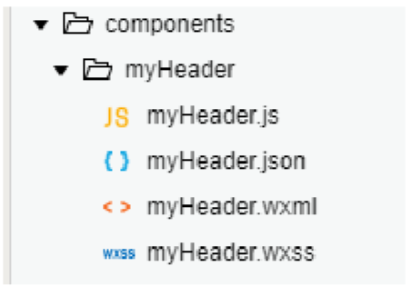

#### 11.1.1 声明组件 

⾸先需要在==**组件**==的` json`⽂件中进⾏⾃定义组件声明
`myHeader.json `

```js
//声明这是一个组件
{  "component": true }
```

#### 11.1.2 编辑组件 

同时，还要在组件的` wxml `⽂件中编写组件模板，在` wxss `⽂件中加⼊组件样式
`slot` 表⽰插槽，类似vue中的slot
`myHeader.wxml `

```html
<!-- 这是自定义组件的内部WXML结构 -->
<view class="inner">
  {{innerText}}
  <slot></slot>
</view>
```

在组件的` wxss `⽂件中编写样式

> 注意：在组件wxss中不应使用ID选择器、属性选择器和标签名选择器。

`myHeader.wxss`

```js
/* 这里的样式只应用于这个自定义组件 */
.inner {  color: red; }
```

#### 11.1.3. 注册组件  

在组件的 ` js ` ⽂件中，需要使⽤`Component()  `来注册组件，并提供组件的属性定义、内部数据和 ⾃定义⽅法

`myHeader.js`

```js
Component({
  properties: {
  // innerText属性是传过来的属性名
    //父组件向子组件传值,在这里接收,使用时就像是data上的数据,直接使用,不用存,可以直接this.setData修改,怀疑内部自动存data上了
    innerText: {
      // 期望要的数据是 string类型
      type: String,
      // 若不传参要使用的默认值
      value: 'default value',
    }
  },
  data: {
    // 这里是一些组件内部数据 定义要使用的数据
    someData: {}
  },
  methods: {
    // 这里是一个自定义方法 组件的方法写在methods内 和页面js放方法的不同
    customMethod: function(){}
  }
})
```

### 11.2 声明引⼊⾃定义组件 

⾸先要在==**⻚⾯**==的` json`⽂件中进⾏引⽤声明（哪个页面要使用组件，就在哪个里面声明）。还要提供对应的组件名和组件路径

`index.wxml `

```js
{    
  // 引用声明
  "usingComponents": {
    // 要使用的组件的名称		// 组件的路径 不能要后缀
    "my-header":"/components/myHeader/myHeader"
  }
}
```

### 11.3 ⻚⾯中使⽤⾃定义组件

```html
<!-- 直接用标签形式使用组件名即可 -->
<view>
  <!-- 以下是对一个自定义组件的引用 -->
  <my-header inner-text="Some text">
    <view>用来替代slot的</view>
  </my-header>
</view>
```

### 11.4 其他属性 

### 11.5 定义段与⽰例⽅法 

`Component `构造器可⽤于定义组件，调⽤`Component `构造器时可以指定组件的属性、数据、⽅法 等。

+ `observers`类似`vue`中的`watch`,此属性只存在组件中,不存在页面中.
+ `attached`组件的实例化都做完了,要开始渲染页面了,此时可以进行`setData`处理数据了
+ `ready`表示在页面中已经能看到完整的组件了

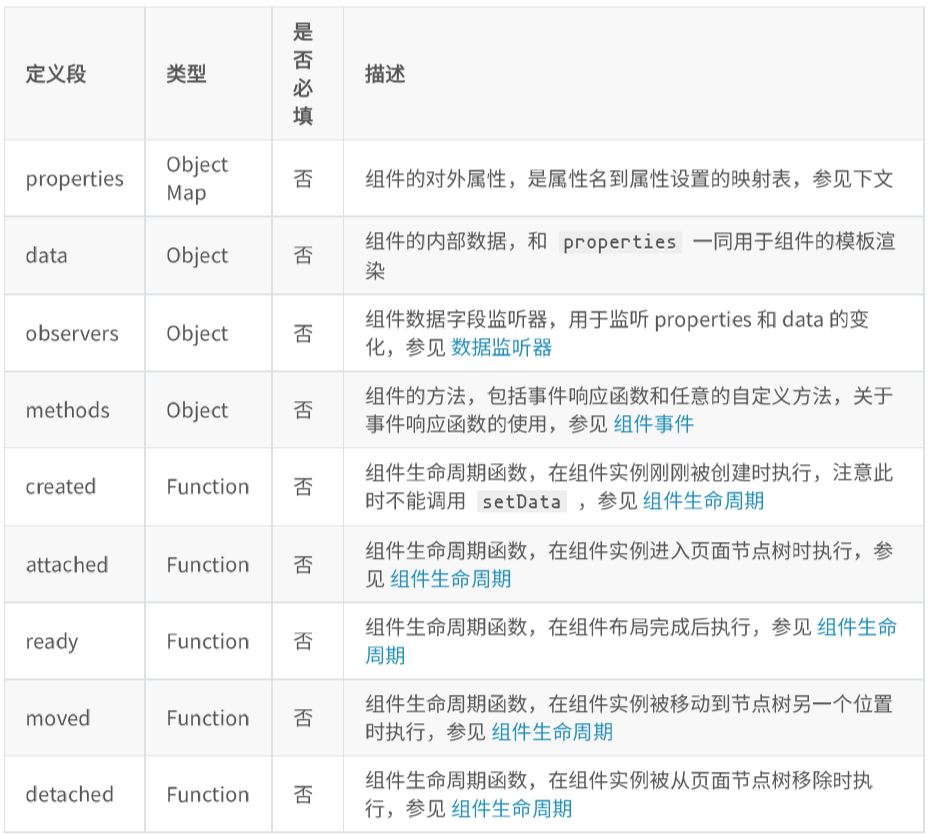

### 11.6 组件-⾃定义组件传参 

#### 11.6.1 父向子传值

**⽗组件通过==属性==的⽅式给⼦组件传递参数** 

+ 父组件通过属性传值给子组件

+ 子组件在js中的`properties`接收，`value`  表值若不传则使用默认值。type指定接收数据的类型,若类型错误,则会转换为指定类型,例若传个undefined则显示的值是false.

+ 在子组件直接使用数据,就像定义在data上一样

+ ==方法内部可通过`this.data.数据名`获取`properties`的数据，详细叙述如下：==

     ```
     总结：
     当data内无指定名字数据，properties有此数据时，通过this.data.数据名不会报错，而是获取到properties内的数据，若data有，则优先获取data内的。不管data有没有此数据，只要进行了this.setData那么就会赋值给data，后续再改数据就是改data内的，而不是properties中的，这种并非改变源数据，而是改的copy的数据，所以不好。
     
     解决方法：
     父组件传方法给子组件，子组件调用父组件传递的方法并向方法传参，父组件方法接收传递的参数并根据接收的东西更改源数据。
     ```

     

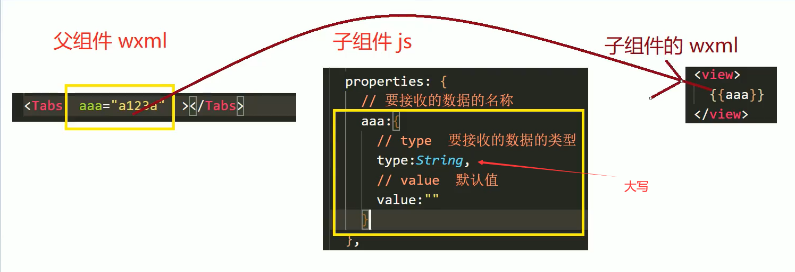

#### 11.6.2 父向子传方法 子通过调用方法向父传数据

**父组件代码:**

```html
<!--wxml
				1. 父组件通过绑定自定义事件向子组件传递方法,把handleItemChange方法通过itemchange传过去
-->

<tabbar binditemchange="handleItemChange"></tabbar>
```

```js
// js
Page({
  handleItemChange(e){
    //	4. 通过e.detail获取传过来的值
    console.log(e.detail)
  }
})
```

**子组件代码:**

```html
<!--wxml
				2. 子组件调用自己的方法,内部写调用父组件方法的代码
-->
<view bindtap="handleTap">点我触发自己事件,进一步触发父组件事件</view>
```

```js
// js
Component({
  methods: {
    handleTap(){
//			3. 通过this.triggerEvent触发父组件的方法,一参:绑定的自定义事件名,二参:传递的数据,通常用对象形式传
      this.triggerEvent("itemchange",123)
    }
  }
})
```

### 11.7 ⼩结 

1. 标签名 是 中划线的⽅式
2. 属性的⽅式 也是要中划线的⽅式 

3. 其他情况可以使⽤驼峰命名 

​		1. 组件的⽂件名如  `myHeader.js ` 的等 

​		2. 组件内的要接收的属性名 如  `innerText`

4. [更多。。](https://developers.weixin.qq.com/miniprogram/dev/framework/custom-component/component.html)

## 11. slot插槽

> `vue`中的`slot`插槽和`react`中的`children`类似
>
> 而`miniprogram`微信小程序的`slot`也是一样的

**作用:**  父组件使用子组件时，组件标签中间包裹的内容会被替换到插槽`slot`中,  插槽只是占位符,  不会转换为任何标签。

通过插槽可以实现点击不同的选项显示不同的内容。这里`list[0].isActive`就是选中的标识符,选中为`true`则显示。

```html
<!--父组件中使用<tabbar/>子组件-->
<tabbar>
  <block wx:if="{{list[0].isActive}}">0</block>
  <block wx:elif="{{list[1].isActive}}">1</block>
</tabbar>

<!--子组件-->
  <view>
    <slot></slot>
  </view>
```


## 12. ⼩程序⽣命周期 

分为**应⽤⽣命周期**和**⻚⾯⽣命周期**

> 关于小程序前后台的定义和小程序的运行机制，请参考运行机制章节。

[简书参考](https://www.jianshu.com/p/ee7c11d691c1)

### 12.1 [应⽤⽣命周期](https://developers.weixin.qq.com/miniprogram/dev/reference/api/App.html) 

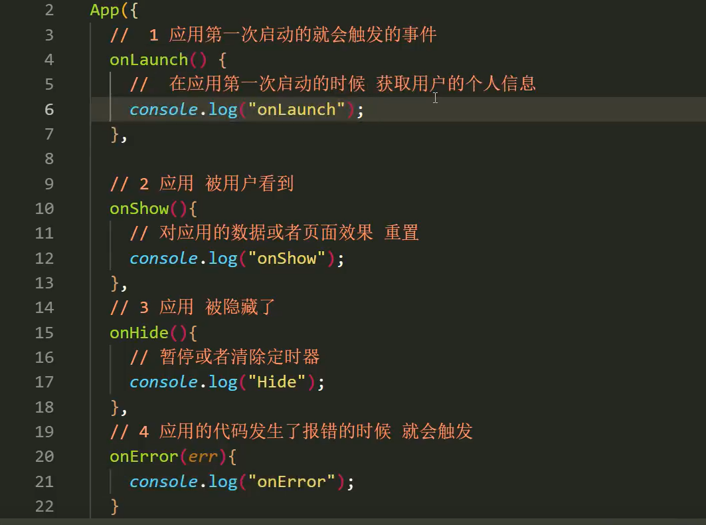

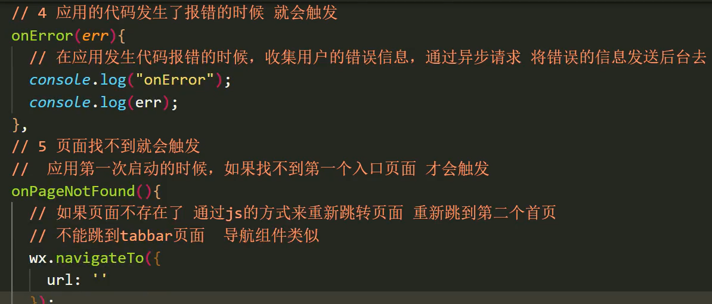

注意:   4中接收一个`err`参数，是错误信息

​			5中仅入口页面找不到才会触发，入口页面指进入小程序看到的第一个页面

### 12.2 [⻚⾯⽣命周期](https://developers.weixin.qq.com/miniprogram/dev/reference/api/Page.html) 

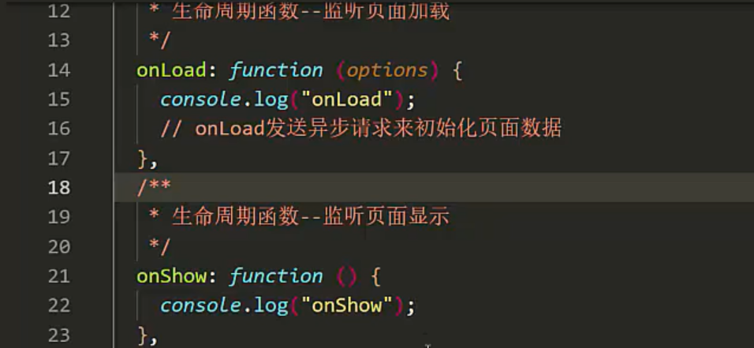

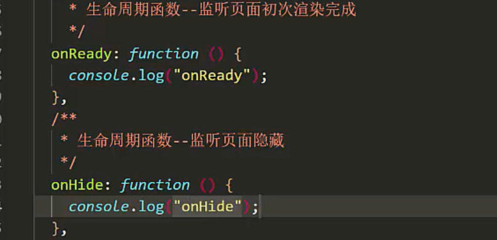

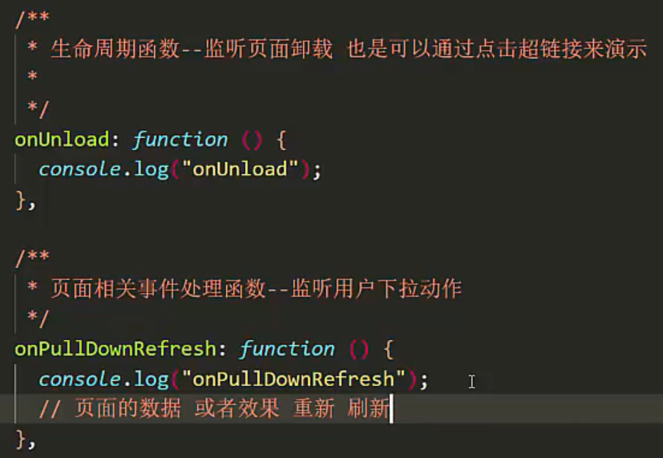


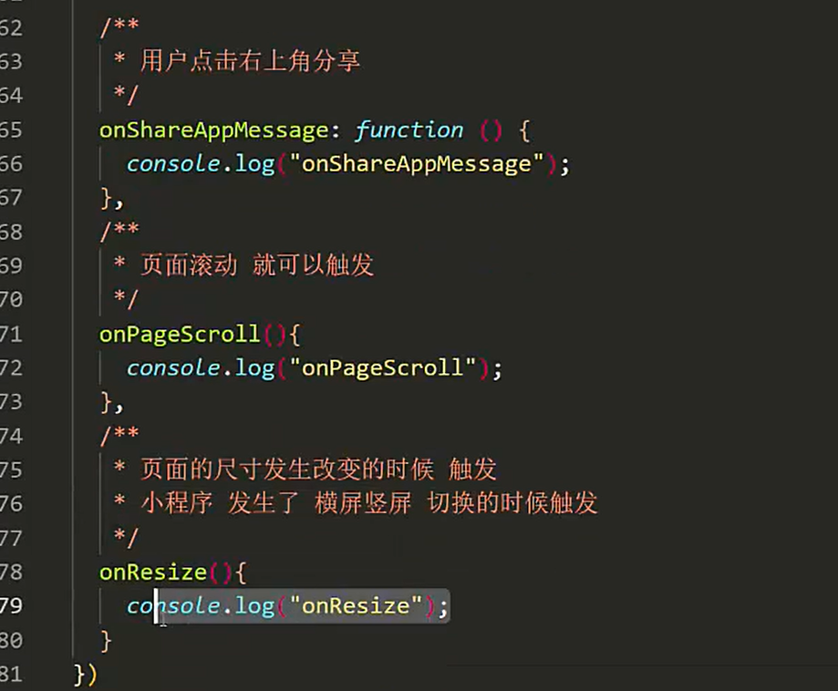

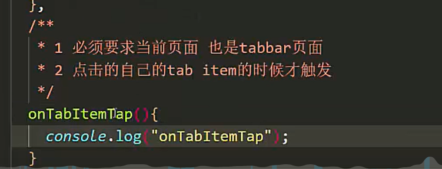

### 12.3 ⻚⾯⽣命周期图解 

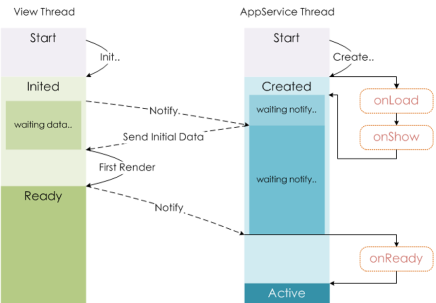

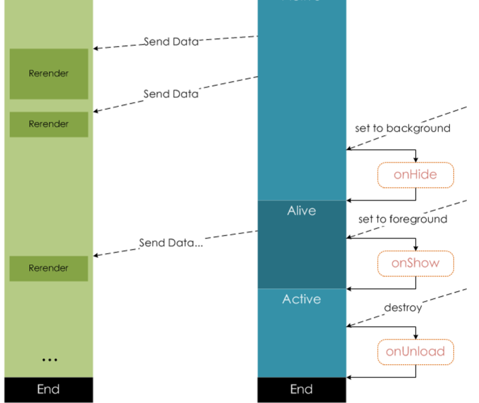

## 13. [wx.request请求资源](https://developers.weixin.qq.com/miniprogram/dev/api/network/request/wx.request.html)

### 13.1 基本使用

**wx.request(Object object)，更多参数看文档**

```js
    wx.request({
      url: 'https://api-hmugo-web.itheima.net/api/public/v1/home/swiperdata',
      data:{id:1,page:2}//若要传参可通过data传
      success: (result)=>{
        this.setData({
          swiperList:result.data.message
        })
      },
    })
```


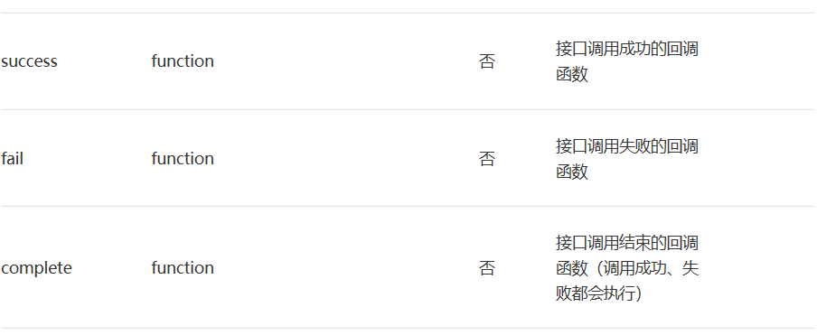

### 13.2 优化（掌握）

若直接老老实实写代码发请求，很容易陷入回调地狱，这里做一个简单的优化

```js
//创建request目录，专门写异步请求代码，里面根据功能分类建文件
//例：建index.js文件

export const request = (params) => {
  return new Promise((resolve, reject) => {
    wx.request({
      ...params,
      success: (result) => {
        resolve(result)
      },
      fail: (error) => {
        reject(error)
      }
    });
  })
}
```

```js
//其他js文件需要发请求，直接引入此函数

import {request} from '../../request/index.js'

request({url: 'https://api-hmugo-web.itheima.net/api/public/v1/home/swiperdata'})
  .then(result=>{
  		this.setData({
    		swiperList:result.data.message
  		})
	})
	.then()//若需要多个，可继续.then 可以换行
```


这里引入后，函数执行，传参传的url，工具函数执行后会把请求结果即资源返回，再用.then方式进行相应操作。

==注意：在`vue`或`react`中引入文件，若文件为`index.js`我们写路径时会到目录处停止，不会写文件名，但是在微信小程序中，路径必须补全，哪怕是`index.js`也必须写。==

```js
//错误写法
import {request} from '../../request'

//正确写法
import {request} from '../../request/index.js'
```

### 13.3 优化公共路径（掌握)

> 将发请求的公共路径提取出来，
>
> 后期利于维护，否则上线了改域名，一个个改忙不过来还极易出错

**定义：**

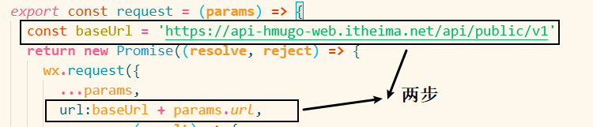

**使用：**

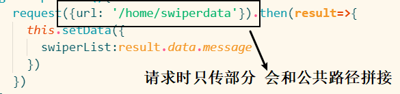

## 14.请求域名加白名单

默认小程序不能随意发请求,两种解决方式

#### 方式一: 仅限开发时用(不推荐)

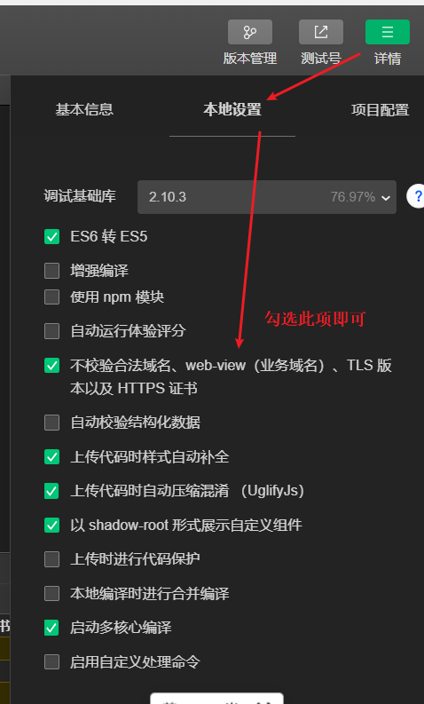

#### 方式二:项目上线时用

**项目上线时会要求请求必须是合法的,所以用方式一就不行了.**

**合法指：**1. 域名必须是https的, 

​				2.必须把它添加到小程序后台里

**这里进行演示如何把小程序添加到后台白名单中:**

1. 登录[小程序后台](https://mp.weixin.qq.com/)  

     若在文档中可由图一方式进入,或者点击链接[小程序后台](https://mp.weixin.qq.com/),成功后均显示图二页面


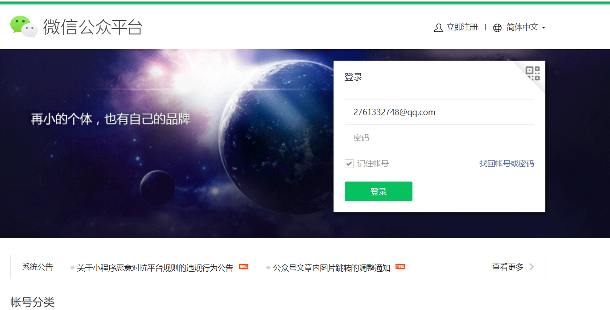

**2. 开始配置**

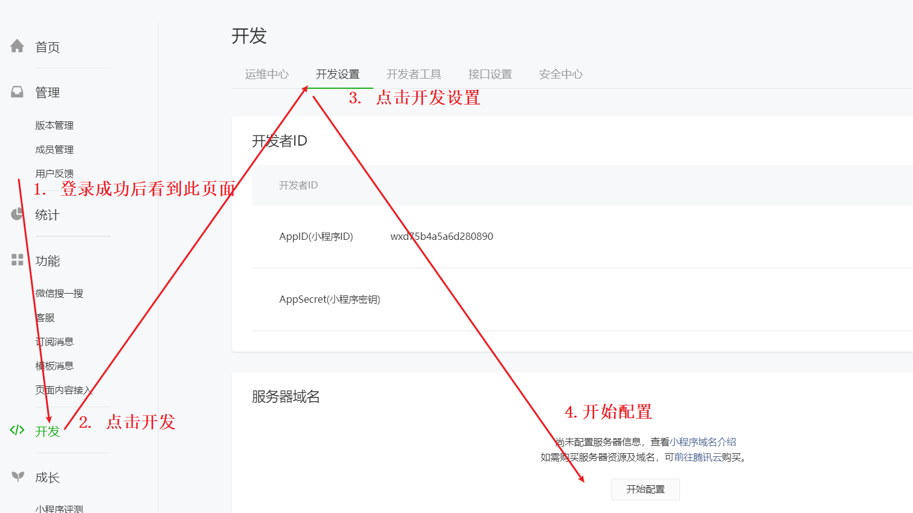

**3. 扫码后添加域名并确定**

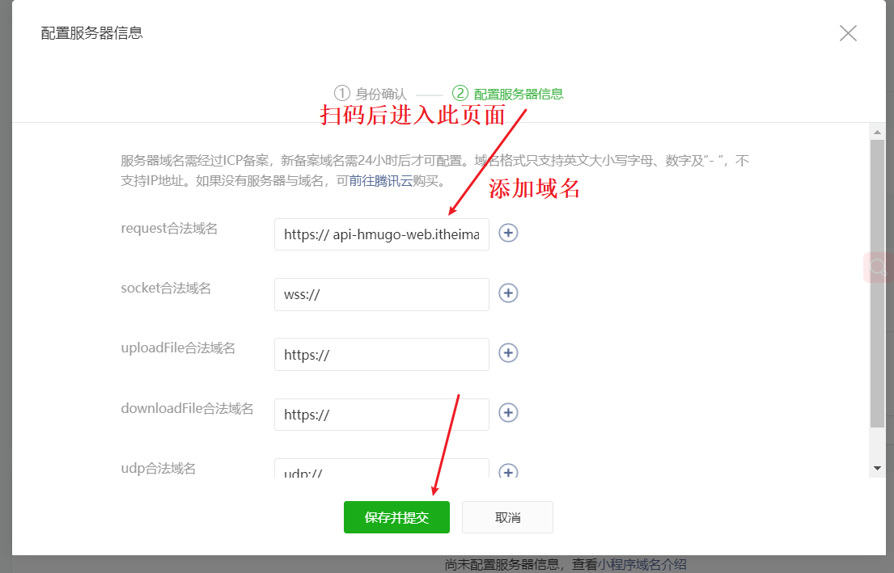

**4. 成功后如图(注意是加域名,不带其他参数),**

**把域名加到白名单后无需方式一操作即可使用,上线时都要求这么做即加白名单**

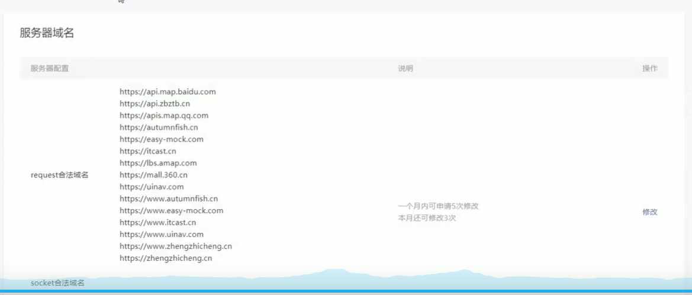

**微信开发者工具,刷新域名配置**

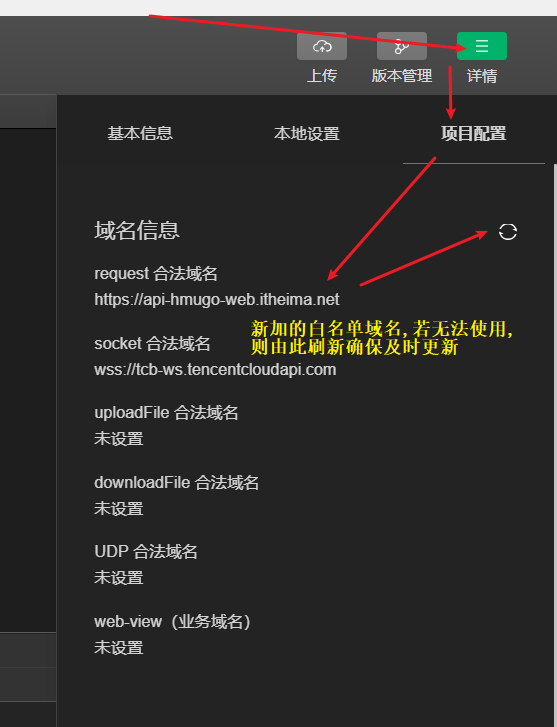

## 15.  微信小程序的本地存储

> 每次进入页面都会发起新的请求,当请求的数据体积过大时,此举极耗性能.此时可以考虑本地存储,提高性能,
>
> 在微信小程序中也有 本地存储 技术.

###  **15.1 web本地存储和小程序的区别:**

1. **代码书写区别**

 web:               localStorage**.**setItem('key','value')           localStorage**.**getItem('key')

 微信小程序:   wx**.**setStorageSync('key','value')              wx**.**getStorageSync('key') 

2. **传参区别**

 web:参数value的存取都需要进行转换

 微信小程序: 参数value的存取都不需要转换,存进去是什么,取出来就是什么,例可直接存对象进去,不需转为字符串,取出来也直接用

### **15.2 代码示例**

```js
//存
wx.setStorageSync('categoryList',{time: Date.now(),data: this.categoryList})
//取
const {time,data} = wx.getStorageSync('categoryList');
```

## 16. ⼩程序中⽀持es7的async语法

es7的`async` 号称是解决回调地域的最终⽅案

#### 16.1 方法一:(推荐)

现在的小程序开发工具已经支持ES7语法了，需要进行如下步骤

```
1.勾选ES6转ES5

2.勾选增强编译

3.使用ES7时方法名前加【async】关键字 内部使用【await】
```

如下示例：用对象简洁语法写async函数

> 当键和方法名相同时可以简写, 而async的区别就是 在前面加一个async
>
> await后面的request({ url: '/categories' }) 这是promise对象,返回的结果左边变量接收

```js
{
  async getCategoryList() {
    let result = await request({ url: '/categories' })
    this.categoryList = result
  }
}
```


#### 16.2 方法二: (仅做了解)

老视频时小程序不支持es7的解决方案,但解决后依然会有兼容问题,今天是2020-3-14号,网上说已经支持es7了,这里依旧记录下 旧的解决方案 仅做了解.

**说明**  **(旧视频的言论 如今已支持es7)**

​	小程序中明确说明只支持es6转es5，但未说明支持es7，所以==直接使用es7会报错==, 这里进行解决方案（仅适合大部分机型，不能完全解决），==在一些旧的机型上依旧会报错，所以当需要适配一些旧的机型时就不要用这个技术,==就需要改为es6的promise语法.这里暂时不考虑兼容性,根据步骤配置和使用

**解决方案及使用步骤**

1. 在⼩程序的开发⼯具中，勾选 es6转es5语法

     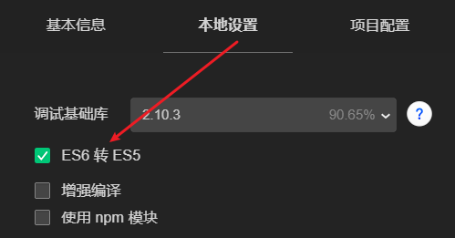

2. 下载 facebook的regenerator库中的 [regenerator/packages/regenerator-runtime/runtime.js](https://github.com/facebook/regenerator/blob/5703a79746fffc152600fdcef46ba9230671025a/packages/regenerator-runtime/runtime.js ) ,它是专门用来编译`async`语法的.

     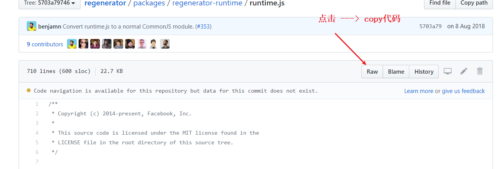

3.  在⼩程序⽬录下新建⽂件夹 ` lib/runtime/runtime.js `，将代码拷⻉进去 

4. 在每⼀个需要使⽤`async`语法的⻚⾯js⽂件中引⼊,只能单个引入（不能全局引⼊,否则无效）,

     ```js
     import regeneratorRuntime from '../../lib/runtime/runtime.js';
     ```

     只引入就可以了, 无需使用, 不用管`regeneratorRuntime`这些,然后按平时写es7的async语法 直接写就行.

# 项目

## 1. 使用阿里巴巴图标库

**1.图标加入购物车 ---> 点击class ---> 搜索链接 ---> copy内容粘贴到自己wxss文件**（推荐创建`styles`目录存放公共样式文件，将对应文件引入到`app.wxss`中全局生效，所有页面都能用）


**2. 使用**

将对应文件引入到`app.wxss`中全局生效，所有页面都能用,

通过类名使用图标：基础类每次使用都要写`iconfont`  + `要用的图标类` 

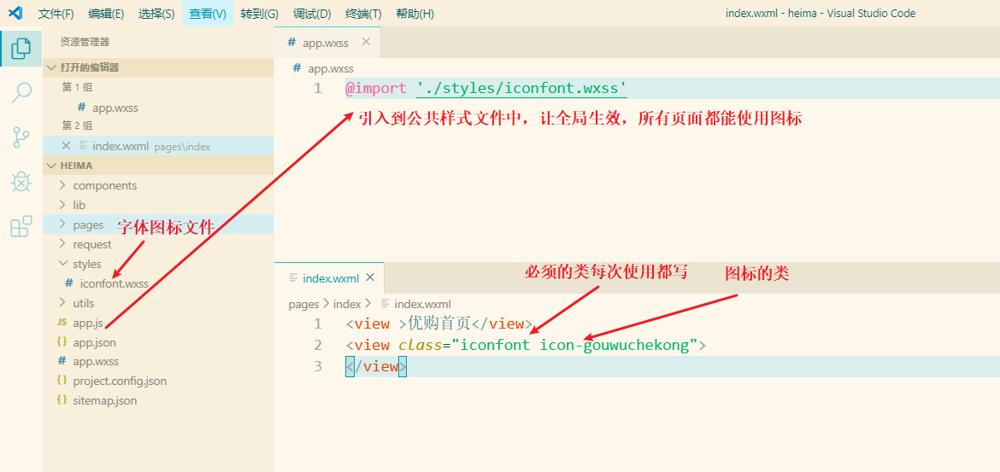

## 2. wxss变量设置主题色

**定义**

主题颜色一般通过变量实现，`wxss`也有变量，需在`page`选择器中定义

```css
<!--在全局样式文件app.wxss的page选择器中定义变量 ,这里的 -- 是关键字      -->
page{
  --themeColor:#ff4246;
}
```

**使用**

全局样式文件中定义的变量其他页面都能使用, 通过`var(`变量名) `

```css
view{
  color: var(--themeColor);
}
```

## 3. 设置入口页面 及传参

**做项目的使用技巧:**

每次更改代码就会重新跳转页面,为避免多次点击切换页面,可通过编译模式设置入口页面

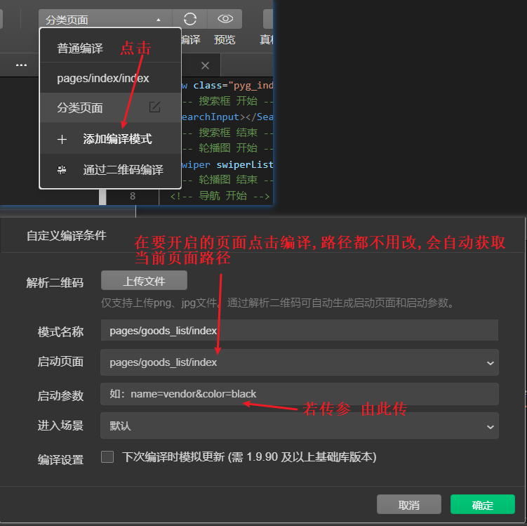

页面路径和参数,都可以由此查看:


## 4. 加载图片时进行判断

对图片src进行判断，若无值则使用`暂无图片`的提示

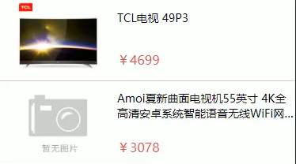

```html
<image src="{{img.src?img.src:'暂无图片的路径'}}" mode="widthFix"></image>
```

