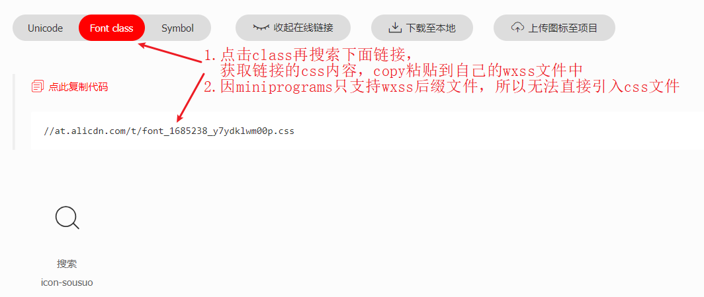
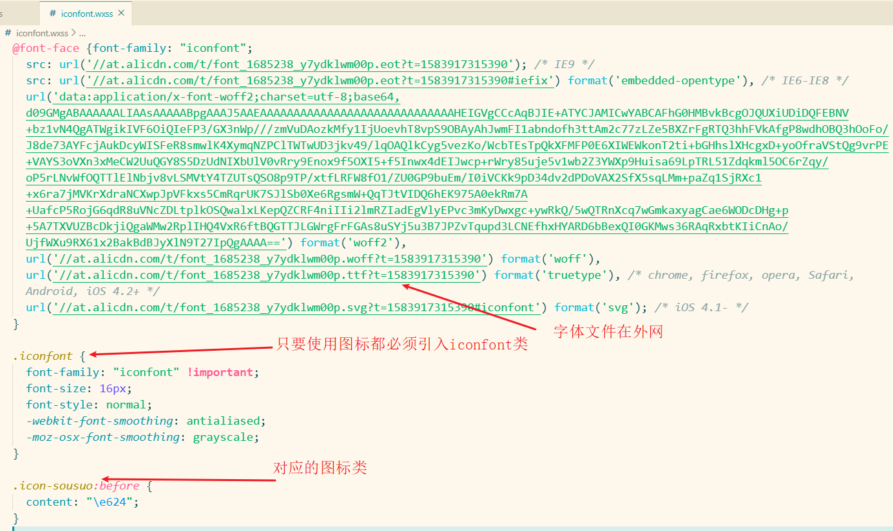
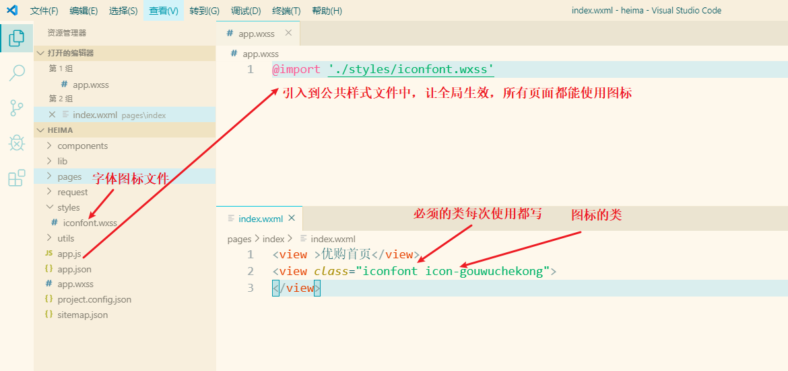

类名写`inconfont`和`字体图标的类名`

每一个都必须加`inconfont`相当于一共要写两个类名

## 项目使用阿里巴巴图标库

**1.图标加入购物车 ---> 点击class ---> 搜索链接 ---> copy内容粘贴到自己wxss文件**（推荐创建`styles`目录存放公共样式文件，将对应文件引入到`app.wxss`中全局生效，所有页面都能用）

**2. 使用**

将对应文件引入到`app.wxss`中全局生效，所有页面都能用,

通过类名使用图标：基础类每次使用都要写`iconfont`  + `要用的图标类` 

